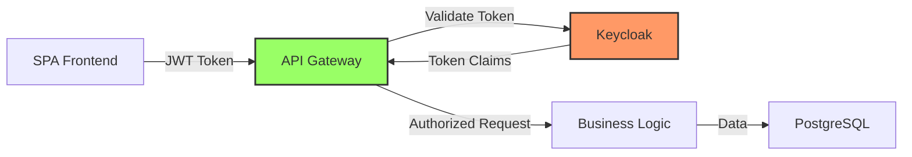

# 🛒 Conaprole Orders API

[](https://github.com/ingnlema/Conaprole/actions/workflows/docs.yml)
[](https://github.com/ingnlema/Conaprole/actions/workflows/main.yml)

Modern order management system built with .NET 8, Clean Architecture, and Domain-Driven Design principles. This comprehensive guide serves as the **single source of truth** for developers, QA engineers, and DevOps teams.

## 📋 Table of Contents

- [Prerequisites](#-prerequisites)
- [Quick Start](#-quick-start)
- [Keycloak Authentication](#-keycloak-authentication)
- [Environment Variables](#-environment-variables)
- [Architecture](#-architecture)
- [API Endpoints](#-api-endpoints)
- [Testing](#-testing)
- [Troubleshooting](#-troubleshooting)
- [Useful Commands](#-useful-commands)
- [Documentation](#-documentation)
- [Contributing](#-contributing)

## 📋 Prerequisites

- [.NET 8 SDK](https://dotnet.microsoft.com/download/dotnet/8.0) (8.0.x)
- [Docker](https://www.docker.com/get-started) with Docker Compose
- [Git](https://git-scm.com/downloads)
- **Optional**: [Node.js](https://nodejs.org/) (for frontend development)

## 🚀 Quick Start

**One-command setup** - copy and paste this block to get started in less than 5 minutes:

```bash
# Clone and setup
git clone https://github.com/ingnlema/Conaprole.git
cd Conaprole

# Restore dependencies
dotnet restore

# Start infrastructure (PostgreSQL + Keycloak with auto-import)
docker compose up -d

# Wait for services to be ready (30 seconds for Keycloak)
echo "Waiting for services to start..."
sleep 30

# Run database migrations (EF tools will be restored automatically)
dotnet ef database update --project src/Conaprole.Orders.Infrastructure

# Start the API
dotnet run --project src/Conaprole.Orders.Api
```

**Access Points:**
- 🌐 **API + Swagger**: `https://localhost:7017/swagger`
- 🔐 **Keycloak Admin**: `http://localhost:18080` (admin/admin)
- 🗄️ **PostgreSQL**: `localhost:5432` (postgres/postgres)

## 🔐 Keycloak Authentication

### Automatic Setup (Recommended)

The system automatically imports the **Conaprole** realm with configured clients when Keycloak starts:



### Client Configuration

| Cliente | Tipo | Propósito | Scopes/Roles | Client ID |
|---------|------|-----------|--------------|-----------|
| **auth** | Public | Login de usuarios SPA | `openid`, `profile` | `conaprole-auth-client` |
| **admin** | Confidential | Token de servicio API | `realm-management` (`view-users`, `manage-clients`) | `conaprole-admin-client` |

### Auto-Import Details

- **Realm File**: `Keycloak/conaprole-realm-export.json`
- **Import Command**: `start-dev --import-realm`
- **Import Trigger**: Only on first startup when realm doesn't exist
- **Test Files**: `test/*/.files/conaprole-realm-export.json` (equivalent for testing)

### Manual Setup (Fallback)

If auto-import fails, follow these steps:

1. **Access Keycloak Admin Console**
   ```bash
   open http://localhost:18080
   # Login: admin / admin
   ```

2. **Create Realm**
   - Click "Create Realm"
   - Name: `Conaprole`
   - Save

3. **Create Auth Client (Public)**
   - Go to Clients → Create
   - Client ID: `conaprole-auth-client`
   - Client Type: OpenID Connect
   - Client authentication: OFF (public)
   - Valid redirect URIs: `http://localhost:*`
   - Web origins: `http://localhost:*`

4. **Create Admin Client (Confidential)**
   - Go to Clients → Create
   - Client ID: `conaprole-admin-client`
   - Client Type: OpenID Connect
   - Client authentication: ON (confidential)
   - Service accounts enabled: ON
   - Service Account Roles → Assign: `realm-management` roles

5. **Update Configuration**
   Copy the client secrets to `src/Conaprole.Orders.Api/appsettings.Development.json`:
   ```json
   {
     "Keycloak": {
       "AdminClientSecret": "YOUR_ADMIN_CLIENT_SECRET",
       "AuthClientSecret": "YOUR_AUTH_CLIENT_SECRET"
     }
   }
   ```

## 🔧 Environment Variables

### Development (Local)

| Variable | Default Value | Description |
|----------|---------------|-------------|
| `DB_CONNECTION` | `Host=conaprole.orders-db;Port=5432;Database=conaprole.orders;Username=postgres;Password=postgres` | PostgreSQL connection string |
| `KEYCLOAK_BASE_URL` | `http://conaprole-idp:8080` | Keycloak base URL |
| `KEYCLOAK_REALM` | `Conaprole` | Keycloak realm name |
| `KEYCLOAK_ADMIN_CLIENT_ID` | `conaprole-admin-client` | Admin client ID |
| `KEYCLOAK_ADMIN_CLIENT_SECRET` | `MdyBcICzOkfdxLeDcbcyhi5Im3EtVOb9` | Admin client secret |
| `KEYCLOAK_AUTH_CLIENT_ID` | `conaprole-auth-client` | Auth client ID |
| `KEYCLOAK_AUTH_CLIENT_SECRET` | `EMI6IRqofvQmXHhvCX3MiX9bVdqKN4VS` | Auth client secret |
| `ASPNETCORE_ENVIRONMENT` | `Development` | .NET environment |
| `ASPNETCORE_URLS` | `https://localhost:7017;http://localhost:5017` | API listening ports |

### Production

| Variable | Description | Required |
|----------|-------------|----------|
| `ConnectionStrings__Database` | Azure PostgreSQL connection string | ✅ |
| `KEYCLOAK_BASE_URL` | Production Keycloak URL | ✅ |
| `KEYCLOAK_ADMIN_SECRET` | Admin client secret from Azure Key Vault | ✅ |
| `KEYCLOAK_AUTH_SECRET` | Auth client secret from Azure Key Vault | ✅ |
| `ApplicationInsights__ConnectionString` | Application Insights connection | ✅ |

### Configuration Files

- **Development**: `src/Conaprole.Orders.Api/appsettings.Development.json`
- **Production**: `src/Conaprole.Orders.Api/appsettings.json`
- **Docker**: Environment variables in `docker-compose.yaml`

## 🏗️ Architecture

The system follows **Clean Architecture** principles with these layers:

```
┌─────────────────────────────────────┐
│             API Layer               │  ← Controllers, DTOs, Swagger
├─────────────────────────────────────┤
│         Application Layer           │  ← Use Cases, CQRS, Handlers
├─────────────────────────────────────┤
│           Domain Layer              │  ← Entities, Value Objects, Rules
├─────────────────────────────────────┤
│        Infrastructure Layer         │  ← Database, Auth, External APIs
└─────────────────────────────────────┘
```

**Key Technologies:**
- **Backend**: .NET 8, ASP.NET Core, Entity Framework Core
- **Database**: PostgreSQL with EF Core migrations
- **Authentication**: JWT tokens with Keycloak
- **Testing**: xUnit, TestContainers, FluentAssertions
- **Documentation**: Markdown with Mermaid diagrams

## 📊 API Endpoints

| Endpoint | Description | Authentication | Required Permission |
|----------|-------------|----------------|-------------------|
| `GET /api/users` | List users | Bearer Token | `users:read` |
| `POST /api/users/register` | Register user | Bearer Token | `users:write` |
| `POST /api/users/login` | User login | Public | - |
| `GET /api/permissions` | Get user permissions | Bearer Token | - |
| `GET /api/orders` | List orders | Bearer Token | `orders:read` |
| `POST /api/orders` | Create order | Bearer Token | `orders:write` |
| `GET /api/products` | List products | Bearer Token | `products:read` |
| `POST /api/products` | Create product | Bearer Token | `products:write` |
| `GET /api/distributors` | List distributors | Bearer Token | `distributors:read` |

**Full API documentation**: `/swagger` when running locally.

## 🧪 Testing

### Running Tests

```bash
# Run all tests
dotnet test

# Run by category
dotnet test --filter Category=Unit
dotnet test --filter Category=Integration  
dotnet test --filter Category=Functional

# Run specific project
dotnet test test/Conaprole.Orders.Domain.UnitTests

# Generate test coverage
dotnet test --collect:"XPlat Code Coverage"
```

### Test Structure

- **Unit Tests** (110 tests): Domain logic and business rules
- **Integration Tests**: Database and repository layers with TestContainers
- **Functional Tests**: API endpoints and workflows with TestContainers

### Test Environment

Tests use **TestContainers** to spin up:
- **PostgreSQL**: `postgres:15-alpine`
- **Keycloak**: `quay.io/keycloak/keycloak:21.1.1` with realm import

## ❗ Troubleshooting

### 1. Keycloak Container Won't Start

**Symptoms**: `docker compose up -d` fails on Keycloak service

**Solutions**:
```bash
# Check if realm file exists
ls -la Keycloak/conaprole-realm-export.json

# Restart with fresh data
docker compose down -v
docker compose up -d

# Check logs
docker logs Conaprole.Identity
```

### 2. Token Validation Fails (401 Unauthorized)

**Symptoms**: API returns 401 for authenticated requests

**Solutions**:
```bash
# Verify Keycloak issuer configuration
curl http://localhost:18080/realms/Conaprole/.well-known/openid-configuration

# Check appsettings.Development.json matches
# "ValidIssuer": "http://conaprole-idp:8080/realms/Conaprole"

# Verify token at jwt.io
```

### 3. Database Migration Fails

**Symptoms**: `dotnet ef database update` fails

**Solutions**:
```bash
# Check PostgreSQL is running
docker ps | grep postgres

# Check connection string
docker logs Conaprome.Orders.Db

# Reset database
docker compose down -v
docker compose up -d conaprole.orders-db
# Wait 10 seconds, then retry migration
```

### 4. Port Already in Use

**Symptoms**: Docker fails with "port already allocated"

**Solutions**:
```bash
# Check what's using the ports
netstat -tulpn | grep :18080  # Keycloak
netstat -tulpn | grep :5432   # PostgreSQL

# Kill conflicting processes or change ports in docker-compose.yaml
```

### 5. Client Authentication Failures (403 Forbidden)

**Symptoms**: Admin operations fail with 403

**Solutions**:
```bash
# Verify client configuration in Keycloak Admin Console
# 1. Check client_id and client_secret match appsettings
# 2. Verify service account is enabled for admin client
# 3. Check service account has realm-management roles
```

### 6. TestContainers Timeout

**Symptoms**: Integration tests timeout or fail to start containers

**Solutions**:
```bash
# Set Docker platform
export DOCKER_DEFAULT_PLATFORM=linux/amd64

# Increase timeout
export TESTCONTAINERS_WAIT_TIMEOUT=300

# Clean up containers
docker container prune -f

# Run tests with more memory
docker system df  # Check available space
```

### 7. Realm Import Not Working

**Symptoms**: Keycloak starts but has no Conaprole realm

**Solutions**:
```bash
# Check file is mounted correctly
docker exec Conaprole.Identity ls -la /opt/keycloak/data/import/

# Verify import command
docker exec Conaprole.Identity ps aux | grep kc.sh

# Manual import
docker exec Conaprole.Identity /opt/keycloak/bin/kc.sh import --file /opt/keycloak/data/import/realm.json
```

## 🛠️ Useful Commands

### Development

```bash
# Clean and restore
dotnet clean && dotnet restore

# Watch mode (auto-rebuild)
dotnet watch run --project src/Conaprole.Orders.Api

# Format code
dotnet format

# Update database
dotnet ef database update --project src/Conaprole.Orders.Infrastructure
```

### Docker

```bash
# Start infrastructure only
docker compose up -d conaprole.orders-db conaprole-idp

# View logs
docker compose logs -f

# Reset everything
docker compose down -v && docker compose up -d

# Backup database
docker exec Conaprome.Orders.Db pg_dump -U postgres conaprole.orders > backup.sql
```

### Documentation

```bash
# Validate documentation
make docs-validate

# Fix markdown lint issues
make docs-fix

# Show documentation stats
make docs-stats
```

## 📚 Documentation

Comprehensive documentation is available in the [`docs/`](./docs/) directory:

- **[📖 Documentation Index](./docs/README.md)** - Start here for navigation
- **[🏗️ Architecture](./docs/architecture/README.md)** - System design and patterns
- **[🔐 Security](./docs/security/README.md)** - Authentication and authorization
- **[🧪 Testing](./docs/testing/README.md)** - Testing strategies and guides
- **[❓ FAQ](./docs/FAQ.md)** - Frequently asked questions

### Quick Links

| Topic | Documentation | Description |
|-------|---------------|-------------|
| **Getting Started** | [System Overview](./docs/overview/README.md) | High-level introduction |
| **API Design** | [API Design Patterns](./docs/architecture/api-design.md) | REST API conventions |
| **Authentication** | [Auth Setup](./docs/security/authentication.md) | JWT + Keycloak integration |
| **Testing** | [Test Setup](./docs/testing/integration-tests-setup.md) | Running tests locally |
| **Deployment** | [Azure Deployment](./docs/how-to/README.md) | Production deployment |

## 🔐 Security

- **Authentication**: JWT bearer tokens from Keycloak
- **Authorization**: Role and permission-based access control
- **API Security**: HTTPS, CORS, input validation
- **Database**: Connection string encryption, parameterized queries

## 🚀 Deployment

The application is deployed to **Azure Container Apps** with automatic CI/CD via GitHub Actions.

**Production Environment:**
- **API**: Azure Container Apps
- **Database**: Azure Database for PostgreSQL
- **Authentication**: Keycloak (containerized)
- **Monitoring**: Application Insights

## 🤝 Contributing

1. **Read the documentation** in [`docs/`](./docs/) directory
2. **Follow coding standards** outlined in [Code Conventions](./docs/architecture/convenciones-codigo.md)
3. **Write tests** for new functionality
4. **Update documentation** for any changes
5. **Submit pull requests** with clear descriptions

### Development Workflow

```bash
# Create feature branch
git checkout -b feature/your-feature-name

# Make changes and test
dotnet test
make docs-validate

# Commit and push
git commit -m "feat: add your feature"
git push origin feature/your-feature-name

# Create pull request
```

## 📈 Monitoring & Logs

- **Application Logs**: Structured logging with Serilog
- **Health Checks**: `/health`, `/health/ready`, `/health/live`
- **Metrics**: Application Insights integration
- **Error Tracking**: Automatic error logging and notifications

## 📝 Documentation Status

[](https://github.com/ingnlema/Conaprole/actions/workflows/docs.yml)

- **📄 47 documentation files** with automated validation
- **🔗 148 verified internal links** 
- **💻 334 tested code snippets**
- **📊 52 architectural diagrams**
- **✅ Automated quality checks** in CI/CD

## 📞 Support

- **Documentation**: Start with [docs/README.md](./docs/README.md)
- **FAQ**: Common questions in [docs/FAQ.md](./docs/FAQ.md)
- **Issues**: Report bugs via GitHub Issues
- **Architecture**: Review [architecture docs](./docs/architecture/README.md)

## 📄 License

This project is developed for Conaprole internal use.

---

*For detailed technical documentation, visit the [docs directory](./docs/README.md).*

**Generated**: 2025-07-02 20:49 UTC | **Maintainers**: @ingnlema, @FernandoMachado