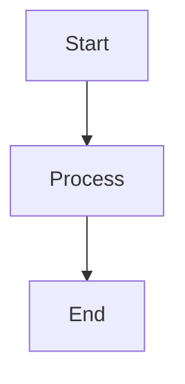

# ❓ Frequently Asked Questions (FAQ)

## Purpose

This FAQ addresses common questions developers encounter when working with the Conaprole Orders system.

## Audience

- **New developers** - Onboarding and getting started
- **All team members** - Common troubleshooting and procedures

## Prerequisites

- Basic familiarity with the system architecture
- Development environment setup

## Development & Setup

### Q: How do I set up the development environment?

**A:** Follow these steps:

1. **Clone the repository**:
   ```bash
   git clone https://github.com/ingnlema/Conaprole.git
   cd Conaprole
   ```

2. **Install dependencies**:
   ```bash
   dotnet restore
   ```

3. **Set up local database** (using Docker):
   ```bash
   docker run --name postgres-dev -e POSTGRES_PASSWORD=dev123 -p 5432:5432 -d postgres:15
   ```

4. **Run migrations**:
   ```bash
   dotnet ef database update --project src/Conaprole.Orders.Infrastructure
   ```

5. **Start the API**:
   ```bash
   dotnet run --project src/Conaprole.Orders.Api
   ```

### Q: Why can't I run integration tests locally?

**A:** Integration tests require Docker to be running. Common solutions:

- **Start Docker Desktop** on Windows/Mac
- **Check Docker service** on Linux: `sudo systemctl start docker`
- **Verify container startup** with sufficient resources (4GB+ RAM recommended)
- **Clear Docker cache** if containers fail: `docker system prune -f`

### Q: How do I add a new endpoint with authorization?

**A:** Follow this pattern:

```csharp
[HttpGet("example")]
[HasPermission(Permissions.ExampleRead)]
[SwaggerOperation(Summary = "Get example data")]
public async Task<IActionResult> GetExample()
{
    var query = new GetExampleQuery();
    var result = await _sender.Send(query);
    return Ok(result);
}
```

**Key points:**
- Always use `[HasPermission]` for protected endpoints
- Use appropriate permission constants from `Permissions` class
- Add Swagger documentation with `[SwaggerOperation]`

## Authentication & Authorization

### Q: How does the permission system work?

**A:** The system uses a token-scoped permission model:

1. **User authenticates** with Keycloak and receives JWT token
2. **Token contains permissions** as claims
3. **API validates permissions** using `[HasPermission]` attribute
4. **Database stores user roles** which map to permissions

**Available permissions:**
- `users:read`, `users:write` - User management
- `orders:read`, `orders:write` - Order management  
- `products:read`, `products:write` - Product management
- `admin:access` - Administrative functions

### Q: How do I test endpoints that require authentication?

**A:** Use the test authentication setup:

```csharp
public class MyControllerTests : BaseIntegrationTest
{
    [Fact]
    public async Task TestProtectedEndpoint()
    {
        // Test with required permissions
        var response = await AuthenticatedRequest(
            HttpMethod.Get,
            "/api/protected-endpoint",
            permissions: new[] { "required:permission" }
        );
        
        response.StatusCode.Should().Be(HttpStatusCode.OK);
    }
}
```

### Q: What's the difference between roles and permissions?

**A:** 
- **Roles** are high-level user categories (Admin, Distributor, etc.)
- **Permissions** are specific actions (users:read, orders:write, etc.)
- **Users have roles**, **roles contain permissions**
- **Authorization checks permissions**, not roles directly

## Database & Entity Framework

### Q: How do I add a new entity?

**A:** Follow the Domain-Driven Design pattern:

1. **Create the domain entity** in `src/Conaprole.Orders.Domain/`
2. **Add EF configuration** in `src/Conaprole.Orders.Infrastructure/Persistence/Configurations/`
3. **Update DbContext** to include the new entity
4. **Create and run migration**:
   ```bash
   dotnet ef migrations add AddNewEntity --project src/Conaprole.Orders.Infrastructure
   dotnet ef database update --project src/Conaprole.Orders.Infrastructure
   ```

### Q: Why do I get LINQ translation errors in tests?

**A:** This happens when EF Core can't translate LINQ expressions to SQL. Common solutions:

- **Use Value Objects properly**:
  ```csharp
  // ❌ Don't do this
  .Where(u => u.Email.Value == emailString)
  
  // ✅ Do this instead  
  var emailValueObject = new Email(emailString);
  .Where(u => u.Email == emailValueObject)
  ```

- **Avoid complex operations** in LINQ expressions
- **Load data first**, then filter in memory for complex operations

## Testing

### Q: How do I run specific test categories?

**A:** Use dotnet test filters:

```bash
# Unit tests only
dotnet test --filter Category=Unit

# Integration tests only  
dotnet test --filter Category=Integration

# Functional tests only
dotnet test --filter Category=Functional

# Specific test class
dotnet test --filter ClassName=OrdersControllerTests
```

### Q: How do I debug failing tests?

**A:** Common debugging approaches:

1. **Add test output**:
   ```csharp
   public class MyTest : IClassFixture<TestFixture>
   {
       private readonly ITestOutputHelper _output;
       
       public MyTest(ITestOutputHelper output)
       {
           _output = output;
       }
       
       [Fact]
       public void MyTestMethod()
       {
           _output.WriteLine("Debug information here");
       }
   }
   ```

2. **Check container logs** for integration tests:
   ```bash
   docker logs $(docker ps -q --filter ancestor=postgres:15)
   ```

3. **Use debugger** with breakpoints in test methods

### Q: Why are my tests flaky?

**A:** Common causes and solutions:

- **Database state pollution**: Ensure proper cleanup between tests
- **Async timing issues**: Use proper `await` patterns
- **Container startup race conditions**: Add retry logic or longer timeouts
- **Shared test data**: Use unique test data for each test

## API & Integration

### Q: How do I consume the API from external applications?

**A:** Follow these steps:

1. **Obtain JWT token** from Keycloak:
   ```bash
   curl -X POST "https://keycloak.example.com/auth/realms/conaprole/protocol/openid-connect/token" \
     -H "Content-Type: application/x-www-form-urlencoded" \
     -d "grant_type=client_credentials&client_id=YOUR_CLIENT&client_secret=YOUR_SECRET"
   ```

2. **Use token in API requests**:
   ```bash
   curl -X GET "https://api.example.com/api/users" \
     -H "Authorization: Bearer YOUR_JWT_TOKEN"
   ```

3. **Handle token refresh** when tokens expire

### Q: What's the API rate limiting?

**A:** Currently no explicit rate limiting is implemented, but consider:

- **Reasonable request patterns** (don't spam the API)
- **Batch operations** for bulk data operations
- **Pagination** for large result sets
- **Caching** frequently accessed data

## Deployment & Operations

### Q: How do I deploy to production?

**A:** The system uses Azure Container Apps:

1. **Code is deployed** automatically via GitHub Actions
2. **Container is built** and pushed to Azure Container Registry
3. **Container App is updated** with the new image
4. **Health checks** verify successful deployment

### Q: How do I check system health?

**A:** Use the built-in health check endpoints:

- **Basic health**: `GET /health`
- **Detailed health**: `GET /health/detailed` (may require authentication)
- **Readiness**: `GET /health/ready`
- **Liveness**: `GET /health/live`

### Q: How do I access logs in production?

**A:** Azure Container Apps provides several logging options:

- **Azure Portal**: Container Apps > Monitoring > Log Stream
- **Application Insights**: Structured logging and telemetry
- **Azure CLI**: `az containerapp logs show`

## Documentation

### Q: How do I update documentation?

**A:** Follow the documentation standards:

1. **Read the style guide**: See [STYLE_GUIDE.md](./STYLE_GUIDE.md)
2. **Update relevant docs** when making code changes
3. **Verify code examples** compile and execute
4. **Run validation**: `make docs-validate`
5. **Fix any issues**: `make docs-fix`

### Q: How do I add new diagrams?

**A:** Use Mermaid for consistency:

```markdown

```

**Diagram types supported:**
- **Flowcharts** for processes
- **Sequence diagrams** for interactions  
- **C4 diagrams** for architecture
- **ER diagrams** for data models

## Getting Help

### Q: Where can I get additional help?

**A:** Resources for further assistance:

- **Team Documentation**: Browse other docs in this repository
- **Code Reviews**: Ask questions in pull request reviews
- **Team Discussions**: Use team communication channels
- **Architecture Decisions**: Check ADR documents for context
- **Issue Tracking**: Create GitHub issues for bugs or enhancements

### Q: How do I contribute to this FAQ?

**A:** To add new questions:

1. **Identify common questions** from team discussions
2. **Write clear, actionable answers** with code examples
3. **Test all code examples** to ensure they work
4. **Submit a pull request** with your additions
5. **Keep answers updated** as the system evolves

---

*Last verified: 2025-01-02 - Commit: [FAQ section added]*