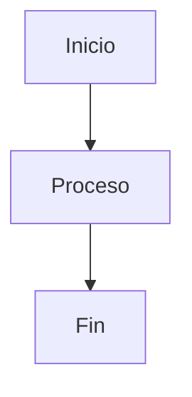

# 📄 [Título del Documento]

> **Propósito**: [Descripción clara del propósito del documento]  
> **Audiencia**: [Desarrolladores/Arquitectos/QA/DevOps]  
> **Prerrequisitos**: [Conocimientos o configuración necesaria]

## 🎯 Objetivos

[Explicación del problema que resuelve este documento y los objetivos específicos]

---

## 📋 Contenido Principal

### [Sección 1]

[Contenido con narrativa clara y explicaciones en lenguaje natural]

#### Ejemplo de Código

```csharp
// Ejemplo verificado contra implementación actual
// Ruta de referencia: src/Conaprole.Orders.*/...
public class ExampleClass
{
    // Código que compila y ejecuta correctamente
}
```

#### Ejemplo de Comando

```bash
# Comando verificado en entorno de desarrollo
dotnet build --configuration Release
```

### [Sección 2]

[Continuar con el contenido según la estructura específica del documento]

## 🔗 Referencias

- [Documento relacionado](../ruta/documento.md)
- [Código fuente](../../src/ruta/archivo.cs)
- [Tests relacionados](../../test/ruta/tests.cs)

## 📊 Diagramas



## ❓ FAQ

### ¿Pregunta frecuente?

Respuesta clara y concisa.

---

> **Última verificación**: 2025-07-02  
> **Commit SHA**: [SHA del último commit verificado]  
> **Estado**: ✅ Verificado | ⚠️ Requiere actualización | ❌ Desactualizado