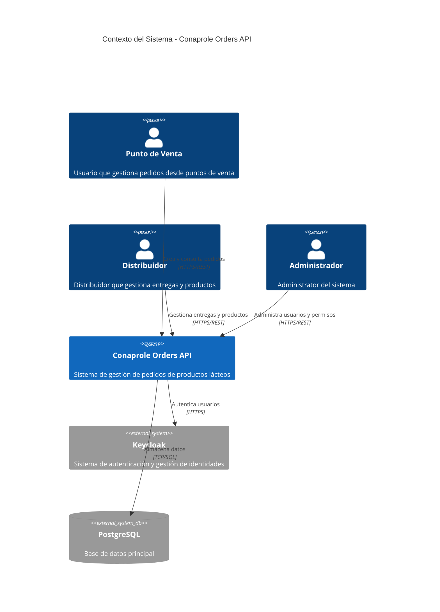
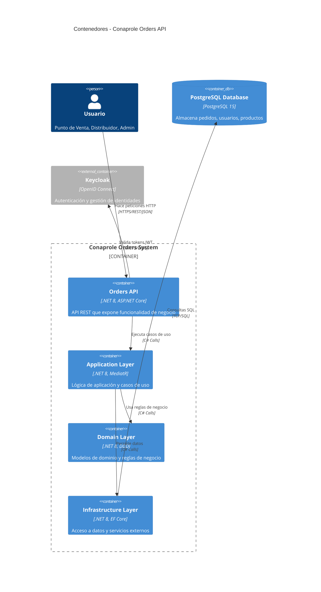
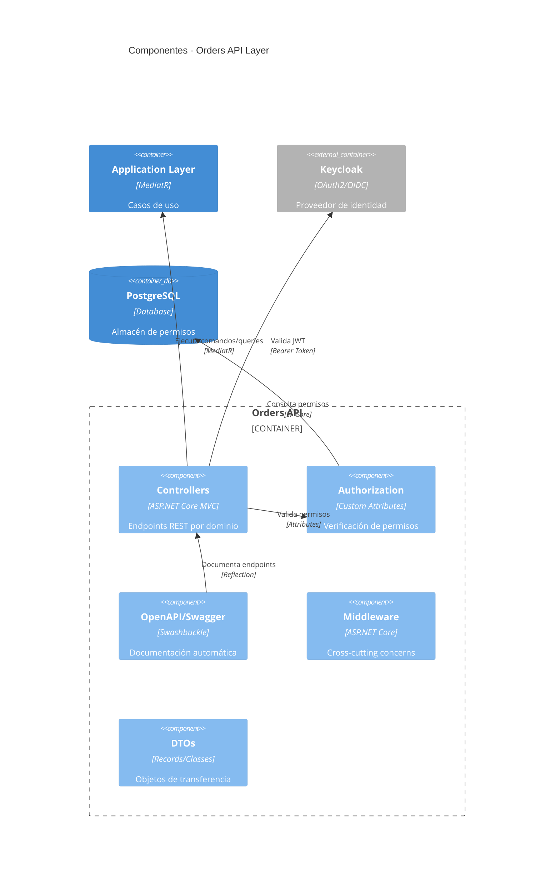
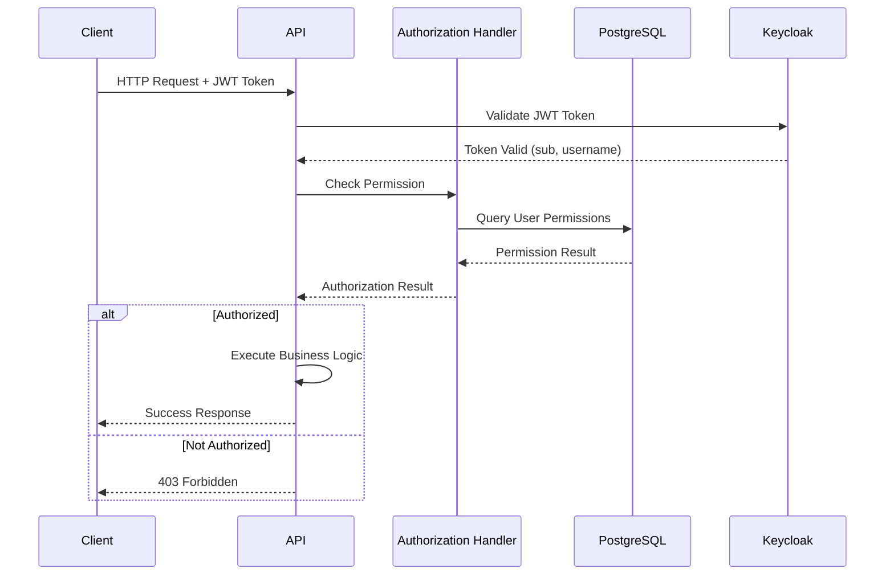

# 🏗️ Arquitectura C4 - Conaprole Orders API

> **Propósito**: Documentar la arquitectura del sistema usando el modelo C4  
> **Audiencia**: Arquitectos, Desarrolladores Senior, Stakeholders  
> **Prerrequisitos**: Conocimientos básicos de arquitectura de software

## 🎯 Objetivos

Proporcionar vistas arquitectónicas de alto nivel del sistema Conaprole Orders API siguiendo el modelo C4:

- **Contexto del Sistema**: Relación con usuarios y sistemas externos
- **Contenedores**: Componentes principales y tecnologías
- **Componentes**: Estructura interna de la aplicación

---

## 📊 Nivel 1: Contexto del Sistema



### Actores Principales

| Actor | Responsabilidades | Permisos |
|-------|------------------|----------|
| **Punto de Venta** | Crear pedidos, consultar productos | `orders:write`, `products:read` |
| **Distribuidor** | Gestionar entregas, actualizar inventario | `orders:read`, `distributors:write` |
| **Administrador** | Configurar sistema, gestionar usuarios | `admin:access`, `users:write` |

---

## 📦 Nivel 2: Contenedores



### Tecnologías por Contenedor

| Contenedor | Tecnología Principal | Responsabilidad |
|------------|---------------------|-----------------|
| **Orders API** | ASP.NET Core 8.0 | Endpoints REST, autorización, documentación |
| **Application** | MediatR, FluentValidation | CQRS, validaciones, orquestación |
| **Domain** | .NET 8, DDD | Entidades, agregados, reglas de negocio |
| **Infrastructure** | Entity Framework Core | Persistencia, integración externa |

---

## 🔧 Nivel 3: Componentes (API Layer)



### Patrones de Componentes

#### Controllers por Dominio

```csharp
// Ejemplo: src/Conaprole.Orders.Api/Controllers/Orders/OrdersController.cs
[ApiController]
[Route("api/[controller]")]
public class OrdersController : ControllerBase
{
    [HttpGet("{id}")]
    [HasPermission(Permissions.OrdersRead)]
    public async Task<IActionResult> GetOrder(Guid id)
    {
        var query = new GetOrderQuery(id);
        var result = await _sender.Send(query);
        return result.IsSuccess ? Ok(result.Value) : NotFound();
    }
}
```

#### Authorization Handler

```csharp
// src/Conaprole.Orders.Infrastructure/Authorization/PermissionAuthorizationHandler.cs
public class PermissionAuthorizationHandler : AuthorizationHandler<PermissionRequirement>
{
    protected override async Task HandleRequirementAsync(
        AuthorizationHandlerContext context,
        PermissionRequirement requirement)
    {
        // Verificar permisos en base de datos
        var hasPermission = await CheckUserPermission(userId, requirement.Permission);
        if (hasPermission) context.Succeed(requirement);
    }
}
```

---

## 🔄 Flujos de Autorización

### Flujo de Autenticación y Autorización



---

## 🔗 Referencias

- [Clean Architecture](clean-architecture.md)
- [CQRS & MediatR](cqrs-mediator.md)
- [Authorization Details](../security/authorization.md)
- [API Design Patterns](api-design.md)

---

> **Última verificación**: 2025-07-02  
> **Commit SHA**: 20c7d61  
> **Estado**: ✅ Verificado
