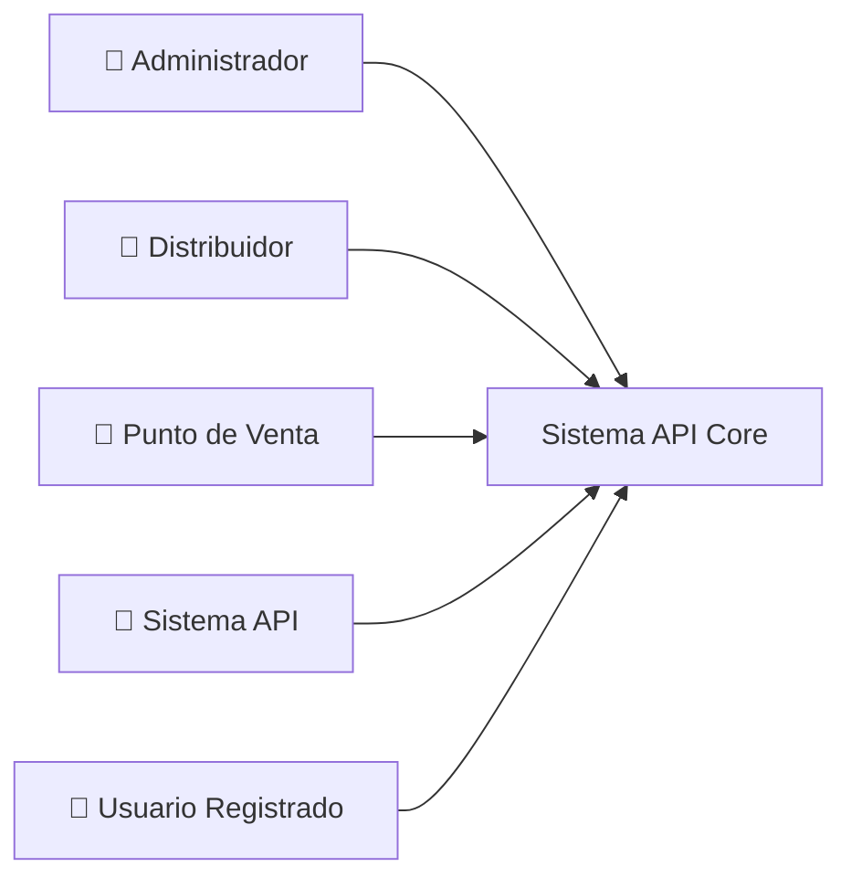

# 📋 Diagramas de Casos de Uso - API Core Conaprole

## 📁 Contenido del Directorio

Este directorio contiene los diagramas de casos de uso completos del sistema API Core Conaprole, organizados por actores principales y funcionalidades.

### 📄 Archivos Disponibles

| Archivo | Descripción | Actor Principal | Vista Previa |
|---------|-------------|-----------------|--------------|
| `casos-uso-general.md` | Visión general del sistema completo | Todos los actores | `casos-uso-general.html` |
| `casos-uso-administrador.md` | Casos de uso del administrador | 👤 Administrador | `casos-uso-administrador.html` |
| `casos-uso-distribuidor.md` | Casos de uso del distribuidor | 🚛 Distribuidor | `casos-uso-distribuidor.html` |
| `casos-uso-punto-de-venta.md` | Casos de uso del punto de venta | 🛒 Punto de Venta | `casos-uso-punto-de-venta.html` |

### 🖼️ Formatos Disponibles

- **📄 Markdown (.md)**: Documentación completa con diagramas Mermaid
- **🌐 HTML (.html)**: Vista previa interactiva de los diagramas
- **📁 Editables**: Los archivos .md pueden editarse en cualquier editor de texto

## 🎯 Propósito

Los diagramas de casos de uso proporcionan una representación visual completa de:

- **Actores** del sistema y sus roles
- **Funcionalidades** disponibles para cada actor
- **Relaciones** entre casos de uso (include, extend)
- **Flujos** de trabajo y procesos de negocio
- **Permisos** y reglas de autorización

## 🏗️ Arquitectura del Sistema

### Actores Principales



### Módulos Funcionales

- **👤 Gestión de Usuarios**: Autenticación, roles, permisos
- **📦 Gestión de Productos**: Catálogo, precios, categorías
- **🛒 Gestión de Pedidos**: Creación, seguimiento, procesamiento
- **🏪 Gestión de Puntos de Venta**: Registro, configuración, asignaciones
- **🚛 Gestión de Distribuidores**: Red de distribución, categorías

## 📊 Estadísticas de Casos de Uso

| Actor | Casos de Uso | Principales Funciones |
|-------|-------------|-----------------------|
| Administrador | 21 | Gestión completa del sistema |
| Distribuidor | 15 | Procesamiento y entrega |
| Punto de Venta | 20 | Pedidos y consultas |
| API | 8 | Integración sistema-a-sistema |
| Usuario Registrado | 5 | Acceso básico |

## 🔐 Modelo de Seguridad

### Roles del Sistema

- **Administrator**: Control total del sistema
- **Distributor**: Gestión de entregas y asignaciones
- **Registered**: Acceso básico autenticado
- **API**: Integración entre sistemas

### Permisos Principales

- `AdminAccess`: Administración completa
- `UsersWrite/Read`: Gestión de usuarios
- `OrdersWrite/Read`: Gestión de pedidos
- `ProductsWrite/Read`: Gestión de productos
- `PointsOfSaleWrite/Read`: Gestión de puntos de venta
- `DistributorsWrite/Read`: Gestión de distribuidores

## 🔄 Flujos de Trabajo Principales

### 1. Configuración Inicial del Sistema

```
Administrador → Crear Productos → Crear Distribuidores → Asignar Categorías
```

### 2. Registro de Punto de Venta

```
PdV → Registrarse → Admin Valida → Admin Asigna Distribuidor → PdV Activo
```

### 3. Proceso de Pedido Completo

```
PdV → Crear Pedido → Distribuidor Confirma → Procesa → Entrega → Completado
```

## 🛠️ Tecnologías Utilizadas

- **Formato**: Markdown + Mermaid
- **Herramientas**: Compatible con GitHub, GitLab, Draw.io
- **Estándares**: UML 2.5 para diagramas de casos de uso
- **Exportación**: Fácil conversión a PNG, PDF, SVG

## 📖 Cómo Usar Estos Diagramas

### 🖼️ Visualización de Diagramas

#### Opción 1: GitHub/GitLab (Recomendado)

Los archivos `.md` se renderizan automáticamente con los diagramas Mermaid en GitHub y GitLab.

#### Opción 2: Vista Previa HTML

1. Abrir los archivos `.html` en cualquier navegador web
2. Los diagramas se renderizan automáticamente con Mermaid.js
3. Ideal para presentaciones o revisiones offline

#### Opción 3: Exportar Imágenes

1. Abrir archivo `.html` en navegador
2. Usar herramientas del navegador para exportar a PNG/PDF
3. Alternativamente, usar herramientas como [Mermaid Live Editor](https://mermaid.live/)

### Para Desarrollo

1. **Análisis de Requisitos**: Identificar funcionalidades por implementar
2. **Diseño de APIs**: Definir endpoints basados en casos de uso
3. **Testing**: Crear casos de prueba para cada caso de uso
4. **Documentación**: Referencia para documentación técnica

### Para Negocio

1. **Capacitación**: Entender funcionalidades disponibles
2. **Procesos**: Mapear flujos de trabajo empresariales
3. **Roles**: Definir responsabilidades por actor
4. **Validación**: Verificar que el sistema cubre necesidades

### Para Mantenimiento

1. **Evolución**: Identificar áreas de mejora
2. **Nuevas Funcionalidades**: Planificar extensiones del sistema
3. **Optimización**: Detectar flujos complejos o redundantes
4. **Integración**: Planificar conectores con sistemas externos

## 🔄 Mantenimiento de Diagramas

### Cuándo Actualizar

- ✅ Nuevos casos de uso implementados
- ✅ Cambios en permisos o roles
- ✅ Modificaciones en flujos de negocio
- ✅ Nuevos actores o integraciones
- ✅ Cambios en reglas de autorización

### Proceso de Actualización

1. **Identificar Cambios**: Analizar modificaciones en código
2. **Actualizar Diagramas**: Modificar archivos Markdown
3. **Validar Consistencia**: Verificar coherencia entre diagramas
4. **Documentar Cambios**: Registrar modificaciones realizadas
5. **Comunicar**: Notificar a equipos relevantes

## 📚 Referencias Adicionales

- [Documentación de Arquitectura](../README.md)
- [Domain-Driven Design](../domain-design.md)
- [CQRS y MediatR](../cqrs-mediator.md)
- [Arquitectura de Seguridad](../../security/README.md)
- [Diagramas de Seguridad](../../security/diagrams.md)

## 🏷️ Etiquetas

`#UML` `#UseCases` `#Architecture` `#DDD` `#CQRS` `#API` `#Conaprole` `#Documentation`

---

*Generado automáticamente para API Core Conaprole*  
*Última actualización: $(date)*  
*Versión: 1.0.0*
