# 🔐 Casos de Uso - Administrador

## Diagrama de Casos de Uso - Administrador

```mermaid
graph TB
    subgraph "Sistema API Core Conaprole"
        %% User Management Use Cases
        UC1[Registrar Usuario]
        UC2[Gestionar Roles de Usuario]
        UC3[Gestionar Permisos de Usuario]
        UC4[Consultar Todos los Usuarios]
        UC5[Eliminar Usuario]
        UC6[Consultar Roles de Usuario]
        UC7[Consultar Permisos de Usuario]
        
        %% Product Management Use Cases
        UC8[Crear Producto]
        UC9[Consultar Producto]
        UC10[Listar Productos]
        
        %% Point of Sale Management Use Cases
        UC11[Crear Punto de Venta]
        UC12[Habilitar Punto de Venta]
        UC13[Deshabilitar Punto de Venta]
        UC14[Asignar Distribuidor a PdV]
        UC15[Desasignar Distribuidor de PdV]
        UC16[Consultar Puntos de Venta]
        
        %% Distributor Management Use Cases
        UC17[Crear Distribuidor]
        UC18[Gestionar Categorías de Distribuidor]
        UC19[Consultar Distribuidores]
        
        %% System Management Use Cases
        UC20[Consultar Roles del Sistema]
        UC21[Consultar Permisos del Sistema]
    end
    
    %% Actor
    Admin[👤 Administrador]
    
    %% Relationships
    Admin --> UC1
    Admin --> UC2
    Admin --> UC3
    Admin --> UC4
    Admin --> UC5
    Admin --> UC6
    Admin --> UC7
    Admin --> UC8
    Admin --> UC9
    Admin --> UC10
    Admin --> UC11
    Admin --> UC12
    Admin --> UC13
    Admin --> UC14
    Admin --> UC15
    Admin --> UC16
    Admin --> UC17
    Admin --> UC18
    Admin --> UC19
    Admin --> UC20
    Admin --> UC21
    
    %% Styling
    classDef actor fill:#e1f5fe,stroke:#01579b,stroke-width:2px
    classDef usecase fill:#f3e5f5,stroke:#4a148c,stroke-width:1px
    classDef system fill:#e8f5e8,stroke:#2e7d32,stroke-width:2px
    
    class Admin actor
    class UC1,UC2,UC3,UC4,UC5,UC6,UC7,UC8,UC9,UC10,UC11,UC12,UC13,UC14,UC15,UC16,UC17,UC18,UC19,UC20,UC21 usecase
```

## Descripción de Casos de Uso

### Gestión de Usuarios
- **UC1 - Registrar Usuario**: Crear nuevos usuarios en el sistema con roles asignados
- **UC2 - Gestionar Roles de Usuario**: Asignar y remover roles de usuarios existentes
- **UC3 - Gestionar Permisos de Usuario**: Configurar permisos específicos por usuario
- **UC4 - Consultar Todos los Usuarios**: Listar usuarios con filtros por rol
- **UC5 - Eliminar Usuario**: Remover usuarios del sistema
- **UC6 - Consultar Roles de Usuario**: Ver roles asignados a un usuario específico
- **UC7 - Consultar Permisos de Usuario**: Ver permisos efectivos de un usuario

### Gestión de Productos
- **UC8 - Crear Producto**: Registrar nuevos productos en el catálogo
- **UC9 - Consultar Producto**: Ver detalles de un producto específico
- **UC10 - Listar Productos**: Ver catálogo completo de productos

### Gestión de Puntos de Venta
- **UC11 - Crear Punto de Venta**: Registrar nuevos puntos de venta
- **UC12 - Habilitar Punto de Venta**: Activar un punto de venta para recibir pedidos
- **UC13 - Deshabilitar Punto de Venta**: Desactivar un punto de venta temporalmente
- **UC14 - Asignar Distribuidor a PdV**: Crear relación entre distribuidor y punto de venta
- **UC15 - Desasignar Distribuidor de PdV**: Remover relación distribuidor-punto de venta
- **UC16 - Consultar Puntos de Venta**: Listar puntos de venta con filtros de estado

### Gestión de Distribuidores
- **UC17 - Crear Distribuidor**: Registrar nuevos distribuidores
- **UC18 - Gestionar Categorías de Distribuidor**: Asignar/remover categorías de productos
- **UC19 - Consultar Distribuidores**: Listar distribuidores y sus asignaciones

### Gestión del Sistema
- **UC20 - Consultar Roles del Sistema**: Ver todos los roles disponibles
- **UC21 - Consultar Permisos del Sistema**: Ver todos los permisos configurados

## Permisos Requeridos
- `AdminAccess`: Acceso completo de administrador
- `UsersWrite`: Creación y modificación de usuarios
- `UsersRead`: Consulta de información de usuarios
- `ProductsWrite`: Creación y modificación de productos
- `ProductsRead`: Consulta de productos
- `PointsOfSaleWrite`: Gestión de puntos de venta
- `PointsOfSaleRead`: Consulta de puntos de venta
- `DistributorsWrite`: Gestión de distribuidores
- `DistributorsRead`: Consulta de distribuidores

---

*Generado para API Core Conaprole - Casos de Uso del Administrador*