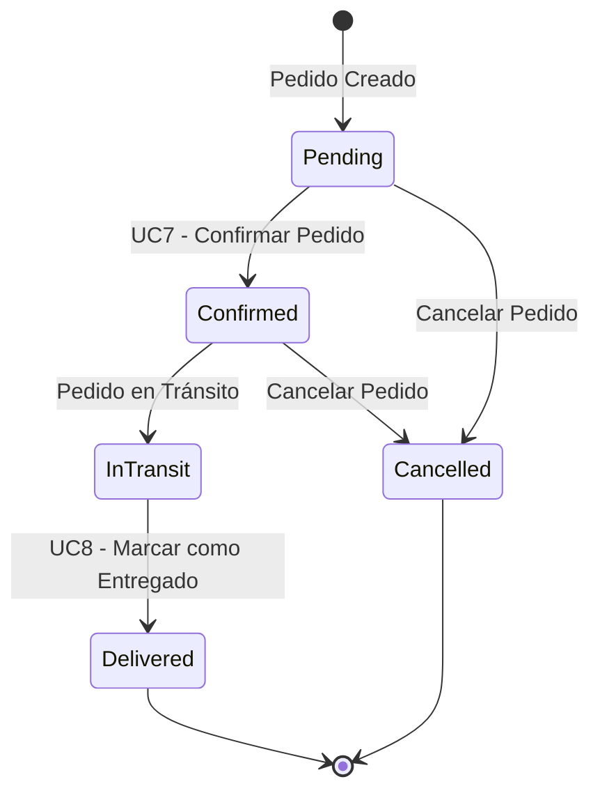

# 🚛 Casos de Uso - Distribuidor

## Diagrama de Casos de Uso - Distribuidor

```mermaid
graph TB
    subgraph "Sistema API Core Conaprole"
        %% Authentication Use Cases
        UC1[Iniciar Sesión]
        UC2[Cambiar Contraseña]
        UC3[Consultar Perfil Propio]
        
        %% Order Management Use Cases
        UC4[Consultar Pedidos Asignados]
        UC5[Actualizar Estado de Pedido]
        UC6[Consultar Detalle de Pedido]
        UC7[Confirmar Pedido]
        UC8[Marcar Pedido como Entregado]
        
        %% Point of Sale Management Use Cases
        UC9[Consultar Puntos de Venta Asignados]
        UC10[Consultar Detalle de Punto de Venta]
        UC11[Ver Historial de Pedidos por PdV]
        
        %% Category Management Use Cases
        UC12[Consultar Categorías Asignadas]
        UC13[Solicitar Nuevas Categorías]
        
        %% Product Management Use Cases
        UC14[Consultar Productos por Categoría]
        UC15[Verificar Disponibilidad de Producto]
    end
    
    %% Actor
    Dist[🚛 Distribuidor]
    
    %% Relationships
    Dist --> UC1
    Dist --> UC2
    Dist --> UC3
    Dist --> UC4
    Dist --> UC5
    Dist --> UC6
    Dist --> UC7
    Dist --> UC8
    Dist --> UC9
    Dist --> UC10
    Dist --> UC11
    Dist --> UC12
    Dist --> UC13
    Dist --> UC14
    Dist --> UC15
    
    %% Include relationships
    UC4 -.->|<<include>>| UC6
    UC5 -.->|<<include>>| UC6
    UC9 -.->|<<include>>| UC10
    UC11 -.->|<<include>>| UC6
    
    %% Extend relationships  
    UC7 -.->|<<extend>>| UC5
    UC8 -.->|<<extend>>| UC5
    
    %% Styling
    classDef actor fill:#e1f5fe,stroke:#01579b,stroke-width:2px
    classDef usecase fill:#fff3e0,stroke:#ef6c00,stroke-width:1px
    classDef system fill:#e8f5e8,stroke:#2e7d32,stroke-width:2px
    
    class Dist actor
    class UC1,UC2,UC3,UC4,UC5,UC6,UC7,UC8,UC9,UC10,UC11,UC12,UC13,UC14,UC15 usecase
```

## Descripción de Casos de Uso

### Autenticación y Perfil
- **UC1 - Iniciar Sesión**: Autenticarse en el sistema con credenciales
- **UC2 - Cambiar Contraseña**: Modificar contraseña de acceso
- **UC3 - Consultar Perfil Propio**: Ver información personal y configuración

### Gestión de Pedidos
- **UC4 - Consultar Pedidos Asignados**: Listar pedidos que debe atender el distribuidor
- **UC5 - Actualizar Estado de Pedido**: Cambiar estado del pedido durante el proceso
- **UC6 - Consultar Detalle de Pedido**: Ver información completa de un pedido específico
- **UC7 - Confirmar Pedido**: Aceptar un pedido para procesamiento
- **UC8 - Marcar Pedido como Entregado**: Finalizar el proceso de entrega

### Gestión de Puntos de Venta
- **UC9 - Consultar Puntos de Venta Asignados**: Ver PdV bajo su responsabilidad
- **UC10 - Consultar Detalle de Punto de Venta**: Ver información específica de un PdV
- **UC11 - Ver Historial de Pedidos por PdV**: Consultar pedidos anteriores de un PdV

### Gestión de Categorías
- **UC12 - Consultar Categorías Asignadas**: Ver categorías de productos que puede distribuir
- **UC13 - Solicitar Nuevas Categorías**: Pedir autorización para nuevas categorías

### Gestión de Productos
- **UC14 - Consultar Productos por Categoría**: Ver productos disponibles en sus categorías
- **UC15 - Verificar Disponibilidad de Producto**: Comprobar stock y disponibilidad

## Estados de Pedido Manejados por Distribuidor

## Categorías de Productos
- **LACTEOS**: Productos lácteos (leche, quesos, yogurt)
- **CONGELADOS**: Productos congelados (helados, comidas preparadas)
- **SUBPRODUCTOS**: Derivados y subproductos lácteos

## Permisos Requeridos
- `DistributorAccess`: Acceso básico como distribuidor
- `OrdersRead`: Consulta de pedidos
- `OrdersWrite`: Modificación de estados de pedidos
- `PointsOfSaleRead`: Consulta de puntos de venta asignados
- `ProductsRead`: Consulta de productos

## Reglas de Negocio
1. Un distribuidor solo puede ver pedidos de sus PdV asignados
2. Un distribuidor solo puede manejar productos de sus categorías autorizadas
3. Los cambios de estado de pedidos siguen un flujo específico
4. Un distribuidor no puede cancelar pedidos ya confirmados sin autorización

---

*Generado para API Core Conaprole - Casos de Uso del Distribuidor*