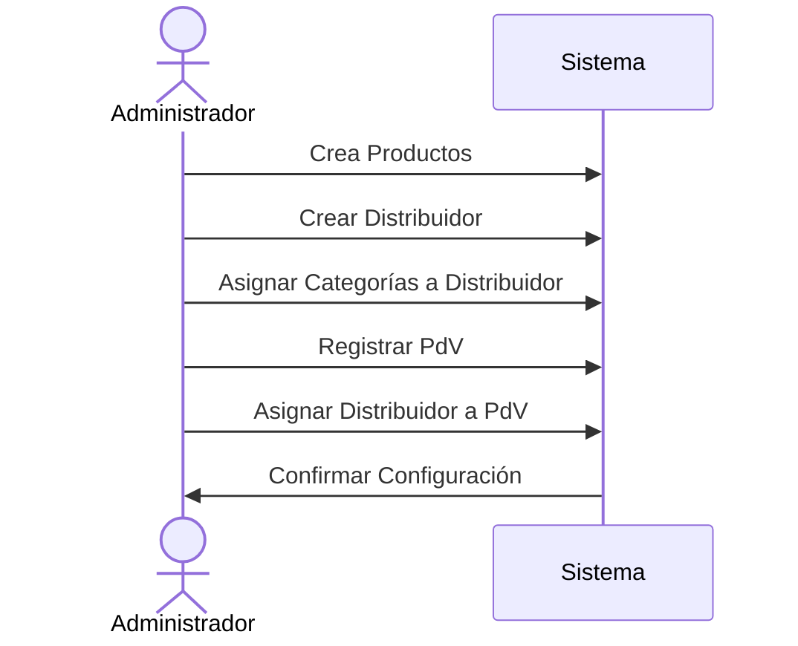
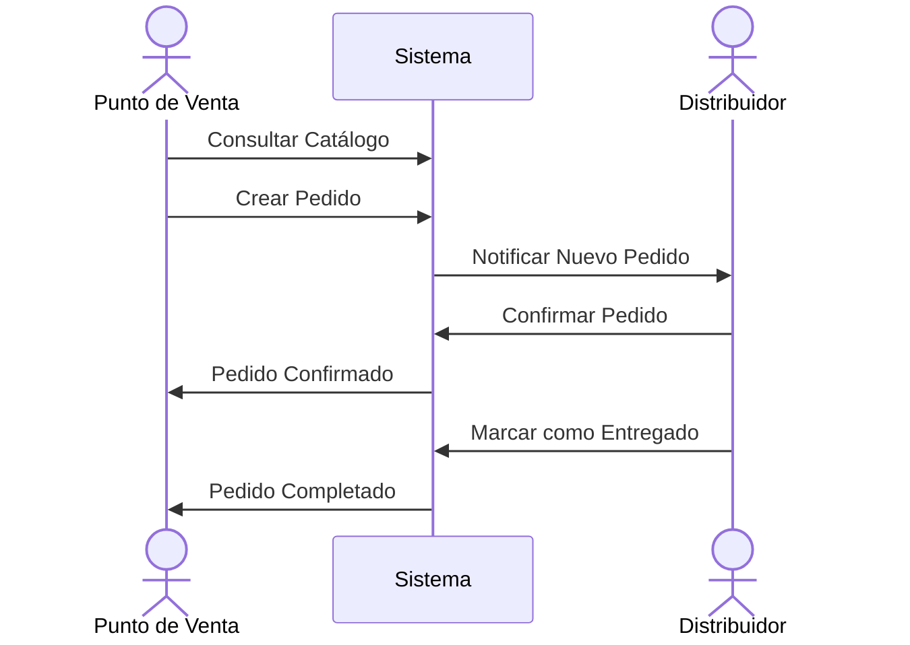

# 🏗️ Casos de Uso - Visión General del Sistema

## Diagrama de Casos de Uso - Sistema Completo

```mermaid
graph TB
    subgraph "API Core Conaprole"
        subgraph "Gestión de Usuarios"
            U1[Registrar Usuario]
            U2[Iniciar Sesión]
            U3[Gestionar Roles]
            U4[Gestionar Permisos]
            U5[Cambiar Contraseña]
        end
        
        subgraph "Gestión de Pedidos"
            O1[Crear Pedido]
            O2[Consultar Pedidos]
            O3[Actualizar Estado]
            O4[Gestionar Líneas de Pedido]
            O5[Crear Pedidos en Lote]
        end
        
        subgraph "Gestión de Productos"
            P1[Crear Producto]
            P2[Consultar Catálogo]
            P3[Gestionar Precios]
        end
        
        subgraph "Gestión de Puntos de Venta"
            S1[Crear Punto de Venta]
            S2[Gestionar Estado PdV]
            S3[Asignar Distribuidores]
            S4[Consultar PdV]
        end
        
        subgraph "Gestión de Distribuidores"
            D1[Crear Distribuidor]
            D2[Gestionar Categorías]
            D3[Consultar Asignaciones]
            D4[Procesar Entregas]
        end
    end
    
    %% Actors
    Admin[👤 Administrador]
    Dist[🚛 Distribuidor]
    PdV[🛒 Punto de Venta]
    API[🔌 Sistema API]
    User[👥 Usuario Registrado]
    
    %% Admin relationships
    Admin --> U1
    Admin --> U3
    Admin --> U4
    Admin --> P1
    Admin --> P3
    Admin --> S1
    Admin --> S2
    Admin --> S3
    Admin --> D1
    Admin --> D2
    
    %% Distributor relationships
    Dist --> U2
    Dist --> U5
    Dist --> O2
    Dist --> O3
    Dist --> D3
    Dist --> D4
    Dist --> P2
    
    %% Point of Sale relationships
    PdV --> U1
    PdV --> U2
    PdV --> U5
    PdV --> O1
    PdV --> O2
    PdV --> O4
    PdV --> O5
    PdV --> P2
    PdV --> S4
    
    %% API relationships
    API --> U1
    API --> O1
    API --> O2
    API --> O5
    API --> P2
    API --> S4
    API --> D3
    
    %% Registered User relationships
    User --> U2
    User --> U5
    User --> O2
    User --> P2
    
    %% Styling
    classDef actor fill:#e1f5fe,stroke:#01579b,stroke-width:2px
    classDef usecase fill:#f3e5f5,stroke:#4a148c,stroke-width:1px
    classDef admin fill:#ffebee,stroke:#c62828,stroke-width:1px
    classDef distributor fill:#fff3e0,stroke:#ef6c00,stroke-width:1px
    classDef pos fill:#e8f5e8,stroke:#2e7d32,stroke-width:1px
    classDef product fill:#e3f2fd,stroke:#1976d2,stroke-width:1px
    classDef user fill:#fce4ec,stroke:#8e24aa,stroke-width:1px
    
    class Admin,Dist,PdV,API,User actor
    class U1,U2,U3,U4,U5 user
    class O1,O2,O3,O4,O5 pos
    class P1,P2,P3 product
    class S1,S2,S3,S4 pos
    class D1,D2,D3,D4 distributor
```

## Actores del Sistema

### 👤 Administrador

**Rol principal**: Administración completa del sistema

- Gestión de usuarios, roles y permisos
- Configuración de productos y precios
- Administración de puntos de venta y distribuidores
- Supervisión general del sistema

### 🚛 Distribuidor

**Rol principal**: Distribución y entrega de productos

- Procesamiento de pedidos asignados
- Actualización de estados de entrega
- Gestión de rutas y entregas
- Comunicación con puntos de venta

### 🛒 Punto de Venta

**Rol principal**: Realización de pedidos

- Creación y gestión de pedidos
- Consulta de catálogo y precios
- Seguimiento de entregas
- Gestión de inventario local

### 🔌 Sistema API

**Rol principal**: Integración sistema-a-sistema

- Automatización de procesos
- Integración con sistemas externos
- Operaciones en lote
- Sincronización de datos

### 👥 Usuario Registrado

**Rol principal**: Acceso básico al sistema

- Autenticación y perfil personal
- Consultas de información pública
- Operaciones limitadas según permisos

## Flujos Principales del Sistema

### 1. Flujo de Registro y Configuración

### 2. Flujo de Pedido Completo

## Categorías de Productos

### 🥛 LACTEOS

- Leche y derivados básicos
- Quesos y productos fermentados
- Yogurts y postres lácteos

### 🧊 CONGELADOS

- Helados y productos congelados
- Comidas preparadas congeladas
- Productos de larga conservación

### 🔄 SUBPRODUCTOS

- Derivados industriales
- Ingredientes para procesamiento
- Productos especializados

## Reglas de Negocio Transversales

1. **Autenticación**: Todos los actores deben autenticarse excepto para registro inicial
2. **Autorización**: Cada operación valida permisos específicos del actor
3. **Trazabilidad**: Todas las operaciones críticas se registran para auditoría
4. **Consistencia**: Las operaciones mantienen integridad referencial
5. **Disponibilidad**: El sistema debe estar disponible 24/7 para operaciones críticas
6. **Escalabilidad**: Soporta múltiples actores concurrentes sin degradación

## Tecnologías y Patrones

- **Arquitectura**: Clean Architecture + DDD
- **Comunicación**: CQRS + MediatR
- **Autenticación**: JWT + Keycloak
- **Base de Datos**: PostgreSQL + Entity Framework
- **API**: REST + OpenAPI/Swagger
- **Patrones**: Repository, Specification, Domain Events

---

*Generado para API Core Conaprole - Visión General del Sistema*
