# 🏗️ Casos de Uso - Visión General del Sistema

## Diagrama de Casos de Uso - Sistema Completo

## Actores del Sistema

### 👤 Administrador

**Rol principal**: Administración completa del sistema

- Gestión de usuarios, roles y permisos
- Configuración de productos y precios
- Administración de puntos de venta y distribuidores
- Supervisión general del sistema

### 🚛 Distribuidor

**Rol principal**: Distribución y entrega de productos

- Procesamiento de pedidos asignados
- Actualización de estados de entrega
- Gestión de rutas y entregas
- Comunicación con puntos de venta

### 🛒 Punto de Venta

**Rol principal**: Realización de pedidos

- Creación y gestión de pedidos
- Consulta de catálogo y precios
- Seguimiento de entregas
- Gestión de inventario local

### 🔌 Sistema API

**Rol principal**: Integración sistema-a-sistema

- Automatización de procesos
- Integración con sistemas externos
- Operaciones en lote
- Sincronización de datos

### 👥 Usuario Registrado

**Rol principal**: Acceso básico al sistema

- Autenticación y perfil personal
- Consultas de información pública
- Operaciones limitadas según permisos

## Flujos Principales del Sistema

### 1. Flujo de Registro y Configuración

```mermaid
sequenceDiagram
    actor Admin as Administrador
    participant SYS as Sistema
    actor PdV as Punto de Venta
    actor Dist as Distribuidor
    
    Admin->>SYS: Crear Producto
    Admin->>SYS: Crear Distribuidor
    Admin->>SYS: Asignar Categorías a Distribuidor
    
    PdV->>SYS: Registrarse como PdV
    SYS->>Admin: Notificar Nuevo PdV
    
    Admin->>SYS: Asignar Distribuidor a PdV
    SYS->>Dist: Notificar Nueva Asignación
    SYS->>PdV: Confirmar Configuración
```

### 2. Flujo de Pedido Completo

```mermaid
sequenceDiagram
    actor PdV as Punto de Venta
    participant SYS as Sistema
    actor Dist as Distribuidor
    
    PdV->>SYS: Consultar Catálogo
    PdV->>SYS: Crear Pedido
    SYS->>Dist: Notificar Nuevo Pedido
    
    Dist->>SYS: Confirmar Pedido
    SYS->>PdV: Pedido Confirmado
    
    Dist->>SYS: Actualizar a "En Tránsito"
    SYS->>PdV: Notificar Estado
    
    Dist->>SYS: Marcar como Entregado
    SYS->>PdV: Pedido Completado
```

## Matriz de Permisos por Actor

| Funcionalidad | Admin | Distribuidor | Punto de Venta | API | Usuario |
|---------------|-------|--------------|----------------|-----|---------|
| Gestión Usuarios | ✅ | ❌ | ❌ | ✅ | ❌ |
| Gestión Productos | ✅ | 👁️ | 👁️ | 👁️ | 👁️ |
| Crear Pedidos | ✅ | ❌ | ✅ | ✅ | ❌ |
| Procesar Pedidos | ✅ | ✅ | ❌ | ❌ | ❌ |
| Gestión PdV | ✅ | ❌ | 👁️ | 👁️ | ❌ |
| Gestión Distribuidores | ✅ | 👁️ | 👁️ | 👁️ | ❌ |

**Leyenda**: ✅ = Control total, 👁️ = Solo lectura, ❌ = Sin acceso

## Categorías de Productos

### 🥛 LACTEOS

- Leche y derivados básicos
- Quesos y productos fermentados
- Yogurts y postres lácteos

### 🧊 CONGELADOS

- Helados y productos congelados
- Comidas preparadas congeladas
- Productos de larga conservación

### 🔄 SUBPRODUCTOS

- Derivados industriales
- Ingredientes para procesamiento
- Productos especializados

## Reglas de Negocio Transversales

1. **Autenticación**: Todos los actores deben autenticarse excepto para registro inicial
2. **Autorización**: Cada operación valida permisos específicos del actor
3. **Trazabilidad**: Todas las operaciones críticas se registran para auditoría
4. **Consistencia**: Las operaciones mantienen integridad referencial
5. **Disponibilidad**: El sistema debe estar disponible 24/7 para operaciones críticas
6. **Escalabilidad**: Soporta múltiples actores concurrentes sin degradación

## Tecnologías y Patrones

- **Arquitectura**: Clean Architecture + DDD
- **Comunicación**: CQRS + MediatR
- **Autenticación**: JWT + Keycloak
- **Base de Datos**: PostgreSQL + Entity Framework
- **API**: REST + OpenAPI/Swagger
- **Patrones**: Repository, Specification, Domain Events

---

*Generado para API Core Conaprole - Visión General del Sistema*
