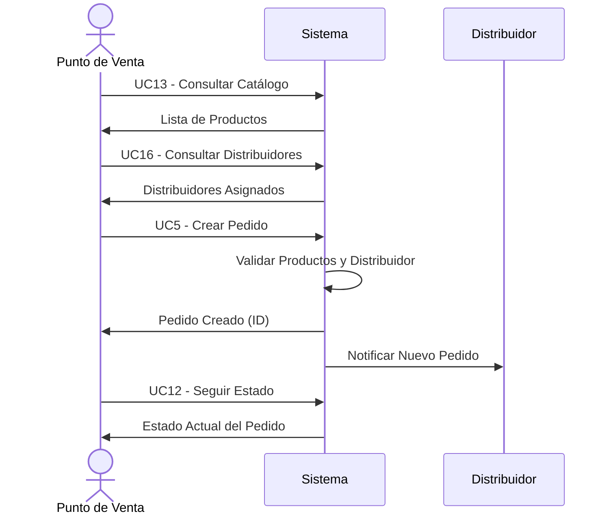
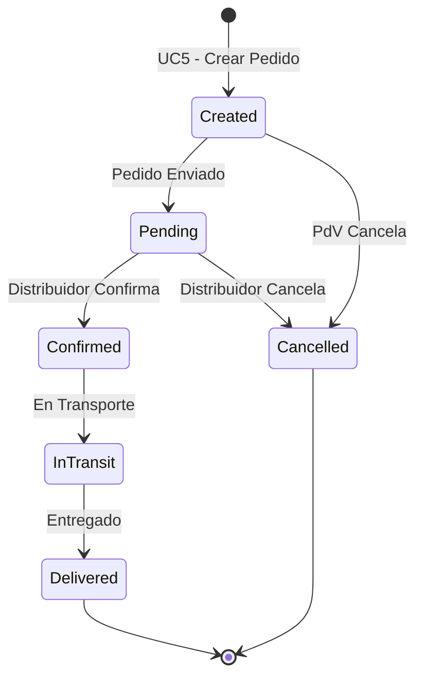

# 🛒 Casos de Uso - Punto de Venta

## Diagrama de Casos de Uso - Punto de Venta

```mermaid
graph TB
    subgraph "Sistema API Core Conaprole"
        %% Authentication Use Cases
        UC1[Registrarse en el Sistema]
        UC2[Iniciar Sesión]
        UC3[Cambiar Contraseña]
        UC4[Consultar Perfil Propio]
        
        %% Order Management Use Cases
        UC5[Crear Pedido]
        UC6[Crear Pedidos en Lote]
        UC7[Consultar Mis Pedidos]
        UC8[Consultar Detalle de Pedido]
        UC9[Agregar Línea de Pedido]
        UC10[Eliminar Línea de Pedido]
        UC11[Modificar Cantidad en Línea]
        UC12[Seguir Estado de Pedido]
        
        %% Product Management Use Cases
        UC13[Consultar Catálogo de Productos]
        UC14[Consultar Producto Específico]
        UC15[Verificar Precios]
        
        %% Distributor Management Use Cases
        UC16[Consultar Distribuidores Asignados]
        UC17[Ver Información de Distribuidor]
        UC18[Consultar Categorías por Distribuidor]
        
        %% System Integration Use Cases
        UC19[Refrescar Token de Acceso]
        UC20[Ver Historial de Pedidos]
    end
    
    %% Actor
    PdV[🛒 Punto de Venta]
    
    %% Relationships
    PdV --> UC1
    PdV --> UC2
    PdV --> UC3
    PdV --> UC4
    PdV --> UC5
    PdV --> UC6
    PdV --> UC7
    PdV --> UC8
    PdV --> UC9
    PdV --> UC10
    PdV --> UC11
    PdV --> UC12
    PdV --> UC13
    PdV --> UC14
    PdV --> UC15
    PdV --> UC16
    PdV --> UC17
    PdV --> UC18
    PdV --> UC19
    PdV --> UC20
    
    %% Include relationships
    UC5 -.->|<<include>>| UC13
    UC5 -.->|<<include>>| UC16
    UC6 -.->|<<include>>| UC5
    UC7 -.->|<<include>>| UC8
    UC9 -.->|<<include>>| UC14
    UC11 -.->|<<include>>| UC14
    UC20 -.->|<<include>>| UC8
    
    %% Extend relationships
    UC6 -.->|<<extend>>| UC5
    UC9 -.->|<<extend>>| UC5
    UC10 -.->|<<extend>>| UC8
    UC11 -.->|<<extend>>| UC8
    
    %% Styling
    classDef actor fill:#e1f5fe,stroke:#01579b,stroke-width:2px
    classDef usecase fill:#e8f5e8,stroke:#2e7d32,stroke-width:1px
    classDef system fill:#f3e5f5,stroke:#4a148c,stroke-width:2px
    
    class PdV actor
    class UC1,UC2,UC3,UC4,UC5,UC6,UC7,UC8,UC9,UC10,UC11,UC12,UC13,UC14,UC15,UC16,UC17,UC18,UC19,UC20 usecase
```

## Descripción de Casos de Uso

### Autenticación y Registro
- **UC1 - Registrarse en el Sistema**: Crear cuenta como punto de venta
- **UC2 - Iniciar Sesión**: Autenticarse con credenciales
- **UC3 - Cambiar Contraseña**: Modificar credenciales de acceso
- **UC4 - Consultar Perfil Propio**: Ver información del establecimiento

### Gestión de Pedidos
- **UC5 - Crear Pedido**: Realizar nuevo pedido de productos
- **UC6 - Crear Pedidos en Lote**: Crear múltiples pedidos simultáneamente
- **UC7 - Consultar Mis Pedidos**: Listar pedidos realizados con filtros
- **UC8 - Consultar Detalle de Pedido**: Ver información completa de un pedido
- **UC9 - Agregar Línea de Pedido**: Añadir productos a pedido existente
- **UC10 - Eliminar Línea de Pedido**: Remover productos de pedido
- **UC11 - Modificar Cantidad en Línea**: Cambiar cantidades solicitadas
- **UC12 - Seguir Estado de Pedido**: Monitorear progreso de entrega

### Gestión de Productos
- **UC13 - Consultar Catálogo de Productos**: Ver productos disponibles
- **UC14 - Consultar Producto Específico**: Ver detalles de un producto
- **UC15 - Verificar Precios**: Consultar precios actualizados

### Gestión de Distribuidores
- **UC16 - Consultar Distribuidores Asignados**: Ver distribuidores disponibles
- **UC17 - Ver Información de Distribuidor**: Consultar datos de contacto
- **UC18 - Consultar Categorías por Distribuidor**: Ver productos que maneja cada distribuidor

### Gestión del Sistema
- **UC19 - Refrescar Token de Acceso**: Renovar sesión automáticamente
- **UC20 - Ver Historial de Pedidos**: Consultar pedidos anteriores

## Flujo de Creación de Pedidos

## Estados de Pedido Visibles para PdV

## Reglas de Negocio para Punto de Venta

1. **Registro**: Debe proporcionar teléfono único y dirección válida
2. **Pedidos**: Solo puede crear pedidos con distribuidores asignados
3. **Productos**: Solo puede pedir productos de categorías cubiertas por sus distribuidores
4. **Modificaciones**: Solo puede modificar pedidos en estado "Created" o "Pending"
5. **Cancelación**: Puede cancelar pedidos antes de ser confirmados
6. **Historial**: Acceso completo a su historial de pedidos
7. **Facturación**: Los precios se calculan automáticamente según el catálogo

## Datos Requeridos para Pedidos

### Información del Pedido
- Distribuidor asignado (automático según categoría)
- Dirección de entrega
- Líneas de pedido (producto + cantidad)

### Información de Línea de Pedido
- Producto (ID externo)
- Cantidad solicitada
- Subtotal (calculado automáticamente)

## Permisos Requeridos
- `Registered`: Acceso básico como usuario registrado
- `OrdersWrite`: Creación y modificación de pedidos
- `OrdersRead`: Consulta de pedidos propios
- `ProductsRead`: Consulta del catálogo de productos
- `PointsOfSaleRead`: Consulta de información propia

---

*Generado para API Core Conaprole - Casos de Uso del Punto de Venta*