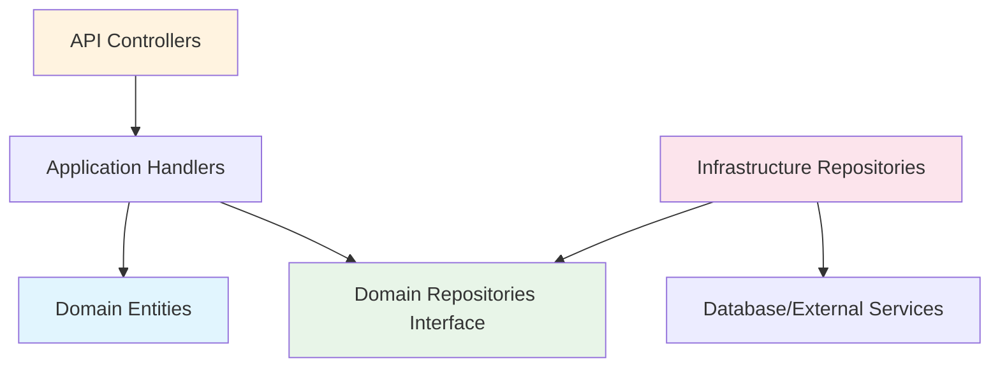

# 🏗️ Clean Architecture - Implementación en API Core Conaprole

## Introducción

La API Core de Conaprole Orders implementa **Clean Architecture** (Arquitectura Limpia) como patrón arquitectónico principal, siguiendo los principios establecidos por Robert C. Martin. Esta arquitectura garantiza la separación de responsabilidades, independencia de frameworks, y alta testabilidad.

## Principios Fundamentales

### 1. Dependency Inversion Principle (DIP)

Las dependencias fluyen hacia adentro, desde las capas externas hacia el núcleo del dominio:

```
API → Application → Domain
Infrastructure → Application → Domain
```

### 2. Independence of Frameworks

El dominio no depende de Entity Framework, ASP.NET Core, o cualquier framework específico.

### 3. Testability

Cada capa puede ser probada independientemente mediante mocking de dependencias.

### 4. Independence of Database

El dominio no conoce detalles de persistencia (PostgreSQL, Entity Framework).

## Estructura de Capas

### 📁 Estructura de Directorios

```
src/
├── Conaprole.Orders.Domain/           # 🔵 Capa de Dominio
│   ├── Abstractions/                  # Contratos base
│   ├── Orders/                        # Agregado Order
│   ├── Users/                         # Agregado User
│   ├── Distributors/                  # Agregado Distributor
│   ├── Products/                      # Agregado Product
│   ├── PointsOfSale/                  # Agregado PointOfSale
│   └── Shared/                        # Value Objects compartidos
├── Conaprole.Orders.Application/      # 🟢 Capa de Aplicación
│   ├── Abstractions/                  # Interfaces y contratos
│   ├── Orders/                        # Casos de uso de Orders
│   ├── Users/                         # Casos de uso de Users
│   ├── Distributors/                  # Casos de uso de Distributor
│   ├── Products/                      # Casos de uso de Product
│   ├── PointsOfSale/                  # Casos de uso de PointOfSale
│   └── Exceptions/                    # Excepciones de aplicación
├── Conaprole.Orders.Infrastructure/   # 🟡 Capa de Infraestructura
│   ├── Data/                         # Entity Framework
│   ├── Repositories/                 # Implementaciones de repositorios
│   ├── Authentication/               # Servicios de autenticación
│   ├── Authorization/                # Servicios de autorización
│   └── Configuration/                # Configuraciones EF
└── Conaprole.Orders.Api/             # 🔴 Capa de Presentación
    ├── Controllers/                  # Controladores REST
    ├── Middelware/                   # Middlewares personalizados
    └── Extensions/                   # Extensions methods
```

## 🔵 Capa de Dominio (Domain Layer)

### Responsabilidades

- **Entidades de dominio** y agregados
- **Value Objects** para conceptos del negocio
- **Domain Events** para comunicación entre agregados
- **Interfaces de repositorios** (sin implementación)
- **Lógica de negocio** pura

### Componentes Principales

#### Entidades Principales

```csharp
// src/Conaprole.Orders.Domain/Orders/Order.cs
public class Order : Entity, IAggregateRoot
{
        private readonly List<OrderLine> _orderLines = new();
        public IReadOnlyCollection<OrderLine> OrderLines => _orderLines.AsReadOnly();
        public Guid DistributorId { get; private set; }
        public Distributor Distributor { get; private set; }
        public Guid PointOfSaleId { get; private set; }
        public PointOfSale PointOfSale { get; private set; }
        public Address DeliveryAddress { get; private set; }
        public Status Status { get; private set; }
        public DateTime CreatedOnUtc { get; private set; }
        public DateTime? ConfirmedOnUtc { get; private set; }
        public DateTime? RejectedOnUtc { get; private set; }
        public DateTime? DeliveryOnUtc { get; private set; }
        public DateTime? CanceledOnUtc { get; private set; }
        public DateTime? DeliveredOnUtc { get; private set; }
        public Money Price { get; private set; }
}
```

#### Value Objects

```csharp
// src/Conaprole.Orders.Domain/Shared/Money.cs
public record Money(decimal Amount, Currency Currency)
{
    public static Money operator +(Money first, Money second)
    {
        if (first.Currency != second.Currency)
            throw new InvalidOperationException("Currencies must be equal");
        
        return new Money(first.Amount + second.Amount, first.Currency);
    }
}
```

#### Domain Events

```csharp
// src/Conaprole.Orders.Domain/Orders/Events/OrderCreatedDomainEvent.cs
public sealed record OrderCreatedDomainEvent(Guid OrderId) : IDomainEvent;
```

### Abstracciones Clave

```csharp
// src/Conaprole.Orders.Domain/Abstractions/Entity.cs
public abstract class Entity
{
    private readonly List<IDomainEvent> _domainEvents = new();
    
    protected void RaiseDomainEvent(IDomainEvent domainEvent)
    {
        _domainEvents.Add(domainEvent);
    }
}
```

## 🟢 Capa de Aplicación (Application Layer)

### Responsabilidades

- **Casos de uso** del sistema (Commands y Queries)
- **Orquestación** de la lógica de dominio
- **Validación** de entrada
- **Transformación** de datos (DTOs)
- **Coordinación** de transacciones

### Patrones Implementados

#### CQRS con MediatR

```csharp
// Command
public sealed record CreateOrderCommand(
    string PointOfSalePhoneNumber,
    string DistributorPhoneNumber,
    string City,
    string Street,
    string ZipCode,
    string CurrencyCode,
    List<CreateOrderLineCommand> OrderLines) : ICommand<Guid>;

// Command Handler
internal sealed class CreateOrderCommandHandler : ICommandHandler<CreateOrderCommand, Guid>
{
    private readonly IOrderRepository _orderRepository;
    private readonly IUnitOfWork _unitOfWork;
    
    public async Task<Result<Guid>> Handle(CreateOrderCommand request, CancellationToken cancellationToken)
    {
        // Orquestación del caso de uso
    }
}
```

#### Pipeline Behaviors

```csharp
// src/Conaprole.Orders.Application/Abstractions/Behaviors/ValidationBehavior.cs
public class ValidationBehavior<TRequest, TResponse>
    : IPipelineBehavior<TRequest, TResponse>
    where TRequest : IBaseCommand
{
    private readonly IEnumerable<IValidator<TRequest>> _validators;

    public ValidationBehavior(IEnumerable<IValidator<TRequest>> validators)
    {
        _validators = validators;
    }

    public async Task<TResponse> Handle(
        TRequest request,
        RequestHandlerDelegate<TResponse> next,
        CancellationToken cancellationToken)
    {
        if (!_validators.Any())
        {
            return await next();
        }

        var context = new ValidationContext<TRequest>(request);

        var validationErrors = _validators
            .Select(validator => validator.Validate(context))
            .Where(validationResult => validationResult.Errors.Any())
            .SelectMany(validationResult => validationResult.Errors)
            .Select(validationFailure => new ValidationError(
                validationFailure.PropertyName,
                validationFailure.ErrorMessage))
            .ToList();

        if (validationErrors.Any())
        {
            throw new Exceptions.ValidationException(validationErrors);
        }

        return await next();
    }
}

//use example
public class CreateOrderCommandValidator : AbstractValidator<CreateOrderCommand>
{
    public CreateOrderCommandValidator()
    {
        RuleFor(c => c.PointOfSalePhoneNumber)
            .NotEmpty().WithMessage("Phone number is required.")
            .MaximumLength(20);
        RuleFor(c => c.DistributorPhoneNumber)
            .NotEmpty().WithMessage("Distributor phone number is required.")
            .MaximumLength(20);
        RuleFor(c => c.City).NotEmpty();
        RuleFor(c => c.Street).NotEmpty();
        RuleFor(c => c.ZipCode).NotEmpty();
        RuleFor(c => c.CurrencyCode).NotEmpty();

        RuleFor(c => c.OrderLines)
            .NotEmpty().WithMessage("At least one order line is required.");

        RuleForEach(c => c.OrderLines).SetValidator(new CreateOrderLineCommandValidator());
    }
}

public class CreateOrderLineCommandValidator : AbstractValidator<CreateOrderLineCommand>
{
    public CreateOrderLineCommandValidator()
    {
        RuleFor(ol => ol.ExternalProductId).NotEmpty();
        RuleFor(ol => ol.Quantity).GreaterThan(0);
    }
}


```

### Configuración de Servicios

```csharp
// src/Conaprole.Orders.Application/DependencyInjection.cs
public static IServiceCollection AddApplication(this IServiceCollection services)
{
    services.AddMediatR(configuration =>
    {
        configuration.RegisterServicesFromAssembly(typeof(DependencyInjection).Assembly);
        configuration.AddOpenBehavior(typeof(LoggingBehavior<,>));
        configuration.AddOpenBehavior(typeof(ValidationBehavior<,>));
    });

    services.AddValidatorsFromAssembly(typeof(DependencyInjection).Assembly);
    return services;
}
```

## 🟡 Capa de Infraestructura (Infrastructure Layer)

### Responsabilidades

- **Implementación de repositorios** definidos en el dominio
- **Configuración de persistencia** (Entity Framework Core)
- **Servicios externos** (Keycloak, APIs)
- **Cross-cutting concerns** (logging, caching)

### Componentes Principales

#### Entity Framework Configuration

```csharp
// src/Conaprole.Orders.Infrastructure/ApplicationDbContext.cs
public sealed class ApplicationDbContext : DbContext, IUnitOfWork
{
    private readonly IPublisher _publisher;
    
    protected override void OnModelCreating(ModelBuilder modelBuilder)
    {
        modelBuilder.ApplyConfigurationsFromAssembly(typeof(ApplicationDbContext).Assembly);
    }
    
    public override async Task<int> SaveChangesAsync(CancellationToken cancellationToken = default)
    {
        var result = await base.SaveChangesAsync(cancellationToken);
        await PublishDomainEvents();
        return result;
    }
}
```

#### Repository Implementations

```csharp
// src/Conaprole.Orders.Infrastructure/Repositories/OrderRepository.cs
internal sealed class OrderRepository : Repository<Order>, IOrderRepository
{
    public OrderRepository(ApplicationDbContext dbContext) : base(dbContext) { }
    
    public async Task<Order?> GetByIdAsync(Guid id, CancellationToken cancellationToken = default)
    {
        return await DbContext.Set<Order>()
            .Include(o => o.OrderLines)
            .ThenInclude(ol => ol.Product)
            .FirstOrDefaultAsync(o => o.Id == id, cancellationToken);
    }
}
```

## 🔴 Capa de Presentación (API Layer)

### Responsabilidades

- **Endpoints HTTP** REST
- **Serialización/Deserialización** JSON
- **Autenticación y Autorización** HTTP
- **Documentación de API** (Swagger)
- **Manejo de errores** HTTP

### Controladores REST

```csharp
// src/Conaprole.Orders.Api/Controllers/Orders/OrdersController.cs
[ApiController]
[Route("api/Orders")]
public class OrdersController : ControllerBase
{
    private readonly ISender _sender;
    
    [HttpPost]
    public async Task<IActionResult> CreateOrder(CreateOrderRequest request, CancellationToken cancellationToken)
    {
        var command = new CreateOrderCommand(/* mapeo de request */);
        var result = await _sender.Send(command, cancellationToken);
        
        return result.IsSuccess ? Ok(result.Value) : BadRequest(result.Error);
    }
}
```

## Flujo de Dependencias

### Diagrama de Dependencias



### Inyección de Dependencias

```csharp
// src/Conaprole.Orders.Api/Program.cs
var builder = WebApplication.CreateBuilder(args);

// Registro de servicios por capa
builder.Services.AddApplication();              // Capa de Aplicación
builder.Services.AddInfrastructure(configuration); // Capa de Infraestructura

// La capa de dominio no requiere registro (POCO classes)
```

## Beneficios de la Implementación

### ✅ Ventajas Observadas

1. **Independencia de Framework**: El dominio no referencia Entity Framework o ASP.NET Core
2. **Testabilidad Alta**: Cada capa se puede probar independientemente
3. **Flexibilidad**: Cambiar la base de datos no afecta el dominio
4. **Mantenibilidad**: Separación clara de responsabilidades
5. **Evolución**: Nuevas funcionalidades se agregan sin modificar capas existentes

### 📊 Métricas de Cumplimiento

- **Dependencias circulares**: ✅ Ninguna detectada
- **Coupling entre capas**: ✅ Bajo (solo interfaces)
- **Cohesión interna**: ✅ Alta en cada capa
- **Testeos independientes**: ✅ 100% de las capas

## Conclusión

La implementación de Clean Architecture en la API Core de Conaprole demuestra un diseño maduro y profesional. La separación estricta de responsabilidades, el uso correcto de abstracciones, y la aplicación consistente de principios SOLID hacen de este sistema un ejemplo de calidad arquitectónica.

---

*Próximo: [Domain Design](./domain-design.md) - Patrones DDD y modelo de dominio*
