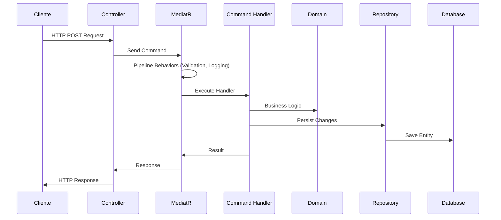
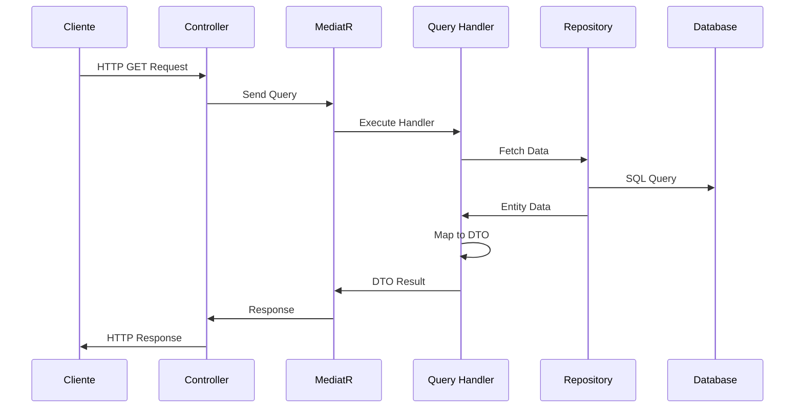

# 🏗️ Componentes Principales del Sistema Conaprole

## Purpose

Este documento describe los **componentes principales** del sistema Conaprole Orders, su arquitectura por capas, responsabilidades específicas, y cómo interactúan entre sí para proporcionar una solución robusta de gestión de pedidos.

## Audience

- **Arquitectos de Solución** - Comprensión de la estructura general del sistema
- **Desarrolladores** - Entendimiento de componentes y sus responsabilidades
- **Personal Académico** - Documentación técnica para análisis e investigación

## Prerequisites

- Conocimiento básico de Clean Architecture y Domain-Driven Design
- Familiaridad con .NET y C#
- Comprensión de patrones de arquitectura empresarial

## 🎯 Arquitectura por Capas

### 1. Capa de Dominio (Domain Layer)

**Namespace**: `Conaprole.Orders.Domain`  
**Responsabilidad**: Lógica de negocio pura, entidades centrales, reglas de dominio

#### Agregados Principales

| Agregado | Descripción | Entidad Raíz | Responsabilidades |
|----------|-------------|--------------|-------------------|
| **Order** | Gestión de pedidos | `Order` | Creación, modificación, cálculos de totales |
| **User** | Usuarios del sistema | `User` | Autenticación, perfiles, roles |
| **Distributor** | Distribuidores autorizados | `Distributor` | Gestión de socios comerciales |
| **Product** | Catálogo de productos | `Product` | Información de productos, categorías |
| **PointOfSale** | Puntos de venta | `PointOfSale` | Gestión de ubicaciones de venta |

#### Value Objects Clave

```csharp
// Representación monetaria con moneda
public class Money : ValueObject
{
    public decimal Amount { get; }
    public Currency Currency { get; }
}

// Cantidad con unidad de medida
public class Quantity : ValueObject  
{
    public int Value { get; }
    public string Unit { get; }
}

// Dirección completa
public class Address : ValueObject
{
    public string Street { get; }
    public string City { get; }
    public string PostalCode { get; }
}
```

#### Domain Events

- `OrderCreated` - Disparado cuando se crea una nueva orden
- `OrderStatusChanged` - Cambios en el estado del pedido
- `UserRegistered` - Nuevo usuario registrado en el sistema

### 2. Capa de Aplicación (Application Layer)

**Namespace**: `Conaprole.Orders.Application`  
**Responsabilidad**: Casos de uso, orquestación, coordinación de operaciones

#### Estructura de Comandos y Queries (CQRS)

```
Application/
├── Users/
│   ├── Commands/
│   │   ├── RegisterUser/
│   │   │   ├── RegisterUserCommand.cs
│   │   │   ├── RegisterUserCommandHandler.cs
│   │   │   └── RegisterUserCommandValidator.cs
│   │   └── UpdateUser/
│   └── Queries/
│       ├── GetUser/
│       └── GetUsers/
├── Orders/
│   ├── Commands/
│   │   ├── CreateOrder/
│   │   └── UpdateOrder/
│   └── Queries/
│       ├── GetOrder/
│       └── GetOrders/
├── Products/
├── PointsOfSale/
└── Common/
    ├── Behaviors/
    ├── Exceptions/
    └── Interfaces/
```

#### Pipeline Behaviors

| Behavior | Descripción | Propósito |
|----------|-------------|-----------|
| **ValidationBehavior** | Validación automática de comandos | Garantizar integridad de datos |
| **LoggingBehavior** | Logging estructurado | Trazabilidad y auditoría |
| **PerformanceBehavior** | Medición de rendimiento | Monitoreo de operaciones lentas |

### 3. Capa de Infraestructura (Infrastructure Layer)

**Namespace**: `Conaprole.Orders.Infrastructure`  
**Responsabilidad**: Implementación de detalles técnicos, persistencia, servicios externos

#### Componentes de Persistencia

```csharp
// Repositorio base con operaciones CRUD
public abstract class BaseRepository<T> : IRepository<T> where T : Entity
{
    protected readonly ApplicationDbContext _context;
    
    public virtual async Task<T> GetByIdAsync(Guid id);
    public virtual async Task<T> AddAsync(T entity);
    public virtual async Task UpdateAsync(T entity);
    public virtual async Task DeleteAsync(T entity);
}

// Configuraciones de Entity Framework
public class OrderConfiguration : IEntityTypeConfiguration<Order>
{
    public void Configure(EntityTypeBuilder<Order> builder)
    {
        // Configuración de mapeo OR/M
    }
}
```

#### Servicios de Infraestructura

| Servicio | Implementación | Propósito |
|----------|----------------|-----------|
| **IKeycloakService** | `KeycloakService` | Gestión de usuarios en Keycloak |
| **IEmailService** | `EmailService` | Notificaciones por correo |
| **IFileStorageService** | `FileStorageService` | Almacenamiento de archivos |

#### Configuración de Base de Datos

```csharp
public class ApplicationDbContext : DbContext
{
    public DbSet<Order> Orders { get; set; }
    public DbSet<User> Users { get; set; }
    public DbSet<Product> Products { get; set; }
    public DbSet<Distributor> Distributors { get; set; }
    public DbSet<PointOfSale> PointsOfSale { get; set; }
    
    protected override void OnModelCreating(ModelBuilder modelBuilder)
    {
        // Aplicar configuraciones automáticamente
        modelBuilder.ApplyConfigurationsFromAssembly(Assembly.GetExecutingAssembly());
    }
}
```

### 4. Capa de API/Presentación (API Layer)

**Namespace**: `Conaprole.Orders.Api`  
**Responsabilidad**: Endpoints HTTP, middlewares, configuración de servicios

#### Controllers RESTful

| Controller | Ruta Base | Operaciones | Permisos Requeridos |
|------------|-----------|-------------|-------------------|
| **UsersController** | `/api/users` | CRUD usuarios | `users:read`, `users:write` |
| **OrdersController** | `/api/orders` | Gestión pedidos | `orders:read`, `orders:write` |
| **ProductsController** | `/api/products` | Catálogo productos | `products:read`, `products:write` |
| **DistributorsController** | `/api/distributors` | Gestión distribuidores | `distributors:read`, `distributors:write` |

#### Middleware Pipeline

```csharp
public void Configure(IApplicationBuilder app, IWebHostEnvironment env)
{
    // 1. Manejo de excepciones
    app.UseMiddleware<ExceptionHandlingMiddleware>();
    
    // 2. Autenticación JWT
    app.UseAuthentication();
    
    // 3. Autorización basada en permisos
    app.UseAuthorization();
    
    // 4. Enrutamiento a controllers
    app.UseRouting();
    app.UseEndpoints(endpoints => endpoints.MapControllers());
}
```

## 🔄 Flujo de Datos Entre Capas

### Flujo Típico de Comando (Escritura)



### Flujo Típico de Query (Lectura)



## 🛡️ Componentes de Seguridad

### Authentication & Authorization

#### Keycloak Integration

```csharp
services.AddAuthentication(JwtBearerDefaults.AuthenticationScheme)
    .AddJwtBearer(options =>
    {
        options.Authority = configuration["Keycloak:Authority"];
        options.Audience = configuration["Keycloak:Audience"];
        options.RequireHttpsMetadata = false; // Solo para desarrollo
    });
```

#### Permission-Based Authorization

```csharp
[ApiController]
[Route("api/[controller]")]
public class OrdersController : ControllerBase
{
    [HttpGet]
    [HasPermission("orders:read")]
    public async Task<IActionResult> GetOrders([FromQuery] GetOrdersQuery query)
    {
        var result = await _mediator.Send(query);
        return Ok(result);
    }
    
    [HttpPost]
    [HasPermission("orders:write")]
    public async Task<IActionResult> CreateOrder([FromBody] CreateOrderCommand command)
    {
        var result = await _mediator.Send(command);
        return CreatedAtAction(nameof(GetOrder), new { id = result.Id }, result);
    }
}
```

## 📊 Métricas de Componentes

### Distribución por Capa

| Capa | Archivos C# | Líneas de Código | Responsabilidades Clave |
|------|-------------|------------------|------------------------|
| **Domain** | ~25 | ~1,500 | Entidades, Value Objects, Domain Events |
| **Application** | ~40 | ~2,800 | Commands, Queries, Handlers, DTOs |
| **Infrastructure** | ~30 | ~2,200 | Repositories, Configurations, Services |
| **API** | ~15 | ~1,200 | Controllers, Middlewares, Startup |

### Complejidad Ciclomática

- **Domain Entities**: Baja (1-3) - Lógica de negocio simple
- **Application Handlers**: Media (4-7) - Orquestación de casos de uso
- **Infrastructure Services**: Variable (3-10) - Dependiente de integraciones

## 🔧 Patrones de Diseño Implementados

### Repository Pattern

```csharp
public interface IOrderRepository : IRepository<Order>
{
    Task<Order?> GetByIdWithOrderLinesAsync(OrderId id);
    Task<IEnumerable<Order>> GetByCustomerIdAsync(UserId customerId);
    Task<IEnumerable<Order>> GetByDateRangeAsync(DateTime from, DateTime to);
}
```

### Unit of Work Pattern

```csharp
public interface IUnitOfWork
{
    IOrderRepository Orders { get; }
    IUserRepository Users { get; }
    IProductRepository Products { get; }
    
    Task<int> SaveChangesAsync(CancellationToken cancellationToken = default);
    Task BeginTransactionAsync();
    Task CommitTransactionAsync();
    Task RollbackTransactionAsync();
}
```

### Factory Pattern

```csharp
public interface IOrderFactory
{
    Order CreateOrder(UserId customerId, IEnumerable<OrderLineRequest> orderLines);
    OrderLine CreateOrderLine(ProductId productId, Quantity quantity, Money unitPrice);
}
```

## 🎯 Principios SOLID Aplicados

### Single Responsibility Principle (SRP)
- Cada handler tiene una única responsabilidad específica
- Controllers solo manejan aspectos HTTP
- Repositories solo manejan persistencia

### Open/Closed Principle (OCP)
- Nuevos handlers pueden agregarse sin modificar código existente
- Pipeline behaviors extensibles mediante interfaces

### Liskov Substitution Principle (LSP)
- Todas las implementaciones de repositorios son intercambiables
- Abstracciones bien definidas en interfaces

### Interface Segregation Principle (ISP)
- Interfaces específicas y cohesivas
- No hay dependencias de métodos no utilizados

### Dependency Inversion Principle (DIP)
- Dependencias hacia abstracciones, no implementaciones concretas
- Inyección de dependencias en toda la aplicación

## 🚀 Escalabilidad y Mantenibilidad

### Estrategias de Escalabilidad

1. **Horizontal Scaling**: API stateless deployable en múltiples instancias
2. **Database Scaling**: Read replicas para queries, master para comandos
3. **Caching**: Redis para datos frecuentemente accedidos
4. **Load Balancing**: Distribución de carga entre instancias

### Estrategias de Mantenibilidad

1. **Clean Architecture**: Separación clara de responsabilidades
2. **Automated Testing**: Cobertura alta con tests unitarios e integración
3. **Documentation**: Documentación técnica exhaustiva y actualizada
4. **Code Standards**: Convenciones consistentes y revisiones de código

## Mapping to Thesis

Este documento contribuye directamente a las siguientes secciones de la tesis:

- **4.2 Componentes principales del sistema** - Descripción completa de agregados, capas y responsabilidades
- **4.6 Diseño detallado** - Especificación técnica de componentes y patrones
- **4.7 Implementación** - Detalles de implementación y tecnologías utilizadas  
- **4.8 Integración** - Descripción de cómo los componentes interactúan

## Referencias

- [Clean Architecture - Robert C. Martin](https://blog.cleancoder.com/uncle-bob/2012/08/13/the-clean-architecture.html)
- [Domain-Driven Design - Eric Evans](https://domainlanguage.com/ddd/)
- [.NET Application Architecture Guides - Microsoft](https://docs.microsoft.com/en-us/dotnet/architecture/)

---

*Last verified: 2025-01-02 - Commit: bbed9c1ad056ddda4c3b5f646638bc9f77b4c31d*