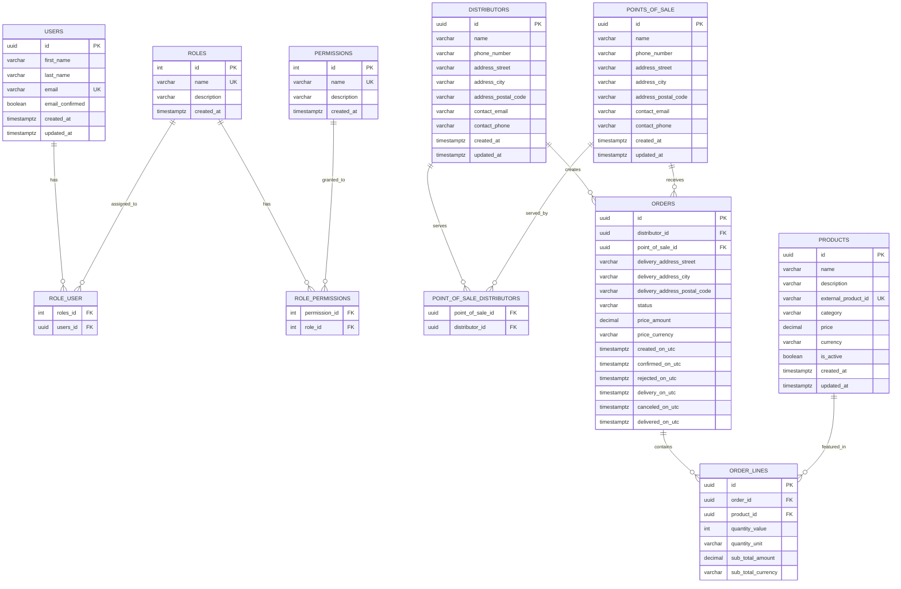
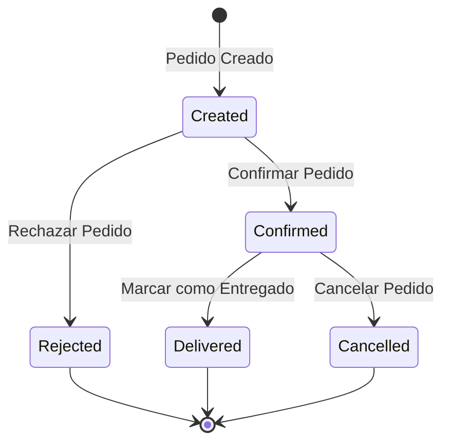
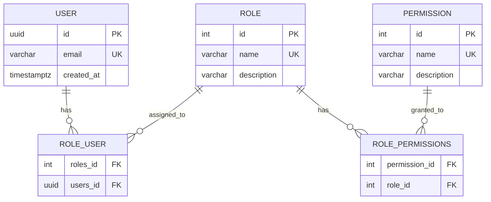
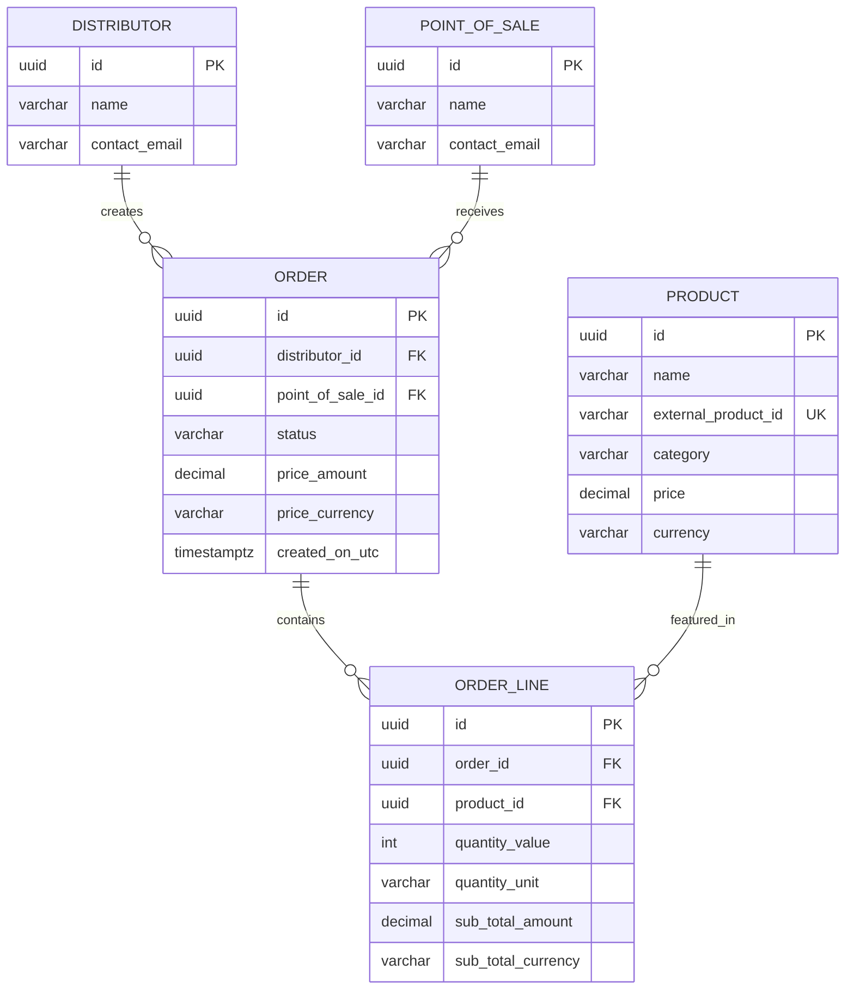

# 🗃️ Modelo de Datos - Conaprole Orders

## Purpose

Este documento describe el **modelo de datos completo** del sistema Conaprole Orders, incluyendo entidades de dominio, relaciones, diagramas ER, esquema de base de datos y convenciones de persistencia.

## Audience

- **Database Administrators** - Comprensión del esquema y optimizaciones
- **Desarrolladores** - Entendimiento del modelo de dominio y persistencia
- **Arquitectos** - Decisiones de diseño de datos y escalabilidad
- **Personal Académico** - Documentación técnica para análisis de datos

## Prerequisites

- Conocimiento básico de bases de datos relacionales
- Familiaridad con Entity Framework Core
- Comprensión de Domain-Driven Design
- Conocimiento de PostgreSQL

## 📊 Diagrama Entidad-Relación General



## 🏗️ Agregados de Dominio

### 1. Agregado Order

**Entidad Raíz**: `Order`  
**Entidades Hijas**: `OrderLine`  
**Value Objects**: `Money`, `Address`, `Quantity`

```csharp
public class Order : Entity, IAggregateRoot
{
    private readonly List<OrderLine> _orderLines = new();
    
    public IReadOnlyCollection<OrderLine> OrderLines => _orderLines.AsReadOnly();
    public Guid DistributorId { get; private set; }
    public Guid PointOfSaleId { get; private set; }
    public Address DeliveryAddress { get; private set; }
    public Status Status { get; private set; }
    public Money Price { get; private set; }
    public DateTime CreatedOnUtc { get; private set; }
    
    // Domain methods
    public static Order Create(Guid pointOfSaleId, Guid distributorId, Address deliveryAddress)
    public void AddOrderLine(Product product, Quantity quantity)
    public void Confirm()
    public void Cancel()
    public void MarkAsDelivered()
}

public class OrderLine : Entity
{
    public Guid OrderId { get; private set; }
    public Guid ProductId { get; private set; }
    public Quantity Quantity { get; private set; }
    public Money SubTotal { get; private set; }
}
```

#### Estados del Pedido



### 2. Agregado User

**Entidad Raíz**: `User`  
**Value Objects**: `Email`, `FirstName`, `LastName`  
**Relaciones**: `Role`, `Permission`

```csharp
public class User : Entity, IAggregateRoot
{
    private readonly List<Role> _roles = new();
    
    public FirstName FirstName { get; private set; }
    public LastName LastName { get; private set; }
    public Email Email { get; private set; }
    public bool EmailConfirmed { get; private set; }
    public IReadOnlyCollection<Role> Roles => _roles.AsReadOnly();
    public DateTime CreatedAt { get; private set; }
    
    public static User Create(FirstName firstName, LastName lastName, Email email)
    public void ConfirmEmail()
    public void AddRole(Role role)
    public void RemoveRole(Role role)
    public bool HasPermission(string permission)
}
```

### 3. Agregado Product

**Entidad Raíz**: `Product`  
**Value Objects**: `Name`, `Description`, `Money`, `ExternalProductId`

```csharp
public class Product : Entity, IAggregateRoot
{
    public Name Name { get; private set; }
    public Description Description { get; private set; }
    public ExternalProductId ExternalProductId { get; private set; }
    public Category Category { get; private set; }
    public Money Price { get; private set; }
    public bool IsActive { get; private set; }
    public DateTime CreatedAt { get; private set; }
    
    public static Product Create(Name name, Description description, Money price, Category category)
    public void UpdatePrice(Money newPrice)
    public void Activate()
    public void Deactivate()
}
```

### 4. Agregado Distributor

**Entidad Raíz**: `Distributor`  
**Value Objects**: `Address`  
**Relaciones**: `PointOfSale` (Many-to-Many)

```csharp
public class Distributor : Entity, IAggregateRoot
{
    private readonly List<PointOfSale> _pointsOfSale = new();
    
    public string Name { get; private set; }
    public string PhoneNumber { get; private set; }
    public Address Address { get; private set; }
    public string ContactEmail { get; private set; }
    public string ContactPhone { get; private set; }
    public IReadOnlyCollection<PointOfSale> PointsOfSale => _pointsOfSale.AsReadOnly();
    
    public static Distributor Create(string name, string phoneNumber, Address address)
    public void AddPointOfSale(PointOfSale pointOfSale)
    public void RemovePointOfSale(PointOfSale pointOfSale)
}
```

## 🎯 Value Objects

### Money Value Object

```csharp
public class Money : ValueObject
{
    public decimal Amount { get; }
    public Currency Currency { get; }
    
    public Money(decimal amount, Currency currency)
    {
        if (amount < 0)
            throw new ArgumentException("Amount cannot be negative");
            
        Amount = amount;
        Currency = currency;
    }
    
    public static Money operator +(Money left, Money right)
    {
        if (left.Currency != right.Currency)
            throw new InvalidOperationException("Cannot add money with different currencies");
            
        return new Money(left.Amount + right.Amount, left.Currency);
    }
    
    protected override IEnumerable<object> GetEqualityComponents()
    {
        yield return Amount;
        yield return Currency;
    }
}

public enum Currency
{
    USD = 1,
    EUR = 2,
    UYU = 3
}
```

### Address Value Object

```csharp
public class Address : ValueObject
{
    public string Street { get; }
    public string City { get; }
    public string PostalCode { get; }
    
    public Address(string street, string city, string postalCode)
    {
        if (string.IsNullOrWhiteSpace(street))
            throw new ArgumentException("Street cannot be empty");
        if (string.IsNullOrWhiteSpace(city))
            throw new ArgumentException("City cannot be empty");
            
        Street = street;
        City = city;
        PostalCode = postalCode;
    }
    
    protected override IEnumerable<object> GetEqualityComponents()
    {
        yield return Street;
        yield return City;
        yield return PostalCode ?? string.Empty;
    }
}
```

### Quantity Value Object

```csharp
public class Quantity : ValueObject
{
    public int Value { get; }
    public string Unit { get; }
    
    public Quantity(int value, string unit)
    {
        if (value <= 0)
            throw new ArgumentException("Quantity must be positive");
        if (string.IsNullOrWhiteSpace(unit))
            throw new ArgumentException("Unit cannot be empty");
            
        Value = value;
        Unit = unit;
    }
    
    protected override IEnumerable<object> GetEqualityComponents()
    {
        yield return Value;
        yield return Unit;
    }
}
```

## 🗂️ Configuraciones de Entity Framework

### Order Configuration

```csharp
public class OrderConfiguration : IEntityTypeConfiguration<Order>
{
    public void Configure(EntityTypeBuilder<Order> builder)
    {
        builder.ToTable("orders");
        
        builder.HasKey(o => o.Id);
        
        // Value Object: Money
        builder.OwnsOne(o => o.Price, money =>
        {
            money.Property(m => m.Amount)
                .HasColumnName("price_amount")
                .HasColumnType("decimal(18,2)");
            money.Property(m => m.Currency)
                .HasColumnName("price_currency")
                .HasConversion<string>();
        });
        
        // Value Object: Address
        builder.OwnsOne(o => o.DeliveryAddress, address =>
        {
            address.Property(a => a.Street)
                .HasColumnName("delivery_address_street")
                .HasMaxLength(200);
            address.Property(a => a.City)
                .HasColumnName("delivery_address_city")
                .HasMaxLength(100);
            address.Property(a => a.PostalCode)
                .HasColumnName("delivery_address_postal_code")
                .HasMaxLength(20);
        });
        
        // Enum conversion
        builder.Property(o => o.Status)
            .HasConversion<string>()
            .HasMaxLength(50);
        
        // Relationships
        builder.HasOne(o => o.Distributor)
            .WithMany()
            .HasForeignKey(o => o.DistributorId);
            
        builder.HasOne(o => o.PointOfSale)
            .WithMany()
            .HasForeignKey(o => o.PointOfSaleId);
        
        builder.HasMany(o => o.OrderLines)
            .WithOne()
            .HasForeignKey(ol => ol.OrderId)
            .OnDelete(DeleteBehavior.Cascade);
        
        // Indexes
        builder.HasIndex(o => o.DistributorId);
        builder.HasIndex(o => o.PointOfSaleId);
        builder.HasIndex(o => o.Status);
        builder.HasIndex(o => o.CreatedOnUtc);
    }
}
```

### User Configuration

```csharp
public class UserConfiguration : IEntityTypeConfiguration<User>
{
    public void Configure(EntityTypeBuilder<User> builder)
    {
        builder.ToTable("users");
        
        builder.HasKey(u => u.Id);
        
        // Value Objects
        builder.OwnsOne(u => u.FirstName, fn =>
        {
            fn.Property(f => f.Value)
                .HasColumnName("first_name")
                .HasMaxLength(100);
        });
        
        builder.OwnsOne(u => u.LastName, ln =>
        {
            ln.Property(l => l.Value)
                .HasColumnName("last_name")
                .HasMaxLength(100);
        });
        
        builder.OwnsOne(u => u.Email, email =>
        {
            email.Property(e => e.Value)
                .HasColumnName("email")
                .HasMaxLength(255);
        });
        
        // Many-to-Many relationship with Roles
        builder.HasMany(u => u.Roles)
            .WithMany()
            .UsingEntity<Dictionary<string, object>>(
                "role_user",
                j => j.HasOne<Role>().WithMany().HasForeignKey("roles_id"),
                j => j.HasOne<User>().WithMany().HasForeignKey("users_id")
            );
        
        // Unique constraints
        builder.HasIndex(u => u.Email.Value)
            .IsUnique();
        
        // Default values
        builder.Property(u => u.CreatedAt)
            .HasDefaultValueSql("now()");
    }
}
```

## 📈 Diagramas de Relaciones Específicas

### Diagrama de Autorización



### Diagrama de Pedidos



## 🔍 Índices y Optimizaciones

### Índices Principales

| Tabla | Columnas | Tipo | Propósito |
|-------|----------|------|-----------|
| `orders` | `distributor_id` | B-tree | Búsquedas por distribuidor |
| `orders` | `point_of_sale_id` | B-tree | Búsquedas por punto de venta |
| `orders` | `status` | B-tree | Filtros por estado |
| `orders` | `created_on_utc` | B-tree | Ordenamiento temporal |
| `orders` | `(distributor_id, created_on_utc)` | Composite | Queries frecuentes |
| `order_lines` | `order_id` | B-tree | FK constraint + performance |
| `order_lines` | `product_id` | B-tree | Búsquedas por producto |
| `users` | `email` | Unique | Autenticación |
| `products` | `external_product_id` | Unique | Sincronización externa |
| `products` | `(category, is_active)` | Composite | Catálogo activo |

### Particionamiento (Futuro)

```sql
-- Particionamiento por rango de fechas para orders
CREATE TABLE orders_2024 PARTITION OF orders
FOR VALUES FROM ('2024-01-01') TO ('2025-01-01');

CREATE TABLE orders_2025 PARTITION OF orders
FOR VALUES FROM ('2025-01-01') TO ('2026-01-01');
```


## 🛡️ Constraints y Validaciones

### Check Constraints

```sql
-- Validaciones de negocio a nivel de BD
ALTER TABLE orders 
ADD CONSTRAINT check_price_positive 
CHECK (price_amount >= 0);

ALTER TABLE order_lines 
ADD CONSTRAINT check_quantity_positive 
CHECK (quantity_value > 0);

ALTER TABLE order_lines 
ADD CONSTRAINT check_subtotal_positive 
CHECK (sub_total_amount >= 0);

-- Estados válidos para órdenes
ALTER TABLE orders 
ADD CONSTRAINT check_valid_status 
CHECK (status IN ('Draft', 'Confirmed', 'InTransit', 'Delivered', 'Canceled'));
```

### Foreign Key Constraints

```sql
-- Integridad referencial estricta
ALTER TABLE orders 
ADD CONSTRAINT fk_orders_distributor 
FOREIGN KEY (distributor_id) REFERENCES distributors(id) ON DELETE RESTRICT;

ALTER TABLE orders 
ADD CONSTRAINT fk_orders_point_of_sale 
FOREIGN KEY (point_of_sale_id) REFERENCES points_of_sale(id) ON DELETE RESTRICT;

ALTER TABLE order_lines 
ADD CONSTRAINT fk_order_lines_order 
FOREIGN KEY (order_id) REFERENCES orders(id) ON DELETE CASCADE;

ALTER TABLE order_lines 
ADD CONSTRAINT fk_order_lines_product 
FOREIGN KEY (product_id) REFERENCES products(id) ON DELETE RESTRICT;
```

## 🔄 Migraciones y Versionado

### Estrategia de Migraciones

1. **Additive Changes**: Nuevas columnas, índices, tablas
2. **Backward Compatible**: Mantener compatibilidad durante transición
3. **Data Migrations**: Scripts para transformación de datos
4. **Rollback Strategy**: Procedimientos de reversión


## Referencias

- [Entity Framework Core Documentation](https://docs.microsoft.com/en-us/ef/core/)
- [PostgreSQL Documentation](https://www.postgresql.org/docs/)
- [Domain-Driven Design Reference](https://domainlanguage.com/ddd/reference/)
- [Database Design Best Practices](https://www.postgresql.org/docs/current/ddl-best-practices.html)

---

*Last verified: 2025-01-02 - Commit: bbed9c1ad056ddda4c3b5f646638bc9f77b4c31d*
