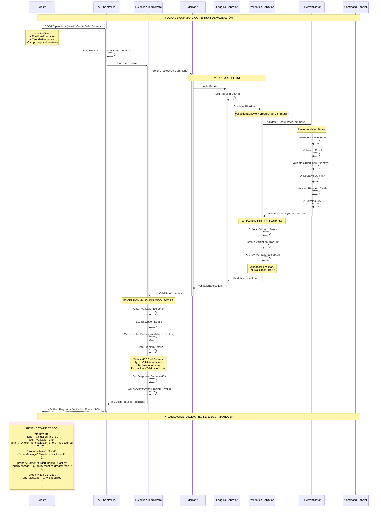

# ⚠️ Flujo de Command con Error de Validación

## 📋 Descripción

Este diagrama representa el flujo alternativo cuando un comando falla debido a errores de validación utilizando FluentValidation. Muestra cómo el sistema maneja y responde a datos de entrada inválidos de manera consistente.

## 🏗️ Arquitectura de Manejo de Errores

- **ValidationBehavior** intercepta comandos antes de la ejecución
- **FluentValidation** para reglas de negocio declarativas
- **ValidationException** personalizada para errores estructurados
- **ExceptionHandlingMiddleware** para respuestas consistentes

## 📊 Diagrama de Secuencia



## 🔍 Puntos Clave del Flujo de Error

### 1. **Validación Temprana**

- La validación ocurre **antes** de la ejecución del handler
- **ValidationBehavior** intercepta en el pipeline de MediatR
- Evita procesamiento innecesario si los datos son inválidos

### 2. **FluentValidation Detallada**

- Reglas declarativas y reutilizables
- **Múltiples errores** capturados simultáneamente
- Mensajes específicos y localizables
- Validación de objetos complejos y anidados

### 3. **Manejo Estructurado de Excepciones**

- **ValidationException** personalizada con lista de errores
- **ExceptionHandlingMiddleware** centraliza el manejo
- Respuesta consistente en formato **Problem Details (RFC 7807)**

### 4. **Respuesta Cliente-Amigable**

- **HTTP 400 Bad Request** apropiado
- **JSON estructurado** con detalles específicos
- Campo `errors` con lista detallada de problemas
- Información suficiente para corrección por parte del cliente

### 5. **No Ejecución del Handler**

- El **Command Handler nunca se ejecuta**
- **No se accede a repositorios** ni base de datos
- **No se inician transacciones** innecesarias
- Optimización de recursos y performance

## 🛠️ Reglas de Validación Típicas

### CreateOrderCommand Validator

```csharp
public class CreateOrderCommandValidator : AbstractValidator<CreateOrderCommand>
{
    public CreateOrderCommandValidator()
    {
        RuleFor(x => x.PointOfSalePhoneNumber)
            .NotEmpty().WithMessage("Point of Sale phone number is required")
            .Matches(@"^\+?[1-9]\d{1,14}$").WithMessage("Invalid phone number format");

        RuleFor(x => x.City)
            .NotEmpty().WithMessage("City is required")
            .MaximumLength(100).WithMessage("City must not exceed 100 characters");

        RuleFor(x => x.OrderLines)
            .NotEmpty().WithMessage("At least one order line is required");

        RuleForEach(x => x.OrderLines).SetValidator(new CreateOrderLineCommandValidator());
    }
}
```

## 📚 Casos de Error Representados

- **Campos requeridos faltantes**
- **Formatos inválidos** (email, teléfono, fechas)
- **Valores fuera de rango** (cantidades negativas, precios inválidos)
- **Longitudes excesivas** de texto
- **Relaciones inexistentes** (IDs no válidos)
- **Reglas de negocio** específicas del dominio

## ⚡ Beneficios del Approach

- ✅ **Fail Fast** - errores detectados tempranamente
- ✅ **Consistencia** en respuestas de error
- ✅ **Performance** - no procesa datos inválidos
- ✅ **User Experience** - errores claros y accionables
- ✅ **Maintainability** - validaciones centralizadas
- ✅ **Testability** - rules fáciles de probar unitariamente

