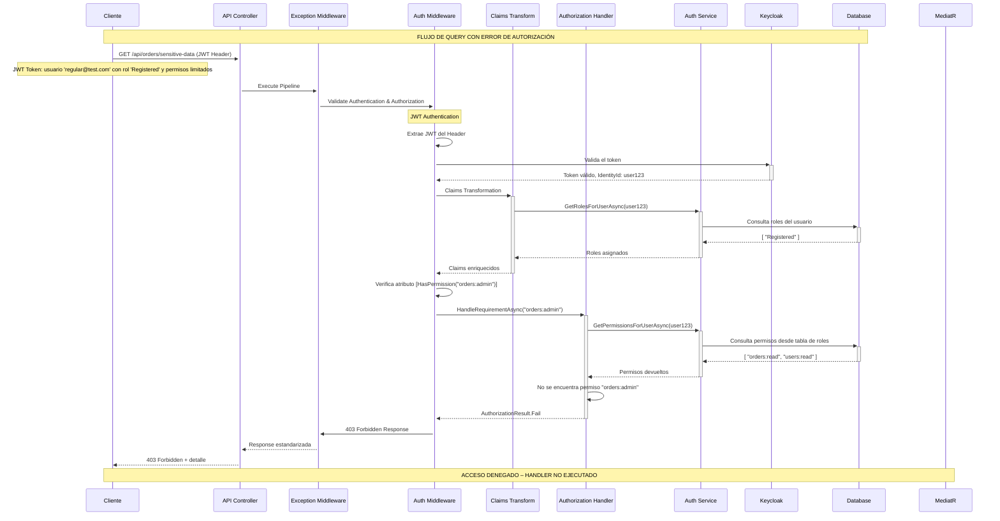

# 🔒 Flujo de Query con Error de Autorización

## 📋 Descripción

Este diagrama representa el flujo alternativo cuando una query falla debido a problemas de autorización. Muestra cómo el sistema valida permisos y maneja accesos no autorizados de manera segura y consistente.

## 🏗️ Arquitectura de Seguridad

- **JWT Authentication Middleware** para validación de tokens
- **Claims Transformation** para enriquecimiento de permisos
- **Permission-based Authorization** con atributos declarativos
- **Authorization Handlers** para verificación de permisos específicos

## 📊 Diagrama de Secuencia



## 🔍 Puntos Clave del Flujo de Autorización

### 1. **Autenticación JWT Exitosa**

- Token válido con firma verificada
- Extracción correcta del `IdentityId`
- Usuario identificado en el sistema

### 2. **Enriquecimiento de Claims**

- **Claims Transformation** obtiene roles del usuario
- Consulta a base de datos local para roles específicos
- ClaimsPrincipal enriquecido con información de autorización

### 3. **Verificación de Permisos Específicos**

- **HasPermission Attribute** requiere permiso específico
- **Authorization Handler** verifica permisos del usuario
- Comparación entre permisos requeridos vs. permisos disponibles

### 4. **Fallo de Autorización**

- Usuario **autenticado** pero **no autorizado**
- Respuesta **403 Forbidden** (no 401 Unauthorized)
- **Información mínima** revelada por seguridad

### 5. **Terminación Temprana del Pipeline**

- **MediatR nunca se ejecuta**
- **Query Handler no se invoca**
- **Base de datos no consultada** para los datos solicitados

## 🛡️ Modelo de Permisos

### Estructura de Permisos

```
Usuario "regular@test.com"
├── Rol: "Registered"
├── Permisos Disponibles:
│   ├── "orders:read"      ✅
│   ├── "users:read"       ✅
│   └── "orders:admin"     ❌ (REQUERIDO)
└── Resultado: 403 Forbidden
```

### Casos de Permisos Típicos

```csharp
[HasPermission("orders:read")]    // ✅ Usuario tiene permiso
[HasPermission("orders:write")]   // ❌ Usuario no tiene permiso
[HasPermission("orders:admin")]   // ❌ Usuario no tiene permiso
[HasPermission("users:admin")]    // ❌ Usuario no tiene permiso
```

## 🔐 Diferencias entre 401 vs 403

| Código | Significado | Cuándo usar | Acción del Cliente |
|--------|-------------|-------------|-------------------|
| **401 Unauthorized** | No autenticado | JWT inválido, expirado, o ausente | Reautenticarse |
| **403 Forbidden** | Autenticado pero sin permisos | JWT válido pero permisos insuficientes | Solicitar permisos |

## 📚 Escenarios de Autorización

### ✅ Casos de Éxito

- Usuario Admin accede a cualquier recurso
- Usuario con permiso específico accede a recurso correspondiente
- Usuario accede a sus propios datos

### ❌ Casos de Fallo

- **Usuario regular** intenta acceder a datos administrativos
- **Usuario sin rol** intenta cualquier operación
- **Usuario de Distribuidor A** intenta acceder a datos de Distributor B
- **Token expirado** durante la verificación

## ⚡ Optimizaciones de Seguridad

### 1. **Caching de Permisos**

```csharp
// Los permisos pueden ser cacheados por usuario
[MemoryCache("user-permissions-{identityId}", Duration = "00:15:00")]
```

### 2. **Minimización de Information Leakage**

```json
// ❌ NO hacer: Información detallada
{
  "error": "User john@doe.com does not have orders:admin permission"
}

// ✅ Hacer: Información mínima
{
  "status": 403,
  "title": "Forbidden",
  "detail": "You do not have permission to access this resource"
}
```

### 3. **Logging de Seguridad**

```csharp
_logger.LogWarning("Authorization failed for user {UserId} attempting to access {Resource} with permission {Permission}",
    user.IdentityId, context.Resource, requiredPermission);
```

## 🔄 Comparación con Query Exitosa

| Aspecto | Query Exitosa | Query con Error Auth |
|---------|---------------|----------------------|
| **JWT Validation** | ✅ Válido | ✅ Válido |
| **Claims Transform** | ✅ Roles cargados | ✅ Roles cargados |
| **Permission Check** | ✅ Permiso encontrado | ❌ Permiso faltante |
| **Pipeline Execution** | Completo hasta DB | Terminado en Auth |
| **Response Status** | 200 OK | 403 Forbidden |
| **Data Exposure** | Datos solicitados | Sin datos |

## 🎯 Beneficios del Modelo

- ✅ **Principio de menor privilegio**
- ✅ **Autorización granular** por recurso y acción
- ✅ **Fail secure** - por defecto denegar
- ✅ **Auditabilidad** completa de accesos
- ✅ **Escalabilidad** del modelo de permisos
- ✅ **Separation of concerns** - auth separado de business logic
