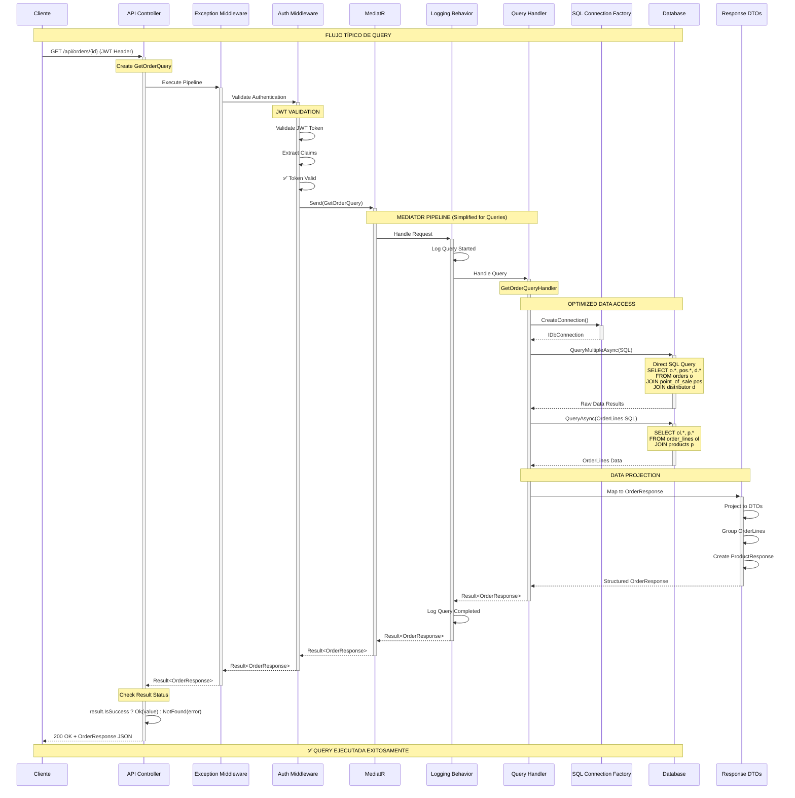

# 🔍 Flujo Típico de Query (Lectura)

## 📋 Descripción

Este diagrama representa el flujo típico de procesamiento de una query (operación de lectura) en la API Core de Conaprole Orders, optimizada para consultas eficientes de datos sin modificación de estado.

## 🏗️ Arquitectura Aplicada

- **CQRS** separando lecturas de escrituras
- **Query Handlers** especializados para lecturas
- **Dapper** para consultas SQL optimizadas
- **DTOs** específicos para respuestas
- **Pipeline simplificado** sin validaciones complejas

## 📊 Diagrama de Secuencia

## 🔍 Puntos Clave del Flujo

### 1. **Autenticación Simplificada**

- Validación de JWT token
- Extracción de claims básicos
- Sin verificación de permisos específicos (para este ejemplo)

### 2. **Pipeline Optimizado para Lecturas**

- **Sin Validation Behavior** (queries raramente necesitan validación compleja)
- **Logging Behavior** para trazabilidad
- Enfoque en performance y rapidez

### 3. **Acceso Directo a Datos**

- **SQL Connection Factory** para conexiones eficientes
- **Dapper** para mapeo rápido de resultados
- **Consultas SQL optimizadas** específicas para la necesidad

### 4. **Proyección de Datos**

- Mapeo directo a DTOs de respuesta
- **Sin entidades de dominio** (no se necesitan)
- Estructuración de datos para consumo del cliente

### 5. **Respuesta Optimizada**

- Status code apropiado (200 OK / 404 Not Found)
- JSON serializado directamente
- Headers de respuesta mínimos

## 📚 Casos de Uso Representados

Este flujo es representativo de queries como:

- `GetOrderQuery`
- `GetOrdersQuery`
- `GetDistributorsQuery`
- `GetAssignedPointsOfSaleQuery`

## ⚡ Diferencias con Commands

| Aspecto | Commands | Queries |
|---------|----------|---------|
| **Validación** | FluentValidation compleja | Validación mínima |
| **Dominio** | Entidades y agregados | DTOs directos |
| **Persistencia** | Unit of Work + Repositorios | SQL Connection + Dapper |
| **Transacciones** | Requeridas | No necesarias |
| **Caching** | No aplicable | Potencial para caché |
| **Performance** | Consistencia > Speed | Speed > Overhead |

## 🎯 Optimizaciones Aplicadas

- ✅ **Sin Unit of Work** - no se modifican datos
- ✅ **SQL directo** con Dapper para máxima eficiencia
- ✅ **Proyección específica** solo datos necesarios
- ✅ **Pipeline reducido** menos overhead
- ✅ **Connection pooling** gestionado automáticamente
- ✅ **Mapeo optimizado** a DTOs de lectura

## 🔒 Consideraciones de Seguridad

- JWT validation en middleware de autenticación
- Claims extraction para contexto de usuario
- Potencial para verificación de permisos de lectura
- Logging de accesos para auditoría
