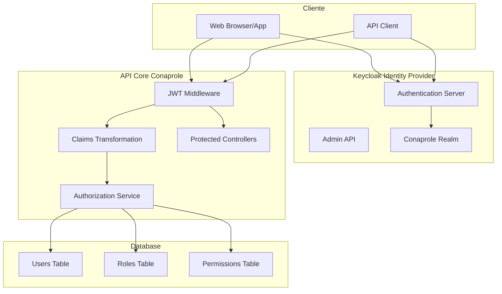
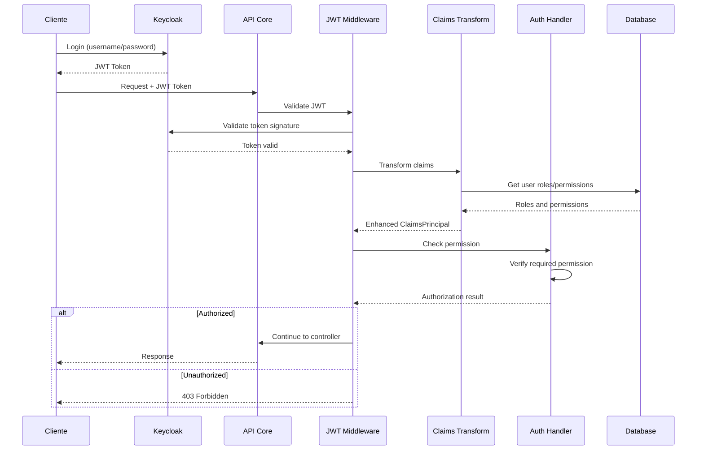

# 🔐 Arquitectura de Seguridad - Autenticación, Autorización y Permisos

## Introducción

La arquitectura de seguridad de la API Core de Conaprole Orders implementa un sistema robusto de **autenticación** y **autorización** basado en **Keycloak** como Identity Provider y **JWT tokens** para la comunicación segura. El sistema incorpora un modelo granular de permisos basado en roles que permite un control fino del acceso a recursos.

## Componentes de Seguridad

### 🌟 Visión General Arquitectónica



### 🔑 Autenticación (Authentication)

#### JWT Token Validation
```csharp
// src/Conaprole.Orders.Infrastructure/Authentication/JwtBearerOptionsSetup.cs
public class JwtBearerOptionsSetup : IConfigureNamedOptions<JwtBearerOptions>
{
    private readonly AuthenticationOptions _authenticationOptions;

    public JwtBearerOptionsSetup(IOptions<AuthenticationOptions> authenticationOptions)
    {
        _authenticationOptions = authenticationOptions.Value;
    }

    public void Configure(string? name, JwtBearerOptions options)
    {
        options.Audience = _authenticationOptions.Audience;
        options.MetadataAddress = _authenticationOptions.MetadataUrl;
        options.RequireHttpsMetadata = _authenticationOptions.RequireHttpsMetadata;
        
        options.TokenValidationParameters = new TokenValidationParameters
        {
            ValidateIssuer = true,
            ValidateAudience = true,
            ValidateLifetime = true,
            ClockSkew = TimeSpan.Zero
        };
    }
}
```

#### Configuración de Autenticación
```csharp
// src/Conaprole.Orders.Infrastructure/DependencyInjection.cs
private static void AddAuthentication(IServiceCollection services, IConfiguration configuration)
{
    services
        .AddAuthentication(JwtBearerDefaults.AuthenticationScheme)
        .AddJwtBearer();

    services.Configure<AuthenticationOptions>(configuration.GetSection("Authentication"));
    services.ConfigureOptions<JwtBearerOptionsSetup>();
    services.Configure<KeycloakOptions>(configuration.GetSection("Keycloak"));

    // Servicios de autenticación
    services.AddTransient<AdminAuthorizationDelegatingHandler>();
    services.AddHttpClient<IAuthenticationService, AuthenticationService>();
    services.AddHttpClient<IJwtService, JwtService>();
    
    services.AddHttpContextAccessor();
    services.AddScoped<IUserContext, UserContext>();
}
```

#### User Context Service
```csharp
// src/Conaprole.Orders.Infrastructure/Authentication/UserContext.cs
internal sealed class UserContext : IUserContext
{
    private readonly IHttpContextAccessor _httpContextAccessor;

    public UserContext(IHttpContextAccessor httpContextAccessor)
    {
        _httpContextAccessor = httpContextAccessor;
    }

    public Guid UserId => 
        _httpContextAccessor.HttpContext?.User?.GetUserId() ?? 
        throw new ApplicationException("User context is unavailable");

    public string IdentityId => 
        _httpContextAccessor.HttpContext?.User?.GetIdentityId() ?? 
        throw new ApplicationException("User identity is unavailable");
}
```

### 🛡️ Autorización (Authorization)

#### Modelo de Permisos
```csharp
// src/Conaprole.Orders.Domain/Users/Permission.cs
public sealed class Permission : Entity
{
    public string Name { get; private set; }
    public string Description { get; private set; }

    public Permission(int id, string name, string description) : base(id)
    {
        Name = name;
        Description = description;
    }

    // Permisos predefinidos
    public static readonly Permission UsersRead = new(1, "users:read", "Read user information");
    public static readonly Permission UsersWrite = new(2, "users:write", "Create and update users");
    public static readonly Permission OrdersRead = new(3, "orders:read", "Read order information");
    public static readonly Permission OrdersWrite = new(4, "orders:write", "Create and update orders");
    public static readonly Permission OrdersDelete = new(5, "orders:delete", "Delete orders");
    public static readonly Permission AdminAccess = new(6, "admin:access", "Administrator access");
}
```

#### Roles y Permisos
```csharp
// src/Conaprole.Orders.Domain/Users/Role.cs
public sealed class Role : Entity
{
    public string Name { get; private set; }
    
    private readonly List<Permission> _permissions = new();
    public IReadOnlyCollection<Permission> Permissions => _permissions.AsReadOnly();

    public Role(int id, string name) : base(id)
    {
        Name = name;
    }

    public void AddPermission(Permission permission)
    {
        if (!_permissions.Contains(permission))
        {
            _permissions.Add(permission);
        }
    }

    // Roles predefinidos
    public static readonly Role Registered = new(1, "Registered");
    public static readonly Role Distributor = new(2, "Distributor");  
    public static readonly Role Manager = new(3, "Manager");
    public static readonly Role Administrator = new(4, "Administrator");
}
```

#### Claims Transformation
```csharp
// src/Conaprole.Orders.Infrastructure/Authorization/CustomClaimsTransformation.cs
internal sealed class CustomClaimsTransformation : IClaimsTransformation
{
    private readonly IServiceProvider _serviceProvider;

    public CustomClaimsTransformation(IServiceProvider serviceProvider)
    {
        _serviceProvider = serviceProvider;
    }

    public async Task<ClaimsPrincipal> TransformAsync(ClaimsPrincipal principal)
    {
        // Evitar procesamiento duplicado
        if (principal.HasClaim(claim => claim.Type == ClaimTypes.Role))
        {
            return principal;
        }

        using var scope = _serviceProvider.CreateScope();
        var authorizationService = scope.ServiceProvider.GetRequiredService<AuthorizationService>();

        var identityId = principal.GetIdentityId();
        if (string.IsNullOrEmpty(identityId))
        {
            return principal;
        }

        // Obtener permisos del usuario desde la base de datos
        var userRoles = await authorizationService.GetRolesForUserAsync(identityId);
        var permissions = await authorizationService.GetPermissionsForUserAsync(identityId);

        var claimsIdentity = new ClaimsIdentity();

        // Agregar roles como claims
        foreach (var role in userRoles)
        {
            claimsIdentity.AddClaim(new Claim(ClaimTypes.Role, role));
        }

        // Agregar permisos como claims
        foreach (var permission in permissions)
        {
            claimsIdentity.AddClaim(new Claim("permission", permission));
        }

        principal.AddIdentity(claimsIdentity);
        return principal;
    }
}
```

#### Authorization Service
```csharp
// src/Conaprole.Orders.Infrastructure/Authorization/AuthorizationService.cs
internal sealed class AuthorizationService
{
    private readonly IUserRepository _userRepository;
    private readonly ILogger<AuthorizationService> _logger;

    public AuthorizationService(
        IUserRepository userRepository,
        ILogger<AuthorizationService> logger)
    {
        _userRepository = userRepository;
        _logger = logger;
    }

    public async Task<HashSet<string>> GetRolesForUserAsync(string identityId)
    {
        var user = await _userRepository.GetByIdentityIdAsync(identityId);
        if (user is null)
        {
            _logger.LogWarning("User with identity {IdentityId} not found", identityId);
            return new HashSet<string>();
        }

        return user.Roles.Select(role => role.Name).ToHashSet();
    }

    public async Task<HashSet<string>> GetPermissionsForUserAsync(string identityId)
    {
        var user = await _userRepository.GetByIdentityIdAsync(identityId);
        if (user is null)
        {
            _logger.LogWarning("User with identity {IdentityId} not found", identityId);
            return new HashSet<string>();
        }

        return user.Roles
            .SelectMany(role => role.Permissions)
            .Select(permission => permission.Name)
            .ToHashSet();
    }

    public async Task<UserRolesResponse> GetUserRolesAsync(
        string identityId,
        CancellationToken cancellationToken = default)
    {
        var user = await _userRepository.GetByIdentityIdAsync(identityId, cancellationToken);
        if (user is null)
        {
            throw new UserNotFoundException(identityId);
        }

        return new UserRolesResponse
        {
            UserId = user.Id,
            IdentityId = user.IdentityId,
            Roles = user.Roles.Select(role => role.Name).ToList(),
            Permissions = user.Roles
                .SelectMany(role => role.Permissions)
                .Select(permission => permission.Name)
                .Distinct()
                .ToList()
        };
    }
}
```

### 🏷️ Permission-Based Authorization

#### HasPermission Attribute
```csharp
// src/Conaprole.Orders.Infrastructure/Authorization/HasPermissionAttribute.cs
public sealed class HasPermissionAttribute : AuthorizeAttribute
{
    public HasPermissionAttribute(string permission) : base(policy: permission)
    {
    }
}
```

#### Permission Authorization Handler
```csharp
// src/Conaprole.Orders.Infrastructure/Authorization/PermissionAuthorizationHandler.cs
internal sealed class PermissionAuthorizationHandler : AuthorizationHandler<PermissionRequirement>
{
    private readonly IServiceProvider _serviceProvider;

    public PermissionAuthorizationHandler(IServiceProvider serviceProvider)
    {
        _serviceProvider = serviceProvider;
    }

    protected override async Task HandleRequirementAsync(
        AuthorizationHandlerContext context,
        PermissionRequirement requirement)
    {
        if (context.User.Identity is not { IsAuthenticated: true })
        {
            return;
        }

        using var scope = _serviceProvider.CreateScope();
        var authorizationService = scope.ServiceProvider.GetRequiredService<AuthorizationService>();

        var identityId = context.User.GetIdentityId();
        if (string.IsNullOrEmpty(identityId))
        {
            return;
        }

        var permissions = await authorizationService.GetPermissionsForUserAsync(identityId);

        if (permissions.Contains(requirement.Permission))
        {
            context.Succeed(requirement);
        }
    }
}
```

#### Permission Requirement
```csharp
// src/Conaprole.Orders.Infrastructure/Authorization/PermissionRequirement.cs
internal sealed class PermissionRequirement : IAuthorizationRequirement
{
    public PermissionRequirement(string permission)
    {
        Permission = permission;
    }

    public string Permission { get; }
}
```

#### Policy Provider
```csharp
// src/Conaprole.Orders.Infrastructure/Authorization/PermissionAuthorizationPolicyProvider.cs
internal sealed class PermissionAuthorizationPolicyProvider : DefaultAuthorizationPolicyProvider
{
    public PermissionAuthorizationPolicyProvider(IOptions<AuthorizationOptions> options) : base(options)
    {
    }

    public override async Task<AuthorizationPolicy?> GetPolicyAsync(string policyName)
    {
        var policy = await base.GetPolicyAsync(policyName);
        if (policy is not null)
        {
            return policy;
        }

        // Crear política dinámicamente para permisos
        return new AuthorizationPolicyBuilder()
            .AddRequirements(new PermissionRequirement(policyName))
            .Build();
    }
}
```

### 🔧 Configuración de Autorización

#### Dependency Injection Setup
```csharp
// src/Conaprole.Orders.Infrastructure/DependencyInjection.cs
private static void AddAuthorization(IServiceCollection services)
{
    services.AddScoped<AuthorizationService>();

    services.AddAuthorization();

    services.AddScoped<IAuthorizationHandler, PermissionAuthorizationHandler>();

    services.AddSingleton<IAuthorizationPolicyProvider, PermissionAuthorizationPolicyProvider>();

    services.AddTransient<IClaimsTransformation, CustomClaimsTransformation>();
}
```

### 🎭 Uso en Controllers

#### Protected Endpoints
```csharp
// src/Conaprole.Orders.Api/Controllers/Orders/OrdersController.cs
[ApiController]
[Route("api/Orders")]
public class OrdersController : ControllerBase
{
    private readonly ISender _sender;

    public OrdersController(ISender sender)
    {
        _sender = sender;
    }

    [HttpGet("{id}")]
    [HasPermission("orders:read")]
    public async Task<IActionResult> GetOrder(Guid id, CancellationToken cancellationToken)
    {
        var query = new GetOrderQuery(id);
        var result = await _sender.Send(query, cancellationToken);

        return result.IsSuccess ? Ok(result.Value) : NotFound(result.Error);
    }

    [HttpPost]
    [HasPermission("orders:write")]
    public async Task<IActionResult> CreateOrder(
        CreateOrderRequest request, 
        CancellationToken cancellationToken)
    {
        var command = new CreateOrderCommand(/* parameters */);
        var result = await _sender.Send(command, cancellationToken);

        return result.IsSuccess 
            ? CreatedAtAction(nameof(GetOrder), new { id = result.Value }, result.Value)
            : BadRequest(result.Error);
    }

    [HttpDelete("{id}")]
    [HasPermission("orders:delete")]
    public async Task<IActionResult> DeleteOrder(Guid id, CancellationToken cancellationToken)
    {
        var command = new DeleteOrderCommand(id);
        var result = await _sender.Send(command, cancellationToken);

        return result.IsSuccess ? NoContent() : BadRequest(result.Error);
    }
}
```

#### User Management Controller
```csharp
// src/Conaprole.Orders.Api/Controllers/Users/UsersController.cs
[ApiController]
[Route("api/Users")]
public class UsersController : ControllerBase
{
    private readonly ISender _sender;

    public UsersController(ISender sender)
    {
        _sender = sender;
    }

    [HttpGet]
    [HasPermission("users:read")]
    public async Task<IActionResult> GetUsers(CancellationToken cancellationToken)
    {
        var query = new GetUsersQuery();
        var result = await _sender.Send(query, cancellationToken);

        return result.IsSuccess ? Ok(result.Value) : BadRequest(result.Error);
    }

    [HttpPost]
    [HasPermission("users:write")]
    public async Task<IActionResult> CreateUser(
        CreateUserRequest request, 
        CancellationToken cancellationToken)
    {
        var command = new CreateUserCommand(/* parameters */);
        var result = await _sender.Send(command, cancellationToken);

        return result.IsSuccess ? Ok(result.Value) : BadRequest(result.Error);
    }

    [HttpPost("{id}/roles")]
    [HasPermission("admin:access")]
    public async Task<IActionResult> AssignRole(
        Guid id, 
        AssignRoleRequest request, 
        CancellationToken cancellationToken)
    {
        var command = new AssignRoleCommand(id, request.RoleId);
        var result = await _sender.Send(command, cancellationToken);

        return result.IsSuccess ? NoContent() : BadRequest(result.Error);
    }
}
```

### 🔐 Integración con Keycloak

#### Keycloak Configuration
```csharp
// src/Conaprole.Orders.Infrastructure/Authentication/Models/KeycloakOptions.cs
public sealed class KeycloakOptions
{
    public string AdminUrl { get; init; } = string.Empty;
    public string TokenUrl { get; init; } = string.Empty;
    public string AuthUrl { get; init; } = string.Empty;
    public string Realm { get; init; } = string.Empty;
    public string ClientId { get; init; } = string.Empty;
    public string ClientSecret { get; init; } = string.Empty;
}
```

#### Authentication Service
```csharp
// src/Conaprole.Orders.Infrastructure/Authentication/AuthenticationService.cs
internal sealed class AuthenticationService : IAuthenticationService
{
    private readonly HttpClient _httpClient;
    private readonly KeycloakOptions _keycloakOptions;

    public AuthenticationService(HttpClient httpClient, IOptions<KeycloakOptions> keycloakOptions)
    {
        _httpClient = httpClient;
        _keycloakOptions = keycloakOptions.Value;
    }

    public async Task<string> RegisterAsync(
        UserRepresentationModel user,
        string password,
        CancellationToken cancellationToken = default)
    {
        user.Credentials = new List<CredentialRepresentationModel>
        {
            new()
            {
                Value = password,
                Temporary = false,
                Type = "password"
            }
        };

        var response = await _httpClient.PostAsJsonAsync(
            $"admin/realms/{_keycloakOptions.Realm}/users",
            user,
            cancellationToken);

        response.EnsureSuccessStatusCode();

        return ExtractIdentityIdFromLocationHeader(response);
    }

    private static string ExtractIdentityIdFromLocationHeader(HttpResponseMessage httpResponseMessage)
    {
        const string usersSegment = "/users/";

        var locationHeader = httpResponseMessage.Headers.Location?.PathAndQuery;

        if (locationHeader is null)
        {
            throw new InvalidOperationException("Location header is null");
        }

        var userSegmentValueIndex = locationHeader.IndexOf(usersSegment, StringComparison.InvariantCulture);
        var userIdentityId = locationHeader.Substring(userSegmentValueIndex + usersSegment.Length);

        return userIdentityId;
    }
}
```

### 🔒 Configuración de Seguridad

#### appsettings.json
```json
{
  "Authentication": {
    "Audience": "conaprole-orders-api",
    "MetadataUrl": "http://localhost:8080/realms/conaprole/.well-known/openid_configuration",
    "RequireHttpsMetadata": false
  },
  "Keycloak": {
    "AdminUrl": "http://localhost:8080/",
    "TokenUrl": "http://localhost:8080/",
    "AuthUrl": "http://localhost:8080/realms/conaprole/protocol/openid-connect/auth",
    "Realm": "conaprole",
    "ClientId": "conaprole-orders-api",
    "ClientSecret": "your-client-secret"
  }
}
```

#### Configuración de Producción
```json
{
  "Authentication": {
    "Audience": "conaprole-orders-api",
    "MetadataUrl": "https://keycloak.conaprole.com/realms/conaprole/.well-known/openid_configuration",
    "RequireHttpsMetadata": true
  },
  "Keycloak": {
    "AdminUrl": "https://keycloak.conaprole.com/",
    "TokenUrl": "https://keycloak.conaprole.com/",
    "AuthUrl": "https://keycloak.conaprole.com/realms/conaprole/protocol/openid-connect/auth",
    "Realm": "conaprole",
    "ClientId": "conaprole-orders-api",
    "ClientSecret": "${KEYCLOAK_CLIENT_SECRET}"
  }
}
```

### 🛠️ Extensiones y Utilities

#### ClaimsPrincipal Extensions
```csharp
// src/Conaprole.Orders.Infrastructure/Authentication/ClaimsPrincipalExtensions.cs
internal static class ClaimsPrincipalExtensions
{
    public static Guid GetUserId(this ClaimsPrincipal? principal)
    {
        var userId = principal?.FindFirstValue("userId");
        return Guid.TryParse(userId, out var parsedUserId) ? parsedUserId : Guid.Empty;
    }

    public static string GetIdentityId(this ClaimsPrincipal? principal)
    {
        return principal?.FindFirstValue(ClaimTypes.NameIdentifier) ?? string.Empty;
    }

    public static string GetEmail(this ClaimsPrincipal? principal)
    {
        return principal?.FindFirstValue(ClaimTypes.Email) ?? string.Empty;
    }

    public static bool HasPermission(this ClaimsPrincipal? principal, string permission)
    {
        return principal?.FindAll("permission").Any(c => c.Value == permission) ?? false;
    }
}
```

### 📊 Flujo de Autorización

#### Secuencia de Autenticación/Autorización


## Mejores Prácticas Implementadas

### ✅ Principios de Seguridad

1. **Principio de Menor Privilegio**: Los usuarios solo tienen los permisos mínimos necesarios
2. **Defense in Depth**: Múltiples capas de seguridad (JWT + Permissions + Database validation)
3. **Fail Secure**: En caso de error, el sistema niega el acceso por defecto
4. **Separation of Concerns**: Autenticación separada de autorización

### 🔍 Auditoría y Logging

```csharp
// Logging de eventos de seguridad
_logger.LogWarning("User {IdentityId} attempted to access {Permission} without authorization", 
    identityId, requiredPermission);

_logger.LogInformation("User {IdentityId} successfully authenticated with roles {Roles}", 
    identityId, string.Join(", ", roles));
```

### 🧪 Testing de Seguridad

```csharp
// Tests de autorización
[Fact]
public async Task Handle_UserWithoutPermission_ShouldReturnForbidden()
{
    // Arrange
    var user = CreateUserWithoutPermission();
    var requirement = new PermissionRequirement("orders:write");
    
    // Act
    var result = await _handler.HandleAsync(context);
    
    // Assert
    Assert.False(context.HasSucceeded);
}
```

## Conclusión

La arquitectura de seguridad de la API Core de Conaprole implementa un sistema completo y robusto que incluye:

- **Autenticación federada** con Keycloak
- **Autorización granular** basada en permisos
- **Claims enrichment** para contexto de usuario
- **Separación clara** entre autenticación y autorización
- **Configuración flexible** para múltiples entornos
- **Logging y auditoría** de eventos de seguridad
- **Testabilidad** de componentes de seguridad

Este diseño proporciona una base sólida y escalable para el manejo de identidad y acceso en el sistema.

---

*Próximo: [Capa de Datos](./data-layer.md) - Persistencia y repositorios*