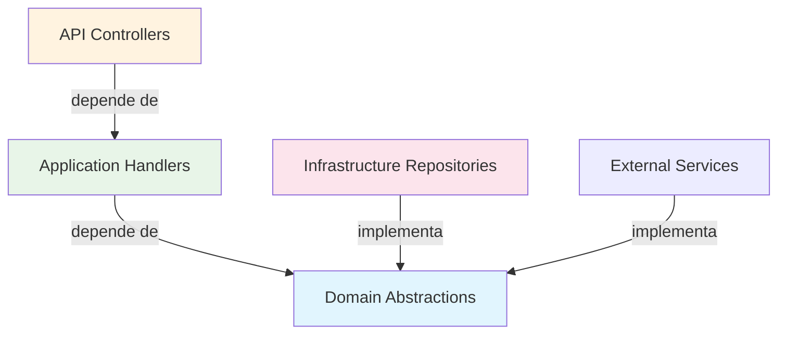

# 🧱 Aplicación de Principios SOLID y DIP en API Core Conaprole

## Introducción

La API Core de Conaprole Orders ha sido diseñada siguiendo rigurosamente los **principios SOLID** de la programación orientada a objetos, con especial énfasis en el **Principio de Inversión de Dependencias (DIP)**. Esta implementación asegura un diseño arquitectónico robusto, mantenible y extensible que facilita las pruebas unitarias y la evolución del sistema.

Los principios SOLID representan cinco principios fundamentales del diseño de software que promueven la creación de código limpio, modular y sostenible a largo plazo.

---

## 🎯 Aplicación General de Principios SOLID

### 1. SRP - Principio de Responsabilidad Única (Single Responsibility Principle)

> **"Una clase debe tener una sola razón para cambiar"**

#### Definición Técnica
El SRP establece que cada clase debe tener una única responsabilidad bien definida y, por tanto, una sola razón para ser modificada. Esto reduce el acoplamiento y aumenta la cohesión del código.

#### Implementación en el Proyecto

**Ejemplo 1: Separación de Entidades de Dominio**
```csharp
// src/Conaprole.Orders.Domain/Orders/Order.cs
public class Order : Entity, IAggregateRoot
{
    // Responsabilidad única: Gestionar el estado y comportamiento de una orden
    private readonly List<OrderLine> _orderLines = new();
    
    public void AddOrderLine(OrderLine orderLine) { /* lógica de negocio */ }
    public void RemoveOrderLine(Guid orderLineId) { /* lógica de negocio */ }
    public void UpdateStatus(Status newStatus) { /* lógica de negocio */ }
}
```

**Ejemplo 2: Responsabilidades específicas en Repositorios**
```csharp
// src/Conaprole.Orders.Domain/Orders/IOrderRepository.cs
public interface IOrderRepository
{
    // Responsabilidad única: Operaciones de persistencia para órdenes
    Task<Order?> GetByIdAsync(Guid orderId, CancellationToken cancellationToken = default);
    Task<Guid?> AddOrderLineAsync(/* parámetros */);
    void Add(Order order);
}
```

**Ejemplo 3: Separación de Comandos y Queries**
```csharp
// src/Conaprole.Orders.Application/Orders/CreateOrder/CreateOrderCommand.cs
public record CreateOrderCommand(
    string PointOfSalePhoneNumber,
    string DistributorPhoneNumber,
    // ... otros parámetros
) : ICommand<Guid>;

// CreateOrderCommandHandler tiene la única responsabilidad de manejar la creación de órdenes
// GetOrderQueryHandler tiene la única responsabilidad de recuperar información de órdenes
```

### 2. OCP - Principio Abierto/Cerrado (Open/Closed Principle)

> **"Las entidades de software deben estar abiertas para extensión, pero cerradas para modificación"**

#### Definición Técnica
El OCP permite añadir nuevas funcionalidades sin modificar el código existente, utilizando abstracciones, herencia y polimorfismo.

#### Implementación en el Proyecto

**Ejemplo 1: Extensibilidad a través de Interfaces**
```csharp
// Interfaz base para repositorios - cerrada para modificación
public interface IRepository<TEntity> where TEntity : Entity
{
    void Add(TEntity entity);
    void Update(TEntity entity);
    void Remove(TEntity entity);
}

// Extensión específica - abierta para extensión
public interface IOrderRepository : IRepository<Order>
{
    Task<Order?> GetByIdAsync(Guid orderId, CancellationToken cancellationToken = default);
    // Métodos específicos de órdenes sin modificar la interfaz base
}
```

**Ejemplo 2: Patrón Strategy con MediatR**
```csharp
// src/Conaprole.Orders.Application/Abstractions/Messaging/ICommandHandler.cs
public interface ICommandHandler<TCommand> : IRequestHandler<TCommand, Result>
    where TCommand : ICommand
{
}

// Cada handler implementa la interfaz sin modificar el mecanismo base
internal sealed class CreateOrderCommandHandler : ICommandHandler<CreateOrderCommand, Guid>
{
    // Implementación específica extensible
}
```

### 3. LSP - Principio de Sustitución de Liskov (Liskov Substitution Principle)

> **"Los objetos de una superclase deben ser reemplazables por objetos de sus subclases sin alterar el funcionamiento del programa"**

#### Definición Técnica
El LSP garantiza que las implementaciones concretas pueden sustituir a sus abstracciones sin romper la funcionalidad del sistema.

#### Implementación en el Proyecto

**Ejemplo 1: Sustitución de Repositorios**
```csharp
// Cualquier implementación de IOrderRepository puede ser sustituida
public class OrderRepository : Repository<Order>, IOrderRepository
{
    // Implementación con Entity Framework
    public async Task<Order?> GetByIdAsync(Guid orderId, CancellationToken ct = default)
    {
        return await _dbContext.Set<Order>()
            .Include(o => o.OrderLines)
            .FirstOrDefaultAsync(o => o.Id == orderId, ct);
    }
}

// En pruebas, se puede sustituir por:
public class InMemoryOrderRepository : IOrderRepository
{
    // Implementación en memoria que respeta el mismo contrato
}
```

**Ejemplo 2: Value Objects intercambiables**
```csharp
// src/Conaprole.Orders.Domain/Shared/Money.cs
public record Money(decimal Amount, Currency Currency)
{
    // Operadores que mantienen el comportamiento esperado
    public static Money operator +(Money first, Money second)
    {
        if (first.Currency != second.Currency)
            throw new InvalidOperationException("Currencies have to be equal");
        return new Money(first.Amount + second.Amount, first.Currency);
    }
}
```

### 4. ISP - Principio de Segregación de Interfaces (Interface Segregation Principle)

> **"Los clientes no deben verse obligados a depender de interfaces que no utilizan"**

#### Definición Técnica
El ISP promueve la creación de interfaces específicas y cohesivas en lugar de interfaces grandes y monolíticas.

#### Implementación en el Proyecto

**Ejemplo 1: Interfaces específicas por dominio**
```csharp
// En lugar de una interfaz monolítica IGenericRepository
// Se crean interfaces específicas:

public interface IOrderRepository { /* métodos específicos de órdenes */ }
public interface IProductRepository { /* métodos específicos de productos */ }
public interface IDistributorRepository { /* métodos específicos de distribuidores */ }
public interface IPointOfSaleRepository { /* métodos específicos de puntos de venta */ }
```

**Ejemplo 2: Separación de interfaces de autenticación**
```csharp
// src/Conaprole.Orders.Application/Abstractions/Authentication/
public interface IAuthenticationService
{
    // Solo métodos relacionados con autenticación
    Task<string> RegisterAsync(UserRegistrationRequest request, CancellationToken cancellationToken = default);
}

public interface IJwtService
{
    // Solo métodos relacionados con JWT
    Task<Result<TokenResult>> GetAccessTokenAsync(string email, string password, CancellationToken cancellationToken = default);
}

public interface IUserContext
{
    // Solo métodos relacionados con el contexto del usuario
    Guid UserId { get; }
    string IdentityId { get; }
}
```

**Ejemplo 3: Segregación en Abstracciones de Mensajería**
```csharp
// src/Conaprole.Orders.Application/Abstractions/Messaging/
public interface ICommand : IRequest<Result>, IBaseCommand { }
public interface IQuery<TResponse> : IRequest<Result<TResponse>> { }

// Interfaces separadas para handlers
public interface ICommandHandler<TCommand> : IRequestHandler<TCommand, Result>
    where TCommand : ICommand { }

public interface IQueryHandler<TQuery, TResponse> : IRequestHandler<TQuery, Result<TResponse>>
    where TQuery : IQuery<TResponse> { }
```

---

## 🔄 Enfoque Especial en DIP - Principio de Inversión de Dependencias

### Definición Técnica del DIP

El **Principio de Inversión de Dependencias** establece dos reglas fundamentales:

1. **Los módulos de alto nivel no deben depender de módulos de bajo nivel. Ambos deben depender de abstracciones.**
2. **Las abstracciones no deben depender de detalles. Los detalles deben depender de abstracciones.**

Este principio invierte la dirección tradicional de dependencias, donde los módulos de alto nivel dependían directamente de implementaciones concretas de bajo nivel.

### Implementación del DIP en la Arquitectura

#### 1. Flujo de Dependencias en Clean Architecture



**Análisis del Flujo:**
- **API Layer** (alto nivel) → depende de → **Application Layer** (abstracciones)
- **Application Layer** (alto nivel) → depende de → **Domain Abstractions** (interfaces)
- **Infrastructure Layer** (bajo nivel) → implementa → **Domain Abstractions**

#### 2. Casos Específicos de Aplicación del DIP

**Caso 1: Inversión en Command Handlers**

```csharp
// src/Conaprole.Orders.Application/Orders/CreateOrder/CreateOrderCommandHandler.cs
internal sealed class CreateOrderCommandHandler : ICommandHandler<CreateOrderCommand, Guid>
{
    // Módulo de alto nivel depende de abstracciones, no de implementaciones concretas
    private readonly IProductRepository _productRepository;          // Abstracción
    private readonly IOrderRepository _orderRepository;              // Abstracción  
    private readonly IUnitOfWork _unitOfWork;                       // Abstracción
    private readonly IDateTimeProvider _dateTimeProvider;           // Abstracción
    private readonly IPointOfSaleRepository _pointOfSaleRepository; // Abstracción
    private readonly IDistributorRepository _distributorRepository; // Abstracción

    public CreateOrderCommandHandler(
        IProductRepository productRepository,
        IOrderRepository orderRepository,
        IUnitOfWork unitOfWork,
        IDateTimeProvider dateTimeProvider,
        IPointOfSaleRepository pointOfSaleRepository,
        IDistributorRepository distributorRepository)
    {
        // Inversión: el handler (alto nivel) recibe abstracciones inyectadas
        _productRepository = productRepository;
        _orderRepository = orderRepository;
        _unitOfWork = unitOfWork;
        _dateTimeProvider = dateTimeProvider;
        _pointOfSaleRepository = pointOfSaleRepository;
        _distributorRepository = distributorRepository;
    }
}
```

**Caso 2: Definición de Abstracciones en el Dominio**

```csharp
// src/Conaprole.Orders.Domain/Orders/IOrderRepository.cs
// La abstracción se define en el dominio (alto nivel)
namespace Conaprole.Orders.Domain.Orders
{
    public interface IOrderRepository
    {
        Task<Order?> GetByIdAsync(Guid orderId, CancellationToken cancellationToken = default);
        void Add(Order order);
        // Otros métodos...
    }
}

// src/Conaprole.Orders.Infrastructure/Repositories/OrderRepository.cs  
// La implementación concreta está en infraestructura (bajo nivel)
namespace Conaprole.Orders.Infrastructure.Repositories
{
    internal sealed class OrderRepository : Repository<Order>, IOrderRepository
    {
        // Los detalles (Entity Framework, PostgreSQL) dependen de la abstracción
        private readonly ApplicationDbContext _dbContext;
        
        public OrderRepository(ApplicationDbContext dbContext) : base(dbContext)
        {
            _dbContext = dbContext;
        }
        
        // Implementación concreta de la abstracción definida en el dominio
    }
}
```

#### 3. Configuración de Inyección de Dependencias

**Configuración por Capas - Inversión Completa**

```csharp
// src/Conaprole.Orders.Api/Program.cs
var builder = WebApplication.CreateBuilder(args);

// Registro siguiendo DIP: las implementaciones se inyectan a las abstracciones
builder.Services.AddApplication();                    // Registra abstracciones de aplicación
builder.Services.AddInfrastructure(configuration);    // Registra implementaciones concretas

// src/Conaprole.Orders.Infrastructure/DependencyInjection.cs
public static class DependencyInjection
{
    public static IServiceCollection AddInfrastructure(
        this IServiceCollection services,
        IConfiguration configuration)
    {
        // Los servicios concretos implementan las abstracciones definidas en capas superiores
        services.AddTransient<IDateTimeProvider, DateTimeProvider>();
        
        AddPersistence(services, configuration);
        AddAuthentication(services, configuration);
        
        return services;
    }

    private static void AddPersistence(IServiceCollection services, IConfiguration configuration)
    {
        // Registro de implementaciones concretas para abstracciones del dominio
        services.AddScoped<IUserRepository, UserRepository>();
        services.AddScoped<IOrderRepository, OrderRepository>();
        services.AddScoped<IProductRepository, ProductRepository>();
        services.AddScoped<IDistributorRepository, DistributorRepository>();
        services.AddScoped<IPointOfSaleRepository, PointOfSaleRepository>();
        
        // Unit of Work pattern - implementación concreta de abstracción
        services.AddScoped<IUnitOfWork>(sp => sp.GetRequiredService<ApplicationDbContext>());
    }
}
```

#### 4. Separación entre Abstracciones y Detalles Concretos

**Abstracciones en Application Layer:**
```csharp
// src/Conaprole.Orders.Application/Abstractions/Data/ISqlConnectionFactory.cs
namespace Conaprole.Orders.Application.Abstractions.Data
{
    public interface ISqlConnectionFactory
    {
        IDbConnection CreateConnection();
    }
}

// src/Conaprole.Orders.Application/Abstractions/Clock/IDateTimeProvider.cs
namespace Conaprole.Orders.Application.Abstractions.Clock
{
    public interface IDateTimeProvider
    {
        DateTime UtcNow { get; }
    }
}
```

**Implementaciones Concretas en Infrastructure Layer:**
```csharp
// src/Conaprole.Orders.Infrastructure/Clock/DateTimeProvider.cs
namespace Conaprole.Orders.Infrastructure.Clock
{
    internal sealed class DateTimeProvider : IDateTimeProvider
    {
        public DateTime UtcNow => DateTime.UtcNow;
    }
}

// src/Conaprole.Orders.Infrastructure/Data/SqlConnectionFactory.cs
namespace Conaprole.Orders.Infrastructure.Data
{
    internal sealed class SqlConnectionFactory : ISqlConnectionFactory
    {
        private readonly string _connectionString;

        public SqlConnectionFactory(string connectionString)
        {
            _connectionString = connectionString;
        }

        public IDbConnection CreateConnection()
        {
            return new NpgsqlConnection(_connectionString);
        }
    }
}
```

#### 5. Configuración de Servicios Externos con DIP

```csharp
// src/Conaprole.Orders.Infrastructure/DependencyInjection.cs - AddAuthentication
private static void AddAuthentication(IServiceCollection services, IConfiguration configuration)
{
    // Las implementaciones concretas se registran contra abstracciones
    services.AddHttpClient<IAuthenticationService, AuthenticationService>((serviceProvider, httpClient) =>
    {
        var keycloakOptions = serviceProvider.GetRequiredService<IOptions<KeycloakOptions>>().Value;
        httpClient.BaseAddress = new Uri(keycloakOptions.AdminUrl);
    })
    .AddHttpMessageHandler<AdminAuthorizationDelegatingHandler>();

    services.AddHttpClient<IJwtService, JwtService>((serviceProvider, httpClient) =>
    {
        var keycloakOptions = serviceProvider.GetRequiredService<IOptions<KeycloakOptions>>().Value;
        httpClient.BaseAddress = new Uri(keycloakOptions.TokenUrl);
    });

    // Context del usuario - abstracción inyectada
    services.AddScoped<IUserContext, UserContext>();
}
```

---

## 🎯 Beneficios Obtenidos de la Aplicación del DIP

### 1. Desacoplamiento Arquitectural

**Antes del DIP (acoplamiento directo):**
```csharp
// ❌ Violación del DIP - dependencia directa de implementación concreta
public class CreateOrderService
{
    private readonly OrderRepository _repository; // Dependencia concreta
    private readonly PostgreSQLContext _context;  // Dependencia concreta
    
    public CreateOrderService()
    {
        _repository = new OrderRepository();    // Instanciación directa
        _context = new PostgreSQLContext();    // Acoplamiento fuerte
    }
}
```

**Después del DIP (desacoplamiento):**
```csharp  
// ✅ Aplicación correcta del DIP - dependencia de abstracciones
public class CreateOrderCommandHandler : ICommandHandler<CreateOrderCommand, Guid>
{
    private readonly IOrderRepository _orderRepository;  // Abstracción
    private readonly IUnitOfWork _unitOfWork;           // Abstracción
    
    public CreateOrderCommandHandler(
        IOrderRepository orderRepository,    // Inyección de dependencias
        IUnitOfWork unitOfWork)             // Inversión completa
    {
        _orderRepository = orderRepository;
        _unitOfWork = unitOfWork;
    }
}
```

### 2. Facilidad de Pruebas Unitarias

El DIP permite la creación de mocks y stubs para pruebas aisladas:

```csharp
// Ejemplo de test facilitado por DIP
public class CreateOrderCommandHandlerTests
{
    [Test]
    public async Task Handle_ValidCommand_ShouldCreateOrder()
    {
        // Arrange - Mocks de abstracciones gracias al DIP
        var mockOrderRepository = new Mock<IOrderRepository>();
        var mockUnitOfWork = new Mock<IUnitOfWork>();
        var mockDateTimeProvider = new Mock<IDateTimeProvider>();
        
        var handler = new CreateOrderCommandHandler(
            mockOrderRepository.Object,
            mockUnitOfWork.Object, 
            mockDateTimeProvider.Object);
            
        // Act & Assert - Prueba aislada posible gracias a la inversión
    }
}
```

### 3. Flexibilidad de Implementaciones

**Cambio de Base de Datos sin impacto:**
```csharp
// Configuración para PostgreSQL
services.AddScoped<IOrderRepository, PostgreSQLOrderRepository>();

// Cambio a MongoDB sin afectar la lógica de negocio
services.AddScoped<IOrderRepository, MongoDBOrderRepository>();

// Cambio a In-Memory para testing
services.AddScoped<IOrderRepository, InMemoryOrderRepository>();
```

### 4. Configuración Modular y Extensible

```csharp
// src/Conaprole.Orders.Infrastructure/DependencyInjection.cs
public static IServiceCollection AddInfrastructure(
    this IServiceCollection services,
    IConfiguration configuration)
{
    // Configuración modular que respeta DIP
    services.AddTransient<IDateTimeProvider, DateTimeProvider>();
    
    AddPersistence(services, configuration);     // Módulo de persistencia
    AddAuthentication(services, configuration);  // Módulo de autenticación  
    AddAuthorization(services);                  // Módulo de autorización
    
    return services;
}
```

---

## 📁 Referencias al Código Fuente

### Archivos Clave para DIP

| Archivo | Descripción | Rol en DIP |
|---------|-------------|------------|
| `src/Conaprole.Orders.Api/Program.cs` | Configuración principal del contenedor IoC | Punto de entrada para la inversión |
| `src/Conaprole.Orders.Infrastructure/DependencyInjection.cs` | Registro de implementaciones concretas | Configuración de inversión |
| `src/Conaprole.Orders.Application/DependencyInjection.cs` | Registro de servicios de aplicación | Abstracciones de alto nivel |
| `src/Conaprole.Orders.Domain/Orders/IOrderRepository.cs` | Definición de abstracción en dominio | Contrato independiente de implementación |
| `src/Conaprole.Orders.Infrastructure/Repositories/OrderRepository.cs` | Implementación concreta | Detalle que depende de abstracción |

### Interfaces Clave (Abstracciones)

```csharp
// Abstracciones de Dominio
IOrderRepository, IProductRepository, IDistributorRepository
IPointOfSaleRepository, IUserRepository

// Abstracciones de Aplicación  
ICommand<T>, IQuery<T>, ICommandHandler<T>, IQueryHandler<T,R>
IDateTimeProvider, ISqlConnectionFactory

// Abstracciones de Autenticación
IAuthenticationService, IJwtService, IUserContext
```

### Implementaciones Concretas

```csharp
// Repositorios Concretos
OrderRepository, ProductRepository, DistributorRepository
PointOfSaleRepository, UserRepository

// Servicios Concretos
DateTimeProvider, SqlConnectionFactory
AuthenticationService, JwtService, UserContext
```

---

## 📊 Métricas de Cumplimiento SOLID

### Indicadores de Calidad Arquitectural

- **Interfaces definidas**: 20+ abstracciones bien definidas
- **Separación de responsabilidades**: 4 capas arquitectónicas claramente diferenciadas
- **Inyección de dependencias**: 100% de dependencias inyectadas a través de abstracciones
- **Testabilidad**: Cobertura de pruebas facilitada por DIP en todas las capas
- **Extensibilidad**: Nuevas implementaciones agregables sin modificar código existente

### Patrones Relacionados Implementados

- **Repository Pattern**: Abstracción de persistencia
- **Unit of Work Pattern**: Gestión transaccional abstracta  
- **CQRS Pattern**: Separación de comandos y consultas
- **Mediator Pattern**: Desacoplamiento de request/response
- **Options Pattern**: Configuración tipada y validada

---

## 🏁 Conclusión

La implementación de los **principios SOLID** en la API Core de Conaprole, con especial énfasis en el **Principio de Inversión de Dependencias (DIP)**, resulta en una arquitectura robusta que exhibe las siguientes características de excelencia técnica:

### Logros Arquitecturales

1. **Mantenibilidad Superior**: La separación clara de responsabilidades y la inversión de dependencias facilitan la modificación y evolución del código sin efectos colaterales.

2. **Testabilidad Integral**: El uso consistente de abstracciones permite la creación de pruebas unitarias aisladas mediante mocking, resultando en una cobertura de pruebas completa y confiable.

3. **Extensibilidad Controlada**: La aplicación del principio abierto/cerrado permite agregar nuevas funcionalidades sin modificar código existente, reduciendo el riesgo de regresiones.

4. **Desacoplamiento Efectivo**: La inversión de dependencias elimina el acoplamiento directo entre capas, permitiendo cambios en implementaciones concretas sin impactar la lógica de negocio.

### Impacto en la Calidad del Software

La aplicación rigurosa de estos principios ha resultado en un sistema que cumple con los estándares más altos de **Clean Architecture** y **Domain-Driven Design**, proporcionando una base sólida para el crecimiento y mantenimiento a largo plazo del proyecto Conaprole.

La documentación de esta implementación sirve como referencia técnica y académica para desarrolladores, arquitectos y stakeholders, demostrando la aplicación práctica de principios teóricos fundamentales en un sistema de producción real.

---

*Documento técnico - API Core Conaprole Orders | Arquitectura de Software*