# 🏗️ System Architecture - C4 Diagrams

## Purpose

This document provides comprehensive architectural diagrams following the C4 model to visualize the Conaprole Orders system at different levels of detail.

## Audience

- **Solution Architects** - System design and integration planning
- **Technical Leads** - Architecture reviews and decisions
- **Developers** - Understanding system structure and dependencies

## Prerequisites

- Basic understanding of the C4 architectural model
- Familiarity with the Conaprole Orders system

## C4 Level 1: System Context

## C4 Level 2: Container Diagram

```mermaid
C4Container
    title Container Diagram - Conaprole Orders API

    Person(user, "Usuario", "Distribuidor/Punto de Venta/Admin")
    
    System_Boundary(orders_system, "Conaprole Orders System") {
        Container(api, "Web API", ".NET 8, ASP.NET Core", "Provee endpoints REST para gestión de pedidos")
        Container(domain, "Domain Layer", ".NET 8", "Lógica de negocio y entidades de dominio")
        Container(application, "Application Layer", ".NET 8, MediatR", "Casos de uso y servicios de aplicación")
        Container(infrastructure, "Infrastructure Layer", ".NET 8, EF Core", "Acceso a datos y servicios externos")
    }
    
    System_Ext(keycloak, "Keycloak", "Autenticación JWT")
    SystemDb(db, "PostgreSQL", "Base de datos principal")
    System_Ext(client, "Cliente Web/Mobile", "Aplicación cliente")
    
    Rel(user, client, "Usa")
    Rel(client, api, "Consume", "HTTPS/REST")
    Rel(api, application, "Llama")
    Rel(application, domain, "Usa")
    Rel(application, infrastructure, "Llama")
    Rel(infrastructure, db, "Lee/Escribe", "Entity Framework")
    Rel(api, keycloak, "Valida tokens", "JWT")
    
    UpdateLayoutConfig($c4ShapeInRow="2", $c4BoundaryInRow="1")
```

## C4 Level 3: Component Diagram - API Layer

## Sequence Diagrams

### User Authentication Flow

### Order Creation Flow

```mermaid
sequenceDiagram
    participant C as Cliente
    participant API as Orders API
    participant Auth as Authorization
    participant App as Application
    participant D as Database
    
    C->>API: POST /api/orders (JWT Token)
    API->>Auth: Verificar permiso "orders:write"
    Auth->>D: Consultar permisos del usuario
    Auth->>API: ✅ Autorizado
    
    API->>App: CreateOrderCommand
    App->>App: Validar datos de negocio
    App->>D: Guardar orden
    App->>API: OrderCreatedResponse
    API->>C: 201 Created + Order Details
```

## Deployment Architecture

## Security Architecture

## Data Flow Architecture

*Last verified: 2025-01-02 - Commit: [architecture diagrams added]*
