# 🧪 Estrategia de Testing - Arquitectura de Pruebas

## Introducción

La API Core de Conaprole Orders implementa una **estrategia de testing completa** que cubre todos los niveles de la arquitectura, desde tests unitarios de dominio hasta tests funcionales end-to-end. La estrategia sigue la **pirámide de testing** con múltiples proyectos especializados.

## Estructura de Testing

### 📁 Organización de Proyectos de Test

```
test/
├── Conaprole.Orders.Domain.UnitTests/           # 🔵 Tests de Dominio
├── Conaprole.Orders.Application.UnitTests/      # 🟢 Tests de Aplicación  
├── Conaprole.Orders.Application.IntegrationTests/ # 🟡 Tests de Integración
└── Conaprole.Orders.Api.FunctionalTests/        # 🔴 Tests Funcionales
```

### 🏗️ Pirámide de Testing

```mermaid
graph TD
    A[Tests Funcionales - E2E] --> B[Tests de Integración]
    B --> C[Tests Unitarios de Aplicación]
    C --> D[Tests Unitarios de Dominio]
    
    style D fill:#e1f5fe
    style C fill:#e8f5e8
    style B fill:#fff3e0
    style A fill:#fce4ec
```



## Tests Unitarios de Dominio

### 🔵 Domain Unit Tests

```csharp
// test/Conaprole.Orders.Domain.UnitTests/Orders/OrderTests.cs
public class OrderTests
{
    [Fact]
    public void Create_Order_Should_Have_Created_Status()
    {
        // Arrange
        var pointOfSale = CreatePointOfSale();
        var distributor = CreateDistributor();
        var address = new Address("Montevideo", "18 de Julio", "11000");

        // Act
        var order = Order.Create(pointOfSale, distributor, address);

        // Assert
        order.Status.Should().Be(Status.Created);
        order.CreatedOnUtc.Should().BeCloseTo(DateTime.UtcNow, TimeSpan.FromSeconds(1));
    }

    [Fact]
    public void AddOrderLine_Should_Increase_Order_Price()
    {
        // Arrange
        var order = CreateValidOrder();
        var product = CreateProduct(unitPrice: new Money(100, Currency.UYU));
        var quantity = new Quantity(2);

        // Act
        order.AddOrderLine(product, quantity);

        // Assert
        order.Price.Amount.Should().Be(200);
        order.OrderLines.Should().HaveCount(1);
    }

    [Fact]
    public void UpdateStatus_To_Invalid_Transition_Should_Throw_Exception()
    {
        // Arrange
        var order = CreateValidOrder();

        // Act & Assert
        var action = () => order.UpdateStatus(Status.Delivered); // Invalid: Created -> Delivered
        action.Should().Throw<DomainException>()
              .WithMessage("Invalid status transition*");
    }
}
```

### 🎯 Value Objects Tests

```csharp
// test/Conaprole.Orders.Domain.UnitTests/Shared/MoneyTests.cs
public class MoneyTests
{
    [Fact]
    public void Add_Same_Currency_Should_Sum_Amounts()
    {
        // Arrange
        var money1 = new Money(100, Currency.UYU);
        var money2 = new Money(50, Currency.UYU);

        // Act
        var result = money1 + money2;

        // Assert
        result.Amount.Should().Be(150);
        result.Currency.Should().Be(Currency.UYU);
    }

    [Fact]
    public void Add_Different_Currencies_Should_Throw_Exception()
    {
        // Arrange
        var money1 = new Money(100, Currency.UYU);
        var money2 = new Money(50, Currency.USD);

        // Act & Assert
        var action = () => money1 + money2;
        action.Should().Throw<InvalidOperationException>()
              .WithMessage("Currencies must be equal");
    }
}
```

## Tests Unitarios de Aplicación

### 🟢 Application Unit Tests

```csharp
// test/Conaprole.Orders.Application.UnitTests/Orders/CreateOrderCommandHandlerTests.cs
public class CreateOrderCommandHandlerTests
{
    private readonly Mock<IOrderRepository> _orderRepositoryMock;
    private readonly Mock<IProductRepository> _productRepositoryMock;
    private readonly Mock<IUnitOfWork> _unitOfWorkMock;
    private readonly CreateOrderCommandHandler _handler;

    public CreateOrderCommandHandlerTests()
    {
        _orderRepositoryMock = new Mock<IOrderRepository>();
        _productRepositoryMock = new Mock<IProductRepository>();
        _unitOfWorkMock = new Mock<IUnitOfWork>();
        
        _handler = new CreateOrderCommandHandler(
            _productRepositoryMock.Object,
            _orderRepositoryMock.Object,
            _unitOfWorkMock.Object,
            Mock.Of<IDateTimeProvider>(),
            Mock.Of<IPointOfSaleRepository>(),
            Mock.Of<IDistributorRepository>());
    }

    [Fact]
    public async Task Handle_ValidCommand_Should_Create_Order()
    {
        // Arrange
        var command = CreateValidCreateOrderCommand();
        SetupValidMocks();

        // Act
        var result = await _handler.Handle(command, CancellationToken.None);

        // Assert
        result.IsSuccess.Should().BeTrue();
        _orderRepositoryMock.Verify(x => x.Add(It.IsAny<Order>()), Times.Once);
        _unitOfWorkMock.Verify(x => x.SaveChangesAsync(It.IsAny<CancellationToken>()), Times.Once);
    }

    [Fact]
    public async Task Handle_InvalidProduct_Should_Return_Failure()
    {
        // Arrange
        var command = CreateValidCreateOrderCommand();
        _productRepositoryMock.Setup(x => x.GetByExternalIdAsync(It.IsAny<ExternalProductId>(), It.IsAny<CancellationToken>()))
                             .ReturnsAsync((Product?)null);

        // Act
        var result = await _handler.Handle(command, CancellationToken.None);

        // Assert
        result.IsFailure.Should().BeTrue();
        result.Error.Should().Be(ProductErrors.NotFound);
    }
}
```

### 🔄 Pipeline Behavior Tests

```csharp
// test/Conaprole.Orders.Application.UnitTests/Behaviors/ValidationBehaviorTests.cs
public class ValidationBehaviorTests
{
    [Fact]
    public async Task Handle_ValidRequest_Should_Continue_Pipeline()
    {
        // Arrange
        var validators = new List<IValidator<TestCommand>>();
        var behavior = new ValidationBehavior<TestCommand, Result>(validators);
        var request = new TestCommand();
        var next = new Mock<RequestHandlerDelegate<Result>>();
        next.Setup(x => x()).ReturnsAsync(Result.Success());

        // Act
        var result = await behavior.Handle(request, next.Object, CancellationToken.None);

        // Assert
        result.IsSuccess.Should().BeTrue();
        next.Verify(x => x(), Times.Once);
    }

    [Fact]
    public async Task Handle_InvalidRequest_Should_Throw_ValidationException()
    {
        // Arrange
        var validator = new Mock<IValidator<TestCommand>>();
        validator.Setup(x => x.Validate(It.IsAny<ValidationContext<TestCommand>>()))
                 .Returns(new ValidationResult(new[] { new ValidationFailure("Property", "Error") }));
        
        var validators = new[] { validator.Object };
        var behavior = new ValidationBehavior<TestCommand, Result>(validators);

        // Act & Assert
        var act = () => behavior.Handle(new TestCommand(), () => Task.FromResult(Result.Success()), CancellationToken.None);
        await act.Should().ThrowAsync<ValidationException>();
    }
}
```

## Tests de Integración

### 🟡 Application Integration Tests

```csharp
// test/Conaprole.Orders.Application.IntegrationTests/BaseIntegrationTest.cs
public abstract class BaseIntegrationTest : IClassFixture<IntegrationTestWebApplicationFactory>
{
    protected readonly IntegrationTestWebApplicationFactory Factory;
    protected readonly ApplicationDbContext DbContext;
    protected readonly ISender Sender;

    protected BaseIntegrationTest(IntegrationTestWebApplicationFactory factory)
    {
        Factory = factory;
        var scope = factory.Services.CreateScope();
        DbContext = scope.ServiceProvider.GetRequiredService<ApplicationDbContext>();
        Sender = scope.ServiceProvider.GetRequiredService<ISender>();
    }

    protected async Task<User> CreateUserAsync()
    {
        var user = User.Create(
            FirstName.Create("Test"),
            LastName.Create("User"),
            Email.Create("test@test.com"));

        DbContext.Users.Add(user);
        await DbContext.SaveChangesAsync();
        return user;
    }
}

// test/Conaprole.Orders.Application.IntegrationTests/Orders/CreateOrderTests.cs
public class CreateOrderTests : BaseIntegrationTest
{
    public CreateOrderTests(IntegrationTestWebApplicationFactory factory) : base(factory) { }

    [Fact]
    public async Task CreateOrder_Should_Persist_To_Database()
    {
        // Arrange
        var pointOfSale = await CreatePointOfSaleAsync();
        var distributor = await CreateDistributorAsync();
        var product = await CreateProductAsync();

        var command = new CreateOrderCommand(
            pointOfSale.PhoneNumber.Value,
            distributor.PhoneNumber.Value,
            "Montevideo",
            "18 de Julio",
            "11000",
            "UYU",
            new List<CreateOrderLineCommand>
            {
                new(product.ExternalId.Value, 2)
            });

        // Act
        var result = await Sender.Send(command);

        // Assert
        result.IsSuccess.Should().BeTrue();

        var order = await DbContext.Orders
            .Include(o => o.OrderLines)
            .FirstAsync(o => o.Id == result.Value);

        order.Should().NotBeNull();
        order.OrderLines.Should().HaveCount(1);
        order.Status.Should().Be(Status.Created);
    }
}
```

## Tests Funcionales (E2E)

### 🔴 API Functional Tests

```csharp
// test/Conaprole.Orders.Api.FunctionalTests/Orders/CreateOrderTest.cs
[Collection("ApiCollection")]
public class CreateOrderTest : BaseFunctionalTest
{
    public CreateOrderTest(FunctionalTestWebApplicationFactory factory) : base(factory) { }

    [Fact]
    public async Task CreateOrder_Should_Return_Created_With_OrderId()
    {
        // Arrange
        var distributor = await CreateDistributorAsync();
        var pointOfSale = await CreatePointOfSaleAsync();
        var product = await CreateProductAsync();

        var request = new CreateOrderRequest
        {
            PointOfSalePhoneNumber = pointOfSale.PhoneNumber.Value,
            DistributorPhoneNumber = distributor.PhoneNumber.Value,
            City = "Montevideo",
            Street = "18 de Julio",
            ZipCode = "11000",
            CurrencyCode = "UYU",
            OrderLines = new List<CreateOrderLineRequest>
            {
                new() { ExternalProductId = product.ExternalId.Value, Quantity = 2 }
            }
        };

        // Act
        var response = await Client.PostAsJsonAsync("/api/Orders", request);

        // Assert
        response.StatusCode.Should().Be(HttpStatusCode.Created);
        
        var orderId = await response.Content.ReadFromJsonAsync<Guid>();
        orderId.Should().NotBeEmpty();

        // Verify in database
        var order = await GetOrderFromDatabaseAsync(orderId);
        order.Should().NotBeNull();
        order!.OrderLines.Should().HaveCount(1);
    }

    [Fact]
    public async Task CreateOrder_WithInvalidData_Should_Return_BadRequest()
    {
        // Arrange
        var request = new CreateOrderRequest
        {
            PointOfSalePhoneNumber = "", // Invalid
            DistributorPhoneNumber = "123456789",
            City = "Montevideo",
            Street = "18 de Julio",
            ZipCode = "11000",
            CurrencyCode = "UYU",
            OrderLines = new List<CreateOrderLineRequest>()
        };

        // Act
        var response = await Client.PostAsJsonAsync("/api/Orders", request);

        // Assert
        response.StatusCode.Should().Be(HttpStatusCode.BadRequest);
    }
}
```

### 🏗️ Base Functional Test

```csharp
// test/Conaprole.Orders.Api.FunctionalTests/Infrastructure/BaseFunctionalTest.cs
public abstract class BaseFunctionalTest : IClassFixture<FunctionalTestWebApplicationFactory>
{
    protected readonly FunctionalTestWebApplicationFactory Factory;
    protected readonly HttpClient Client;
    protected readonly ApplicationDbContext DbContext;

    protected BaseFunctionalTest(FunctionalTestWebApplicationFactory factory)
    {
        Factory = factory;
        Client = factory.CreateClient();
        DbContext = factory.GetDbContext();
    }

    protected async Task<User> CreateUserAsync()
    {
        var user = User.Create(
            FirstName.Create("Test"),
            LastName.Create("User"),
            Email.Create($"test-{Guid.NewGuid()}@test.com"));

        DbContext.Users.Add(user);
        await DbContext.SaveChangesAsync();
        return user;
    }

    protected async Task<Order?> GetOrderFromDatabaseAsync(Guid orderId)
    {
        return await DbContext.Orders
            .Include(o => o.OrderLines)
            .ThenInclude(ol => ol.Product)
            .FirstOrDefaultAsync(o => o.Id == orderId);
    }

    protected void SetupAuthentication(User user)
    {
        var token = CreateJwtToken(user);
        Client.DefaultRequestHeaders.Authorization = 
            new AuthenticationHeaderValue("Bearer", token);
    }
}
```

## Test Utilities y Mocks

### 🛠️ Test Factories

```csharp
// test/Conaprole.Orders.Application.UnitTests/TestUtils/TestDataFactory.cs
public static class TestDataFactory
{
    public static User CreateUser(string? email = null)
    {
        return User.Create(
            FirstName.Create("Test"),
            LastName.Create("User"),
            Email.Create(email ?? $"test-{Guid.NewGuid()}@test.com"));
    }

    public static Product CreateProduct(Money? unitPrice = null)
    {
        return Product.Create(
            Name.Create("Test Product"),
            new ExternalProductId($"PROD-{Guid.NewGuid()}"),
            unitPrice ?? new Money(100, Currency.UYU),
            Category.Dairy);
    }

    public static CreateOrderCommand CreateValidCreateOrderCommand()
    {
        return new CreateOrderCommand(
            "123456789",
            "987654321",
            "Montevideo",
            "18 de Julio",
            "11000",
            "UYU",
            new List<CreateOrderLineCommand>
            {
                new("PROD-001", 2)
            });
    }
}
```

### 🔄 Mock Services

```csharp
// test/Conaprole.Orders.Api.FunctionalTests/Mocks/MockAuthenticationService.cs
public class MockAuthenticationService : IAuthenticationService
{
    public Task<string> RegisterAsync(
        UserRepresentationModel user, 
        string password, 
        CancellationToken cancellationToken = default)
    {
        return Task.FromResult(Guid.NewGuid().ToString());
    }
}
```

## Configuración de Testing

### 🧪 Test Application Factory

```csharp
// test/Conaprole.Orders.Api.FunctionalTests/Infrastructure/FunctionalTestWebApplicationFactory.cs
public class FunctionalTestWebApplicationFactory : WebApplicationFactory<Program>
{
    protected override void ConfigureWebHost(IWebHostBuilder builder)
    {
        builder.ConfigureTestServices(services =>
        {
            // Replace database with in-memory
            services.RemoveAll(typeof(DbContextOptions<ApplicationDbContext>));
            services.AddDbContext<ApplicationDbContext>(options =>
            {
                options.UseInMemoryDatabase($"TestDb-{Guid.NewGuid()}");
            });

            // Mock external services
            services.AddScoped<IAuthenticationService, MockAuthenticationService>();
            
            // Disable authentication for testing
            services.PostConfigure<JwtBearerOptions>(JwtBearerDefaults.AuthenticationScheme, options =>
            {
                options.Events = new JwtBearerEvents
                {
                    OnMessageReceived = context =>
                    {
                        context.Token = "test-token";
                        return Task.CompletedTask;
                    }
                };
            });
        });
    }

    public ApplicationDbContext GetDbContext()
    {
        var scope = Services.CreateScope();
        return scope.ServiceProvider.GetRequiredService<ApplicationDbContext>();
    }
}
```

## Métricas de Testing

### 📊 Cobertura de Tests

- **Domain Unit Tests**: 95%+ de cobertura
- **Application Unit Tests**: 90%+ de cobertura  
- **Integration Tests**: Casos de uso críticos
- **Functional Tests**: Endpoints principales

### 🎯 Tipos de Tests por Capa

| Capa | Tipo de Test | Objetivo |
|------|-------------|----------|
| Domain | Unit Tests | Lógica de negocio, invariantes |
| Application | Unit Tests | Handlers, behaviors |
| Application | Integration Tests | Casos de uso completos |
| API | Functional Tests | Endpoints HTTP end-to-end |

## Conclusión

La estrategia de testing de la API Core de Conaprole proporciona:

- **Cobertura completa** de todas las capas
- **Tests rápidos** para feedback inmediato
- **Tests de integración** para validar flujos completos
- **Tests funcionales** para validar la API end-to-end
- **Mocks y factories** para facilitar la escritura de tests
- **Configuración flexible** para diferentes escenarios

Esta estrategia asegura la calidad y confiabilidad del sistema en todos los niveles.

---

*Próximo: [Diseño de API](./api-design.md) - Patrones de controllers y endpoints*