# 📊 Observabilidad y Monitoreo - Conaprole Orders

## Purpose

Este documento describe la **estrategia completa de observabilidad** implementada en Conaprole Orders, incluyendo logging estructurado, métricas de rendimiento, trazabilidad distribuida y sistema de monitoreo proactivo.

## Audience

- **DevOps Engineers** - Configuración y mantenimiento de sistemas de monitoreo
- **Developers** - Comprensión de logging y debugging
- **SRE/Ops Teams** - Monitoreo operacional y alertas
- **Personal Académico** - Documentación de estrategias de observabilidad

## Prerequisites

- Conocimiento básico de observabilidad y monitoreo
- Familiaridad con Serilog y Application Insights
- Comprensión de métricas y alertas
- Conocimiento de Azure Monitor

## 🎯 Los Tres Pilares de Observabilidad

### 1. Logs (Registros)
- **Eventos discretos** que ocurren en la aplicación
- **Contexto detallado** de errores y operaciones
- **Trazabilidad** de transacciones y flujos de negocio

### 2. Metrics (Métricas)
- **Mediciones numéricas** de rendimiento y salud
- **Agregaciones** para identificar tendencias
- **Alertas** basadas en umbrales

### 3. Traces (Trazas)
- **Seguimiento** de requests a través de servicios
- **Latencia** y dependencias entre componentes
- **Identificación** de cuellos de botella

```mermaid
graph TB
    subgraph "Observabilidad Stack"
        LOGS[📝 Logs<br/>Serilog + File + Console]
        METRICS[📊 Metrics<br/>Application Insights]
        TRACES[🔍 Traces<br/>OpenTelemetry]
    end
    
    subgraph "Destinos"
        FILE[📁 Log Files]
        CONSOLE[💻 Console]
        INSIGHTS[☁️ App Insights]
        AZURE[📈 Azure Monitor]
    end
    
    subgraph "Alertas"
        EMAIL[📧 Email]
        SLACK[💬 Slack]
        TEAMS[👥 Teams]
    end
    
    LOGS --> FILE
    LOGS --> CONSOLE
    LOGS --> INSIGHTS
    METRICS --> INSIGHTS
    TRACES --> INSIGHTS
    INSIGHTS --> AZURE
    AZURE --> EMAIL
    AZURE --> SLACK
    AZURE --> TEAMS
```



## 📝 Sistema de Logging

### Configuración Serilog

```csharp
public static class LoggingConfiguration
{
    public static void ConfigureLogging(this IHostBuilder hostBuilder)
    {
        hostBuilder.UseSerilog((context, configuration) =>
        {
            configuration
                .ReadFrom.Configuration(context.Configuration)
                .Enrich.FromLogContext()
                .Enrich.WithProperty("Application", "Conaprole.Orders.Api")
                .Enrich.WithProperty("Environment", context.HostingEnvironment.EnvironmentName)
                .Enrich.WithMachineName()
                .Enrich.WithThreadId()
                .WriteTo.Console(
                    outputTemplate: "[{Timestamp:HH:mm:ss} {Level:u3}] {Message:lj} {Properties:j}{NewLine}{Exception}")
                .WriteTo.File(
                    path: "logs/conaprole-.txt",
                    rollingInterval: RollingInterval.Day,
                    retainedFileCountLimit: 30,
                    fileSizeLimitBytes: 10_000_000,
                    rollOnFileSizeLimit: true,
                    outputTemplate: "{Timestamp:yyyy-MM-dd HH:mm:ss.fff zzz} [{Level:u3}] {Message:lj} {Properties:j}{NewLine}{Exception}")
                .WriteTo.ApplicationInsights(
                    TelemetryConfiguration.CreateDefault(),
                    TelemetryConverter.Traces);
        });
    }
}
```

### Niveles de Logging

| Nivel | Uso | Ejemplos | Retención |
|-------|-----|----------|-----------|
| **Trace** | Debugging detallado | Entrada/salida de métodos | 7 días |
| **Debug** | Información de desarrollo | Estados internos, variables | 7 días |
| **Information** | Eventos normales | Inicio de aplicación, requests exitosos | 30 días |
| **Warning** | Situaciones inesperadas | Timeouts, reintentos | 90 días |
| **Error** | Errores manejados | Excepciones de negocio | 1 año |
| **Critical** | Errores críticos | Fallos de sistema, corrupción | 2 años |

### Structured Logging

```csharp
public class OrderService
{
    private readonly ILogger<OrderService> _logger;
    
    public OrderService(ILogger<OrderService> logger)
    {
        _logger = logger;
    }
    
    public async Task<Order> CreateOrderAsync(CreateOrderCommand command)
    {
        using var activity = _logger.BeginScope(new Dictionary<string, object>
        {
            ["OrderId"] = command.Id,
            ["CustomerId"] = command.CustomerId,
            ["OrderLinesCount"] = command.OrderLines.Count
        });
        
        _logger.LogInformation("Creating order for customer {CustomerId} with {OrderLinesCount} lines",
            command.CustomerId, command.OrderLines.Count);
        
        try
        {
            var order = await ProcessOrderCreation(command);
            
            _logger.LogInformation("Order {OrderId} created successfully with total amount {TotalAmount}",
                order.Id, order.TotalAmount);
                
            return order;
        }
        catch (Exception ex)
        {
            _logger.LogError(ex, "Failed to create order for customer {CustomerId}",
                command.CustomerId);
            throw;
        }
    }
}
```

### Correlation IDs

```csharp
public class CorrelationMiddleware
{
    private readonly RequestDelegate _next;
    private readonly ILogger<CorrelationMiddleware> _logger;
    
    public async Task InvokeAsync(HttpContext context)
    {
        var correlationId = context.Request.Headers["X-Correlation-ID"].FirstOrDefault()
            ?? Guid.NewGuid().ToString();
            
        context.Items["CorrelationId"] = correlationId;
        context.Response.Headers["X-Correlation-ID"] = correlationId;
        
        using (_logger.BeginScope(new Dictionary<string, object>
        {
            ["CorrelationId"] = correlationId,
            ["RequestPath"] = context.Request.Path,
            ["RequestMethod"] = context.Request.Method
        }))
        {
            await _next(context);
        }
    }
}
```

## 📊 Sistema de Métricas

### Application Insights Configuration

```csharp
public void ConfigureServices(IServiceCollection services)
{
    services.AddApplicationInsightsTelemetry(options =>
    {
        options.InstrumentationKey = Configuration["ApplicationInsights:InstrumentationKey"];
        options.EnableAdaptiveSampling = true;
        options.EnableQuickPulseMetricStream = true;
    });
    
    services.AddSingleton<ITelemetryInitializer, CustomTelemetryInitializer>();
    services.AddSingleton<IMetrics, ApplicationInsightsMetrics>();
}
```

### Custom Metrics

```csharp
public class ApplicationMetrics
{
    private readonly IMetrics _metrics;
    private readonly ILogger<ApplicationMetrics> _logger;
    
    // Counters
    private readonly Counter<int> _ordersCreated;
    private readonly Counter<int> _ordersCompleted;
    private readonly Counter<int> _ordersFailed;
    
    // Histograms
    private readonly Histogram<double> _orderProcessingDuration;
    private readonly Histogram<double> _databaseQueryDuration;
    
    // Gauges
    private readonly ObservableGauge<int> _activeConnections;
    
    public ApplicationMetrics(IMetrics metrics, ILogger<ApplicationMetrics> logger)
    {
        _metrics = metrics;
        _logger = logger;
        
        var meter = metrics.CreateMeter("Conaprole.Orders.Api");
        
        _ordersCreated = meter.CreateCounter<int>("orders_created_total",
            description: "Total number of orders created");
            
        _ordersCompleted = meter.CreateCounter<int>("orders_completed_total",
            description: "Total number of orders completed");
            
        _ordersFailed = meter.CreateCounter<int>("orders_failed_total",
            description: "Total number of failed order operations");
            
        _orderProcessingDuration = meter.CreateHistogram<double>("order_processing_duration_seconds",
            description: "Order processing duration in seconds");
            
        _databaseQueryDuration = meter.CreateHistogram<double>("database_query_duration_seconds",
            description: "Database query duration in seconds");
            
        _activeConnections = meter.CreateObservableGauge<int>("active_connections",
            description: "Number of active database connections",
            observeValue: GetActiveConnections);
    }
    
    public void RecordOrderCreated(string customerType = "regular")
    {
        _ordersCreated.Add(1, new TagList
        {
            ["customer_type"] = customerType
        });
    }
    
    public void RecordOrderProcessingTime(TimeSpan duration, string status = "success")
    {
        _orderProcessingDuration.Record(duration.TotalSeconds, new TagList
        {
            ["status"] = status
        });
    }
    
    private int GetActiveConnections()
    {
        // Implementación para obtener conexiones activas
        return 10; // Placeholder
    }
}
```

### Business Metrics

```csharp
public class BusinessMetrics
{
    private readonly IMetrics _metrics;
    
    public void RecordRevenue(decimal amount, string currency)
    {
        _metrics.CreateHistogram<decimal>("revenue_amount")
            .Record(amount, new TagList
            {
                ["currency"] = currency,
                ["date"] = DateTime.UtcNow.ToString("yyyy-MM-dd")
            });
    }
    
    public void RecordProductSales(string productId, int quantity)
    {
        _metrics.CreateCounter<int>("product_sales_total")
            .Add(quantity, new TagList
            {
                ["product_id"] = productId,
                ["category"] = GetProductCategory(productId)
            });
    }
    
    public void RecordCustomerActivity(string customerId, string activityType)
    {
        _metrics.CreateCounter<int>("customer_activity_total")
            .Add(1, new TagList
            {
                ["customer_id"] = customerId,
                ["activity_type"] = activityType
            });
    }
}
```

## 🔍 Distributed Tracing

### OpenTelemetry Configuration

```csharp
public void ConfigureServices(IServiceCollection services)
{
    services.AddOpenTelemetryTracing(builder =>
    {
        builder
            .SetSampler(new TraceIdRatioBasedSampler(0.1)) // Sample 10% of traces
            .AddSource("Conaprole.Orders.Api")
            .AddAspNetCoreInstrumentation(options =>
            {
                options.RecordException = true;
                options.EnrichWithHttpRequest = (activity, request) =>
                {
                    activity.SetTag("user.id", request.HttpContext.User?.Identity?.Name);
                };
            })
            .AddEntityFrameworkCoreInstrumentation(options =>
            {
                options.SetDbStatementForText = true;
                options.SetDbStatementForStoredProcedure = true;
            })
            .AddHttpClientInstrumentation()
            .AddConsoleExporter() // For development
            .AddJaegerExporter() // For detailed tracing
            .AddApplicationInsightsTracing(); // For Azure integration
    });
}
```

### Custom Tracing

```csharp
public class OrderService
{
    private static readonly ActivitySource ActivitySource = new("Conaprole.Orders.Domain");
    private readonly ILogger<OrderService> _logger;
    
    public async Task<Order> ProcessOrderAsync(CreateOrderCommand command)
    {
        using var activity = ActivitySource.StartActivity("ProcessOrder");
        activity?.SetTag("order.customer_id", command.CustomerId.ToString());
        activity?.SetTag("order.lines_count", command.OrderLines.Count.ToString());
        
        try
        {
            // Business logic
            var order = await CreateOrder(command);
            
            activity?.SetTag("order.id", order.Id.ToString());
            activity?.SetTag("order.total_amount", order.TotalAmount.ToString());
            activity?.SetStatus(ActivityStatusCode.Ok);
            
            return order;
        }
        catch (Exception ex)
        {
            activity?.SetStatus(ActivityStatusCode.Error, ex.Message);
            activity?.RecordException(ex);
            throw;
        }
    }
}
```

## 🚨 Alerting y Monitoring

### Health Checks

```csharp
public void ConfigureServices(IServiceCollection services)
{
    services.AddHealthChecks()
        .AddDbContext<ApplicationDbContext>(
            name: "database",
            tags: new[] { "database", "sql" })
        .AddUrlGroup(
            uri: new Uri(Configuration["Keycloak:Authority"]),
            name: "keycloak",
            tags: new[] { "external", "auth" })
        .AddCheck<RedisHealthCheck>(
            name: "redis",
            tags: new[] { "cache", "redis" })
        .AddCheck<FileSystemHealthCheck>(
            name: "filesystem",
            tags: new[] { "storage", "disk" });
}

public void Configure(IApplicationBuilder app)
{
    app.UseHealthChecks("/health", new HealthCheckOptions
    {
        ResponseWriter = UIResponseWriter.WriteHealthCheckUIResponse,
        ResultStatusCodes =
        {
            [HealthStatus.Healthy] = StatusCodes.Status200OK,
            [HealthStatus.Degraded] = StatusCodes.Status200OK,
            [HealthStatus.Unhealthy] = StatusCodes.Status503ServiceUnavailable
        }
    });
    
    app.UseHealthChecks("/health/ready", new HealthCheckOptions
    {
        Predicate = check => check.Tags.Contains("ready")
    });
    
    app.UseHealthChecks("/health/live", new HealthCheckOptions
    {
        Predicate = _ => false
    });
}
```

### Azure Monitor Alerts

```json
{
  "alertRules": [
    {
      "name": "High Error Rate",
      "description": "Alert when error rate exceeds 5%",
      "condition": {
        "allOf": [
          {
            "metricName": "requests/failed",
            "operator": "GreaterThan",
            "threshold": 5,
            "timeAggregation": "Percentage",
            "windowSize": "PT5M"
          }
        ]
      },
      "actions": [
        {
          "actionGroupId": "/subscriptions/.../actionGroups/critical-alerts"
        }
      ],
      "severity": 1
    },
    {
      "name": "High Response Time",
      "description": "Alert when avg response time exceeds 2 seconds",
      "condition": {
        "allOf": [
          {
            "metricName": "requests/duration",
            "operator": "GreaterThan",
            "threshold": 2000,
            "timeAggregation": "Average",
            "windowSize": "PT10M"
          }
        ]
      },
      "actions": [
        {
          "actionGroupId": "/subscriptions/.../actionGroups/warning-alerts"
        }
      ],
      "severity": 2
    },
    {
      "name": "Database Connection Failures",
      "description": "Alert on database connectivity issues",
      "condition": {
        "allOf": [
          {
            "metricName": "database/connections/failed",
            "operator": "GreaterThan",
            "threshold": 0,
            "timeAggregation": "Total",
            "windowSize": "PT1M"
          }
        ]
      },
      "actions": [
        {
          "actionGroupId": "/subscriptions/.../actionGroups/critical-alerts"
        }
      ],
      "severity": 0
    }
  ]
}
```

### Custom Alert Conditions

```csharp
public class AlertConditions
{
    // Performance alerts
    public static readonly AlertRule HighCpuUsage = new()
    {
        Name = "High CPU Usage",
        Condition = "avg(cpu_percent) > 80",
        Window = TimeSpan.FromMinutes(5),
        Severity = AlertSeverity.Warning
    };
    
    public static readonly AlertRule HighMemoryUsage = new()
    {
        Name = "High Memory Usage", 
        Condition = "avg(memory_percent) > 85",
        Window = TimeSpan.FromMinutes(5),
        Severity = AlertSeverity.Warning
    };
    
    // Business alerts
    public static readonly AlertRule LowOrderVolume = new()
    {
        Name = "Low Order Volume",
        Condition = "sum(orders_created_total) < 10",
        Window = TimeSpan.FromHours(1),
        Severity = AlertSeverity.Info
    };
    
    public static readonly AlertRule HighOrderFailureRate = new()
    {
        Name = "High Order Failure Rate",
        Condition = "rate(orders_failed_total) / rate(orders_created_total) > 0.1",
        Window = TimeSpan.FromMinutes(10),
        Severity = AlertSeverity.Critical
    };
}
```

## 📈 Dashboards y Visualización

### Azure Dashboard Configuration

```json
{
  "dashboards": [
    {
      "name": "Conaprole Orders - Operations",
      "widgets": [
        {
          "type": "metrics",
          "title": "Request Rate",
          "query": "requests/rate",
          "visualization": "timechart"
        },
        {
          "type": "metrics", 
          "title": "Response Time P95",
          "query": "requests/duration | summarize percentile(duration, 95)",
          "visualization": "timechart"
        },
        {
          "type": "metrics",
          "title": "Error Rate",
          "query": "requests/failed | summarize rate()",
          "visualization": "timechart"
        },
        {
          "type": "logs",
          "title": "Recent Errors",
          "query": "traces | where severityLevel >= 3 | take 50",
          "visualization": "table"
        }
      ]
    },
    {
      "name": "Conaprole Orders - Business",
      "widgets": [
        {
          "type": "custom",
          "title": "Orders Created Today",
          "query": "customMetrics | where name == 'orders_created_total' | where timestamp > ago(1d) | summarize sum(value)",
          "visualization": "singleValue"
        },
        {
          "type": "custom",
          "title": "Revenue Trend",
          "query": "customMetrics | where name == 'revenue_amount' | summarize sum(value) by bin(timestamp, 1h)",
          "visualization": "areachart"
        },
        {
          "type": "custom",
          "title": "Top Products",
          "query": "customMetrics | where name == 'product_sales_total' | summarize sum(value) by tostring(customDimensions.product_id) | top 10 by sum_value",
          "visualization": "piechart"
        }
      ]
    }
  ]
}
```

### Grafana Integration

```yaml
# grafana-datasource.yml
apiVersion: 1
datasources:
  - name: ApplicationInsights
    type: grafana-azure-monitor-datasource
    access: proxy
    jsonData:
      subscriptionId: "${AZURE_SUBSCRIPTION_ID}"
      tenantId: "${AZURE_TENANT_ID}"
      clientId: "${AZURE_CLIENT_ID}"
      cloudName: azuremonitor
    secureJsonData:
      clientSecret: "${AZURE_CLIENT_SECRET}"
```

## 🔧 Log Management

### Log Rotation y Archival

```csharp
services.Configure<FileLoggerOptions>(options =>
{
    options.FileSizeLimitBytes = 10_000_000; // 10MB
    options.RetainedFileCountLimit = 30; // 30 files
    options.IncludeScopes = true;
});
```

### Log Parsing y Analysis

```bash
#!/bin/bash
# Script para análisis de logs
LOG_FILE="logs/conaprole-$(date +%Y%m%d).txt"

# Errores más frecuentes
echo "=== Top 10 Errors ==="
grep -E "\[ERR\]|\[FTL\]" "$LOG_FILE" | \
    sed 's/.*\] //' | \
    sort | uniq -c | sort -rn | head -10

# Endpoints más lentos
echo "=== Slowest Endpoints ==="
grep "Request finished" "$LOG_FILE" | \
    grep -E "in [0-9]{4,}\.[0-9]+ms" | \
    sort -k8 -rn | head -10

# Usuarios más activos
echo "=== Most Active Users ==="
grep "UserId" "$LOG_FILE" | \
    grep -oE "UserId=[A-Za-z0-9-]+" | \
    sort | uniq -c | sort -rn | head -10
```

### Log Shipping

```yaml
# Azure Log Analytics Workspace
apiVersion: insights/v1
kind: Workspace
metadata:
  name: conaprole-logs
spec:
  retentionInDays: 90
  sku:
    name: PerGB2018
  features:
    enableLogAccessUsingOnlyResourcePermissions: true
```

## 📊 Performance Monitoring

### Application Performance

```csharp
public class PerformanceMiddleware
{
    private readonly RequestDelegate _next;
    private readonly ILogger<PerformanceMiddleware> _logger;
    private readonly IMetrics _metrics;
    
    public async Task InvokeAsync(HttpContext context)
    {
        var stopwatch = Stopwatch.StartNew();
        var endpoint = context.Request.Path.Value;
        var method = context.Request.Method;
        
        try
        {
            await _next(context);
            
            var statusCode = context.Response.StatusCode;
            var duration = stopwatch.Elapsed;
            
            _metrics.CreateHistogram<double>("http_request_duration_seconds")
                .Record(duration.TotalSeconds, new TagList
                {
                    ["method"] = method,
                    ["endpoint"] = endpoint,
                    ["status"] = statusCode.ToString()
                });
                
            if (duration.TotalMilliseconds > 1000)
            {
                _logger.LogWarning("Slow request: {Method} {Endpoint} took {Duration}ms",
                    method, endpoint, duration.TotalMilliseconds);
            }
        }
        catch (Exception ex)
        {
            _logger.LogError(ex, "Request failed: {Method} {Endpoint} after {Duration}ms",
                method, endpoint, stopwatch.ElapsedMilliseconds);
            throw;
        }
    }
}
```

### Database Performance

```csharp
public class DatabasePerformanceInterceptor : DbCommandInterceptor
{
    private readonly ILogger<DatabasePerformanceInterceptor> _logger;
    private readonly IMetrics _metrics;
    
    public override async ValueTask<DbDataReader> ReaderExecutedAsync(
        DbCommand command,
        CommandExecutedEventData eventData,
        DbDataReader result,
        CancellationToken cancellationToken = default)
    {
        var duration = eventData.Duration;
        var commandText = command.CommandText;
        
        _metrics.CreateHistogram<double>("database_query_duration_seconds")
            .Record(duration.TotalSeconds, new TagList
            {
                ["command_type"] = command.CommandType.ToString(),
                ["table"] = ExtractTableName(commandText)
            });
            
        if (duration.TotalMilliseconds > 1000)
        {
            _logger.LogWarning("Slow query: {CommandText} took {Duration}ms",
                commandText.Take(100), duration.TotalMilliseconds);
        }
        
        return await base.ReaderExecutedAsync(command, eventData, result, cancellationToken);
    }
}
```

## Mapping to Thesis

Este documento contribuye directamente a las siguientes secciones de la tesis:

- **3.6.7 Herramientas de desarrollo** - Sistema de observabilidad y monitoreo
- **5.0 Aseguramiento de la calidad** - Monitoring y alertas de calidad
- **8.0 Automatización de pruebas** - Métricas y trazabilidad de testing
- **4.7 Implementación** - Detalles técnicos de observabilidad

## Referencias

- [Serilog Documentation](https://serilog.net/)
- [Application Insights](https://docs.microsoft.com/en-us/azure/azure-monitor/app/app-insights-overview)
- [OpenTelemetry .NET](https://opentelemetry.io/docs/instrumentation/net/)
- [Azure Monitor](https://docs.microsoft.com/en-us/azure/azure-monitor/)

---

*Last verified: 2025-01-02 - Commit: bbed9c1ad056ddda4c3b5f646638bc9f77b4c31d*