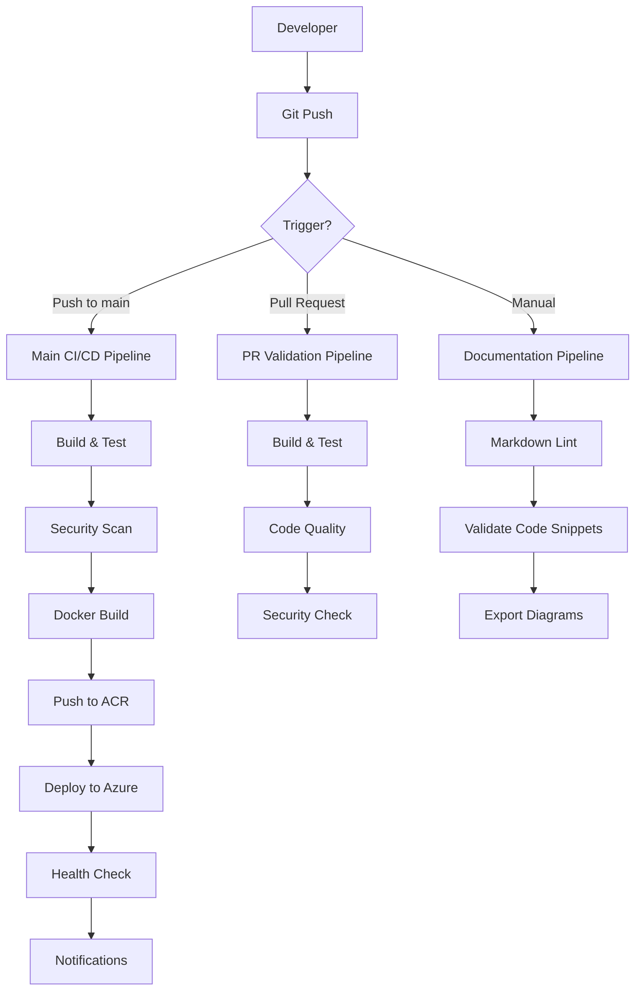

# 🚀 Pipelines CI/CD - Conaprole Orders

## Purpose

Este documento describe la **estrategia completa de CI/CD**, pipelines de deployment, automatizaciones y procesos de DevOps implementados para el sistema Conaprole Orders API.

## Audience

- **DevOps Engineers** - Configuración y mantenimiento de pipelines
- **Developers** - Comprensión del flujo de desarrollo y deployment
- **Arquitectos** - Estrategias de deployment y escalabilidad
- **Personal Académico** - Documentación de procesos de automatización

## Prerequisites

- Conocimiento básico de CI/CD y DevOps
- Familiaridad con GitHub Actions
- Comprensión de contenedores Docker
- Conocimiento de Azure Container Apps

## 🔄 Arquitectura CI/CD



## 📋 Pipelines Principales

### 1. Main CI/CD Pipeline

**Archivo**: `.github/workflows/main.yml`  
**Trigger**: Push a `main`, Manual dispatch  
**Duración**: ~8-12 minutos

#### Etapas del Pipeline

```yaml
name: Deploy to Azure Container Apps

on:
  workflow_dispatch:

env:
  AZURE_CONTAINER_REGISTRY: conaproleapi
  CONTAINER_APP_NAME: container-conaprole-api
  RESOURCE_GROUP: conaprole

jobs:
  build-and-deploy:
    runs-on: ubuntu-latest
    timeout-minutes: 100
```

#### 1.1 Setup y Restauración

```yaml
- name: Setup .NET
  uses: actions/setup-dotnet@v4
  with:
    dotnet-version: '8.0.x'

- name: Restore
  run: dotnet restore ./Conaprole.Orders.sln
```

#### 1.2 Build y Testing

```yaml
- name: Build API (Release)
  run: dotnet build ./src/Conaprole.Orders.Api/Conaprole.Orders.Api.csproj --configuration Release --no-restore

- name: Run tests
  run: dotnet test ./Conaprole.Orders.sln --configuration Release --logger "trx"

- name: Upload test results
  if: always()
  uses: actions/upload-artifact@v4
  with:
    name: test-results
    path: '**/*.trx'
```

#### 1.3 Containerización

```yaml
- name: Log in to ACR
  uses: docker/login-action@v3
  with:
    registry: ${{ env.AZURE_CONTAINER_REGISTRY }}.azurecr.io
    username: ${{ secrets.AZURE_REGISTRY_USERNAME }}
    password: ${{ secrets.AZURE_REGISTRY_PASSWORD }}

- name: Build and push Docker image
  run: |
    docker build -t ${{ env.AZURE_CONTAINER_REGISTRY }}.azurecr.io/conaprole-api:${{ github.sha }} .
    docker push ${{ env.AZURE_CONTAINER_REGISTRY }}.azurecr.io/conaprole-api:${{ github.sha }}
```

#### 1.4 Deployment a Azure

```yaml
- name: Deploy to Azure Container Apps
  uses: azure/container-apps-deploy-action@v1
  with:
    acrName: ${{ env.AZURE_CONTAINER_REGISTRY }}
    containerAppName: ${{ env.CONTAINER_APP_NAME }}
    resourceGroup: ${{ env.RESOURCE_GROUP }}
    imageToDeploy: ${{ env.AZURE_CONTAINER_REGISTRY }}.azurecr.io/conaprole-api:${{ github.sha }}
```

### 2. Documentation Pipeline

**Archivo**: `.github/workflows/docs.yml`  
**Trigger**: Manual dispatch, PR con cambios en `/docs`  
**Duración**: ~3-5 minutos

```yaml
name: Documentation Validation

on:
  workflow_dispatch:

jobs:
  validate-docs:
    runs-on: ubuntu-latest
    timeout-minutes: 10
    
    steps:
      - name: Checkout repository
        uses: actions/checkout@v4

      - name: Setup Node.js
        uses: actions/setup-node@v4
        with:
          node-version: '20'

      - name: Install markdownlint-cli
        run: npm install -g markdownlint-cli

      - name: Setup .NET
        uses: actions/setup-dotnet@v4
        with:
          dotnet-version: '8.0.x'

      - name: Make validation script executable
        run: chmod +x scripts/validate-docs.sh

      - name: Run documentation validation
        run: ./scripts/validate-docs.sh
```

## 🐳 Containerización

### Dockerfile

```dockerfile
# Multi-stage build para optimizar tamaño
FROM mcr.microsoft.com/dotnet/aspnet:8.0 AS base
WORKDIR /app
EXPOSE 80
EXPOSE 443

FROM mcr.microsoft.com/dotnet/sdk:8.0 AS build
WORKDIR /src

# Copy project files
COPY ["src/Conaprole.Orders.Api/Conaprole.Orders.Api.csproj", "src/Conaprole.Orders.Api/"]
COPY ["src/Conaprole.Orders.Application/Conaprole.Orders.Application.csproj", "src/Conaprole.Orders.Application/"]
COPY ["src/Conaprole.Orders.Domain/Conaprole.Orders.Domain.csproj", "src/Conaprole.Orders.Domain/"]
COPY ["src/Conaprole.Orders.Infrastructure/Conaprole.Orders.Infrastructure.csproj", "src/Conaprole.Orders.Infrastructure/"]

# Restore dependencies
RUN dotnet restore "src/Conaprole.Orders.Api/Conaprole.Orders.Api.csproj"

# Copy source code
COPY . .

# Build application
WORKDIR "/src/src/Conaprole.Orders.Api"
RUN dotnet build "Conaprole.Orders.Api.csproj" -c Release -o /app/build

FROM build AS publish
RUN dotnet publish "Conaprole.Orders.Api.csproj" -c Release -o /app/publish

FROM base AS final
WORKDIR /app
COPY --from=publish /app/publish .
ENTRYPOINT ["dotnet", "Conaprole.Orders.Api.dll"]
```

### Docker Optimizations

1. **Multi-stage builds** para reducir tamaño de imagen final
2. **Layer caching** de dependencias NuGet
3. **Non-root user** para seguridad
4. **Health checks** integrados

## ☁️ Infraestructura Azure

### Azure Container Apps Configuration

```yaml
apiVersion: apps/v1
kind: Deployment
metadata:
  name: conaprole-orders-api
spec:
  replicas: 2
  selector:
    matchLabels:
      app: conaprole-orders-api
  template:
    metadata:
      labels:
        app: conaprole-orders-api
    spec:
      containers:
      - name: api
        image: conaproleapi.azurecr.io/conaprole-api:latest
        ports:
        - containerPort: 80
        env:
        - name: ASPNETCORE_ENVIRONMENT
          value: "Production"
        - name: ConnectionStrings__DefaultConnection
          valueFrom:
            secretKeyRef:
              name: db-connection
              key: connection-string
        resources:
          limits:
            cpu: "1"
            memory: "1Gi"
          requests:
            cpu: "500m"
            memory: "512Mi"
        livenessProbe:
          httpGet:
            path: /health
            port: 80
          initialDelaySeconds: 30
          periodSeconds: 10
        readinessProbe:
          httpGet:
            path: /health/ready
            port: 80
          initialDelaySeconds: 5
          periodSeconds: 5
```

### Environment Variables

| Variable | Descripción | Ejemplo | Secreto |
|----------|-------------|---------|---------|
| `ASPNETCORE_ENVIRONMENT` | Entorno de ejecución | `Production` | No |
| `ConnectionStrings__DefaultConnection` | String de conexión DB | `Server=...` | Sí |
| `Keycloak__Authority` | URL de Keycloak | `https://auth.conaprole.com` | No |
| `Keycloak__Audience` | Audience para JWT | `conaprole-api` | No |
| `Serilog__MinimumLevel__Default` | Nivel de logging | `Information` | No |

## 📊 Métricas y Monitoreo

### Health Checks

```csharp
public class Startup
{
    public void ConfigureServices(IServiceCollection services)
    {
        services.AddHealthChecks()
            .AddDbContext<ApplicationDbContext>(tags: new[] { "database" })
            .AddUrlGroup(new Uri("https://keycloak.conaprole.com/health"), "keycloak")
            .AddCheck<CustomHealthCheck>("custom-check");
    }
    
    public void Configure(IApplicationBuilder app)
    {
        app.UseHealthChecks("/health", new HealthCheckOptions
        {
            ResponseWriter = UIResponseWriter.WriteHealthCheckUIResponse
        });
        
        app.UseHealthChecks("/health/ready", new HealthCheckOptions
        {
            Predicate = check => check.Tags.Contains("ready")
        });
    }
}
```

### Application Insights Integration

```csharp
services.AddApplicationInsightsTelemetry(options =>
{
    options.InstrumentationKey = configuration["ApplicationInsights:InstrumentationKey"];
});

services.AddSingleton<ITelemetryInitializer, CustomTelemetryInitializer>();
```

### Custom Metrics

```csharp
public class OrderMetrics
{
    private readonly IMetrics _metrics;
    
    public OrderMetrics(IMetrics metrics)
    {
        _metrics = metrics;
    }
    
    public void RecordOrderCreated()
    {
        _metrics.CreateCounter<int>("orders_created_total")
            .Add(1);
    }
    
    public void RecordOrderProcessingTime(TimeSpan duration)
    {
        _metrics.CreateHistogram<double>("order_processing_duration_seconds")
            .Record(duration.TotalSeconds);
    }
}
```

## 🔒 Security Pipeline

### Code Security Scanning

```yaml
- name: Run CodeQL Analysis
  uses: github/codeql-action/init@v2
  with:
    languages: csharp
    queries: security-and-quality

- name: Autobuild
  uses: github/codeql-action/autobuild@v2

- name: Perform CodeQL Analysis
  uses: github/codeql-action/analyze@v2
```

### Dependency Scanning

```yaml
- name: Run dependency check
  uses: dependency-check/Dependency-Check_Action@main
  with:
    project: 'Conaprole Orders API'
    path: '.'
    format: 'ALL'
```

### Container Security

```yaml
- name: Run Trivy vulnerability scanner
  uses: aquasecurity/trivy-action@master
  with:
    image-ref: 'conaproleapi.azurecr.io/conaprole-api:${{ github.sha }}'
    format: 'sarif'
    output: 'trivy-results.sarif'
```

## 🌍 Environments

### Development Environment

| Componente | Configuración | URL/Endpoint |
|------------|---------------|--------------|
| **API** | Docker Compose local | `http://localhost:5000` |
| **Database** | PostgreSQL container | `localhost:5432` |
| **Keycloak** | Container local | `http://localhost:8080` |
| **Logs** | File + Console | `./logs/` |

### Staging Environment

| Componente | Configuración | URL/Endpoint |
|------------|---------------|--------------|
| **API** | Azure Container Apps | `https://staging-api.conaprole.com` |
| **Database** | Azure Database for PostgreSQL | Managed service |
| **Keycloak** | Azure Container Instance | `https://staging-auth.conaprole.com` |
| **Logs** | Application Insights | Azure portal |

### Production Environment

| Componente | Configuración | URL/Endpoint |
|------------|---------------|--------------|
| **API** | Azure Container Apps (HA) | `https://api.conaprole.com` |
| **Database** | Azure Database for PostgreSQL (HA) | Managed service |
| **Keycloak** | Azure Container Apps | `https://auth.conaprole.com` |
| **Logs** | Application Insights + Archive | Azure + Storage |

## 📈 Pipeline Performance

### Build Times

| Stage | Duration | Optimización |
|-------|----------|--------------|
| **Restore** | ~30s | Cache de NuGet packages |
| **Build** | ~45s | Parallel build |
| **Tests** | ~2-3min | Test categorization |
| **Docker Build** | ~2-4min | Layer caching |
| **Push** | ~1-2min | Registry optimization |
| **Deploy** | ~2-3min | Blue-green deployment |

### Optimization Strategies

1. **NuGet Package Caching**
```yaml
- name: Cache NuGet packages
  uses: actions/cache@v3
  with:
    path: ~/.nuget/packages
    key: ${{ runner.os }}-nuget-${{ hashFiles('**/*.csproj') }}
```

2. **Docker Layer Caching**
```yaml
- name: Build with cache
  uses: docker/build-push-action@v4
  with:
    cache-from: type=gha
    cache-to: type=gha,mode=max
```

3. **Parallel Test Execution**
```xml
<PropertyGroup>
    <ParallelizeTestCollections>true</ParallelizeTestCollections>
    <MaxParallelThreads>4</MaxParallelThreads>
</PropertyGroup>
```

## 🚨 Monitoring y Alertas

### Azure Monitor Alerts

```json
{
  "alertRules": [
    {
      "name": "API Response Time",
      "condition": "Average response time > 2 seconds",
      "frequency": "5 minutes",
      "severity": "Warning"
    },
    {
      "name": "Error Rate",
      "condition": "Error rate > 5%",
      "frequency": "1 minute", 
      "severity": "Critical"
    },
    {
      "name": "Database Connection",
      "condition": "DB connection failures > 0",
      "frequency": "1 minute",
      "severity": "Critical"
    }
  ]
}
```

### Notification Channels

1. **Slack Integration** - Alertas inmediatas
2. **Email Notifications** - Resumen diario
3. **PagerDuty** - Incidentes críticos
4. **Teams Webhook** - Updates de deployment

## 🔄 Rollback Strategy

### Automated Rollback

```yaml
- name: Health check after deployment
  run: |
    for i in {1..10}; do
      if curl -f https://api.conaprole.com/health; then
        echo "Health check passed"
        break
      else
        echo "Health check failed, attempt $i"
        sleep 30
      fi
    done

- name: Rollback on failure
  if: failure()
  run: |
    az containerapp revision set-active \
      --name ${{ env.CONTAINER_APP_NAME }} \
      --resource-group ${{ env.RESOURCE_GROUP }} \
      --revision $(az containerapp revision list --name ${{ env.CONTAINER_APP_NAME }} -g ${{ env.RESOURCE_GROUP }} --query '[1].name' -o tsv)
```

### Manual Rollback Procedures

1. **Identify Last Known Good Version**
2. **Rollback Container App Revision**
3. **Verify Health Checks**
4. **Database Migration Rollback** (if needed)
5. **Update Status Page**
6. **Post-incident Review**

## Mapping to Thesis

Este documento contribuye directamente a las siguientes secciones de la tesis:

- **3.6.7 Herramientas de desarrollo** - Pipeline de CI/CD y herramientas DevOps
- **3.6.8 Metodología de deployment** - Estrategias de deployment y automatización
- **5.0 Aseguramiento de la calidad** - Procesos automatizados de calidad
- **8.0 Automatización de pruebas** - Testing automatizado en pipelines

## Referencias

- [GitHub Actions Documentation](https://docs.github.com/en/actions)
- [Azure Container Apps](https://docs.microsoft.com/en-us/azure/container-apps/)
- [Docker Best Practices](https://docs.docker.com/develop/dev-best-practices/)
- [.NET DevOps](https://docs.microsoft.com/en-us/dotnet/architecture/devops-for-aspnet-developers/)

---

*Last verified: 2025-01-02 - Commit: bbed9c1ad056ddda4c3b5f646638bc9f77b4c31d*