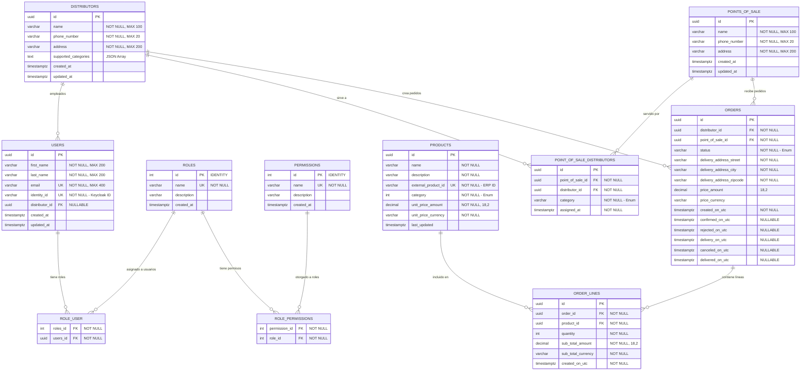

# 📊 Diagrama MERM Completo - Sistema Conaprole Orders

Este diagrama representa el **Modelo Entidad-Relación** completo del sistema Conaprole Orders, incluyendo todas las entidades, relaciones, claves y atributos más relevantes del esquema de base de datos.

## 🗂️ Diagrama ERD Completo



## 📋 Descripción de Entidades

### 🔑 Entidades Principales

#### USERS
- **Propósito**: Usuarios del sistema con autenticación via Keycloak
- **Claves**: `id` (PK), `email` (UK), `identity_id` (UK)
- **Relaciones**: Vinculado opcionalmente a un distribuidor

#### DISTRIBUTORS
- **Propósito**: Distribuidores que manejan productos y crean pedidos
- **Características**: Maneja categorías de productos soportadas como JSON
- **Relaciones**: Puede tener empleados (users) y servir múltiples puntos de venta

#### POINTS_OF_SALE
- **Propósito**: Puntos de venta que reciben pedidos
- **Relaciones**: Servidos por múltiples distribuidores según categoría

#### PRODUCTS
- **Propósito**: Catálogo de productos con pricing
- **Características**: Integración con ERP via `external_product_id`
- **Value Objects**: `UnitPrice` (Money)

#### ORDERS
- **Propósito**: Pedidos con ciclo de vida completo
- **Estados**: Created → Confirmed/Rejected → Delivered/Cancelled
- **Value Objects**: `Price` (Money), `DeliveryAddress` (Address)

#### ORDER_LINES
- **Propósito**: Líneas de pedido con productos y cantidades
- **Value Objects**: `SubTotal` (Money), `Quantity`

### 🔗 Tablas de Relación

#### ROLE_USER (N:M)
- **Propósito**: Asignación de roles a usuarios
- **Constraint**: Clave compuesta (`roles_id`, `users_id`)

#### ROLE_PERMISSIONS (N:M)
- **Propósito**: Permisos asignados a roles
- **Constraint**: Clave compuesta (`permission_id`, `role_id`)

#### POINT_OF_SALE_DISTRIBUTORS (N:M)
- **Propósito**: Relación distribuidor-punto de venta por categoría
- **Constraint**: Índice único (`point_of_sale_id`, `distributor_id`, `category`)

## 🎯 Características Técnicas

### Tipos de Datos
- **UUIDs**: Claves primarias para entidades de dominio
- **Integers**: Para roles, permisos y cantidades
- **Decimals**: Para valores monetarios (18,2)
- **Timestamps**: Con zona horaria para auditoría

### Constraints e Índices
- **Unique Constraints**: Emails, identity_ids, external_product_ids
- **Foreign Keys**: Con CASCADE delete para integridad referencial
- **Composite Indexes**: Para optimización de consultas frecuentes

### Value Objects
- **Money**: Amount + Currency para valores monetarios
- **Address**: Street + City + ZipCode para direcciones
- **Quantity**: Wrapper para cantidades con validación

## 🔄 Estados y Flujos

### Estados de Order
```
Created → Confirmed → Delivered
    ↓         ↓
Rejected  Cancelled
```

### Categorías de Productos
- LACTEOS
- CARNES
- BEBIDAS (deprecated)
- PANADERIA
- Y otros según enumeración

---

*Diagrama generado automáticamente a partir del esquema de base de datos Entity Framework Core*