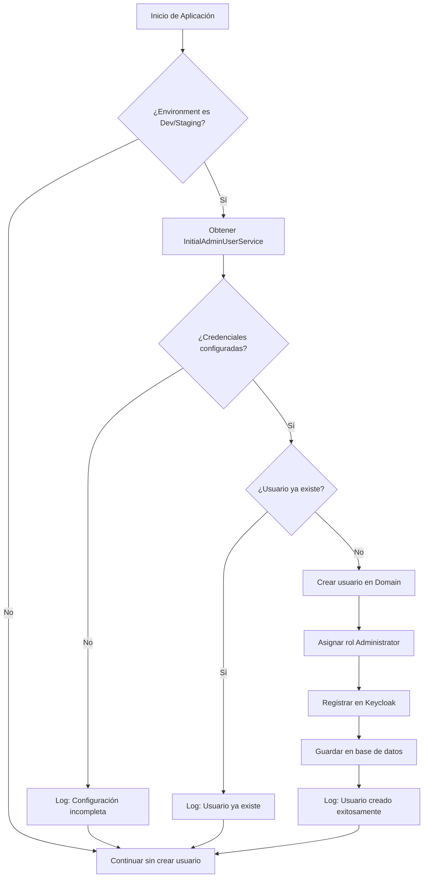

# 🔑 Configuración de Usuario Administrador Inicial

Este documento explica la implementación del sistema de creación automática de usuario administrador inicial en los entornos de **Development** y **Staging**.

## 📋 Descripción General

El sistema automáticamente crea un usuario administrador inicial al arrancar la aplicación en entornos de desarrollo y staging, lo que facilita el acceso inmediato al sistema sin configuración manual adicional.

### Credenciales por Defecto

- **Email**: `admininit@init.com`
- **Contraseña**: `admin`
- **Rol**: Administrator
- **Nombres**: Admin Initial

## 🏗️ Implementación Técnica

### Configuración

La configuración se realiza mediante las variables `InitialAdminUser` e `InitialAdminPassword` en la sección `Keycloak` de los archivos de configuración:

#### appsettings.Development.json
```json
{
  "Keycloak": {
    "BaseUrl": "http://conaprole-idp:8080",
    "AdminUrl": "http://conaprole-idp:8080/admin/realms/Conaprole/",
    "TokenUrl": "http://conaprole-idp:8080/realms/Conaprole/protocol/openid-connect/token",
    "AdminClientId": "conaprole-admin-client",
    "AdminClientSecret": "MdyBcICzOkfdxLeDcbcyhi5Im3EtVOb9",
    "AuthClientId": "conaprole-auth-client",
    "AuthClientSecret": "EMI6IRqofvQmXHhvCX3MiX9bVdqKN4VS",
    "InitialAdminUser": "admininit@init.com",
    "InitialAdminPassword": "admin"
  }
}
```

#### appsettings.Staging.json
```json
{
  "Keycloak": {
    "BaseUrl": "https://container-conaprole-keycloak.delightfulbay-f2b42d90.brazilsouth.azurecontainerapps.io",
    "AdminUrl": "https://container-conaprole-keycloak.delightfulbay-f2b42d90.brazilsouth.azurecontainerapps.io/admin/realms/Conaprole/",
    "TokenUrl": "https://container-conaprole-keycloak.delightfulbay-f2b42d90.brazilsouth.azurecontainerapps.io/realms/Conaprole/protocol/openid-connect/token",
    "AdminClientId": "conaprole-admin-client",
    "AdminClientSecret": "",
    "AuthClientId": "conaprole-auth-client",
    "AuthClientSecret": "",
    "InitialAdminUser": "admininit@init.com",
    "InitialAdminPassword": "admin"
  }
}
```

### Clases y Servicios

#### KeycloakOptions
```csharp
public sealed class KeycloakOptions
{
    public string AdminUrl { get; set; } = string.Empty;
    public string TokenUrl { get; set; } = string.Empty;
    public string AdminClientId { get; init; } = string.Empty;
    public string AdminClientSecret { get; init; } = string.Empty;
    public string AuthClientId { get; init; } = string.Empty;
    public string AuthClientSecret { get; init; } = string.Empty;
    public string InitialAdminUser { get; init; } = string.Empty;
    public string InitialAdminPassword { get; init; } = string.Empty;
}
```

#### InitialAdminUserService
```csharp
public interface IInitialAdminUserService
{
    Task CreateInitialAdminUserAsync(CancellationToken cancellationToken = default);
}

internal sealed class InitialAdminUserService : IInitialAdminUserService
{
    // Implementación que:
    // 1. Verifica si las credenciales están configuradas
    // 2. Comprueba si el usuario ya existe
    // 3. Crea el usuario en Keycloak
    // 4. Asigna el rol Administrator
    // 5. Guarda en la base de datos
}
```

### Flujo de Ejecución



### Integración en Program.cs

```csharp
// Crear usuario administrador inicial solo en Development y Staging
if (app.Environment.IsDevelopment() || app.Environment.IsStaging())
{
    using var scope = app.Services.CreateScope();
    var initialAdminUserService = scope.ServiceProvider.GetRequiredService<IInitialAdminUserService>();
    await initialAdminUserService.CreateInitialAdminUserAsync();
}
```

## 🔒 Consideraciones de Seguridad

### Entornos de Desarrollo y Staging
- ✅ La creación automática está habilitada
- ✅ Facilita el acceso inmediato para desarrollo y pruebas
- ✅ Las credenciales son conocidas y documentadas
- ⚠️ Usar solo en entornos no productivos

### Entorno de Producción
- ❌ La creación automática está **DESHABILITADA**
- ✅ Previene usuarios predecibles en producción
- ✅ Requiere configuración manual o scripts de migración específicos

## 🚀 Recomendaciones para Producción

### 1. Desactivar Creación Automática
La creación automática solo se ejecuta en entornos `Development` y `Staging`. En `Production`, el código **NO** ejecuta esta lógica.

### 2. Usar Migraciones o Seeders Dedicados
Para entornos de producción, implementar uno de los siguientes enfoques:

#### Opción A: Script de Migración EF Core
```csharp
// En una migración EF Core
protected override void Up(MigrationBuilder migrationBuilder)
{
    // Crear usuario administrador inicial de producción
    // con credenciales seguras generadas dinámicamente
}
```

#### Opción B: Seeder de Inicialización
```csharp
public class ProductionAdminSeeder
{
    public async Task SeedAsync()
    {
        // Leer credenciales desde Azure Key Vault
        // Crear usuario administrativo con contraseña compleja
        // Forzar cambio de contraseña en primer login
    }
}
```

#### Opción C: Script de PowerShell/Bash
```bash
#!/bin/bash
# Script de inicialización para producción
# Obtener credenciales desde Azure Key Vault
# Llamar a API de registro con credenciales seguras
```

### 3. Gestión de Credenciales en Producción
- **Azure Key Vault**: Almacenar credenciales administrativas
- **Rotación automática**: Implementar rotación periódica de contraseñas
- **Acceso auditado**: Registrar todos los accesos administrativos
- **MFA obligatorio**: Requerir autenticación multifactor

### 4. Configuración de Producción
```json
{
  "Keycloak": {
    "BaseUrl": "https://prod-keycloak.domain.com",
    "AdminUrl": "https://prod-keycloak.domain.com/admin/realms/Conaprole/",
    "TokenUrl": "https://prod-keycloak.domain.com/realms/Conaprole/protocol/openid-connect/token",
    "AdminClientId": "conaprole-admin-client",
    "AdminClientSecret": "{{AZURE_KEY_VAULT_SECRET}}",
    "AuthClientId": "conaprole-auth-client",
    "AuthClientSecret": "{{AZURE_KEY_VAULT_SECRET}}"
    // InitialAdminUser y InitialAdminPassword NO configurados
  }
}
```

## 📊 Logging y Monitoreo

El servicio registra las siguientes actividades:

- **Información**: Configuración no encontrada o incompleta
- **Información**: Usuario administrador ya existe
- **Información**: Usuario administrador creado exitosamente
- **Error**: Fallos en la creación del usuario (sin detener la aplicación)

### Ejemplo de Logs
```
[INF] Initial admin user admininit@init.com already exists. Skipping creation.
[INF] Initial admin user admininit@init.com created successfully.
[ERR] Failed to create initial admin user admininit@init.com. Exception: ...
```

## ❓ Preguntas Frecuentes

### ¿Se puede cambiar la contraseña del usuario inicial?
Sí, una vez creado, el usuario puede cambiar su contraseña usando los endpoints estándar de la API o la interfaz de Keycloak.

### ¿Qué pasa si ya existe un usuario con ese email?
El sistema detecta la existencia del usuario y omite la creación, registrando esta acción en los logs.

### ¿Se puede personalizar el email o contraseña?
Sí, modificando las variables `InitialAdminUser` e `InitialAdminPassword` en los archivos de configuración.

### ¿Funciona en contenedores Docker?
Sí, la funcionalidad es completamente compatible con despliegues en contenedores.

### ¿Se puede deshabilitar en Development?
Sí, simplemente removiendo o dejando vacías las variables `InitialAdminUser` e `InitialAdminPassword`.

## 🔗 Referencias

- [Documentación de Keycloak Integration](./security/keycloak-integration.md)
- [Guía de Authentication](./security/authentication.md)
- [Configuración de Entornos](../README.md#environment-variables)
- [Convenciones de Código](./architecture/convenciones-codigo.md)