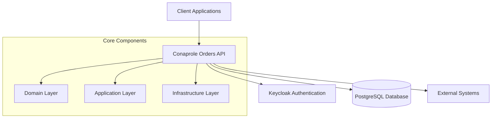

# 🔍 System Overview

## Purpose

This section provides a high-level introduction to the Conaprole Orders system for stakeholders at all technical levels.

## Audience

- **New Team Members** - System introduction and onboarding
- **Business Stakeholders** - System capabilities and architecture
- **External Developers** - API integration overview

## Prerequisites

- Basic understanding of web applications
- Familiarity with REST APIs (for integration scenarios)

## Contents

### System Introduction
- [System Overview](./system-overview.md) - What the system does and why
- [Business Context](./business-context.md) - Business requirements and goals
- [Technology Stack](./technology-stack.md) - Technologies and frameworks used

### Key Concepts
- [Domain Model](./domain-model.md) - Core business entities and relationships
- [User Roles](./user-roles.md) - System actors and permissions
- [Integration Points](./integration-points.md) - External system connections

### Getting Started
- [Quick Start Guide](./quick-start.md) - Fast track to understanding the system
- [Glossary](./glossary.md) - Important terms and definitions

## Quick Reference

| Component | Description | Documentation |
|-----------|-------------|---------------|
| **Orders API** | Core order management system | [API Documentation](../reference/api-reference.md) |
| **Authentication** | JWT-based security with Keycloak | [Security Guide](../security/README.md) |
| **Database** | PostgreSQL with Entity Framework | [Data Architecture](../architecture/data-layer.md) |
| **Testing** | Comprehensive test suite | [Testing Guide](../testing/README.md) |

## System At a Glance

---

*Last verified: 2025-01-02 - Commit: [documentation restructure]*