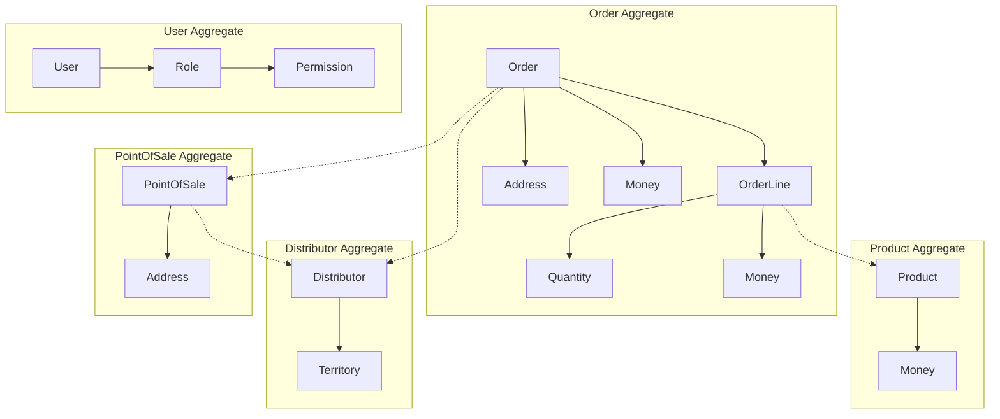

# 🏗️ Domain Model

## Purpose

This document describes the core domain model of the Conaprole Orders system, including entities, value objects, aggregates, and their relationships. The domain model represents the business concepts and rules that drive the system's behavior.

## Domain Overview

The Conaprole Orders domain focuses on managing the complete lifecycle of dairy product orders within a distributor network. The domain encompasses order management, user roles, product catalog, and distributor territories.

## Core Aggregates

### Order Aggregate

The **Order** aggregate is the central entity in the domain, representing a request for dairy products from a point of sale through a distributor.

#### Order (Aggregate Root)
```csharp
public class Order : Entity
{
    public Guid Id { get; private set; }
    public Guid DistributorId { get; private set; }
    public Guid PointOfSaleId { get; private set; }
    public Address DeliveryAddress { get; private set; }
    public OrderStatus Status { get; private set; }
    public DateTime CreatedOnUtc { get; private set; }
    public DateTime? ConfirmedOnUtc { get; private set; }
    public DateTime? DeliveredOnUtc { get; private set; }
    public Money Price { get; private set; }
    public List<OrderLine> OrderLines { get; private set; }
}
```

**Business Rules:**
- Orders can only be modified in `Created` status
- Order confirmation requires all order lines to be available
- Total price is calculated from order lines
- Delivery address must be within distributor territory

#### OrderLine (Entity)
```csharp
public class OrderLine : Entity
{
    public Guid Id { get; private set; }
    public Guid OrderId { get; private set; }
    public Guid ProductId { get; private set; }
    public Quantity Quantity { get; private set; }
    public Money UnitPrice { get; private set; }
    public Money TotalPrice { get; private set; }
}
```

**Business Rules:**
- Quantity must be positive
- Unit price must match current product pricing
- Total price = Quantity × Unit price

#### OrderStatus (Enumeration)
```csharp
public enum OrderStatus
{
    Created = 1,
    Confirmed = 2,
    InTransit = 3,
    Delivered = 4,
    Cancelled = 5
}
```

**State Transitions:**
- Created → Confirmed (when all products available)
- Confirmed → InTransit (when shipping begins)
- InTransit → Delivered (when delivery completed)
- Created/Confirmed → Cancelled (when cancellation requested)

### User Aggregate

The **User** aggregate represents actors in the system with different roles and permissions.

#### User (Aggregate Root)
```csharp
public class User : Entity
{
    public Guid Id { get; private set; }
    public string Email { get; private set; }
    public string FirstName { get; private set; }
    public string LastName { get; private set; }
    public List<Role> Roles { get; private set; }
    public bool IsActive { get; private set; }
    public DateTime CreatedOnUtc { get; private set; }
}
```

#### Role (Entity)
```csharp
public class Role : Entity
{
    public Guid Id { get; private set; }
    public string Name { get; private set; }
    public string Description { get; private set; }
    public List<Permission> Permissions { get; private set; }
}
```

#### Permission (Entity)
```csharp
public class Permission : Entity
{
    public Guid Id { get; private set; }
    public string Name { get; private set; }
    public string Description { get; private set; }
}
```

**Standard Roles:**
- **Administrator**: Full system access
- **Distributor**: Territory-specific order management
- **PointOfSale**: Order creation and viewing
- **SalesManager**: Regional oversight and reporting

### Product Aggregate

The **Product** aggregate represents dairy products available for ordering.

#### Product (Aggregate Root)
```csharp
public class Product : Entity
{
    public Guid Id { get; private set; }
    public string Name { get; private set; }
    public string Description { get; private set; }
    public string ExternalId { get; private set; }
    public ProductCategory Category { get; private set; }
    public Money BasePrice { get; private set; }
    public string Unit { get; private set; }
    public bool IsActive { get; private set; }
}
```

**Business Rules:**
- External ID must be unique (ERP system integration)
- Base price serves as default for distributor pricing
- Inactive products cannot be ordered

### Distributor Aggregate

The **Distributor** aggregate represents distribution partners and their territories.

#### Distributor (Aggregate Root)
```csharp
public class Distributor : Entity
{
    public Guid Id { get; private set; }
    public string Name { get; private set; }
    public string ContactEmail { get; private set; }
    public string ContactPhone { get; private set; }
    public List<Territory> Territories { get; private set; }
    public bool IsActive { get; private set; }
}
```

#### Territory (Value Object)
```csharp
public class Territory : ValueObject
{
    public string Region { get; private set; }
    public string City { get; private set; }
    public List<string> PostalCodes { get; private set; }
}
```

### PointOfSale Aggregate

The **PointOfSale** aggregate represents retail locations that place orders.

#### PointOfSale (Aggregate Root)
```csharp
public class PointOfSale : Entity
{
    public Guid Id { get; private set; }
    public string Name { get; private set; }
    public Address Address { get; private set; }
    public string ContactEmail { get; private set; }
    public string ContactPhone { get; private set; }
    public Guid AssignedDistributorId { get; private set; }
    public bool IsActive { get; private set; }
}
```

## Value Objects

### Address
```csharp
public class Address : ValueObject
{
    public string Street { get; private set; }
    public string City { get; private set; }
    public string PostalCode { get; private set; }
    public string Country { get; private set; }
}
```

### Money
```csharp
public class Money : ValueObject
{
    public decimal Amount { get; private set; }
    public string Currency { get; private set; }
    
    public Money Add(Money other) { /* implementation */ }
    public Money Multiply(decimal factor) { /* implementation */ }
}
```

### Quantity
```csharp
public class Quantity : ValueObject
{
    public decimal Value { get; private set; }
    public string Unit { get; private set; }
    
    public Quantity Add(Quantity other) { /* implementation */ }
    public bool IsPositive => Value > 0;
}
```

## Domain Services

### OrderDomainService
Handles complex business logic that doesn't belong to a single aggregate.

```csharp
public class OrderDomainService
{
    public bool CanConfirmOrder(Order order, List<Product> products)
    {
        // Complex validation logic across aggregates
    }
    
    public Money CalculateOrderTotal(Order order, List<Product> products)
    {
        // Price calculation with business rules
    }
}
```

### TerritoryService
Manages territory assignment and validation.

```csharp
public class TerritoryService
{
    public bool IsAddressInTerritory(Address address, List<Territory> territories)
    {
        // Territory validation logic
    }
    
    public Distributor FindDistributorForAddress(Address address)
    {
        // Distributor assignment logic
    }
}
```

## Domain Events

### Order Events
```csharp
public record OrderCreatedEvent(Guid OrderId, Guid DistributorId) : DomainEvent;
public record OrderConfirmedEvent(Guid OrderId, DateTime ConfirmedOnUtc) : DomainEvent;
public record OrderDeliveredEvent(Guid OrderId, DateTime DeliveredOnUtc) : DomainEvent;
public record OrderCancelledEvent(Guid OrderId, string Reason) : DomainEvent;
```

### User Events
```csharp
public record UserCreatedEvent(Guid UserId, string Email) : DomainEvent;
public record UserRoleChangedEvent(Guid UserId, List<string> NewRoles) : DomainEvent;
```

## Aggregate Relationships



## Business Invariants

### Order Invariants
1. **Order total consistency**: Order.Price must equal sum of OrderLine.TotalPrice
2. **Status progression**: Orders can only move forward in status (no backwards transitions except to Cancelled)
3. **Territory compliance**: Order delivery address must be within distributor territory
4. **Active products only**: Order lines can only reference active products

### User Invariants
1. **Unique email**: Each user must have a unique email address
2. **Role consistency**: Users must have at least one role
3. **Permission transitivity**: Users inherit all permissions from their roles

### Product Invariants
1. **Unique external ID**: Each product must have a unique external identifier
2. **Positive pricing**: Product base price must be positive
3. **Valid units**: Product units must be from approved unit list

### Distributor Invariants
1. **Territory exclusivity**: Each postal code can only belong to one distributor
2. **Active distributor orders**: Only active distributors can receive new orders
3. **Contact information**: Distributors must have valid contact information

## Domain Rules Implementation

Domain rules are implemented through:

1. **Entity methods**: Business logic encapsulated in aggregate roots
2. **Domain services**: Cross-aggregate business logic
3. **Value object validation**: Invariants enforced in value object constructors
4. **Domain events**: Side effects triggered by business operations

This domain model ensures that business rules are enforced at the core of the application, maintaining data integrity and business logic consistency across all system operations.

---

*Last verified: 2025-01-02 - Commit: [documentation restructure]*