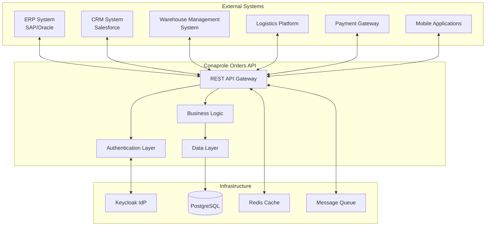

# 🔗 Integration Points

## Purpose

This document describes the integration architecture and external connection points for the Conaprole Orders system, including APIs, protocols, data exchange formats, and integration patterns used to connect with internal and external systems.

## Integration Architecture Overview

The Conaprole Orders system follows an **API-first** integration strategy, providing RESTful endpoints for external systems while consuming services from enterprise systems and third-party providers.



## Primary Integration Points

### 1. ERP System Integration

#### Purpose
Bidirectional synchronization with enterprise resource planning system for product catalog, pricing, and order fulfillment.

#### Technology
- **Protocol**: REST API over HTTPS
- **Authentication**: OAuth 2.0 Client Credentials
- **Data Format**: JSON
- **Frequency**: Real-time for orders, scheduled for master data

#### Integration Flows

##### Product Synchronization (Inbound)
```json
// ERP → Conaprole Orders
{
  "product_id": "SAP_12345",
  "name": "Leche Entera 1L",
  "description": "Leche entera pasteurizada",
  "category": "DAIRY",
  "base_price": {
    "amount": 45.00,
    "currency": "UYU"
  },
  "unit": "liter",
  "is_active": true,
  "last_updated": "2025-01-02T10:30:00Z"
}
```

##### Order Submission (Outbound)
```json
// Conaprole Orders → ERP
{
  "order_id": "ORD-12345",
  "distributor_code": "DIST001",
  "delivery_date": "2025-01-05",
  "items": [
    {
      "product_code": "SAP_12345",
      "quantity": 50,
      "unit_price": 45.00
    }
  ],
  "total_amount": 2250.00,
  "status": "confirmed"
}
```

#### Error Handling
- Retry mechanism with exponential backoff
- Dead letter queue for failed messages
- Compensation transactions for partial failures

### 2. CRM System Integration

#### Purpose
Customer and distributor relationship management, sales performance tracking.

#### Technology
- **Platform**: Salesforce API
- **Protocol**: REST API
- **Authentication**: OAuth 2.0 Authorization Code
- **Sync Pattern**: Event-driven + scheduled batch

#### Integration Flows

##### Customer Data Sync
```json
{
  "account_id": "SF_ACC_001",
  "account_name": "Supermercado Norte",
  "type": "point_of_sale",
  "territory": "montevideo_norte",
  "assigned_distributor": "DIST001",
  "contact_info": {
    "email": "orders@supernorte.com.uy",
    "phone": "+598 2XXX XXXX"
  }
}
```

### 3. Warehouse Management System (WMS)

#### Purpose
Real-time inventory visibility and order fulfillment coordination.

#### Technology
- **Protocol**: Message Queue (RabbitMQ/Azure Service Bus)
- **Message Format**: JSON with schema validation
- **Pattern**: Event-driven architecture

#### Integration Events

##### Inventory Update Event
```json
{
  "event_type": "inventory_updated",
  "timestamp": "2025-01-02T10:30:00Z",
  "warehouse_id": "WH_MVD_001",
  "product_updates": [
    {
      "product_id": "SAP_12345",
      "available_quantity": 1500,
      "reserved_quantity": 200,
      "unit": "liter"
    }
  ]
}
```

##### Order Fulfillment Request
```json
{
  "event_type": "order_fulfillment_request",
  "order_id": "ORD-12345",
  "warehouse_id": "WH_MVD_001",
  "priority": "standard",
  "requested_delivery_date": "2025-01-05",
  "items": [
    {
      "product_id": "SAP_12345",
      "quantity": 50
    }
  ]
}
```

### 4. Logistics Platform Integration

#### Purpose
Delivery scheduling, route optimization, and shipment tracking.

#### Technology
- **API Type**: REST API
- **Real-time**: WebSocket for tracking updates
- **Batch**: Scheduled delivery planning

#### Integration Flows

##### Delivery Schedule Request
```json
{
  "shipment_id": "SHIP_12345",
  "orders": ["ORD-12345", "ORD-12346"],
  "pickup_location": {
    "warehouse_id": "WH_MVD_001",
    "address": "Warehouse Address"
  },
  "delivery_stops": [
    {
      "order_id": "ORD-12345",
      "delivery_address": {
        "street": "Av. 18 de Julio 1234",
        "city": "Montevideo",
        "postal_code": "11200"
      },
      "time_window": {
        "start": "08:00",
        "end": "12:00"
      }
    }
  ]
}
```

### 5. Payment Gateway Integration

#### Purpose
Payment processing for COD (Cash on Delivery) and credit terms management.

#### Technology
- **Provider**: Local payment processors
- **Protocol**: HTTPS REST API
- **Security**: PCI DSS compliance

#### Integration Patterns

##### Payment Authorization
```json
{
  "transaction_id": "PAY_12345",
  "order_id": "ORD-12345",
  "amount": {
    "value": 2250.00,
    "currency": "UYU"
  },
  "payment_method": "credit_terms",
  "customer_id": "CUST_001",
  "due_date": "2025-02-01"
}
```

### 6. Mobile Applications

#### Purpose
Field sales support, distributor mobile access, and delivery confirmation.

#### Technology
- **API**: RESTful JSON API
- **Authentication**: JWT Bearer tokens
- **Offline Support**: Local storage with sync

#### Mobile-Specific Endpoints

```http
GET /api/mobile/orders/distributor/{distributorId}
GET /api/mobile/products/catalog
POST /api/mobile/orders/{orderId}/delivery-confirmation
GET /api/mobile/sync/delta?since={timestamp}
```

## Authentication & Authorization

### Inter-System Authentication

#### Client Credentials Flow (System-to-System)
```http
POST /auth/realms/conaprole/protocol/openid-connect/token
Content-Type: application/x-www-form-urlencoded

grant_type=client_credentials
&client_id=erp-integration
&client_secret={client_secret}
&scope=orders:write products:read
```

#### API Key Authentication (Legacy Systems)
```http
GET /api/orders
Authorization: ApiKey {api_key}
X-Client-Id: warehouse-system
```

### Rate Limiting

Different rate limits per integration type:

```yaml
rate_limits:
  erp_system: 1000/hour
  crm_system: 500/hour
  mobile_apps: 100/minute/user
  warehouse_system: 2000/hour
  default: 100/hour
```

## Data Exchange Patterns

### Synchronous Integration

Used for real-time operations requiring immediate response:

- Order validation
- Inventory checks
- Payment authorization
- User authentication

### Asynchronous Integration

Used for non-critical operations and bulk data:

- Product catalog updates
- Historical data synchronization
- Reporting and analytics
- Audit log transmission

### Event-Driven Integration

Used for business events that trigger workflows:

```csharp
public class OrderConfirmedEvent : IntegrationEvent
{
    public Guid OrderId { get; set; }
    public Guid DistributorId { get; set; }
    public DateTime ConfirmedAt { get; set; }
    public List<OrderLineEvent> OrderLines { get; set; }
}

// Event publishing
await _eventBus.PublishAsync(new OrderConfirmedEvent
{
    OrderId = order.Id,
    DistributorId = order.DistributorId,
    ConfirmedAt = DateTime.UtcNow,
    OrderLines = order.OrderLines.Select(ol => new OrderLineEvent
    {
        ProductId = ol.ProductId,
        Quantity = ol.Quantity.Value
    }).ToList()
});
```

## Integration Monitoring

### Health Checks

Each integration point has dedicated health checks:

```csharp
services.AddHealthChecks()
    .AddCheck<ErpSystemHealthCheck>("erp_system")
    .AddCheck<CrmSystemHealthCheck>("crm_system")
    .AddCheck<WarehouseSystemHealthCheck>("warehouse_system")
    .AddCheck<LogisticsSystemHealthCheck>("logistics_system");
```

### Metrics and Alerting

Key integration metrics:

- **Response Times**: Average response time per integration
- **Success Rates**: Percentage of successful API calls
- **Error Rates**: Frequency of integration failures
- **Throughput**: Messages processed per minute
- **Queue Depth**: Pending messages in async queues

### Circuit Breaker Pattern

Implemented for external system resilience:

```csharp
public class ErpIntegrationService
{
    private readonly ICircuitBreaker _circuitBreaker;
    
    public async Task<ProductData> GetProductAsync(string productId)
    {
        return await _circuitBreaker.ExecuteAsync(async () =>
        {
            return await _erpApiClient.GetProductAsync(productId);
        });
    }
}
```

## Data Transformation

### Mapping Patterns

Data transformation between internal and external formats:

```csharp
public class OrderMappingProfile : Profile
{
    public OrderMappingProfile()
    {
        CreateMap<Order, ErpOrderDto>()
            .ForMember(dest => dest.ExternalOrderId, opt => opt.MapFrom(src => src.Id))
            .ForMember(dest => dest.CustomerCode, opt => opt.MapFrom(src => src.DistributorExternalId))
            .ForMember(dest => dest.Items, opt => opt.MapFrom(src => src.OrderLines));
    }
}
```

### Schema Validation

All external data validated against schemas:

```json
{
  "$schema": "https://json-schema.org/draft/2020-12/schema",
  "type": "object",
  "properties": {
    "order_id": {"type": "string"},
    "total_amount": {"type": "number", "minimum": 0},
    "items": {
      "type": "array",
      "items": {
        "type": "object",
        "properties": {
          "product_code": {"type": "string"},
          "quantity": {"type": "number", "minimum": 1}
        },
        "required": ["product_code", "quantity"]
      }
    }
  },
  "required": ["order_id", "total_amount", "items"]
}
```

## Security Considerations

### API Security

- **TLS 1.3**: All communications encrypted
- **Certificate Pinning**: For critical integrations
- **Input Validation**: All external data validated
- **Output Filtering**: Sensitive data masked in responses

### Network Security

- **VPN Tunnels**: For on-premise system connections
- **IP Whitelisting**: Restricted access by source IP
- **Firewall Rules**: Port-specific access control
- **Network Segmentation**: Isolated integration zones

### Data Privacy

- **Data Classification**: Sensitivity levels for all exchanged data
- **Retention Policies**: Automatic data purging
- **Anonymization**: PII protection in non-production environments
- **Audit Logging**: Complete integration activity tracking

This integration architecture ensures secure, reliable, and scalable connections between the Conaprole Orders system and all external platforms while maintaining data integrity and business continuity.

---

*Last verified: 2025-01-02 - Commit: [documentation restructure]*