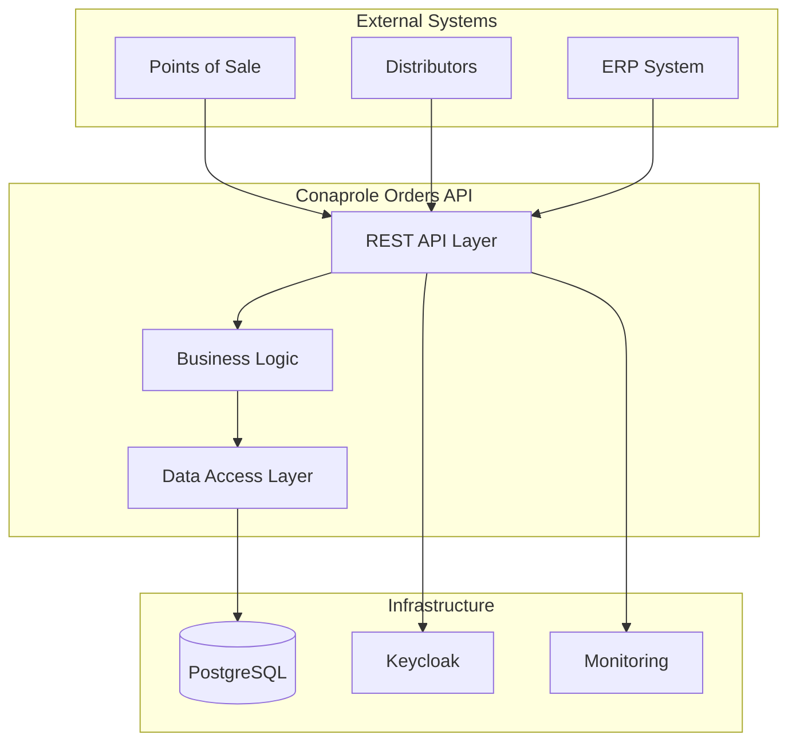

# 🔍 System Overview

## Purpose

This document provides a comprehensive overview of the Conaprole Orders system, explaining what the system does, why it exists, and how it fits within the broader business ecosystem.

## What is Conaprole Orders?

Conaprole Orders is a **core order management API** designed to handle the complete lifecycle of dairy product orders within the Conaprole ecosystem. The system facilitates order creation, management, and fulfillment between distributors, points of sale, and the company's internal systems.

## Key Business Objectives

### Primary Goals
- **Streamline Order Processing**: Automate and optimize the order management workflow
- **Improve Data Consistency**: Centralized order data management with real-time updates
- **Enhance Scalability**: Support growing business demands with modern architecture
- **Ensure Data Security**: Robust authentication and authorization mechanisms

### Business Value
- **Operational Efficiency**: Reduced manual processing and error rates
- **Real-time Visibility**: Live order status tracking and reporting
- **Integration Ready**: API-first design for seamless system integration
- **Compliance**: Built-in audit trails and security controls

## System Capabilities

### Core Features
- **Order Management**: Complete CRUD operations for orders and order lines
- **User Management**: Role-based access control for different user types
- **Product Catalog**: Management of dairy products and pricing
- **Distributor Network**: Support for multiple distributors and territories
- **Point of Sale Integration**: Direct integration with retail locations

### Technical Features
- **RESTful API**: Standards-compliant REST endpoints
- **Real-time Processing**: Immediate order processing and status updates
- **Data Validation**: Comprehensive business rule validation
- **Audit Logging**: Complete activity tracking for compliance
- **Health Monitoring**: Built-in health checks and monitoring

## System Context

### Business Domain
The system operates within the **dairy products distribution** domain, specifically handling:
- Product orders from retail points of sale
- Distributor territory management
- Inventory coordination
- Delivery scheduling coordination

### Integration Points
- **Identity Provider**: Keycloak for authentication and authorization
- **Database**: PostgreSQL for reliable data persistence
- **Monitoring**: Application insights and health monitoring

## High-Level Architecture

## Key Benefits

### For Developers
- **Clean Architecture**: Well-structured, maintainable codebase
- **Comprehensive Testing**: Unit, integration, and end-to-end test coverage
- **Documentation**: Complete API documentation and architectural guides
- **Development Tools**: Docker containerization and CI/CD pipelines

### For Business Users
- **Reliability**: High availability and data consistency
- **Performance**: Optimized for high-throughput order processing
- **Flexibility**: Configurable business rules and workflows
- **Reporting**: Rich data for business intelligence and analytics

## Next Steps

To get started with the Conaprole Orders system:

1. **For Technical Users**: See [Quick Start Guide](./quick-start.md)
2. **For Business Users**: Review [Business Context](./business-context.md)
3. **For Integrators**: Check [Integration Points](./integration-points.md)
4. **For Architects**: Study [Technology Stack](./technology-stack.md)

---

*Last verified: 2025-01-02 - Commit: [documentation restructure]*
