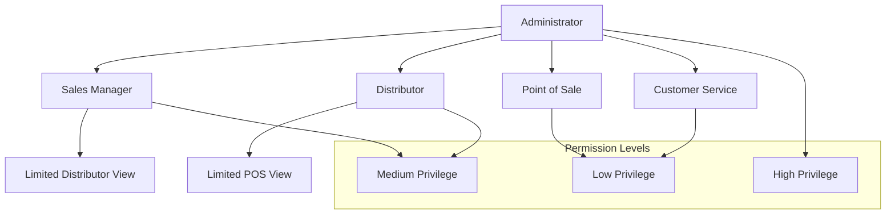

# 👥 User Roles

## Purpose

This document defines the user roles, permissions, and access control structure within the Conaprole Orders system. It outlines the responsibilities, capabilities, and security boundaries for each type of system user.

## Role-Based Access Control (RBAC)

The Conaprole Orders system implements a comprehensive role-based access control system that ensures users can only perform actions appropriate to their business function and organizational level.

### Security Principles

1. **Principle of Least Privilege**: Users receive minimum permissions necessary for their role
2. **Separation of Duties**: Critical operations require multiple roles
3. **Data Territoriality**: Access restricted based on business territories
4. **Audit Compliance**: All actions are logged for security and compliance

## Core User Roles

### 1. Administrator (`admin`)

**Purpose**: System administration and configuration management

#### Responsibilities
- Complete system configuration and maintenance
- User management and role assignment
- System monitoring and troubleshooting
- Data backup and recovery operations
- Security policy enforcement

#### Permissions
```
users:read, users:write, users:delete
roles:read, roles:write, roles:delete  
permissions:read, permissions:write
distributors:read, distributors:write, distributors:delete
products:read, products:write, products:delete
points-of-sale:read, points-of-sale:write, points-of-sale:delete
orders:read, orders:write, orders:delete
system:configuration, system:monitoring
audit-logs:read
```

#### Access Scope
- **Global**: Access to all system data and configurations
- **No Territorial Restrictions**: Can view and modify all territories
- **All Environments**: Development, staging, and production access

#### Typical Users
- IT System Administrators
- DevOps Engineers
- System Integration Specialists

### 2. Sales Manager (`sales_manager`)

**Purpose**: Regional sales oversight and business intelligence

#### Responsibilities
- Regional sales performance monitoring
- Distributor relationship management
- Business intelligence and reporting
- Strategic planning support
- Quality assurance oversight

#### Permissions
```
orders:read, orders:reports
distributors:read, distributors:write
products:read
points-of-sale:read, points-of-sale:write
users:read (within territory)
analytics:read, analytics:reports
```

#### Access Scope
- **Regional**: Access limited to assigned sales regions
- **Multi-Distributor**: Can view multiple distributors within region
- **Read-Heavy**: Primarily reporting and oversight functions

#### Typical Users
- Regional Sales Managers
- Business Development Managers
- Sales Directors

### 3. Distributor (`distributor`)

**Purpose**: Territory-based order management and fulfillment

#### Responsibilities
- Order processing and fulfillment
- Territory management
- Point of sale relationship management
- Inventory coordination
- Local customer service

#### Permissions
```
orders:read, orders:write, orders:confirm, orders:ship
points-of-sale:read (within territory)
products:read
users:read (own profile)
territories:read (own territory)
```

#### Access Scope
- **Territory-Specific**: Access limited to assigned territory
- **Own Orders Only**: Cannot view other distributors' orders
- **POS Management**: Can view points of sale in their territory

#### Data Filtering
```csharp
// Example: Territory-based data filtering
public async Task<List<Order>> GetOrdersAsync(Guid distributorId)
{
    return await _context.Orders
        .Where(o => o.DistributorId == distributorId)
        .ToListAsync();
}
```

#### Typical Users
- Distributor Company Users
- Regional Distributors
- Local Distribution Centers

### 4. Point of Sale (`point_of_sale`)

**Purpose**: Order creation and management for retail locations

#### Responsibilities
- Product order creation
- Order status monitoring
- Inventory level management
- Customer service support
- Local delivery coordination

#### Permissions
```
orders:read (own orders), orders:write (create/modify pending)
products:read
users:read (own profile)
inventory:read (own location)
```

#### Access Scope
- **Location-Specific**: Access limited to their physical location
- **Own Orders Only**: Cannot view other locations' orders
- **Product Catalog**: Full read access to available products

#### Typical Users
- Retail Store Managers
- Inventory Coordinators
- Store Clerks

### 5. Customer Service (`customer_service`)

**Purpose**: Customer support and order assistance

#### Responsibilities
- Customer inquiry resolution
- Order status investigation
- Problem escalation
- Documentation support
- Quality assurance

#### Permissions
```
orders:read, orders:modify (limited)
points-of-sale:read
products:read
users:read (customer profiles)
support-tickets:read, support-tickets:write
```

#### Access Scope
- **Support-Focused**: Read access to investigate issues
- **Limited Modification**: Can make specific order adjustments
- **Cross-Territory**: Can view across territories for support

#### Typical Users
- Customer Service Representatives
- Support Specialists
- Quality Assurance Staff

## Permission Structure

### Granular Permissions

The system uses a granular permission structure with the format: `resource:action`

#### Order Permissions
- `orders:read` - View order information
- `orders:write` - Create and modify orders
- `orders:confirm` - Confirm pending orders
- `orders:ship` - Mark orders as shipped
- `orders:cancel` - Cancel orders
- `orders:delete` - Delete orders (admin only)
- `orders:reports` - Generate order reports

#### User Management Permissions
- `users:read` - View user information
- `users:write` - Create and modify users
- `users:delete` - Delete users
- `users:impersonate` - Act on behalf of other users

#### Product Permissions
- `products:read` - View product catalog
- `products:write` - Modify product information
- `products:delete` - Remove products

#### System Permissions
- `system:configuration` - Modify system settings
- `system:monitoring` - Access monitoring tools
- `audit-logs:read` - View audit logs

### Permission Inheritance



## Data Access Patterns

### Territory-Based Filtering

Users with territorial restrictions have data automatically filtered:

```csharp
public class TerritoryFilter : IQueryFilter
{
    public IQueryable<T> Apply<T>(IQueryable<T> query, ClaimsPrincipal user)
        where T : ITerritorialEntity
    {
        var userTerritories = user.GetTerritories();
        return query.Where(e => userTerritories.Contains(e.Territory));
    }
}
```

### Row-Level Security

Critical entities implement row-level security:

```csharp
public class Order : Entity, IOwnedEntity
{
    public Guid OwnerId { get; set; } // DistributorId
    
    public bool CanBeAccessedBy(ClaimsPrincipal user)
    {
        return user.HasClaim("distributor_id", OwnerId.ToString()) ||
               user.IsInRole("admin") ||
               user.IsInRole("sales_manager");
    }
}
```

## Authentication Integration

### Keycloak Integration

The system integrates with Keycloak for authentication and role management:

```json
{
  "realm": "conaprole",
  "auth-server-url": "https://auth.conaprole.com/",
  "ssl-required": "external",
  "resource": "conaprole-orders",
  "credentials": {
    "secret": "client-secret"
  }
}
```

### JWT Token Structure

```json
{
  "sub": "user-uuid",
  "email": "user@distributor.com",
  "realm_access": {
    "roles": ["distributor"]
  },
  "resource_access": {
    "conaprole-orders": {
      "roles": ["distributor", "territory:north"]
    }
  },
  "custom_claims": {
    "distributor_id": "dist-uuid",
    "territory": "north",
    "point_of_sale_id": "pos-uuid"
  }
}
```

## Role Assignment Workflow

### User Creation Process

1. **Administrator creates user account**
2. **Business manager assigns appropriate role**
3. **Territory/location assignment (if applicable)**
4. **Permission verification and testing**
5. **User notification and onboarding**

### Role Change Process

1. **Business justification required**
2. **Manager approval needed**
3. **Security review for privilege escalation**
4. **Audit trail creation**
5. **User notification of changes**

## Security Considerations

### Privilege Escalation Prevention

- Role changes require approval workflow
- Temporary privilege elevation with automatic expiration
- Regular access reviews and certification

### Session Management

- JWT token expiration: 8 hours
- Refresh token rotation
- Concurrent session limits by role
- Automatic logout on inactivity

### Audit and Compliance

All role-based actions are logged:

```csharp
public class RoleBasedAuditLogger
{
    public void LogAction(string action, ClaimsPrincipal user, object resource)
    {
        var audit = new AuditLog
        {
            UserId = user.GetUserId(),
            Action = action,
            Resource = resource.GetType().Name,
            ResourceId = resource.GetId(),
            UserRole = user.GetRoles(),
            Timestamp = DateTime.UtcNow,
            IpAddress = user.GetIpAddress()
        };
        
        _auditRepository.Add(audit);
    }
}
```

## Role Migration and Evolution

### Adding New Roles

1. **Business requirement analysis**
2. **Permission matrix design**
3. **Security impact assessment**
4. **Implementation and testing**
5. **Documentation updates**

### Modifying Existing Roles

1. **Impact analysis on existing users**
2. **Backward compatibility considerations**
3. **Gradual rollout strategy**
4. **User communication plan**

This role-based access control system ensures that the Conaprole Orders platform maintains security, compliance, and operational efficiency while providing users with the appropriate level of access for their business functions.

---

*Last verified: 2025-01-02 - Commit: [documentation restructure]*