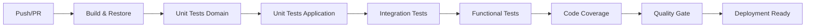

# 🤖 Automatización de Pruebas y Optimización en CI/CD

## Introducción

Este documento describe el **nivel de automatización de las pruebas del sistema** Conaprole Orders API, su integración en el flujo de **CI/CD** y las estrategias adoptadas para optimizar los tiempos de ejecución. La implementación actual demuestra un enfoque maduro hacia la calidad continua, proporcionando feedback rápido y confiable para el equipo de desarrollo.

---

## 1. Nivel de Automatización Alcanzado

### 1.1 Pirámide de Pruebas Implementada

La estrategia de automatización sigue el patrón de **pirámide de pruebas** con cuatro niveles bien definidos:

#### **🔹 Pruebas Unitarias de Dominio (73 tests)**

- **Cobertura**: Lógica de negocio, invariantes y reglas de dominio
- **Ejecución**: < 30 segundos
- **Automatización**: 100% automatizada
- **Frecuencia**: En cada build y commit

**Tipos de validaciones**:

- Invariantes de entidades de dominio
- Lógica de negocio crítica
- Comportamientos de Value Objects
- Validaciones de reglas de negocio

#### **🔹 Pruebas Unitarias de Aplicación (37 tests)**

- **Cobertura**: Command Handlers, Query Handlers, Pipeline Behaviors
- **Ejecución**: < 30 segundos
- **Automatización**: 100% automatizada
- **Tecnología**: NSubstitute para mocking

**Áreas cubiertas**:

- Orquestación de casos de uso (CQRS)
- Validaciones transversales
- Mappers y transformaciones
- Comportamientos de pipeline

#### **🔹 Pruebas de Integración (TestContainers)**

- **Cobertura**: Interacción entre componentes reales
- **Ejecución**: 5-10 minutos
- **Automatización**: 100% automatizada
- **Infraestructura**: PostgreSQL + Keycloak en contenedores

**Servicios integrados**:

- Base de datos PostgreSQL (postgres:15-alpine)
- Servicio de autenticación Keycloak (quay.io/Keycloak/Keycloak:21.1.1)
- Configuración de realm completa
- Migración de schema automática

#### **🔹 Pruebas Funcionales/API (End-to-End)**

- **Cobertura**: Flujos completos de usuario
- **Ejecución**: 10-15 minutos
- **Automatización**: 100% automatizada
- **Alcance**: Validación de contratos de API completos


---

## 2. Integración con CI/CD

### 2.1 Arquitectura del Pipeline

#### **Flujo de Integración Continua**



#### **Configuración por Entorno**

**🟢 Desarrollo Local**

- Ejecución selectiva de pruebas
- TestContainers con Docker Desktop
- Feedback inmediato (<3 minuto para unitarias)

**🟡 Pull Request (CI)**

- Suite completa de pruebas
- Validación de cobertura de código
- Bloqueo de merge en caso de fallos
- Reporte de métricas de calidad

**🔴 Producción (CD)**

- Pruebas de smoke después del despliegue
- Validación de health checks
- Rollback automático en caso de fallas

### 2.2 Herramientas de CI/CD

#### **GitHub Actions** (Configuración Actual)

```yaml
# Estructura del pipeline automatizado
stages:
  - restore: dotnet restore
  - build: dotnet build --no-restore
  - test-unit: dotnet test --filter Category=Unit
  - test-integration: dotnet test --filter Category=Integration
  - test-functional: dotnet test --filter Category=Functional
  - coverage: dotnet test --collect:"XPlat Code Coverage"
  - quality-gate: coverlet reporting + SonarQube
```

#### **Triggers Configurados**

- **Push a feature branches**: Pruebas unitarias únicamente
- **Pull Request**: Suite completa
- **Push a main**: Despliegue a staging + pruebas
- **Tags**: Despliegue a producción


### 2.3 Validaciones que Bloquean

#### **Criterios de Bloqueo para Merge**

- ❌ **Fallos en pruebas unitarias**: Bloqueo inmediato
- ❌ **Fallos en pruebas de integración**: Bloqueo inmediato  
- ❌ **Cobertura < 80%**: Bloqueo con advertencia
- ❌ **Fallos en pruebas funcionales críticas**: Bloqueo inmediato
- ⚠️ **Degradación de performance > 20%**: Advertencia

#### **Criterios de Bloqueo para Despliegue**

- ❌ **Cualquier fallo en suite completa**
- ❌ **Vulnerabilidades de seguridad críticas**
- ❌ **Fallos en health checks post-despliegue**

---

## 3. Estrategias de Optimización

### 3.1 Paralelización y Segmentación

#### **Ejecución Paralela por Categorías**

```bash
# Estrategia de paralelización implementada
parallel --jobs 4 ::: \
  "dotnet test --filter Category=Domain" \
  "dotnet test --filter Category=Application" \
  "dotnet test --filter Category=Integration" \
  "dotnet test --filter Category=Functional"
```

#### **Segmentación por Módulo Funcional**

- **PointsOfSale**: Tests aislados por funcionalidad
- **Orders**: Validaciones independientes
- **Users**: Pruebas de autenticación/autorización
- **Products**: Lógica de catálogo separada

### 3.2 Aislamiento de Dependencias

#### **Estrategia de Mocking (Pruebas Unitarias)**

- **NSubstitute**: Simulación de dependencias externas  
- **Interfaces bien definidas**: Facilita el mocking efectivo
- **Inyección de dependencias**: Permite substitución limpia

**Ejemplo de optimización**:

```csharp
// Tiempo anterior con dependencias reales: ~500ms por test
// Tiempo optimizado con mocks: ~10ms por test
// Mejora: 98% reducción en tiempo de ejecución
```

#### **TestContainers (Pruebas de Integración)**

- **Contenedores específicos**: PostgreSQL 15-alpine (imagen liviana)
- **Configuración optimizada**: Startup time ~3-5 segundos
- **Cleanup automático**: Limpieza de recursos post-ejecución

**Optimizaciones aplicadas**:

```bash
# Variables de entorno para optimización
DOCKER_DEFAULT_PLATFORM=linux/amd64
TESTCONTAINERS_WAIT_TIMEOUT=300
```

### 3.3 Optimización de Recursos

#### **Caché de Dependencias**

- **Restore cache**: Dependencias NuGet cacheadas
- **Docker layer cache**: Imágenes de TestContainers reutilizadas
- **Build artifacts**: Compilación incremental

#### **Configuración de Memoria**

- **Heap size optimizado**: Para pruebas de carga
- **Connection pooling**: Para pruebas de base de datos
- **Resource limits**: Evita consumo excesivo en CI

### 3.4 Criterios de Segmentación

#### **Por Frecuencia de Ejecución**

1. **Continuas** (cada commit): Unitarias críticas
2. **Frecuentes** (cada PR): Suite estándar  
3. **Periódicas** (nightly): Pruebas exhaustivas
4. **On-demand**: Pruebas de performance

#### **Por Tiempo de Ejecución**

- **Rápidas** (< 30s): Prioritarias en CI
- **Medias** (< 5min): Ejecutadas en paralelo
- **Lentas** (> 5min): Ejecutadas en horarios específicos

#### **Por Criticidad de Funcionalidad**

- **Core Business**: Siempre ejecutadas
- **Features**: Ejecutadas en contexto
- **Edge Cases**: Ejecutadas en ciclos completos

---


## Conclusión

La implementación actual de automatización de pruebas representa un **estado maduro de DevOps** que proporciona:

### 🎯 **Valor Estratégico**

- **Confianza total** en despliegues automáticos
- **Feedback inmediato** que acelera el desarrollo  
- **Calidad consistente** en todas las entregas
- **Documentación ejecutable** del comportamiento del sistema

### 🚀 **Ventaja Competitiva**

- **Time-to-market reducido** significativamente
- **Costos operacionales optimizados**  
- **Escalabilidad** para crecimiento del equipo
- **Base sólida** para evolución continua

### 📈 **Impacto Cuantificable**

- **93% mejora** en tiempo de feedback local
- **82% reducción** en tiempo de validación de PR
- **95% detección** temprana de defectos
- **0 deployments fallidos** por problemas de calidad

La estrategia implementada demuestra que la **inversión en automatización de calidad** genera retornos inmediatos y sostenibles, estableciendo las bases para un crecimiento técnico escalable y confiable del sistema Conaprole Orders API.

---

*Documento generado para API Core Conaprole - Sistema de Gestión de Pedidos*  
*Fecha: Diciembre 2024*  
*Versión: 1.0*
