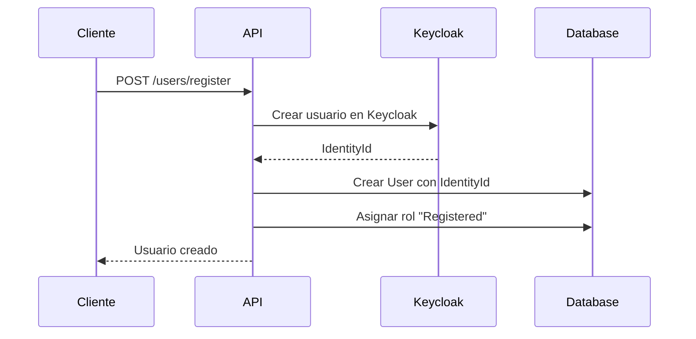
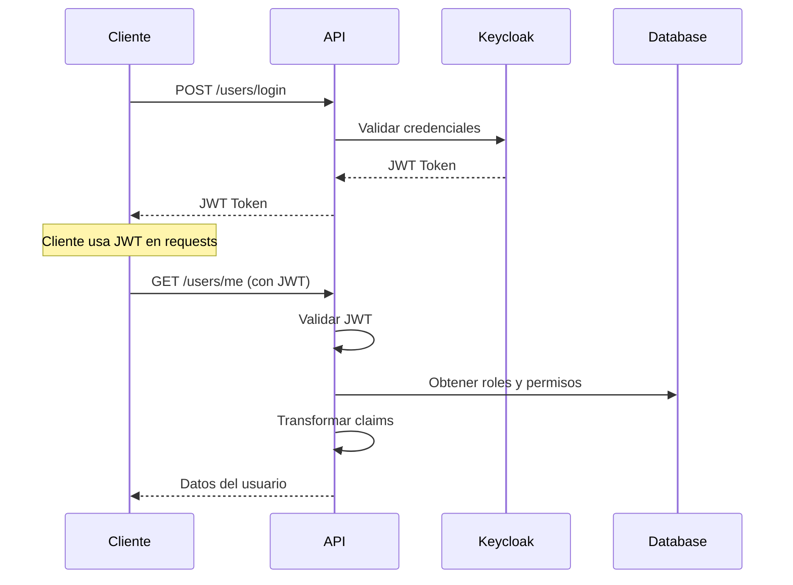
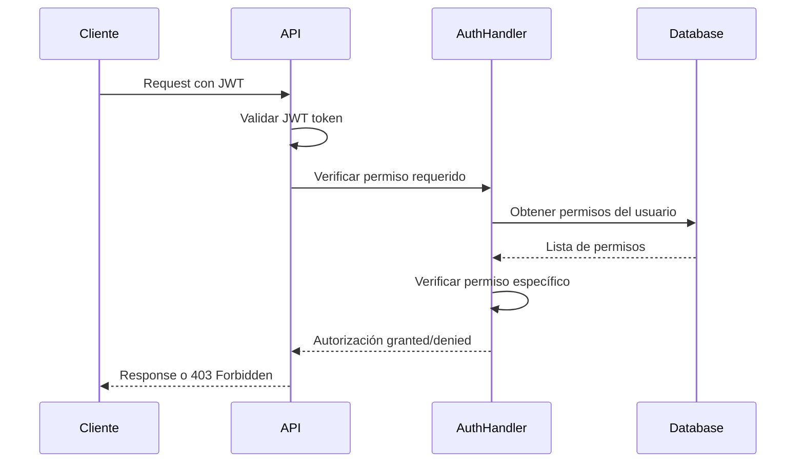

# 🏗️ Arquitectura de Seguridad

## Visión General

La arquitectura de seguridad de **Conaprole Orders** sigue un patrón de **separación de responsabilidades** donde:

- **Keycloak** gestiona identidades y autenticación
- **La aplicación** maneja autorización basada en permisos
- **La base de datos** almacena roles y permisos específicos del dominio

## Componentes Principales

### 1. **Keycloak (Identity Provider)**
```
┌─────────────────────────────────────┐
│             Keycloak                │
│  ┌─────────────┐ ┌─────────────────┐│
│  │ Admin Realm │ │   Auth Client   ││
│  │   Client    │ │                 ││
│  │             │ │  User Login     ││
│  │ User Mgmt   │ │  JWT Tokens     ││
│  └─────────────┘ └─────────────────┘│
└─────────────────────────────────────┘
```

**Responsabilidades:**
- Gestión de usuarios e identidades
- Autenticación y emisión de JWT tokens
- Gestión de credenciales y políticas de contraseñas

### 2. **API Application Layer**
```
┌─────────────────────────────────────┐
│           API Application           │
│  ┌─────────────────────────────────┐│
│  │     JWT Token Validation       ││
│  │                                ││
│  │  ┌─────────────────────────────┐││
│  │  │  Claims Transformation      │││
│  │  │                             │││
│  │  │  Roles + Permissions        │││
│  │  │  from Database              │││
│  │  └─────────────────────────────┘││
│  └─────────────────────────────────┘│
└─────────────────────────────────────┘
```

**Responsabilidades:**
- Validación de JWT tokens
- Transformación de claims con roles del dominio
- Aplicación de políticas de autorización

### 3. **Database (Authorization Store)**
```
┌─────────────────────────────────────┐
│              Database               │
│  ┌─────────┐ ┌─────────┐ ┌─────────┐│
│  │  Users  │ │  Roles  │ │ Permis- ││
│  │         │ │         │ │ sions   ││
│  │Identity │ │"Regist- │ │"users:  ││
│  │Id       │ │ered"    │ │read"    ││
│  └─────────┘ └─────────┘ └─────────┘│
└─────────────────────────────────────┘
```

**Responsabilidades:**
- Almacenamiento de usuarios del dominio
- Gestión de roles y permisos específicos
- Relaciones entre usuarios, roles y permisos

## Flujo de Seguridad

### Registro de Usuario


### Proceso de Login


### Verificación de Permisos


## Capas de Seguridad

### Capa 1: Autenticación (Keycloak)
- **JWT Token Validation**: Verificación de firma, expiración, audiencia
- **Issuer Validation**: Validación del emisor del token
- **HTTPS Enforcement**: Comunicación segura (configurable)

### Capa 2: Transformación de Claims
- **Custom Claims Transformation**: Enriquecimiento con roles del dominio
- **Role Mapping**: Mapeo de IdentityId a roles internos
- **Permission Loading**: Carga de permisos asociados a roles

### Capa 3: Autorización Basada en Permisos
- **Permission Requirements**: Verificación de permisos específicos
- **Dynamic Policy Provider**: Generación dinámica de políticas
- **Authorization Handlers**: Lógica de decisión de autorización

## Principios de Diseño

### Separation of Concerns
- **Keycloak**: Gestión de identidades (quien eres)
- **Application**: Gestión de autorizaciones (que puedes hacer)
- **Database**: Persistencia de relaciones dominio-específicas

### Least Privilege
- Usuarios obtienen solo los permisos mínimos necesarios
- Permisos granulares por funcionalidad
- Roles específicos del dominio de negocio

### Defense in Depth
- Múltiples capas de validación
- Validación tanto en middleware como en handlers
- Configuración flexible para diferentes entornos

### Scalability
- Arquitectura preparada para múltiples servicios
- Reutilización de componentes de autorización
- Configuración centralizada de políticas

## Configuración de Entornos

### Development
- `RequireHttpsMetadata: false` para desarrollo local
- Aplicación automática de migraciones
- Keycloak en contenedor local

### Production
- `RequireHttpsMetadata: true` para seguridad
- Configuración de CORS restrictiva
- Keycloak en clúster con alta disponibilidad

---

*Ver también: [Authentication](./authentication.md) | [Authorization](./authorization.md) | [Keycloak Integration](./keycloak-integration.md)*