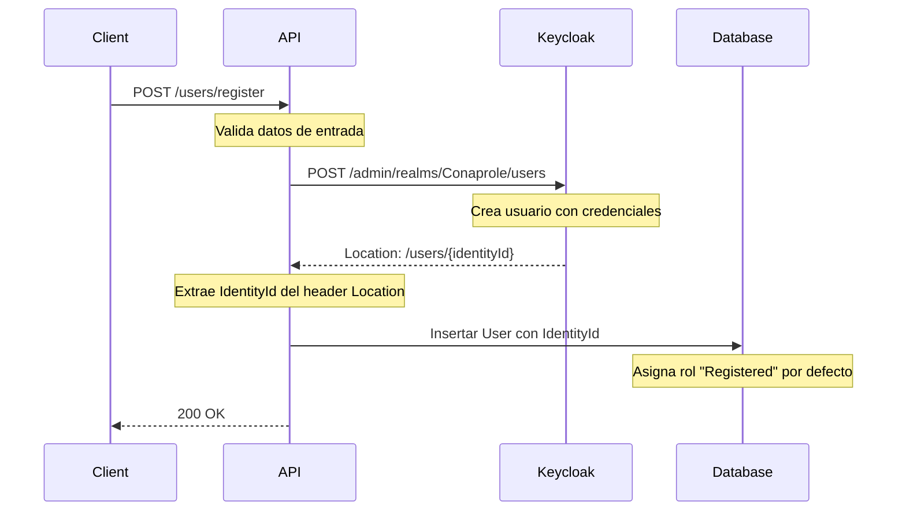
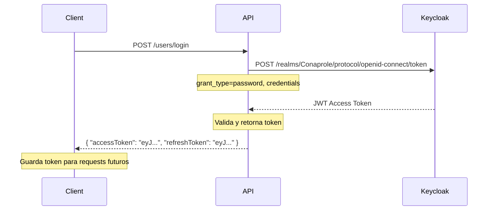
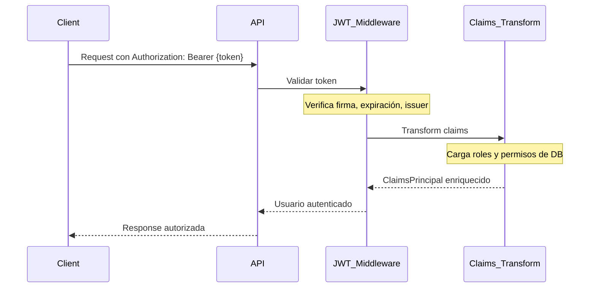
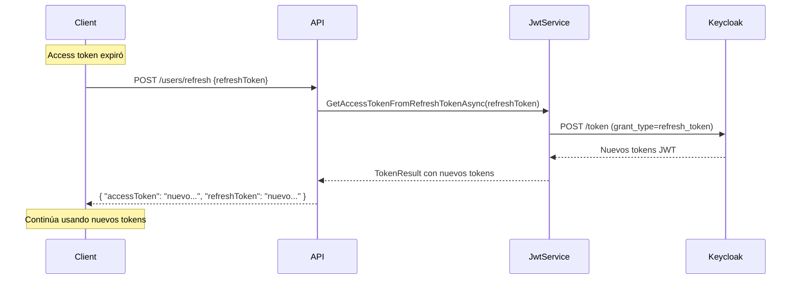

# 🔐 Autenticación

## Mecanismo de Autenticación

La aplicación **Conaprole Orders** utiliza **JWT Bearer Tokens** emitidos por **Keycloak** como mecanismo principal de autenticación.

## Configuración JWT

### AuthenticationOptions
```csharp
// src/Conaprole.Orders.Infrastructure/Authentication/AuthenticationOptions.cs
public sealed class AuthenticationOptions
{
    public string Audience { get; init; } = string.Empty;        // "account"
    public string MetadataUrl { get; set; } = string.Empty;      // Keycloak .well-known
    public bool RequireHttpsMetadata { get; init; }              // false en dev, true en prod
    public string Issuer { get; set; } = string.Empty;          // Keycloak realm URL
}
```

### Configuración en Program.cs
```csharp
// JWT Bearer Authentication
services
    .AddAuthentication(JwtBearerDefaults.AuthenticationScheme)
    .AddJwtBearer();

// Configuración de opciones
services.Configure<AuthenticationOptions>(configuration.GetSection("Authentication"));
services.ConfigureOptions<JwtBearerOptionsSetup>();
```

### JWT Bearer Options Setup
```csharp
// src/Conaprole.Orders.Infrastructure/Authentication/JwtBearerOptionsSetup.cs
public void Configure(JwtBearerOptions options)
{
    options.Audience = _authenticationOptions.Audience;
    options.MetadataAddress = _authenticationOptions.MetadataUrl;
    options.RequireHttpsMetadata = _authenticationOptions.RequireHttpsMetadata;
    options.TokenValidationParameters.ValidIssuer = _authenticationOptions.Issuer;
}
```

## Servicios de Autenticación

### IAuthenticationService - Gestión de Usuarios
```csharp
// src/Conaprole.Orders.Application/Abstractions/Authentication/IAuthenticationService.cs
public interface IAuthenticationService
{
    Task<string> RegisterAsync(User user, string password, CancellationToken cancellationToken = default);
    Task ChangePasswordAsync(string identityId, string newPassword, CancellationToken cancellationToken = default);
}
```

**Implementación:**
```csharp
// src/Conaprole.Orders.Infrastructure/Authentication/AuthenticationService.cs
public async Task<string> RegisterAsync(User user, string password, CancellationToken cancellationToken = default)
{
    var userRepresentationModel = UserRepresentationModel.FromUser(user);
    
    userRepresentationModel.Credentials = new CredentialRepresentationModel[]
    {
        new() { Value = password, Temporary = false, Type = "password" }
    };

    var response = await _httpClient.PostAsJsonAsync("users", userRepresentationModel, cancellationToken);
    
    return ExtractIdentityIdFromLocationHeader(response);
}

public async Task ChangePasswordAsync(string identityId, string newPassword, CancellationToken cancellationToken = default)
{
    var credentialRequest = new CredentialRepresentationModel
    {
        Value = newPassword,
        Temporary = false,
        Type = "password"
    };

    var response = await _httpClient.PutAsJsonAsync($"users/{identityId}/reset-password", credentialRequest, cancellationToken);
    response.EnsureSuccessStatusCode();
}
```

### IJwtService - Gestión de Tokens
```csharp
// src/Conaprole.Orders.Application/Abstractions/Authentication/IJwtService.cs
public interface IJwtService
{
    Task<Result<TokenResult>> GetAccessTokenAsync(string email, string password, CancellationToken cancellationToken = default);
    Task<Result<TokenResult>> GetAccessTokenFromRefreshTokenAsync(string refreshToken, CancellationToken cancellationToken = default);
}
```

#### Modelo TokenResult
```csharp
// src/Conaprole.Orders.Application/Abstractions/Authentication/TokenResult.cs
public sealed record TokenResult(string AccessToken, string RefreshToken);
```

**Implementación Login:**
```csharp
// src/Conaprole.Orders.Infrastructure/Authentication/JwtService.cs
public async Task<Result<TokenResult>> GetAccessTokenAsync(string email, string password, CancellationToken cancellationToken = default)
{
    var authRequestParameters = new KeyValuePair<string, string>[]
    {
        new("client_id", _keycloakOptions.AuthClientId),
        new("client_secret", _keycloakOptions.AuthClientSecret),
        new("scope", "openid email"),
        new("grant_type", "password"),
        new("username", email),
        new("password", password)
    };

    var response = await _httpClient.PostAsync("", new FormUrlEncodedContent(authRequestParameters), cancellationToken);
    
    var authorizationToken = await response.Content.ReadFromJsonAsync<AuthorizationToken>();
    
    return new TokenResult(authorizationToken.AccessToken, authorizationToken.RefreshToken);
}
```

**Implementación Refresh Token:**
```csharp
public async Task<Result<TokenResult>> GetAccessTokenFromRefreshTokenAsync(
    string refreshToken, 
    CancellationToken cancellationToken = default)
{
    var authRequestParameters = new KeyValuePair<string, string>[]
    {
        new("client_id", _keycloakOptions.AuthClientId),
        new("client_secret", _keycloakOptions.AuthClientSecret),
        new("grant_type", "refresh_token"),
        new("refresh_token", refreshToken)
    };

    var response = await _httpClient.PostAsync("", new FormUrlEncodedContent(authRequestParameters), cancellationToken);
    
    var authorizationToken = await response.Content.ReadFromJsonAsync<AuthorizationToken>();
    
    return new TokenResult(authorizationToken.AccessToken, authorizationToken.RefreshToken);
}
```

## User Context

### IUserContext - Acceso al Usuario Actual
```csharp
// src/Conaprole.Orders.Application/Abstractions/Authentication/IUserContext.cs
public interface IUserContext
{
    Guid UserId { get; }
    string IdentityId { get; }
}
```

**Implementación:**
```csharp
// src/Conaprole.Orders.Infrastructure/Authentication/UserContext.cs
public Guid UserId =>
    _httpContextAccessor
        .HttpContext?
        .User
        .GetUserId() ??
    throw new ApplicationException("User context is unavailable");

public string IdentityId =>
    _httpContextAccessor
        .HttpContext?
        .User
        .GetIdentityId() ??
    throw new ApplicationException("User context is unavailable");
```

### Claims Extensions
```csharp
// src/Conaprole.Orders.Infrastructure/Authentication/ClaimsPrincipalExtensions.cs
public static string GetIdentityId(this ClaimsPrincipal? principal)
{
    return principal?.FindFirst(ClaimTypes.NameIdentifier)?.Value ??
           throw new ApplicationException("Identity ID claim is missing");
}

public static Guid GetUserId(this ClaimsPrincipal? principal)
{
    var userId = principal?.FindFirst(JwtRegisteredClaimNames.Sub)?.Value ??
                 throw new ApplicationException("User ID claim is missing");
    
    return Guid.Parse(userId);
}
```

## Flujo de Autenticación

### 1. Registro de Usuario


### 2. Login de Usuario


### 3. Uso del Token


### 4. Refresh Token


## Configuración de Keycloak

### appsettings.Development.json
```json
{
  "Authentication": {
    "Audience": "account",
    "ValidIssuer": "http://conaprole-idp:8080/realms/Conaprole",
    "MetadataUrl": "http://conaprole-idp:8080/realms/Conaprole/.well-known/openid-configuration",
    "RequireHttpsMetadata": false
  },
  "Keycloak": {
    "AdminUrl": "http://conaprole-idp:8080/admin/realms/Conaprole/",
    "TokenUrl": "http://conaprole-idp:8080/realms/Conaprole/protocol/openid-connect/token",
    "AdminClientId": "conaprole-admin-client",
    "AdminClientSecret": "<secreto>",
    "AuthClientId": "conaprole-auth-client",
    "AuthClientSecret": "<secreto>"
  }
}
```

## Admin Authorization Handler

Para operaciones administrativas en Keycloak:

```csharp
// src/Conaprole.Orders.Infrastructure/Authentication/AdminAuthorizationDelegatingHandler.cs
protected override async Task<HttpResponseMessage> SendAsync(HttpRequestMessage request, CancellationToken cancellationToken)
{
    var authorizationToken = await GetAuthorizationToken(cancellationToken);
    
    request.Headers.Authorization = new AuthenticationHeaderValue("Bearer", authorizationToken.AccessToken);
    
    return await base.SendAsync(request, cancellationToken);
}
```

## Endpoints de Autenticación Disponibles

### POST /api/users/login
```csharp
[AllowAnonymous]
[HttpPost("login")]
public async Task<IActionResult> LogIn(LoginUserRequest request, CancellationToken cancellationToken)
{
    var command = new LoginUserCommand(request.Email, request.Password);
    var result = await _sender.Send(command, cancellationToken);
    
    return result.IsSuccess ? Ok(result.Value) : Unauthorized(result.Error);
}
```

**Request:**
```json
{
  "email": "user@example.com",
  "password": "SecurePassword123"
}
```

**Response:**
```json
{
  "accessToken": "eyJhbGciOiJSUzI1NiIsInR5cCI6IkpXVCJ9...",
  "refreshToken": "eyJhbGciOiJSUzI1NiIsInR5cCI6IkpXVCJ9..."
}
```

### POST /api/users/refresh
```csharp
[AllowAnonymous]
[HttpPost("refresh")]
public async Task<IActionResult> RefreshToken(RefreshTokenRequest request, CancellationToken cancellationToken)
{
    var command = new RefreshTokenCommand(request.RefreshToken);
    var result = await _sender.Send(command, cancellationToken);
    
    return result.IsSuccess ? Ok(result.Value) : Unauthorized(result.Error);
}
```

**Request:**
```json
{
  "refreshToken": "eyJhbGciOiJSUzI1NiIsInR5cCI6IkpXVCJ9..."
}
```

**Response:**
```json
{
  "accessToken": "eyJhbGciOiJSUzI1NiIsInR5cCI6IkpXVCJ9...",
  "refreshToken": "eyJhbGciOiJSUzI1NiIsInR5cCI6IkpXVCJ9..."
}
```

## Características de Seguridad

### Validación de Token JWT
- ✅ **Firma digital** verificada usando claves públicas de Keycloak
- ✅ **Expiración** verificada automáticamente
- ✅ **Audience** debe coincidir con la configuración
- ✅ **Issuer** debe ser el realm de Keycloak configurado

### Configuración Flexible
- 🔧 **HTTPS opcional** en desarrollo (`RequireHttpsMetadata: false`)
- 🔧 **HTTPS obligatorio** en producción
- 🔧 **URLs configurables** para diferentes entornos
- 🔧 **Separación de clientes** admin y auth

### Manejo de Errores
- ❌ **Token inválido**: 401 Unauthorized
- ❌ **Token expirado**: 401 Unauthorized  
- ❌ **Usuario no encontrado**: 404 Not Found
- ❌ **Credenciales incorrectas**: 401 Unauthorized

---

*Ver también: [Authorization](./authorization.md) | [Keycloak Integration](./keycloak-integration.md)*
