# 🛂 Autorización

## Sistema de Autorización Basado en Permisos

La aplicación **Conaprole Orders** implementa un sistema de autorización granular basado en **permisos específicos** en lugar de roles estáticos. Esto permite mayor flexibilidad y control de acceso.

## Modelo de Dominio

### Permission (Permisos)
```csharp
// src/Conaprole.Orders.Domain/Users/Permission.cs
public sealed class Permission
{
    public static readonly Permission UsersRead = new(1, "users:read");
    
    public int Id { get; init; }
    public string Name { get; init; }  // Formato: "resource:action"
}
```

### Role (Roles)
```csharp
// src/Conaprole.Orders.Domain/Users/Role.cs
public sealed class Role
{
    public static readonly Role Registered = new(1, "Registered");
    
    public int Id { get; init; }
    public string Name { get; init; }
    public ICollection<User> Users { get; init; } = new List<User>();
    public ICollection<Permission> Permissions { get; init; } = new List<Permission>();
}
```

### User (Usuario)
```csharp
// src/Conaprole.Orders.Domain/Users/User.cs
public sealed class User : Entity
{
    private readonly List<Role> _roles = new();
    
    public IReadOnlyCollection<Role> Roles => _roles.ToList();
    
    public static User Create(FirstName firstName, LastName lastName, Email email)
    {
        var user = new User(Guid.NewGuid(), firstName, lastName, email);
        user._roles.Add(Role.Registered);  // Rol por defecto
        return user;
    }
}
```

### RolePermission (Relación)
```csharp
// src/Conaprole.Orders.Domain/Users/RolePermission.cs
public sealed class RolePermission
{
    public int RoleId { get; set; }
    public int PermissionId { get; set; }
}
```

## Implementación de Autorización

### 1. HasPermissionAttribute
```csharp
// src/Conaprole.Orders.Infrastructure/Authorization/HasPermissionAttribute.cs
public sealed class HasPermissionAttribute : AuthorizeAttribute
{
    public HasPermissionAttribute(string permission) : base(permission)
    {
    }
}
```

**Uso en Controladores:**
```csharp
// src/Conaprole.Orders.Api/Controllers/Users/UsersController.cs
[HttpGet("me")]
[HasPermission(Permissions.UsersRead)]
public async Task<IActionResult> GetLoggedInUser(CancellationToken cancellationToken)
{
    // Solo usuarios con permiso "users:read" pueden acceder
}
```

### 2. Permission Requirement
```csharp
// src/Conaprole.Orders.Infrastructure/Authorization/PermissionRequirement.cs
public sealed class PermissionRequirement : IAuthorizationRequirement
{
    public PermissionRequirement(string permission)
    {
        Permission = permission;
    }

    public string Permission { get; }
}
```

### 3. Permission Authorization Handler
```csharp
// src/Conaprole.Orders.Infrastructure/Authorization/PermissionAuthorizationHandler.cs
protected override async Task HandleRequirementAsync(
    AuthorizationHandlerContext context,
    PermissionRequirement requirement)
{
    if (context.User.Identity is not { IsAuthenticated: true })
    {
        return; // Usuario no autenticado
    }

    using var scope = _serviceProvider.CreateScope();
    var authorizationService = scope.ServiceProvider.GetRequiredService<AuthorizationService>();

    var identityId = context.User.GetIdentityId();
    var permissions = await authorizationService.GetPermissionsForUserAsync(identityId);

    if (permissions.Contains(requirement.Permission))
    {
        context.Succeed(requirement); // ✅ Autorizado
    }
    // Si no tiene el permiso, no se llama context.Succeed() = ❌ No autorizado
}
```

### 4. Dynamic Policy Provider
```csharp
// src/Conaprole.Orders.Infrastructure/Authorization/PermissionAuthorizationPolicyProvider.cs
public override async Task<AuthorizationPolicy?> GetPolicyAsync(string policyName)
{
    var policy = await base.GetPolicyAsync(policyName);
    
    if (policy is not null)
    {
        return policy; // Política existente
    }

    // Crear política dinámicamente
    var permissionPolicy = new AuthorizationPolicyBuilder()
        .AddRequirements(new PermissionRequirement(policyName))
        .Build();

    _authorizationOptions.AddPolicy(policyName, permissionPolicy);
    
    return permissionPolicy;
}
```

## Authorization Service

### Obtener Roles de Usuario
```csharp
// src/Conaprole.Orders.Infrastructure/Authorization/AuthorizationService.cs
public async Task<UserRolesResponse> GetRolesForUserAsync(string identityId)
{
    var roles = await _dbContext.Set<User>()
        .Where(u => u.IdentityId == identityId)
        .Select(u => new UserRolesResponse
        {
            UserId = u.Id,
            Roles = u.Roles.ToList()
        })
        .FirstAsync();

    return roles;
}
```

### Obtener Permisos de Usuario
```csharp
public async Task<HashSet<string>> GetPermissionsForUserAsync(string identityId)
{
    var permissions = await _dbContext.Set<User>()
        .Where(u => u.IdentityId == identityId)
        .SelectMany(u => u.Roles.Select(r => r.Permissions))
        .FirstAsync();

    return permissions.Select(p => p.Name).ToHashSet();
}
```

## Custom Claims Transformation

### Enriquecimiento de Claims
```csharp
// src/Conaprole.Orders.Infrastructure/Authorization/CustomClaimsTransformation.cs
public async Task<ClaimsPrincipal> TransformAsync(ClaimsPrincipal principal)
{
    if (principal.Identity is not { IsAuthenticated: true } ||
        principal.HasClaim(claim => claim.Type == ClaimTypes.Role))
    {
        return principal; // Ya procesado o no autenticado
    }

    using var scope = _serviceProvider.CreateScope();
    var authorizationService = scope.ServiceProvider.GetRequiredService<AuthorizationService>();

    var identityId = principal.GetIdentityId();
    var userRoles = await authorizationService.GetRolesForUserAsync(identityId);

    var claimsIdentity = new ClaimsIdentity();
    
    // Agregar claim de UserId interno
    claimsIdentity.AddClaim(new Claim(JwtRegisteredClaimNames.Sub, userRoles.UserId.ToString()));

    // Agregar claims de roles
    foreach (var role in userRoles.Roles)
    {
        claimsIdentity.AddClaim(new Claim(ClaimTypes.Role, role.Name));
    }

    principal.AddIdentity(claimsIdentity);
    return principal;
}
```

## Definición de Permisos y Roles

### Constantes de Permisos
```csharp
// src/Conaprole.Orders.Api/Controllers/Users/Security/Permissions.cs
internal static class Permissions
{
    public const string UsersRead = "users:read";
    // Futuros permisos:
    // public const string UsersWrite = "users:write";
    // public const string OrdersRead = "orders:read";
    // public const string OrdersWrite = "orders:write";
    // public const string AdminAccess = "admin:access";
}
```

### Constantes de Roles
```csharp
// src/Conaprole.Orders.Api/Controllers/Users/Security/Roles.cs
public static class Roles
{
    public const string Registered = "Registered";
    // Futuros roles:
    // public const string Administrator = "Administrator";
    // public const string Distributor = "Distributor";
    // public const string Manager = "Manager";
}
```

## Configuración en DependencyInjection

```csharp
// src/Conaprole.Orders.Infrastructure/DependencyInjection.cs
private static void AddAuthorization(IServiceCollection services)
{
    services.AddScoped<AuthorizationService>();
    
    // Claims transformation para enriquecer con roles de DB
    services.AddTransient<IClaimsTransformation, CustomClaimsTransformation>();
    
    // Handler para verificación de permisos
    services.AddTransient<IAuthorizationHandler, PermissionAuthorizationHandler>();
    
    // Provider para políticas dinámicas
    services.AddTransient<IAuthorizationPolicyProvider, PermissionAuthorizationPolicyProvider>();
}
```

## Flujo de Autorización

### Verificación de Permisos

```mermaid
sequenceDiagram
    participant Controller
    participant AuthMiddleware
    participant PolicyProvider
    participant AuthHandler
    participant AuthService
    participant Database

    Controller->>AuthMiddleware: [HasPermission("users:read")]
    AuthMiddleware->>PolicyProvider: GetPolicyAsync("users:read")
    
    alt Política no existe
        PolicyProvider->>PolicyProvider: Crear PermissionRequirement("users:read")
        PolicyProvider-->>AuthMiddleware: Nueva política
    else Política existe
        PolicyProvider-->>AuthMiddleware: Política existente
    end
    
    AuthMiddleware->>AuthHandler: HandleRequirementAsync(requirement)
    AuthHandler->>AuthService: GetPermissionsForUserAsync(identityId)
    AuthService->>Database: Query permisos por IdentityId
    Database-->>AuthService: Lista de permisos
    AuthService-->>AuthHandler: HashSet<string> permisos
    
    AuthHandler->>AuthHandler: ¿permissions.Contains("users:read")?
    
    alt Permiso encontrado
        AuthHandler->>AuthHandler: context.Succeed(requirement)
        AuthHandler-->>AuthMiddleware: ✅ Autorizado
        AuthMiddleware-->>Controller: Continuar ejecución
    else Permiso no encontrado
        AuthHandler-->>AuthMiddleware: ❌ No autorizado
        AuthMiddleware-->>Controller: 403 Forbidden
    end
```


### Transformación de Claims


## Ventajas del Sistema

### Granularidad
- ✅ **Permisos específicos** por funcionalidad
- ✅ **Control fino** de acceso a recursos
- ✅ **Separación clara** entre autenticación y autorización

### Flexibilidad
- ✅ **Roles dinámicos** almacenados en base de datos
- ✅ **Permisos configurables** sin cambios de código
- ✅ **Políticas generadas** automáticamente

### Escalabilidad
- ✅ **Reutilizable** entre múltiples servicios
- ✅ **Extensible** para nuevos recursos
- ✅ **Mantenible** con separación de responsabilidades

### Auditoría
- ✅ **Trazabilidad** de decisiones de autorización
- ✅ **Logging** de accesos y permisos
- ✅ **Configuración** centralizada en base de datos

## Ejemplos de Uso

### Proteger un Endpoint
```csharp
[HttpGet("sensitive-data")]
[HasPermission("data:read")]
public async Task<IActionResult> GetSensitiveData()
{
    // Solo usuarios con permiso "data:read" pueden acceder
    return Ok(await _service.GetDataAsync());
}
```

### Verificación Programática
```csharp
public async Task<IActionResult> ConditionalAction()
{
    var permissions = await _authorizationService.GetPermissionsForUserAsync(_userContext.IdentityId);
    
    if (permissions.Contains("admin:access"))
    {
        // Lógica para administradores
    }
    else if (permissions.Contains("user:basic"))
    {
        // Lógica para usuarios básicos
    }
    
    return Ok();
}
```

---

*Ver también: [Authentication](./authentication.md) | [Implementation Guide](./implementation-guide.md)*