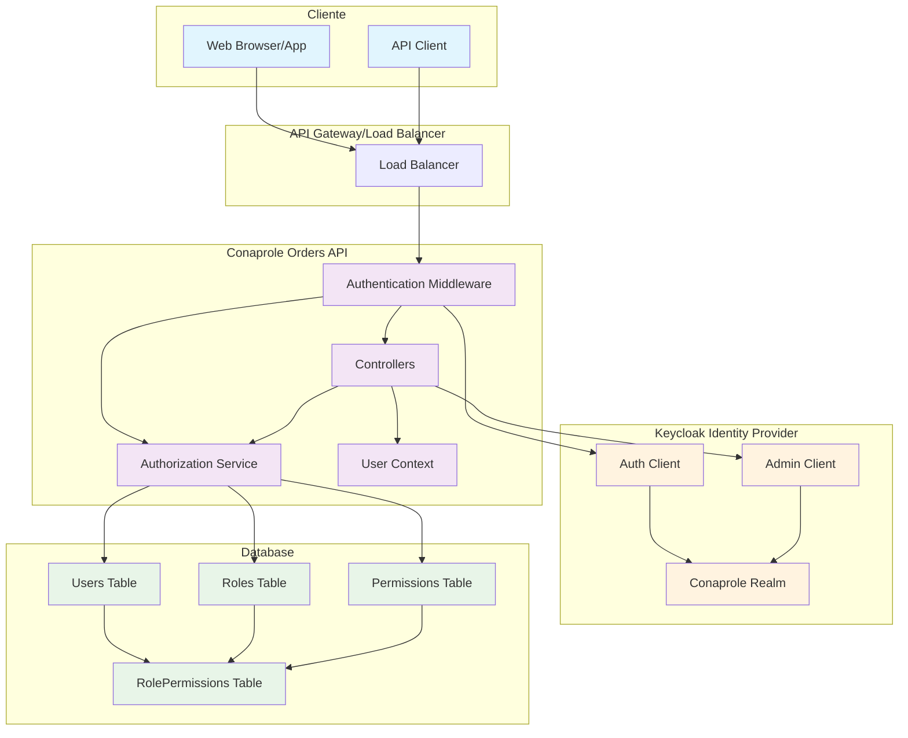
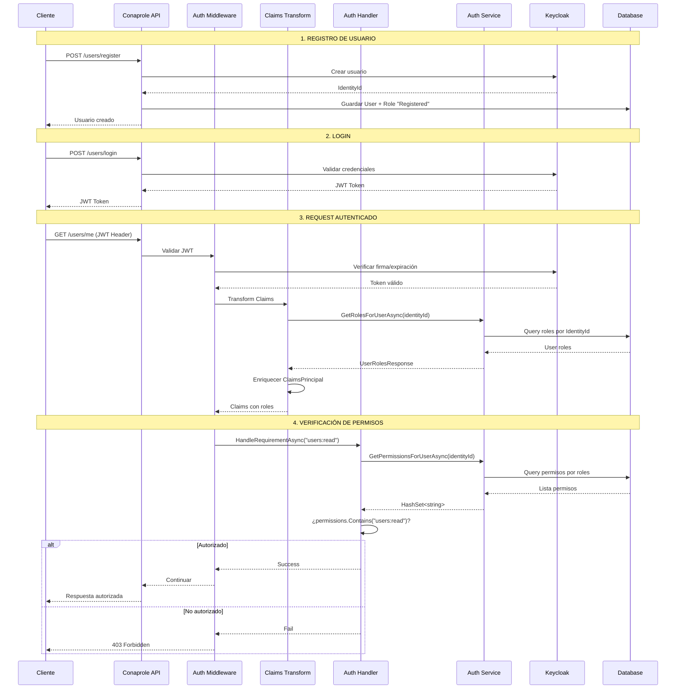
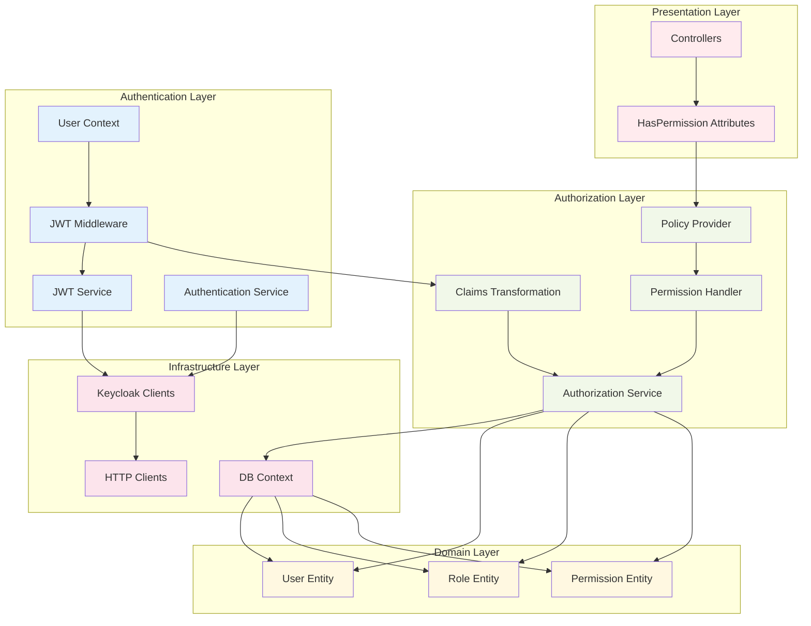
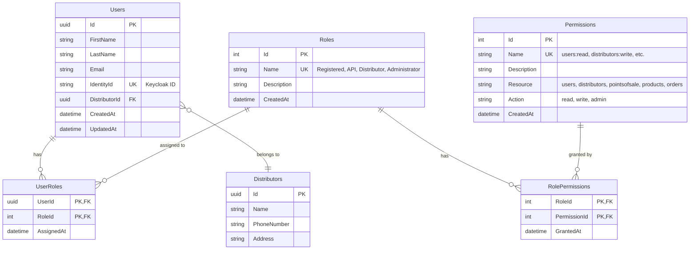
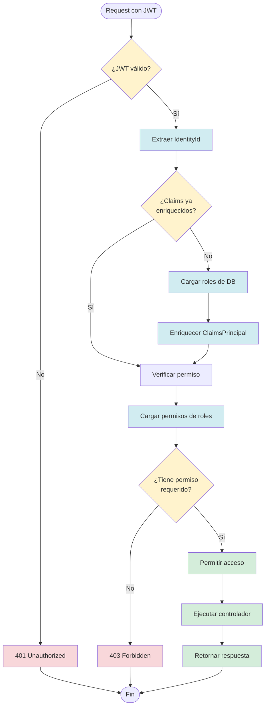
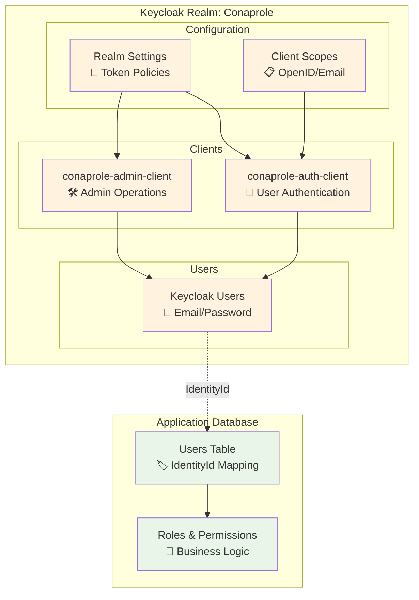
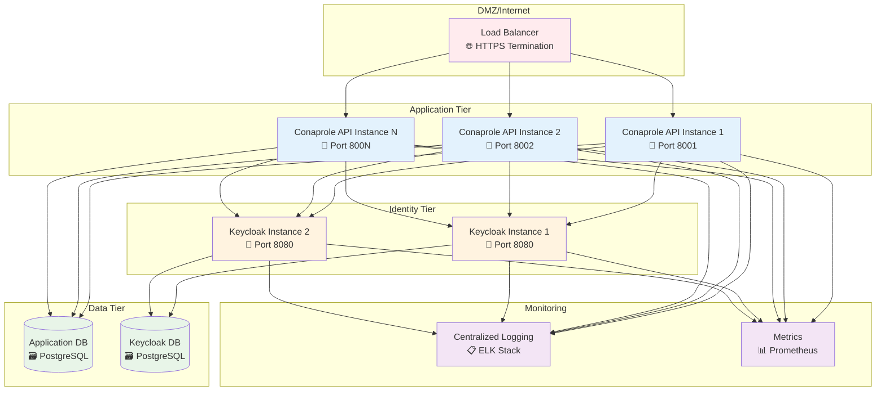
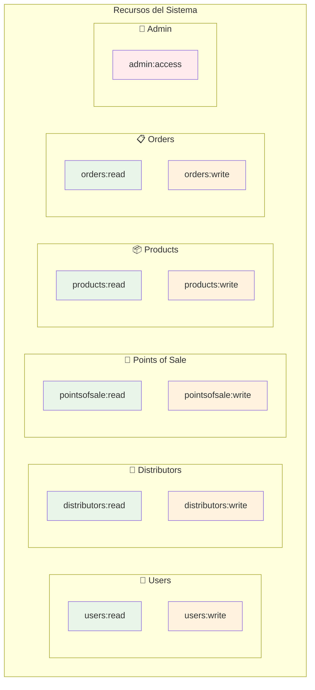
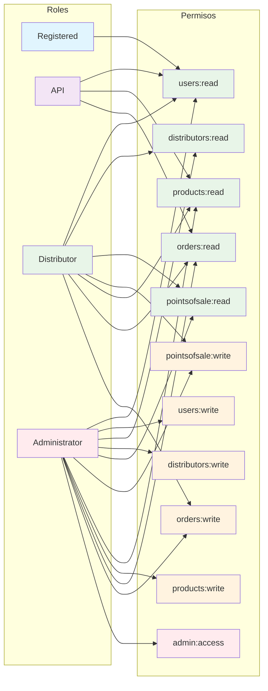

# 🖼️ Diagramas de Seguridad

Esta sección contiene diagramas técnicos que ilustran la arquitectura y flujos de seguridad del sistema **Conaprole Orders**.

## Diagrama de Arquitectura General

## Flujo Completo de Autenticación y Autorización

## Diagrama de Componentes de Seguridad

## Modelo de Datos de Seguridad

## Flujo de Verificación de Permisos

## Configuración de Keycloak

## Diagrama de Despliegue

## Permisos y Roles Implementados

### Diagrama de Permisos por Recurso

### Matriz de Roles y Permisos

---

## Leyenda de Diagramas

### Símbolos Utilizados
- 🔐 Autenticación/Seguridad
- 🛠️ Administración/Gestión
- 📧 Comunicación/Email
- 🔧 Configuración
- 📋 Información/Datos
- 🔑 Permisos/Acceso
- 🏷️ Identificación/Mapeo
- 🌐 Red/Internet
- 🚀 Aplicación/Servicio
- 🗃️ Base de datos
- 📊 Métricas/Monitoreo

### Códigos de Color
- **Azul claro**: Componentes de autenticación
- **Verde claro**: Base de datos y persistencia
- **Naranja claro**: Keycloak/Identity Provider
- **Rosa claro**: Componentes de presentación
- **Gris claro**: Infraestructura y red

---

*Ver también: [Architecture](./architecture.md) | [Authentication](./authentication.md) | [Authorization](./authorization.md)*
