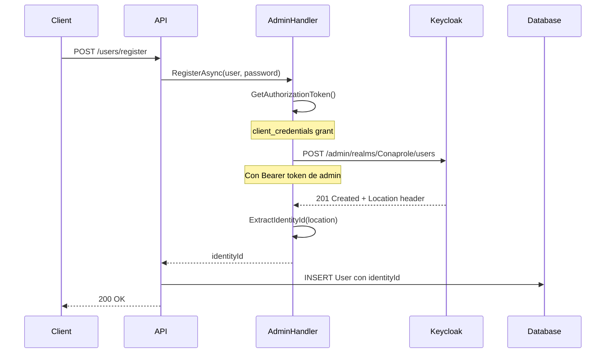
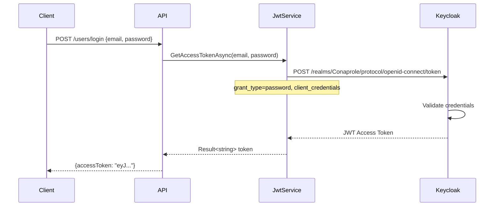
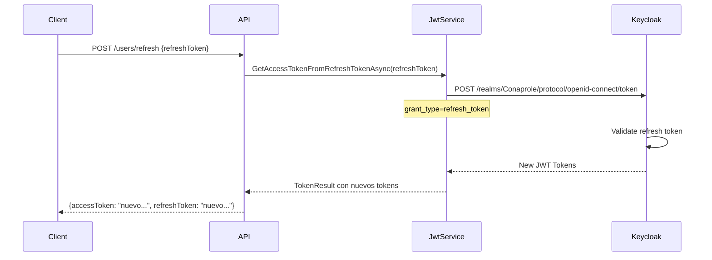

# 🔗 Integración con Keycloak

## Visión General

**Keycloak** actúa como el **Identity Provider (IdP)** centralizado para la aplicación Conaprole Orders, proporcionando servicios de autenticación, gestión de usuarios y emisión de tokens JWT.

## Configuración de Keycloak

### Realm: Conaprole

El sistema utiliza un realm llamado **"Conaprole"** que contiene toda la configuración de identidades para el ecosistema de aplicaciones.

### Clientes Configurados

#### 1. Cliente de Autenticación (`conaprole-auth-client`)

```json
{
  "clientId": "conaprole-auth-client",
  "clientSecret": "<secret>",
  "purpose": "Login de usuarios finales",
  "grantTypes": ["password", "refresh_token"],
  "scopes": ["openid", "email"]
}
```

**Uso:**

- Login de usuarios a través de credenciales
- Obtención de tokens JWT para usuarios
- Refresh de tokens expirados

#### 2. Cliente Administrativo (`conaprole-admin-client`)

```json
{
  "clientId": "conaprole-admin-client", 
  "clientSecret": "<secret>",
  "purpose": "Gestión administrativa de usuarios",
  "grantTypes": ["client_credentials"],
  "permissions": ["manage-users", "view-users"]
}
```

**Uso:**

- Registro de nuevos usuarios
- Gestión de credenciales
- Operaciones administrativas

## KeycloakOptions Configuration

```csharp
// src/Conaprole.Orders.Infrastructure/Authentication/KeycloakOptions.cs
public sealed class KeycloakOptions
{
    public string AdminUrl { get; set; } = string.Empty;        // Admin API URL
    public string TokenUrl { get; set; } = string.Empty;        // Token endpoint
    public string AdminClientId { get; init; } = string.Empty;  // Admin client
    public string AdminClientSecret { get; init; } = string.Empty;
    public string AuthClientId { get; init; } = string.Empty;   // Auth client
    public string AuthClientSecret { get; init; } = string.Empty;
}
```

### Configuración por Ambiente

#### Development (appsettings.Development.JSON)

```json
{
  "Keycloak": {
    "BaseUrl": "http://conaprole-idp:8080",
    "AdminUrl": "http://conaprole-idp:8080/admin/realms/Conaprole/",
    "TokenUrl": "http://conaprole-idp:8080/realms/Conaprole/protocol/openid-connect/token",
    "AdminClientId": "conaprole-admin-client",
    "AdminClientSecret": "<secret>",
    "AuthClientId": "conaprole-auth-client",
    "AuthClientSecret": "<secret>"
  }
}
```

#### Production

```json
{
  "Keycloak": {
    "BaseUrl": "https://keycloak.conaprole.com",
    "AdminUrl": "https://keycloak.conaprole.com/admin/realms/Conaprole/",
    "TokenUrl": "https://keycloak.conaprole.com/realms/Conaprole/protocol/openid-connect/token",
    "AdminClientId": "conaprole-admin-client",
    "AdminClientSecret": "${KEYCLOAK_ADMIN_SECRET}",
    "AuthClientId": "conaprole-auth-client", 
    "AuthClientSecret": "${KEYCLOAK_AUTH_SECRET}"
  }
}
```

## HttpClient Configuration

### Admin Client Setup

```csharp
// src/Conaprole.Orders.Infrastructure/DependencyInjection.cs
services.AddHttpClient<IAuthenticationService, AuthenticationService>((serviceProvider, httpClient) =>
{
    var keycloakOptions = serviceProvider.GetRequiredService<IOptions<KeycloakOptions>>().Value;
    httpClient.BaseAddress = new Uri(keycloakOptions.AdminUrl);
})
.AddHttpMessageHandler<AdminAuthorizationDelegatingHandler>();
```

### Token Client Setup

```csharp
services.AddHttpClient<IJwtService, JwtService>((serviceProvider, httpClient) =>
{
    var keycloakOptions = serviceProvider.GetRequiredService<IOptions<KeycloakOptions>>().Value;
    httpClient.BaseAddress = new Uri(keycloakOptions.TokenUrl);
});
```

## Admin Authorization Handler

### Autenticación Automática para Operaciones Admin

```csharp
// src/Conaprole.Orders.Infrastructure/Authentication/AdminAuthorizationDelegatingHandler.cs
public class AdminAuthorizationDelegatingHandler : DelegatingHandler
{
    protected override async Task<HttpResponseMessage> SendAsync(
        HttpRequestMessage request, 
        CancellationToken cancellationToken)
    {
        var authorizationToken = await GetAuthorizationToken(cancellationToken);
        
        request.Headers.Authorization = new AuthenticationHeaderValue(
            "Bearer", 
            authorizationToken.AccessToken);
        
        return await base.SendAsync(request, cancellationToken);
    }

    private async Task<AuthorizationToken> GetAuthorizationToken(CancellationToken cancellationToken)
    {
        var authRequestParameters = new KeyValuePair<string, string>[]
        {
            new("client_id", _keycloakOptions.AdminClientId),
            new("client_secret", _keycloakOptions.AdminClientSecret),
            new("grant_type", "client_credentials")
        };

        var response = await _httpClient.PostAsync(
            _keycloakOptions.TokenUrl, 
            new FormUrlEncodedContent(authRequestParameters), 
            cancellationToken);

        return await response.Content.ReadFromJsonAsync<AuthorizationToken>();
    }
}
```

## Operaciones con Keycloak

### 1. Registro de Usuario

#### API Request Flow



#### Implementación

```csharp
// src/Conaprole.Orders.Infrastructure/Authentication/AuthenticationService.cs
public async Task<string> RegisterAsync(User user, string password, CancellationToken cancellationToken = default)
{
    var userRepresentationModel = UserRepresentationModel.FromUser(user);
    
    userRepresentationModel.Credentials = new CredentialRepresentationModel[]
    {
        new()
        {
            Value = password,
            Temporary = false,
            Type = PasswordCredentialType
        }
    };

    var response = await _httpClient.PostAsJsonAsync("users", userRepresentationModel, cancellationToken);
    
    return ExtractIdentityIdFromLocationHeader(response);
}

private static string ExtractIdentityIdFromLocationHeader(HttpResponseMessage httpResponseMessage)
{
    const string usersSegmentName = "users/";
    
    var locationHeader = httpResponseMessage.Headers.Location?.PathAndQuery;
    var userSegmentValueIndex = locationHeader.IndexOf(usersSegmentName, StringComparison.InvariantCultureIgnoreCase);
    var userIdentityId = locationHeader.Substring(userSegmentValueIndex + usersSegmentName.Length);
    
    return userIdentityId;
}
```

### 2. Login de Usuario

#### Token Request Flow



#### Implementación

```csharp
// src/Conaprole.Orders.Infrastructure/Authentication/JwtService.cs
public async Task<Result<TokenResult>> GetAccessTokenAsync(string email, string password, CancellationToken cancellationToken = default)
{
    var authRequestParameters = new KeyValuePair<string, string>[]
    {
        new("client_id", _keycloakOptions.AuthClientId),
        new("client_secret", _keycloakOptions.AuthClientSecret),
        new("scope", "openid email"),
        new("grant_type", "password"),
        new("username", email),
        new("password", password)
    };

    var authorizationRequestContent = new FormUrlEncodedContent(authRequestParameters);
    var response = await _httpClient.PostAsync("", authorizationRequestContent, cancellationToken);
    
    response.EnsureSuccessStatusCode();
    
    var authorizationToken = await response.Content.ReadFromJsonAsync<AuthorizationToken>();
    
    return new TokenResult(authorizationToken?.AccessToken, authorizationToken?.RefreshToken);
}
```

### 3. Refresh Token

#### Refresh Token Flow



#### Implementación

```csharp
public async Task<Result<TokenResult>> GetAccessTokenFromRefreshTokenAsync(
    string refreshToken, 
    CancellationToken cancellationToken = default)
{
    var authRequestParameters = new KeyValuePair<string, string>[]
    {
        new("client_id", _keycloakOptions.AuthClientId),
        new("client_secret", _keycloakOptions.AuthClientSecret),
        new("grant_type", "refresh_token"),
        new("refresh_token", refreshToken)
    };

    var authorizationRequestContent = new FormUrlEncodedContent(authRequestParameters);
    var response = await _httpClient.PostAsync("", authorizationRequestContent, cancellationToken);
    
    response.EnsureSuccessStatusCode();
    
    var authorizationToken = await response.Content.ReadFromJsonAsync<AuthorizationToken>();
    
    return new TokenResult(authorizationToken?.AccessToken, authorizationToken?.RefreshToken);
}
```

## Modelos de Keycloak

### User Representation

```csharp
// src/Conaprole.Orders.Infrastructure/Authentication/Models/UserRepresentationModel.cs
public sealed class UserRepresentationModel
{
    public string? Id { get; set; }
    public long? CreatedTimestamp { get; set; }
    public string Username { get; set; } = string.Empty;
    public bool Enabled { get; set; } = true;
    public bool Totp { get; set; }
    public bool EmailVerified { get; set; }
    public string? FirstName { get; set; }
    public string? LastName { get; set; }
    public string? Email { get; set; }
    public Dictionary<string, IEnumerable<string>>? Attributes { get; set; }
    public CredentialRepresentationModel[]? Credentials { get; set; }

    public static UserRepresentationModel FromUser(User user)
    {
        return new UserRepresentationModel
        {
            Username = user.Email.Value,
            Email = user.Email.Value,
            FirstName = user.FirstName.Value,
            LastName = user.LastName.Value,
            Enabled = true,
            EmailVerified = true
        };
    }
}
```

### Credential Representation

```csharp
// src/Conaprole.Orders.Infrastructure/Authentication/Models/CredentialRepresentationModel.cs
public sealed class CredentialRepresentationModel
{
    public string Algorithm { get; set; } = string.Empty;
    public Dictionary<string, object> Config { get; set; } = new();
    public int? Counter { get; set; }
    public long? CreatedDate { get; set; }
    public string Device { get; set; } = string.Empty;
    public int? Digits { get; set; }
    public int? HashIterations { get; set; }
    public string HashedSaltedValue { get; set; } = string.Empty;
    public int? Period { get; set; }
    public string Salt { get; set; } = string.Empty;
    public bool Temporary { get; set; }
    public string Type { get; set; } = string.Empty;
    public string Value { get; set; } = string.Empty;
}
```

### Authorization Token

```csharp
// src/Conaprole.Orders.Infrastructure/Authentication/Models/AuthorizationToken.cs
public sealed class AuthorizationToken
{
    [JsonPropertyName("access_token")]
    public string AccessToken { get; init; } = string.Empty;

    [JsonPropertyName("expires_in")]
    public int ExpiresIn { get; init; }

    [JsonPropertyName("refresh_expires_in")]
    public int RefreshExpiresIn { get; init; }

    [JsonPropertyName("refresh_token")]
    public string RefreshToken { get; init; } = string.Empty;

    [JsonPropertyName("token_type")]
    public string TokenType { get; init; } = string.Empty;

    [JsonPropertyName("scope")]
    public string Scope { get; init; } = string.Empty;
}
```

### TokenResult Model

```csharp
// src/Conaprole.Orders.Application/Abstractions/Authentication/TokenResult.cs
public sealed record TokenResult(string AccessToken, string RefreshToken);
```

## Beneficios de la Integración

### Separación de Responsabilidades

- 🔐 **Keycloak**: Gestión de identidades, credenciales, autenticación
- 🛠️ **API**: Lógica de negocio, autorización específica del dominio
- 📊 **Database**: Datos del dominio, relaciones usuario-roles-permisos

### Escalabilidad

- ✅ **Múltiples aplicaciones** pueden usar el mismo realm
- ✅ **Gestión centralizada** de usuarios en todo el ecosistema
- ✅ **Single Sign-On (SSO)** entre aplicaciones
- ✅ **Federación** con otros proveedores de identidad

### Seguridad

- 🔒 **Gestión profesional** de credenciales
- 🔒 **Políticas de contraseñas** configurables
- 🔒 **2FA/MFA** support nativo
- 🔒 **Auditoría** completa de eventos de autenticación

### Mantenibilidad

- 🔧 **Configuración externa** de identidades
- 🔧 **Sin gestión directa** de contraseñas en la aplicación
- 🔧 **Actualizaciones independientes** del IdP
- 🔧 **Entornos separados** (dev, staging, prod)

## Configuración Docker

### Docker-compose.yml (Development)

```yaml
version: '3.8'
services:
  keycloak:
    image: quay.io/keycloak/keycloak:22.0
    container_name: conaprole-idp
    environment:
      - KEYCLOAK_ADMIN=admin
      - KEYCLOAK_ADMIN_PASSWORD=admin
      - KC_DB=postgres
      - KC_DB_URL=jdbc:postgresql://postgres:5432/keycloak
      - KC_DB_USERNAME=postgres
      - KC_DB_PASSWORD=postgres
    ports:
      - "8080:8080"
    command: start-dev
    depends_on:
      - postgres
```

## Troubleshooting

### Errores Comunes

#### 1. Token Inválido (401 Unauthorized)

```bash
# Verificar configuración de issuer
curl http://conaprole-idp:8080/realms/Conaprole/.well-known/openid-configuration

# Verificar que el issuer en appsettings coincida
"ValidIssuer": "http://conaprole-idp:8080/realms/Conaprole"
```

#### 2. Cliente No Autorizado (403 Forbidden)

```bash
# Verificar client_id y client_secret
# Verificar que el cliente tenga los roles/permisos correctos en Keycloak
```

#### 3. Usuario No Encontrado en DB

```sql
-- Verificar que el IdentityId coincida
SELECT * FROM Users WHERE IdentityId = '{keycloak-user-id}';

-- Verificar que el usuario tenga roles asignados
SELECT u.Email, r.Name 
FROM Users u 
JOIN UserRole ur ON u.Id = ur.UserId
JOIN Roles r ON ur.RoleId = r.Id;
```

### Logs Útiles

```csharp
// Configurar logging para debug
"Logging": {
  "LogLevel": {
    "Microsoft.AspNetCore.Authentication": "Debug",
    "Microsoft.AspNetCore.Authorization": "Debug"
  }
}
```

---

*Ver también: [Authentication](./authentication.md) | [Authorization](./authorization.md) | [Implementation Guide](./implementation-guide.md)*
