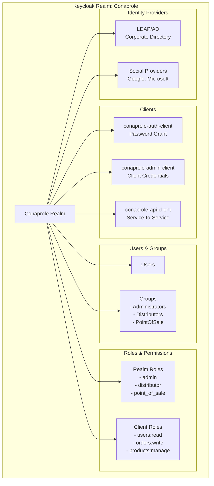
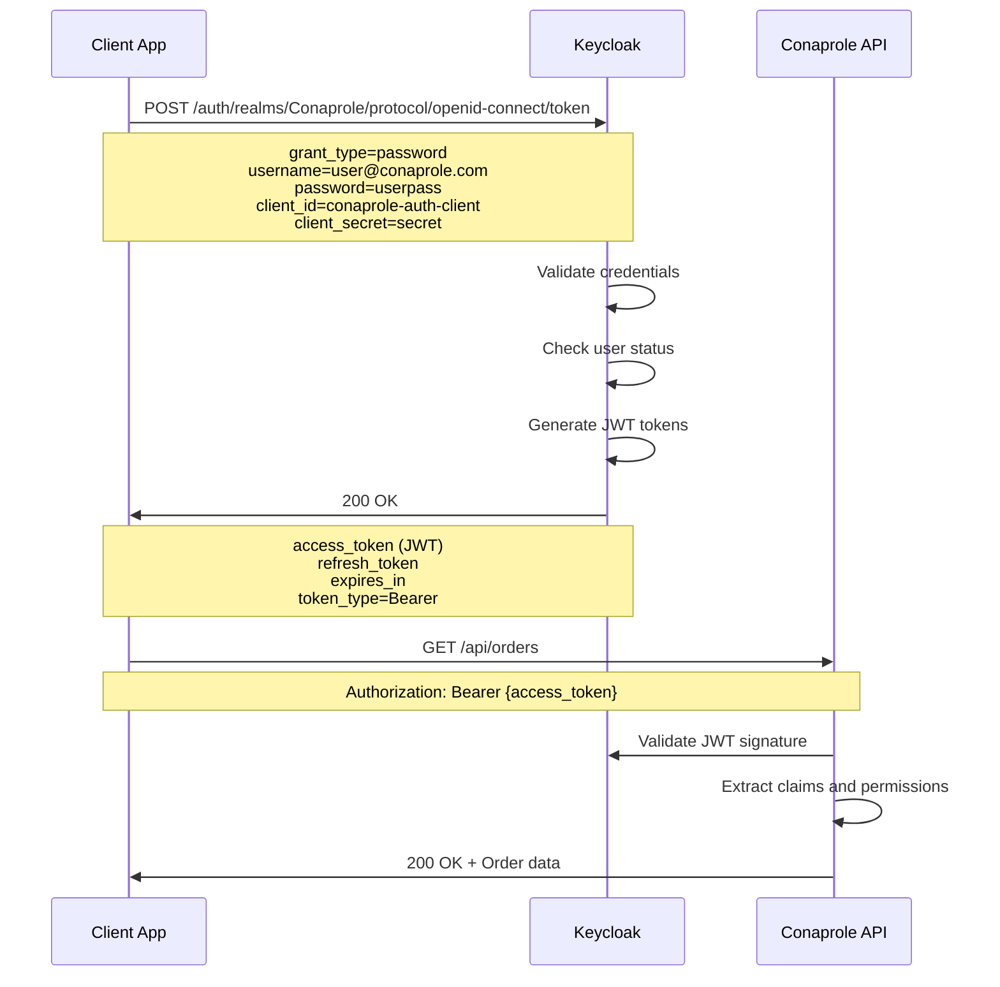
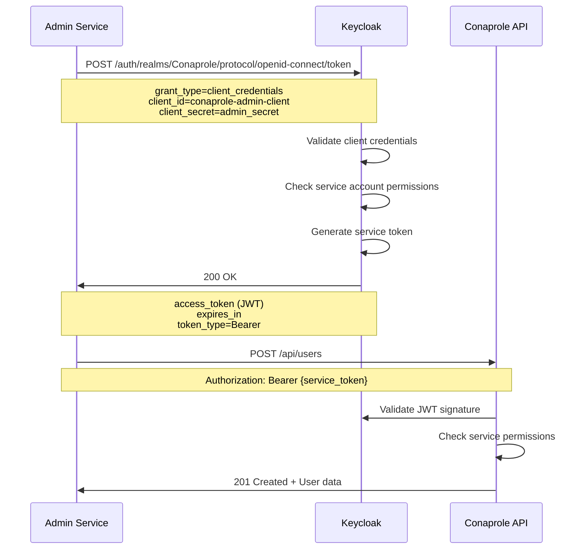
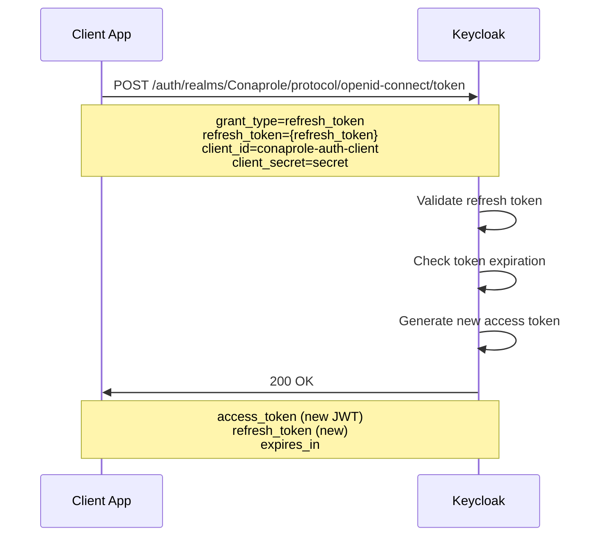

# 🔐 Configuración Keycloak Realm - Conaprole

## Purpose

Este documento describe la **configuración completa del realm Keycloak** para el sistema Conaprole Orders, incluyendo estructura de usuarios, roles, permisos, clientes OAuth2/OIDC y flujos de autenticación implementados.

## Audience

- **Security Engineers** - Configuración y mantenimiento de Keycloak
- **System Administrators** - Gestión de usuarios y permisos
- **Developers** - Integración con APIs de autenticación
- **Personal Académico** - Documentación de arquitectura de seguridad

## Prerequisites

- Conocimiento básico de OAuth2 y OpenID Connect
- Familiaridad con Keycloak administration
- Comprensión de JWT tokens y claims
- Conocimiento de sistemas de autorización basados en roles

## 🏛️ Arquitectura del Realm

### Estructura General



## 🚪 Configuración del Realm

### Realm Settings

```json
{
  "realm": "Conaprole",
  "displayName": "Conaprole Orders System",
  "displayNameHtml": "<strong>Conaprole</strong> Orders System",
  "enabled": true,
  "sslRequired": "external",
  "registrationAllowed": false,
  "registrationEmailAsUsername": true,
  "rememberMe": true,
  "verifyEmail": true,
  "loginWithEmailAllowed": true,
  "duplicateEmailsAllowed": false,
  "resetPasswordAllowed": true,
  "editUsernameAllowed": false,
  "bruteForceProtected": true,
  "permanentLockout": false,
  "maxFailureWaitSeconds": 900,
  "minimumQuickLoginWaitSeconds": 60,
  "waitIncrementSeconds": 60,
  "quickLoginCheckMilliSeconds": 1000,
  "maxDeltaTimeSeconds": 43200,
  "failureFactor": 30,
  "defaultSignatureAlgorithm": "RS256",
  "revokeRefreshToken": false,
  "refreshTokenMaxReuse": 0,
  "accessTokenLifespan": 300,
  "accessTokenLifespanForImplicitFlow": 900,
  "ssoSessionIdleTimeout": 1800,
  "ssoSessionMaxLifespan": 36000,
  "ssoSessionIdleTimeoutRememberMe": 0,
  "ssoSessionMaxLifespanRememberMe": 0,
  "offlineSessionIdleTimeout": 2592000,
  "offlineSessionMaxLifespanEnabled": false,
  "offlineSessionMaxLifespan": 5184000,
  "clientSessionIdleTimeout": 0,
  "clientSessionMaxLifespan": 0,
  "accessCodeLifespan": 60,
  "accessCodeLifespanUserAction": 300,
  "accessCodeLifespanLogin": 1800,
  "actionTokenGeneratedByAdminLifespan": 43200,
  "actionTokenGeneratedByUserLifespan": 300
}
```

### Email Configuration

```json
{
  "smtpServer": {
    "port": "587",
    "host": "smtp.conaprole.com",
    "auth": "true",
    "ssl": "false",
    "starttls": "true",
    "from": "noreply@conaprole.com",
    "fromDisplayName": "Conaprole Orders System",
    "replyTo": "support@conaprole.com",
    "replyToDisplayName": "Conaprole Support",
    "envelopeFrom": "noreply@conaprole.com"
  }
}
```

## 👥 Gestión de Usuarios

### User Attributes

| Atributo | Tipo | Requerido | Descripción |
|----------|------|-----------|-------------|
| `employee_id` | String | Sí | ID del empleado en sistema interno |
| `department` | String | No | Departamento de trabajo |
| `job_title` | String | No | Cargo o posición |
| `phone_number` | String | No | Número de teléfono |
| `distributor_id` | String | Condicional | ID del distribuidor (para usuarios distribuidor) |
| `point_of_sale_id` | String | Condicional | ID del punto de venta |
| `territory` | String | No | Territorio asignado |
| `language` | String | No | Idioma preferido (es, en) |

### User Groups

#### 1. Administrators Group

```json
{
  "name": "Administrators",
  "path": "/Administrators",
  "attributes": {
    "description": ["System administrators with full access"],
    "access_level": ["full"]
  },
  "realmRoles": ["admin"],
  "clientRoles": {
    "conaprole-api": [
      "users:read", "users:write", "users:delete",
      "orders:read", "orders:write", "orders:delete",
      "products:read", "products:write", "products:delete",
      "distributors:read", "distributors:write", "distributors:delete",
      "reports:read", "reports:write"
    ]
  }
}
```

#### 2. Distributors Group

```json
{
  "name": "Distributors",
  "path": "/Distributors",
  "attributes": {
    "description": ["Distributor users with order management access"],
    "access_level": ["distributor"]
  },
  "realmRoles": ["distributor"],
  "clientRoles": {
    "conaprole-api": [
      "orders:read", "orders:write",
      "products:read",
      "distributors:read"
    ]
  }
}
```

#### 3. PointOfSale Group

```json
{
  "name": "PointOfSale",
  "path": "/PointOfSale", 
  "attributes": {
    "description": ["Point of sale users with limited access"],
    "access_level": ["pos"]
  },
  "realmRoles": ["point_of_sale"],
  "clientRoles": {
    "conaprole-api": [
      "orders:read",
      "products:read"
    ]
  }
}
```

### Sample Users

#### Administrator User

```json
{
  "username": "admin@conaprole.com",
  "email": "admin@conaprole.com",
  "firstName": "System",
  "lastName": "Administrator",
  "enabled": true,
  "emailVerified": true,
  "attributes": {
    "employee_id": ["EMP001"],
    "department": ["IT"],
    "job_title": ["System Administrator"],
    "phone_number": ["+598 2 1234567"]
  },
  "groups": ["/Administrators"],
  "realmRoles": ["admin"],
  "credentials": [
    {
      "type": "password",
      "value": "SecurePassword123!",
      "temporary": false
    }
  ]
}
```

#### Distributor User

```json
{
  "username": "distributor1@conaprole.com",
  "email": "distributor1@conaprole.com",
  "firstName": "Carlos",
  "lastName": "Distribuidor",
  "enabled": true,
  "emailVerified": true,
  "attributes": {
    "employee_id": ["DIST001"],
    "department": ["Sales"],
    "job_title": ["Senior Distributor"],
    "distributor_id": ["d123e4567-e89b-12d3-a456-426614174000"],
    "territory": ["Montevideo Norte"],
    "phone_number": ["+598 2 7654321"]
  },
  "groups": ["/Distributors"],
  "realmRoles": ["distributor"]
}
```

## 🏢 Configuración de Clientes

### 1. Authentication Client

```json
{
  "clientId": "conaprole-auth-client",
  "name": "Conaprole Authentication Client",
  "description": "Client for user authentication and token issuance",
  "enabled": true,
  "clientAuthenticatorType": "client-secret",
  "secret": "${KEYCLOAK_AUTH_CLIENT_SECRET}",
  "standardFlowEnabled": true,
  "implicitFlowEnabled": false,
  "directAccessGrantsEnabled": true,
  "serviceAccountsEnabled": false,
  "publicClient": false,
  "frontchannelLogout": true,
  "protocol": "openid-connect",
  "attributes": {
    "saml.assertion.signature": "false",
    "saml.force.post.binding": "false",
    "saml.multivalued.roles": "false",
    "saml.encrypt": "false",
    "saml.server.signature": "false",
    "saml.server.signature.keyinfo.ext": "false",
    "exclude.session.state.from.auth.response": "false",
    "saml_force_name_id_format": "false",
    "saml.client.signature": "false",
    "tls.client.certificate.bound.access.tokens": "false",
    "saml.authnstatement": "false",
    "display.on.consent.screen": "false",
    "saml.onetimeuse.condition": "false"
  },
  "fullScopeAllowed": true,
  "nodeReRegistrationTimeout": -1,
  "defaultClientScopes": [
    "web-origins",
    "role_list", 
    "profile",
    "roles",
    "email"
  ],
  "optionalClientScopes": [
    "address",
    "phone",
    "offline_access",
    "microprofile-jwt"
  ]
}
```

### 2. Admin Client (Service Account)

```json
{
  "clientId": "conaprole-admin-client",
  "name": "Conaprole Admin Client",
  "description": "Service account for administrative operations",
  "enabled": true,
  "clientAuthenticatorType": "client-secret",
  "secret": "${KEYCLOAK_ADMIN_CLIENT_SECRET}",
  "standardFlowEnabled": false,
  "implicitFlowEnabled": false,
  "directAccessGrantsEnabled": false,
  "serviceAccountsEnabled": true,
  "publicClient": false,
  "protocol": "openid-connect",
  "attributes": {
    "access.token.lifespan": "3600"
  },
  "serviceAccountsEnabled": true,
  "authorizationServicesEnabled": true
}
```

### 3. API Client

```json
{
  "clientId": "conaprole-api",
  "name": "Conaprole API",
  "description": "Resource server for API authorization",
  "enabled": true,
  "bearerOnly": true,
  "standardFlowEnabled": false,
  "implicitFlowEnabled": false,
  "directAccessGrantsEnabled": false,
  "serviceAccountsEnabled": false,
  "publicClient": false,
  "protocol": "openid-connect"
}
```

## 🔑 Roles y Permisos

### Realm Roles

#### Admin Role

```json
{
  "name": "admin",
  "description": "System administrator with full access",
  "composite": true,
  "composites": {
    "realm": ["distributor", "point_of_sale"],
    "client": {
      "conaprole-api": [
        "users:read", "users:write", "users:delete",
        "orders:read", "orders:write", "orders:delete", 
        "products:read", "products:write", "products:delete",
        "distributors:read", "distributors:write", "distributors:delete",
        "reports:read", "reports:write"
      ]
    }
  },
  "attributes": {
    "access_level": ["full"],
    "department": ["IT", "Management"]
  }
}
```

#### Distributor Role

```json
{
  "name": "distributor",
  "description": "Distributor with order management capabilities",
  "composite": true,
  "composites": {
    "client": {
      "conaprole-api": [
        "orders:read", "orders:write",
        "products:read",
        "distributors:read"
      ]
    }
  },
  "attributes": {
    "access_level": ["distributor"]
  }
}
```

#### Point of Sale Role

```json
{
  "name": "point_of_sale",
  "description": "Point of sale with read-only access",
  "composite": true,
  "composites": {
    "client": {
      "conaprole-api": [
        "orders:read",
        "products:read"
      ]
    }
  },
  "attributes": {
    "access_level": ["pos"]
  }
}
```

### Client Roles (conaprole-api)

| Role | Descripción | Scope |
|------|-------------|-------|
| `users:read` | Leer información de usuarios | GET /api/users/* |
| `users:write` | Crear y modificar usuarios | POST, PUT /api/users/* |
| `users:delete` | Eliminar usuarios | DELETE /api/users/* |
| `orders:read` | Leer pedidos | GET /api/orders/* |
| `orders:write` | Crear y modificar pedidos | POST, PUT /api/orders/* |
| `orders:delete` | Eliminar pedidos | DELETE /api/orders/* |
| `products:read` | Leer productos | GET /api/products/* |
| `products:write` | Crear y modificar productos | POST, PUT /api/products/* |
| `products:delete` | Eliminar productos | DELETE /api/products/* |
| `distributors:read` | Leer distribuidores | GET /api/distributors/* |
| `distributors:write` | Crear y modificar distribuidores | POST, PUT /api/distributors/* |
| `distributors:delete` | Eliminar distribuidores | DELETE /api/distributors/* |
| `reports:read` | Acceder a reportes | GET /api/reports/* |
| `reports:write` | Generar reportes | POST /api/reports/* |

## 🔄 Flujos de Autenticación

### 1. Resource Owner Password Credentials Flow

**Uso**: Login de usuarios con credenciales



### 2. Client Credentials Flow

**Uso**: Servicios administrativos



### 3. Refresh Token Flow

**Uso**: Renovación de tokens expirados



## 📋 Token Claims

### Access Token Structure

```json
{
  "exp": 1672531200,
  "iat": 1672530900,
  "jti": "f47ac10b-58cc-4372-a567-0e02b2c3d479",
  "iss": "https://auth.conaprole.com/auth/realms/Conaprole",
  "aud": ["conaprole-api"],
  "sub": "f47ac10b-58cc-4372-a567-0e02b2c3d479",
  "typ": "Bearer",
  "azp": "conaprole-auth-client",
  "session_state": "c94d2b5b-8f7a-4e5d-9c6b-5e8f7a4e5d9c",
  "acr": "1",
  "scope": "openid email profile",
  "email_verified": true,
  "name": "Carlos Distribuidor",
  "preferred_username": "distributor1@conaprole.com",
  "given_name": "Carlos",
  "family_name": "Distribuidor",
  "email": "distributor1@conaprole.com",
  "employee_id": "DIST001",
  "department": "Sales",
  "job_title": "Senior Distributor",
  "distributor_id": "d123e4567-e89b-12d3-a456-426614174000",
  "territory": "Montevideo Norte",
  "realm_access": {
    "roles": ["distributor"]
  },
  "resource_access": {
    "conaprole-api": {
      "roles": [
        "orders:read",
        "orders:write", 
        "products:read",
        "distributors:read"
      ]
    }
  }
}
```

### ID Token Structure

```json
{
  "exp": 1672531200,
  "iat": 1672530900,
  "aud": ["conaprole-auth-client"],
  "sub": "f47ac10b-58cc-4372-a567-0e02b2c3d479",
  "iss": "https://auth.conaprole.com/auth/realms/Conaprole",
  "typ": "ID",
  "azp": "conaprole-auth-client",
  "session_state": "c94d2b5b-8f7a-4e5d-9c6b-5e8f7a4e5d9c",
  "email_verified": true,
  "name": "Carlos Distribuidor",
  "preferred_username": "distributor1@conaprole.com",
  "given_name": "Carlos",
  "family_name": "Distribuidor",
  "email": "distributor1@conaprole.com"
}
```

## 🛡️ Configuración de Seguridad

### Password Policy

```json
{
  "passwordPolicy": "length(8) and digits(1) and lowerCase(1) and upperCase(1) and specialChars(1) and notUsername and notEmail and passwordHistory(3) and forceExpiredPasswordChange(365)"
}
```

### Brute Force Protection

```json
{
  "bruteForceProtected": true,
  "permanentLockout": false,
  "maxFailureWaitSeconds": 900,
  "minimumQuickLoginWaitSeconds": 60,
  "waitIncrementSeconds": 60,
  "quickLoginCheckMilliSeconds": 1000,
  "maxDeltaTimeSeconds": 43200,
  "failureFactor": 30
}
```

### Event Logging

```json
{
  "eventsConfig": {
    "eventsEnabled": true,
    "eventsListeners": ["jboss-logging", "email"],
    "enabledEventTypes": [
      "LOGIN",
      "LOGIN_ERROR", 
      "LOGOUT",
      "PASSWORD_CHANGE",
      "USER_DISABLED_BY_PERMANENT_LOCKOUT",
      "USER_ENABLED",
      "USER_DISABLED"
    ],
    "adminEventsEnabled": true,
    "adminEventsDetailsEnabled": true
  }
}
```

## 🔧 Mappers y Transformaciones

### User Attribute Mappers

```json
{
  "protocolMappers": [
    {
      "name": "employee-id",
      "protocol": "openid-connect",
      "protocolMapper": "oidc-usermodel-attribute-mapper",
      "consentRequired": false,
      "config": {
        "userinfo.token.claim": "true",
        "user.attribute": "employee_id",
        "id.token.claim": "true",
        "access.token.claim": "true",
        "claim.name": "employee_id",
        "jsonType.label": "String"
      }
    },
    {
      "name": "distributor-id",
      "protocol": "openid-connect",
      "protocolMapper": "oidc-usermodel-attribute-mapper",
      "consentRequired": false,
      "config": {
        "userinfo.token.claim": "true",
        "user.attribute": "distributor_id",
        "id.token.claim": "false",
        "access.token.claim": "true",
        "claim.name": "distributor_id",
        "jsonType.label": "String"
      }
    },
    {
      "name": "permissions",
      "protocol": "openid-connect",
      "protocolMapper": "oidc-usermodel-client-role-mapper",
      "consentRequired": false,
      "config": {
        "user.attribute": "permissions",
        "access.token.claim": "true",
        "claim.name": "permissions",
        "jsonType.label": "String",
        "multivalued": "true",
        "usermodel.clientRoleMapping.clientId": "conaprole-api"
      }
    }
  ]
}
```

## 📊 Monitoreo y Métricas

### Health Check Endpoints

| Endpoint | Descripción | Uso |
|----------|-------------|-----|
| `/auth/realms/Conaprole/.well-known/openid_configuration` | OIDC Discovery | Configuración automática |
| `/auth/realms/Conaprole/protocol/openid-connect/certs` | JWT Public Keys | Validación de tokens |
| `/auth/health` | Health Status | Monitoreo de infraestructura |
| `/auth/metrics` | Prometheus Metrics | Métricas operacionales |

### Key Metrics

```yaml
# Prometheus metrics
keycloak_logins_total: "Total number of logins"
keycloak_login_errors_total: "Total number of login errors"
keycloak_user_registrations_total: "Total user registrations"
keycloak_active_sessions: "Current active sessions"
keycloak_token_issues_total: "Total tokens issued"
keycloak_token_refreshes_total: "Total token refreshes"
```

## 🚀 Deployment Configuration

### Docker Compose

```yaml
version: '3.8'
services:
  keycloak:
    image: quay.io/keycloak/keycloak:24.0
    environment:
      KEYCLOAK_ADMIN: admin
      KEYCLOAK_ADMIN_PASSWORD: ${KEYCLOAK_ADMIN_PASSWORD}
      KC_DB: postgres
      KC_DB_URL: jdbc:postgresql://postgres:5432/keycloak
      KC_DB_USERNAME: keycloak
      KC_DB_PASSWORD: ${DB_PASSWORD}
      KC_HOSTNAME: auth.conaprole.com
      KC_HTTP_ENABLED: true
      KC_PROXY: edge
    command: start --optimized --import-realm
    volumes:
      - ./realm-config:/opt/keycloak/data/import
      - ./themes:/opt/keycloak/themes
    ports:
      - "8080:8080"
    depends_on:
      - postgres
      
  postgres:
    image: postgres:15-alpine
    environment:
      POSTGRES_DB: keycloak
      POSTGRES_USER: keycloak
      POSTGRES_PASSWORD: ${DB_PASSWORD}
    volumes:
      - keycloak_db:/var/lib/postgresql/data

volumes:
  keycloak_db:
```

### Environment Variables

```bash
# Production environment variables
KEYCLOAK_ADMIN_PASSWORD=SecureAdminPassword123!
DB_PASSWORD=SecureDatabasePassword456!
KEYCLOAK_AUTH_CLIENT_SECRET=auth-client-secret-xyz789
KEYCLOAK_ADMIN_CLIENT_SECRET=admin-client-secret-abc123

# Realm configuration
KC_HOSTNAME=auth.conaprole.com
KC_HTTP_ENABLED=false
KC_HTTPS_CERTIFICATE_FILE=/opt/keycloak/conf/server.crt.pem
KC_HTTPS_CERTIFICATE_KEY_FILE=/opt/keycloak/conf/server.key.pem
```

## 🔄 Backup y Recovery

### Export Configuration

```bash
# Export realm configuration
./kc.sh export --dir /tmp/keycloak-export --realm Conaprole --users realm_file

# Export users separately
./kc.sh export --dir /tmp/keycloak-export --realm Conaprole --users different_files
```

### Import Configuration

```bash
# Import realm during startup
./kc.sh start --import-realm

# Import realm to running instance
./kc.sh import --file realm-export.json
```

## Mapping to Thesis

Este documento contribuye directamente a las siguientes secciones de la tesis:

- **4.7.6 Seguridad y autenticación** - Configuración detallada de Keycloak y seguridad
- **4.6 Diseño detallado** - Especificación técnica de autenticación y autorización
- **4.7 Implementación** - Detalles de implementación de seguridad
- **3.6.7 Herramientas de desarrollo** - Herramientas de seguridad y autenticación

## Referencias

- [Keycloak Documentation](https://www.keycloak.org/documentation)
- [OAuth 2.0 RFC](https://tools.ietf.org/html/rfc6749)
- [OpenID Connect Specification](https://openid.net/connect/)
- [JWT RFC](https://tools.ietf.org/html/rfc7519)
- [Keycloak Admin REST API](https://www.keycloak.org/docs-api/latest/rest-api/)

---

*Last verified: 2025-01-02 - Commit: 4ef981b*