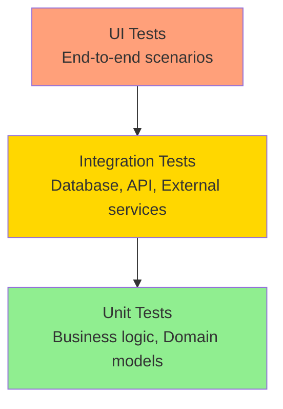

# 🧪 Testing Guide

## Purpose

This section provides comprehensive testing documentation for the Conaprole Orders system, including strategies, patterns, and test implementation guides.

## Audience

- **Developers** - Writing and maintaining tests
- **QA Engineers** - Understanding test architecture and execution
- **Technical Leads** - Test strategy and coverage decisions

## Prerequisites

- Understanding of .NET testing frameworks
- Familiarity with the application architecture
- Basic knowledge of Docker and TestContainers

## Testing Architecture

The system implements a comprehensive testing strategy with multiple layers:

### Test Pyramid



### Test Categories

| Category | Framework | Scope | Count | Coverage |
|----------|-----------|-------|-------|----------|
| **Unit Tests** | xUnit, FluentAssertions | Domain, Application logic | ~200 | 85%+ |
| **Integration Tests** | xUnit, TestContainers | Database, Repository layer | ~50 | 70%+ |
| **Functional Tests** | xUnit, WebApplicationFactory | API endpoints, full stack | ~30 | Key flows |

## Testing Frameworks and Tools

### Core Testing Stack

```csharp
// Test project dependencies
<PackageReference Include="Microsoft.NET.Test.Sdk" Version="17.8.0" />
<PackageReference Include="xunit" Version="2.4.2" />
<PackageReference Include="xunit.runner.visualstudio" Version="2.4.5" />
<PackageReference Include="FluentAssertions" Version="6.12.0" />
<PackageReference Include="NSubstitute" Version="5.1.0" />
<PackageReference Include="Testcontainers" Version="3.6.0" />
<PackageReference Include="Microsoft.AspNetCore.Mvc.Testing" Version="8.0.0" />
```

### Authentication Testing

For testing endpoints with `[HasPermission]` attributes, use the test authentication setup:

```csharp
// Test authentication setup
public class TestAuthenticationHandler : AuthenticationHandler<AuthenticationSchemeOptions>
{
    public TestAuthenticationHandler(IOptionsMonitor<AuthenticationSchemeOptions> options,
        ILoggerFactory logger, UrlEncoder encoder, ISystemClock clock)
        : base(options, logger, encoder, clock)
    {
    }

    protected override Task<AuthenticateResult> HandleAuthenticateAsync()
    {
        var claims = new[]
        {
            new Claim(ClaimTypes.Name, "TestUser"),
            new Claim(ClaimTypes.NameIdentifier, "123"),
            new Claim("sub", "test-user-id"),
            new Claim("permissions", "users:read"),
            new Claim("permissions", "users:write"),
            new Claim("permissions", "orders:read"),
            new Claim("permissions", "orders:write")
        };

        var identity = new ClaimsIdentity(claims, "Test");
        var principal = new ClaimsPrincipal(identity);
        var ticket = new AuthenticationTicket(principal, "Test");

        return Task.FromResult(AuthenticateResult.Success(ticket));
    }
}
```

### Test Base Classes

```csharp
// Base class for integration tests
public abstract class BaseIntegrationTest : IClassFixture<IntegrationTestWebApplicationFactory>
{
    protected readonly HttpClient HttpClient;
    protected readonly IntegrationTestWebApplicationFactory Factory;

    protected BaseIntegrationTest(IntegrationTestWebApplicationFactory factory)
    {
        Factory = factory;
        HttpClient = factory.CreateClient();
    }

    protected async Task<HttpResponseMessage> AuthenticatedRequest(
        HttpMethod method, 
        string requestUri, 
        object? content = null,
        params string[] permissions)
    {
        // Setup authentication with specific permissions
        Factory.WithAuthentication(permissions);
        
        var request = new HttpRequestMessage(method, requestUri);
        
        if (content != null)
        {
            request.Content = JsonContent.Create(content);
        }
        
        return await HttpClient.SendAsync(request);
    }
}
```

## Test Scenarios

### Unit Test Example

```csharp
public class OrderTests
{
    [Fact]
    public void CreateOrder_WithValidData_ShouldSucceed()
    {
        // Arrange
        var customerId = new CustomerId(Guid.NewGuid());
        var orderLines = new List<OrderLine>
        {
            OrderLine.Create(
                new ProductId(Guid.NewGuid()),
                new Money(100, Currency.Usd),
                2
            )
        };

        // Act
        var order = Order.Create(customerId, orderLines);

        // Assert
        order.Should().NotBeNull();
        order.CustomerId.Should().Be(customerId);
        order.OrderLines.Should().HaveCount(1);
        order.TotalAmount.Should().Be(new Money(200, Currency.Usd));
    }
}
```

### Integration Test Example

```csharp
public class UsersControllerTests : BaseIntegrationTest
{
    public UsersControllerTests(IntegrationTestWebApplicationFactory factory) 
        : base(factory) { }

    [Fact]
    public async Task GetAllUsers_WithUsersReadPermission_ShouldReturnUsers()
    {
        // Arrange
        var user = await CreateTestUser();
        
        // Act
        var response = await AuthenticatedRequest(
            HttpMethod.Get, 
            "/api/users",
            permissions: new[] { "users:read" }
        );

        // Assert
        response.StatusCode.Should().Be(HttpStatusCode.OK);
        
        var users = await response.Content.ReadFromJsonAsync<UserResponse[]>();
        users.Should().NotBeEmpty();
        users.Should().Contain(u => u.Id == user.Id);
    }

    [Fact]
    public async Task GetAllUsers_WithoutPermission_ShouldReturnForbidden()
    {
        // Act
        var response = await AuthenticatedRequest(
            HttpMethod.Get, 
            "/api/users",
            permissions: Array.Empty<string>()
        );

        // Assert
        response.StatusCode.Should().Be(HttpStatusCode.Forbidden);
    }
}
```

### Functional Test Example

```csharp
public class OrderWorkflowTests : BaseIntegrationTest
{
    [Fact]
    public async Task CompleteOrderFlow_ShouldProcessSuccessfully()
    {
        // Arrange - Create prerequisites
        var customer = await CreateTestCustomer();
        var product = await CreateTestProduct();
        
        // Act 1 - Create order
        var createOrderRequest = new CreateOrderRequest
        {
            CustomerId = customer.Id,
            OrderLines = new[]
            {
                new CreateOrderLineRequest
                {
                    ProductId = product.Id,
                    Quantity = 2,
                    UnitPrice = 10.00m
                }
            }
        };
        
        var createResponse = await AuthenticatedRequest(
            HttpMethod.Post,
            "/api/orders",
            createOrderRequest,
            "orders:write"
        );
        
        // Assert 1
        createResponse.StatusCode.Should().Be(HttpStatusCode.Created);
        var createdOrder = await createResponse.Content.ReadFromJsonAsync<OrderResponse>();
        
        // Act 2 - Get order details
        var getResponse = await AuthenticatedRequest(
            HttpMethod.Get,
            $"/api/orders/{createdOrder.Id}",
            permissions: new[] { "orders:read" }
        );
        
        // Assert 2
        getResponse.StatusCode.Should().Be(HttpStatusCode.OK);
        var orderDetails = await getResponse.Content.ReadFromJsonAsync<OrderResponse>();
        orderDetails.Id.Should().Be(createdOrder.Id);
        orderDetails.OrderLines.Should().HaveCount(1);
    }
}
```

## Test Data Management

### Test Fixtures

```csharp
public class TestDataFixture
{
    public static class Users
    {
        public static readonly User AdminUser = User.Create(
            "admin@conaprole.com",
            "admin-identity-id",
            "Admin User"
        );
        
        public static readonly User DistributorUser = User.Create(
            "distributor@conaprole.com", 
            "distributor-identity-id",
            "Distributor User"
        );
    }
    
    public static class Products
    {
        public static readonly Product Milk = Product.Create(
            "Leche Entera 1L",
            "MILK001",
            new Money(50, Currency.Usd),
            ProductCategory.Dairy
        );
    }
}
```

### Database Seeding

```csharp
public static class DatabaseSeeder
{
    public static async Task SeedAsync(ConaproleOrdersDbContext context)
    {
        // Clear existing data
        await context.Users.ExecuteDeleteAsync();
        await context.Products.ExecuteDeleteAsync();
        
        // Seed test data
        await context.Users.AddRangeAsync(
            TestDataFixture.Users.AdminUser,
            TestDataFixture.Users.DistributorUser
        );
        
        await context.Products.AddAsync(TestDataFixture.Products.Milk);
        
        await context.SaveChangesAsync();
    }
}
```

## Performance Testing

### Load Testing with NBomber

```csharp
[Fact]
public void LoadTest_GetUsers_ShouldHandleConcurrentRequests()
{
    var scenario = Scenario.Create("get_users", async context =>
    {
        var response = await HttpClient.GetAsync("/api/users");
        
        return response.IsSuccessStatusCode ? Response.Ok() : Response.Fail();
    })
    .WithLoadSimulations(
        Simulation.InjectPerSec(rate: 10, during: TimeSpan.FromMinutes(1))
    );

    NBomberRunner
        .RegisterScenarios(scenario)
        .Run();
}
```

## Test Execution

### Local Development

```bash
# Run all tests
dotnet test

# Run tests with coverage
dotnet test --collect:"XPlat Code Coverage"

# Run specific test category
dotnet test --filter Category=Unit
dotnet test --filter Category=Integration
dotnet test --filter Category=Functional

# Run tests in parallel
dotnet test --parallel
```

### CI/CD Pipeline

```yaml
# GitHub Actions test step
- name: Run Tests
  run: |
    dotnet test --no-build --verbosity normal \
      --collect:"XPlat Code Coverage" \
      --logger trx \
      --results-directory ./TestResults/

- name: Upload Test Results
  uses: actions/upload-artifact@v4
  if: always()
  with:
    name: test-results
    path: ./TestResults/
```

## Best Practices

### Test Organization

1. **Arrange-Act-Assert Pattern** - Clear test structure
2. **Descriptive Test Names** - Should express the scenario being tested
3. **One Assertion Per Test** - Focus on single behavior
4. **Test Data Isolation** - Each test should be independent

### Authentication Testing

1. **Mock JWT Tokens** - Use test authentication handler for faster tests
2. **Permission-based Testing** - Test both authorized and unauthorized scenarios
3. **Role-based Scenarios** - Test different user roles and permissions
4. **Token Expiration** - Test token refresh and expiration scenarios

### Integration Testing

1. **Use TestContainers** - Real database for integration tests
2. **Clean Database State** - Reset between tests
3. **Minimal Test Data** - Only create what's needed for the test
4. **Async Patterns** - Use async/await correctly in tests

## Troubleshooting

### Common Issues

1. **Container Startup Failures** - Check Docker availability and resources
2. **Test Isolation Issues** - Ensure proper cleanup between tests
3. **Authentication Problems** - Verify test authentication setup
4. **Flaky Tests** - Add appropriate waits and retries

### Debugging Tips

```csharp
// Add logging to tests
public class TestWithLogging : ITestOutputHelper
{
    private readonly ITestOutputHelper _output;
    
    public TestWithLogging(ITestOutputHelper output)
    {
        _output = output;
    }
    
    [Fact]
    public async Task TestWithDebugOutput()
    {
        _output.WriteLine("Starting test execution...");
        
        // Test implementation
        
        _output.WriteLine("Test completed successfully");
    }
}
```

---

*Last verified: 2025-01-02 - Commit: [comprehensive testing guide added]*