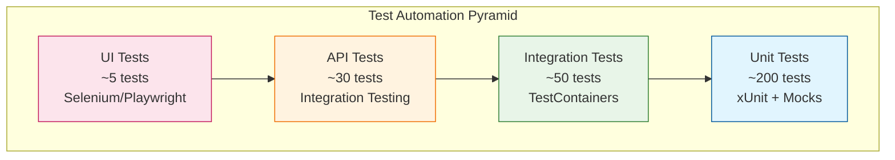
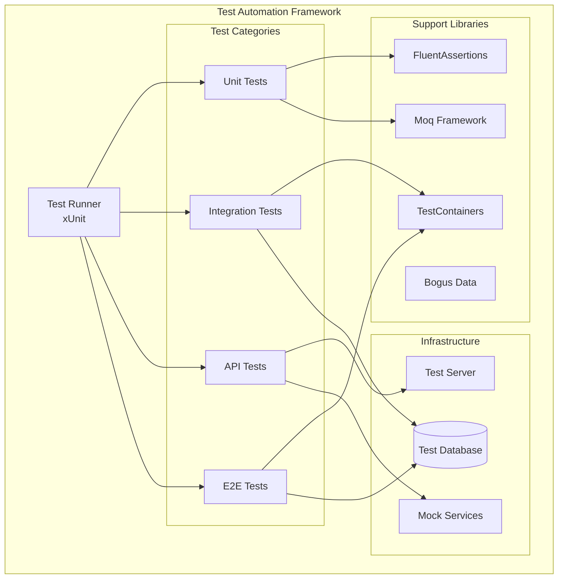

# 🤖 Automatización de Pruebas - Conaprole Orders

## Purpose

Este documento describe el **framework completo de automatización de pruebas** implementado para Conaprole Orders, incluyendo herramientas, estrategias, integración con CI/CD y metodologías de testing automatizado.

## Audience

- **Test Automation Engineers** - Implementación y mantenimiento de frameworks
- **QA Engineers** - Ejecución y análisis de pruebas automatizadas
- **Developers** - Integración de tests en desarrollo
- **DevOps Engineers** - Configuración de pipelines de testing

## Prerequisites

- Conocimiento de frameworks de testing .NET
- Familiaridad con CI/CD pipelines
- Comprensión de Docker y TestContainers
- Experiencia con herramientas de automatización

## 🎯 Estrategia de Automatización

### Principios de Automatización

1. **Automation First** - Priorizar automatización sobre testing manual
2. **Fast Feedback** - Ejecución rápida de tests críticos
3. **Maintainable** - Tests fáciles de mantener y actualizar
4. **Reliable** - Tests determinísticos y estables
5. **Scalable** - Framework que escale con el proyecto

### Pirámide de Automatización



### Test Automation ROI

| Nivel | Manual Time | Automated Time | Savings | Execution Frequency |
|-------|-------------|----------------|---------|-------------------|
| **Unit Tests** | 8 hours | 2 minutes | 99.6% | Every commit |
| **Integration** | 4 hours | 6 minutes | 97.5% | Every PR |
| **API Tests** | 6 hours | 8 minutes | 97.8% | Every deployment |
| **E2E Tests** | 12 hours | 15 minutes | 97.9% | Daily |

## 🛠️ Framework Tecnológico

### Test Frameworks Stack

| Categoría | Tecnología | Versión | Propósito |
|-----------|------------|---------|-----------|
| **Test Framework** | xUnit | 2.4.2 | Testing framework principal |
| **Assertions** | FluentAssertions | 6.12.0 | Assertions expresivas |
| **Mocking** | Moq | 4.20.69 | Mock objects |
| **Test Data** | Bogus | 35.6.2 | Generación de datos |
| **Containers** | Testcontainers | 3.9.0 | Infraestructura de testing |
| **Database** | EF Core InMemory | 8.0.0 | Testing con BD en memoria |
| **HTTP Testing** | Microsoft.AspNetCore.Mvc.Testing | 8.0.0 | Testing de APIs |

### Arquitectura del Framework



## 🧪 Unit Test Automation

### Test Base Classes

```csharp
public abstract class UnitTestBase
{
    protected readonly ITestOutputHelper Output;
    protected readonly Fixture Fixture;
    
    protected UnitTestBase(ITestOutputHelper output)
    {
        Output = output;
        Fixture = new Fixture();
        ConfigureFixture();
    }
    
    private void ConfigureFixture()
    {
        Fixture.Behaviors.Remove(new ThrowingRecursionBehavior());
        Fixture.Behaviors.Add(new OmitOnRecursionBehavior());
        
        // Custom generators
        Fixture.Register(() => new Money(
            Fixture.Create<decimal>() % 10000, 
            Fixture.Create<Currency>()));
    }
}
```

### Domain Test Example

```csharp
public class OrderUnitTests : UnitTestBase
{
    public OrderUnitTests(ITestOutputHelper output) : base(output) { }
    
    [Fact]
    public void Create_Order_With_Valid_Data_Should_Succeed()
    {
        // Arrange
        var pointOfSaleId = Fixture.Create<Guid>();
        var distributorId = Fixture.Create<Guid>();
        var address = Fixture.Create<Address>();
        
        // Act
        var order = Order.Create(pointOfSaleId, distributorId, address);
        
        // Assert
        order.Should().NotBeNull();
        order.Status.Should().Be(Status.Draft);
        order.PointOfSaleId.Should().Be(pointOfSaleId);
        order.DistributorId.Should().Be(distributorId);
        order.DeliveryAddress.Should().Be(address);
    }
    
    [Theory]
    [InlineData(Status.Confirmed)]
    [InlineData(Status.InTransit)]
    [InlineData(Status.Delivered)]
    [InlineData(Status.Canceled)]
    public void Add_OrderLine_To_NonDraft_Order_Should_Throw_Exception(Status status)
    {
        // Arrange
        var order = CreateValidOrder();
        SetOrderStatus(order, status);
        var product = Fixture.Create<Product>();
        var quantity = Fixture.Create<Quantity>();
        
        // Act & Assert
        var exception = Assert.Throws<InvalidOperationException>(() => 
            order.AddOrderLine(product, quantity));
        exception.Message.Should().Contain("cannot be modified");
        
        Output.WriteLine($"Exception correctly thrown for status: {status}");
    }
    
    [Property(MaxTest = 100)]
    public Property Order_Total_Should_Equal_Sum_Of_OrderLines(
        PositiveInt orderLinesCount)
    {
        return Prop.ForAll(
            Gen.Choose(1, orderLinesCount.Get).ToArbitrary(),
            count =>
            {
                // Arrange
                var order = CreateValidOrder();
                var expectedTotal = Money.Zero;
                
                for (int i = 0; i < count; i++)
                {
                    var product = CreateValidProduct();
                    var quantity = CreateValidQuantity();
                    var lineTotal = new Money(
                        product.Price.Amount * quantity.Value,
                        product.Price.Currency);
                    
                    order.AddOrderLine(product, quantity);
                    expectedTotal += lineTotal;
                }
                
                // Assert
                return order.TotalAmount.Equals(expectedTotal);
            });
    }
}
```

### Automated Test Generation

```csharp
public class TestDataGenerator
{
    private readonly Faker<User> _userFaker;
    private readonly Faker<Product> _productFaker;
    private readonly Faker<Order> _orderFaker;
    
    public TestDataGenerator()
    {
        _userFaker = new Faker<User>()
            .CustomInstantiator(f => User.Create(
                new FirstName(f.Name.FirstName()),
                new LastName(f.Name.LastName()),
                new Email(f.Internet.Email())))
            .RuleFor(u => u.CreatedAt, f => f.Date.Recent());
            
        _productFaker = new Faker<Product>()
            .CustomInstantiator(f => Product.Create(
                new Name(f.Commerce.ProductName()),
                new Description(f.Commerce.ProductDescription()),
                new Money(f.Random.Decimal(1, 1000), Currency.USD),
                f.PickRandom<Category>()));
                
        _orderFaker = new Faker<Order>()
            .CustomInstantiator(f => Order.Create(
                f.Random.Guid(),
                f.Random.Guid(),
                new Address(f.Address.StreetAddress(), f.Address.City(), f.Address.ZipCode())));
    }
    
    public User GenerateUser() => _userFaker.Generate();
    public Product GenerateProduct() => _productFaker.Generate();
    public Order GenerateOrder() => _orderFaker.Generate();
    
    public List<T> GenerateList<T>(int count = 5) where T : class
    {
        return typeof(T).Name switch
        {
            nameof(User) => _userFaker.Generate(count) as List<T>,
            nameof(Product) => _productFaker.Generate(count) as List<T>,
            nameof(Order) => _orderFaker.Generate(count) as List<T>,
            _ => throw new NotSupportedException($"Type {typeof(T).Name} not supported")
        };
    }
}
```

## 🔄 Integration Test Automation

### TestContainers Setup

```csharp
public class DatabaseIntegrationTestBase : IAsyncLifetime
{
    protected readonly PostgreSqlContainer PostgresContainer;
    protected readonly ApplicationDbContext DbContext;
    protected readonly IServiceProvider ServiceProvider;
    
    public DatabaseIntegrationTestBase()
    {
        PostgresContainer = new PostgreSqlBuilder()
            .WithImage("postgres:15-alpine")
            .WithDatabase("conaprole_test")
            .WithUsername("test")
            .WithPassword("test")
            .WithPortBinding(5433, 5432)
            .WithWaitStrategy(Wait.ForUnixContainer()
                .UntilPortIsAvailable(5432))
            .Build();
    }
    
    public async Task InitializeAsync()
    {
        await PostgresContainer.StartAsync();
        
        var services = new ServiceCollection();
        ConfigureTestServices(services);
        ServiceProvider = services.BuildServiceProvider();
        
        DbContext = ServiceProvider.GetRequiredService<ApplicationDbContext>();
        await DbContext.Database.MigrateAsync();
        await SeedTestDataAsync();
    }
    
    public async Task DisposeAsync()
    {
        await DbContext.DisposeAsync();
        await ServiceProvider.GetRequiredService<IAsyncDisposable>().DisposeAsync();
        await PostgresContainer.DisposeAsync();
    }
    
    private void ConfigureTestServices(IServiceCollection services)
    {
        services.AddDbContext<ApplicationDbContext>(options =>
            options.UseNpgsql(PostgresContainer.GetConnectionString()));
            
        services.AddTransient<IOrderRepository, OrderRepository>();
        services.AddTransient<IUserRepository, UserRepository>();
        services.AddTransient<IProductRepository, ProductRepository>();
        services.AddTransient<IUnitOfWork, UnitOfWork>();
    }
    
    private async Task SeedTestDataAsync()
    {
        var users = GenerateTestUsers(10);
        var products = GenerateTestProducts(20);
        
        await DbContext.Users.AddRangeAsync(users);
        await DbContext.Products.AddRangeAsync(products);
        await DbContext.SaveChangesAsync();
    }
}
```

### Repository Integration Tests

```csharp
public class OrderRepositoryIntegrationTests : DatabaseIntegrationTestBase
{
    private readonly IOrderRepository _orderRepository;
    
    public OrderRepositoryIntegrationTests()
    {
        _orderRepository = ServiceProvider.GetRequiredService<IOrderRepository>();
    }
    
    [Fact]
    public async Task AddAsync_ValidOrder_Should_Persist_To_Database()
    {
        // Arrange
        var order = GenerateValidOrder();
        
        // Act
        await _orderRepository.AddAsync(order);
        await DbContext.SaveChangesAsync();
        
        // Assert
        var persistedOrder = await DbContext.Orders
            .FirstOrDefaultAsync(o => o.Id == order.Id);
            
        persistedOrder.Should().NotBeNull();
        persistedOrder.Id.Should().Be(order.Id);
        persistedOrder.Status.Should().Be(order.Status);
    }
    
    [Fact]
    public async Task GetByIdWithOrderLinesAsync_Should_Include_OrderLines()
    {
        // Arrange
        var order = await CreateTestOrderWithLinesAsync();
        
        // Act
        var result = await _orderRepository.GetByIdWithOrderLinesAsync(order.Id);
        
        // Assert
        result.Should().NotBeNull();
        result.OrderLines.Should().HaveCount(3);
        result.OrderLines.Should().OnlyContain(ol => ol.OrderId == order.Id);
    }
    
    [Theory]
    [InlineData(1, 10)] // Page 1, 10 items
    [InlineData(2, 5)]  // Page 2, 5 items
    [InlineData(3, 3)]  // Page 3, 3 items
    public async Task GetPagedAsync_Should_Return_Correct_Page(int page, int pageSize)
    {
        // Arrange
        await CreateTestOrdersAsync(25); // Total 25 orders
        
        // Act
        var result = await _orderRepository.GetPagedAsync(page, pageSize);
        
        // Assert
        var expectedCount = Math.Min(pageSize, Math.Max(0, 25 - (page - 1) * pageSize));
        result.Should().HaveCount(expectedCount);
        
        if (expectedCount > 0)
        {
            result.Should().BeInDescendingOrder(o => o.CreatedOnUtc);
        }
    }
}
```

## 🌐 API Test Automation

### API Test Base Class

```csharp
public abstract class ApiTestBase : IClassFixture<CustomWebApplicationFactory>
{
    protected readonly CustomWebApplicationFactory Factory;
    protected readonly HttpClient Client;
    protected readonly JsonSerializerOptions JsonOptions;
    
    protected ApiTestBase(CustomWebApplicationFactory factory)
    {
        Factory = factory;
        Client = factory.CreateClient();
        JsonOptions = new JsonSerializerOptions
        {
            PropertyNamingPolicy = JsonNamingPolicy.CamelCase,
            PropertyNameCaseInsensitive = true
        };
    }
    
    protected async Task<HttpResponseMessage> PostAsync<T>(string endpoint, T data, string[] permissions = null)
    {
        var request = new HttpRequestMessage(HttpMethod.Post, endpoint)
        {
            Content = JsonContent.Create(data, options: JsonOptions)
        };
        
        if (permissions?.Any() == true)
        {
            var token = GenerateTestJwtToken(permissions);
            request.Headers.Authorization = new AuthenticationHeaderValue("Bearer", token);
        }
        
        return await Client.SendAsync(request);
    }
    
    protected async Task<T> GetAsync<T>(string endpoint, string[] permissions = null)
    {
        var request = new HttpRequestMessage(HttpMethod.Get, endpoint);
        
        if (permissions?.Any() == true)
        {
            var token = GenerateTestJwtToken(permissions);
            request.Headers.Authorization = new AuthenticationHeaderValue("Bearer", token);
        }
        
        var response = await Client.SendAsync(request);
        response.EnsureSuccessStatusCode();
        
        var content = await response.Content.ReadAsStringAsync();
        return JsonSerializer.Deserialize<T>(content, JsonOptions);
    }
    
    protected string GenerateTestJwtToken(string[] permissions)
    {
        var claims = new List<Claim>
        {
            new(ClaimTypes.NameIdentifier, Guid.NewGuid().ToString()),
            new(ClaimTypes.Email, "test@conaprole.com"),
            new("permissions", string.Join(",", permissions))
        };
        
        var key = new SymmetricSecurityKey(Encoding.UTF8.GetBytes("test-secret-key-for-jwt-token-generation-minimum-256-bits"));
        var credentials = new SigningCredentials(key, SecurityAlgorithms.HmacSha256);
        
        var token = new JwtSecurityToken(
            issuer: "test-issuer",
            audience: "test-audience", 
            claims: claims,
            expires: DateTime.UtcNow.AddHours(1),
            signingCredentials: credentials);
            
        return new JwtSecurityTokenHandler().WriteToken(token);
    }
}
```

### Automated API Tests

```csharp
public class OrdersControllerApiTests : ApiTestBase
{
    public OrdersControllerApiTests(CustomWebApplicationFactory factory) : base(factory) { }
    
    [Fact]
    public async Task CreateOrder_WithValidData_Should_Return_Created()
    {
        // Arrange
        var request = new CreateOrderRequest
        {
            CustomerId = Guid.NewGuid(),
            PointOfSaleId = Guid.NewGuid(),
            DistributorId = Guid.NewGuid(),
            DeliveryAddress = new AddressDto
            {
                Street = "Test Street 123",
                City = "Test City",
                PostalCode = "12345"
            },
            OrderLines = new[]
            {
                new OrderLineRequest
                {
                    ProductId = Guid.NewGuid(),
                    Quantity = 2
                }
            }
        };
        
        // Act
        var response = await PostAsync("/api/orders", request, new[] { "orders:write" });
        
        // Assert
        response.StatusCode.Should().Be(HttpStatusCode.Created);
        
        var createdOrder = await response.Content.ReadFromJsonAsync<OrderResponse>();
        createdOrder.Should().NotBeNull();
        createdOrder.Id.Should().NotBeEmpty();
        createdOrder.Status.Should().Be("Draft");
        
        // Verify Location header
        response.Headers.Location.Should().NotBeNull();
        response.Headers.Location.ToString().Should().Contain(createdOrder.Id.ToString());
    }
    
    [Theory]
    [InlineData("", "orders:write", HttpStatusCode.BadRequest)]
    [InlineData("valid-data", "", HttpStatusCode.Forbidden)]
    [InlineData("invalid-json", "orders:write", HttpStatusCode.BadRequest)]
    public async Task CreateOrder_WithInvalidData_Should_Return_Error(
        string dataType, string permission, HttpStatusCode expectedStatus)
    {
        // Arrange
        var request = dataType switch
        {
            "" => null,
            "invalid-json" => "{ invalid json }",
            _ => CreateValidOrderRequest()
        };
        
        var permissions = string.IsNullOrEmpty(permission) ? null : new[] { permission };
        
        // Act
        var response = await PostAsync("/api/orders", request, permissions);
        
        // Assert
        response.StatusCode.Should().Be(expectedStatus);
    }
    
    [Fact]
    public async Task GetOrders_WithPagination_Should_Return_PagedResults()
    {
        // Arrange
        await CreateTestOrdersAsync(15);
        
        // Act
        var response = await GetAsync<PagedResult<OrderResponse>>(
            "/api/orders?page=1&pageSize=10", 
            new[] { "orders:read" });
        
        // Assert
        response.Should().NotBeNull();
        response.Items.Should().HaveCount(10);
        response.TotalCount.Should().Be(15);
        response.PageNumber.Should().Be(1);
        response.PageSize.Should().Be(10);
        response.HasNextPage.Should().BeTrue();
    }
}
```

## 🚀 CI/CD Integration

### GitHub Actions Workflow

```yaml
name: Test Automation Pipeline

on:
  push:
    branches: [ main, develop ]
  pull_request:
    branches: [ main ]

env:
  DOTNET_VERSION: '8.0.x'
  NODE_VERSION: '20'

jobs:
  unit-tests:
    name: Unit Tests
    runs-on: ubuntu-latest
    
    steps:
    - uses: actions/checkout@v4
    
    - name: Setup .NET
      uses: actions/setup-dotnet@v4
      with:
        dotnet-version: ${{ env.DOTNET_VERSION }}
    
    - name: Restore dependencies
      run: dotnet restore
    
    - name: Run unit tests
      run: |
        dotnet test \
          --filter Category=Unit \
          --logger "trx;LogFileName=unit-test-results.trx" \
          --logger "console;verbosity=detailed" \
          --collect:"XPlat Code Coverage" \
          --results-directory TestResults/
    
    - name: Upload test results
      uses: actions/upload-artifact@v4
      if: always()
      with:
        name: unit-test-results
        path: TestResults/
        
    - name: Upload coverage to Codecov
      uses: codecov/codecov-action@v3
      with:
        files: TestResults/**/coverage.cobertura.xml

  integration-tests:
    name: Integration Tests
    runs-on: ubuntu-latest
    needs: unit-tests
    
    services:
      postgres:
        image: postgres:15-alpine
        env:
          POSTGRES_DB: conaprole_test
          POSTGRES_USER: test
          POSTGRES_PASSWORD: test
        options: >-
          --health-cmd pg_isready
          --health-interval 10s
          --health-timeout 5s
          --health-retries 5
        ports:
          - 5432:5432
    
    steps:
    - uses: actions/checkout@v4
    
    - name: Setup .NET
      uses: actions/setup-dotnet@v4
      with:
        dotnet-version: ${{ env.DOTNET_VERSION }}
    
    - name: Run integration tests
      run: |
        dotnet test \
          --filter Category=Integration \
          --logger "trx;LogFileName=integration-test-results.trx" \
          --results-directory TestResults/
      env:
        ConnectionStrings__DefaultConnection: "Host=localhost;Database=conaprole_test;Username=test;Password=test"

  api-tests:
    name: API Tests
    runs-on: ubuntu-latest
    needs: integration-tests
    
    steps:
    - uses: actions/checkout@v4
    
    - name: Setup .NET
      uses: actions/setup-dotnet@v4
      with:
        dotnet-version: ${{ env.DOTNET_VERSION }}
    
    - name: Run API tests
      run: |
        dotnet test \
          --filter Category=API \
          --logger "trx;LogFileName=api-test-results.trx" \
          --results-directory TestResults/

  performance-tests:
    name: Performance Tests
    runs-on: ubuntu-latest
    needs: api-tests
    if: github.event_name == 'push' && github.ref == 'refs/heads/main'
    
    steps:
    - uses: actions/checkout@v4
    
    - name: Setup .NET
      uses: actions/setup-dotnet@v4
      with:
        dotnet-version: ${{ env.DOTNET_VERSION }}
    
    - name: Run performance tests
      run: |
        dotnet test \
          --filter Category=Performance \
          --logger "trx;LogFileName=performance-test-results.trx" \
          --results-directory TestResults/

  test-report:
    name: Generate Test Report
    runs-on: ubuntu-latest
    needs: [unit-tests, integration-tests, api-tests]
    if: always()
    
    steps:
    - name: Download test results
      uses: actions/download-artifact@v4
      with:
        name: unit-test-results
        path: TestResults/
    
    - name: Generate test report
      uses: dorny/test-reporter@v1
      if: always()
      with:
        name: Test Results
        path: TestResults/*.trx
        reporter: dotnet-trx
        max-annotations: 50
```

### Test Configuration

```yaml
# test-settings.json
{
  "testSettings": {
    "connectionStrings": {
      "default": "Host=localhost;Database=conaprole_test;Username=test;Password=test"
    },
    "containerSettings": {
      "postgres": {
        "image": "postgres:15-alpine",
        "port": 5433,
        "environment": {
          "POSTGRES_DB": "conaprole_test",
          "POSTGRES_USER": "test", 
          "POSTGRES_PASSWORD": "test"
        }
      },
      "redis": {
        "image": "redis:7-alpine",
        "port": 6380
      }
    },
    "parallelization": {
      "maxDegreeOfParallelism": 4,
      "collectionBehavior": "CollectionPerClass"
    },
    "timeouts": {
      "default": "00:00:30",
      "integration": "00:02:00",
      "e2e": "00:05:00"
    }
  }
}
```

## 📊 Test Reporting y Analytics

### Test Results Dashboard

```csharp
public class TestResultsReporter
{
    private readonly ITestOutputHelper _output;
    
    public TestResultsReporter(ITestOutputHelper output)
    {
        _output = output;
    }
    
    public void GenerateReport(TestExecutionSummary summary)
    {
        var report = new StringBuilder();
        
        report.AppendLine("🧪 TEST EXECUTION SUMMARY");
        report.AppendLine("=" * 50);
        report.AppendLine($"Total Tests: {summary.TotalTests}");
        report.AppendLine($"Passed: {summary.PassedTests} ({summary.PassedPercentage:F1}%)");
        report.AppendLine($"Failed: {summary.FailedTests}");
        report.AppendLine($"Skipped: {summary.SkippedTests}");
        report.AppendLine($"Duration: {summary.Duration:mm\\:ss}");
        report.AppendLine();
        
        if (summary.FailedTests > 0)
        {
            report.AppendLine("❌ FAILED TESTS:");
            foreach (var failure in summary.Failures)
            {
                report.AppendLine($"  - {failure.TestName}: {failure.ErrorMessage}");
            }
            report.AppendLine();
        }
        
        report.AppendLine("📊 COVERAGE BY MODULE:");
        foreach (var module in summary.CoverageByModule)
        {
            report.AppendLine($"  {module.Name}: {module.Coverage:F1}%");
        }
        
        _output.WriteLine(report.ToString());
    }
}
```

### Performance Metrics Collection

```csharp
public class PerformanceTestAttribute : FactAttribute
{
    public int MaxExecutionTimeMs { get; set; } = 1000;
    public int WarmupIterations { get; set; } = 5;
    public int MeasurementIterations { get; set; } = 10;
}

public class PerformanceTestRunner
{
    public async Task<PerformanceResult> RunAsync<T>(
        Func<Task<T>> testMethod,
        PerformanceTestAttribute settings)
    {
        // Warmup
        for (int i = 0; i < settings.WarmupIterations; i++)
        {
            await testMethod();
        }
        
        // Measurement
        var measurements = new List<TimeSpan>();
        var stopwatch = Stopwatch.StartNew();
        
        for (int i = 0; i < settings.MeasurementIterations; i++)
        {
            var start = stopwatch.Elapsed;
            await testMethod();
            var end = stopwatch.Elapsed;
            measurements.Add(end - start);
        }
        
        return new PerformanceResult
        {
            Average = TimeSpan.FromMilliseconds(measurements.Average(m => m.TotalMilliseconds)),
            Min = measurements.Min(),
            Max = measurements.Max(),
            P95 = measurements.OrderBy(m => m).Skip((int)(measurements.Count * 0.95)).First(),
            PassedThreshold = measurements.All(m => m.TotalMilliseconds <= settings.MaxExecutionTimeMs)
        };
    }
}
```

## 🔧 Maintenance y Best Practices

### Test Maintenance Guidelines

1. **Regular Cleanup**
   ```csharp
   [Fact]
   public async Task Cleanup_Old_Test_Data()
   {
       // Remove test data older than 7 days
       var cutoffDate = DateTime.UtcNow.AddDays(-7);
       var oldTestData = await DbContext.Orders
           .Where(o => o.CreatedOnUtc < cutoffDate && o.CreatedBy == "test-system")
           .ToListAsync();
           
       DbContext.Orders.RemoveRange(oldTestData);
       await DbContext.SaveChangesAsync();
   }
   ```

2. **Test Data Isolation**
   ```csharp
   public class TestDataIsolation : IDisposable
   {
       private readonly List<Guid> _createdEntityIds = new();
       
       public T TrackEntity<T>(T entity) where T : Entity
       {
           _createdEntityIds.Add(entity.Id);
           return entity;
       }
       
       public void Dispose()
       {
           // Cleanup tracked entities
           foreach (var id in _createdEntityIds)
           {
               // Remove from database
           }
       }
   }
   ```

3. **Flaky Test Detection**
   ```csharp
   public class FlakyTestDetector
   {
       public static void RunMultipleTimes(Action testMethod, int iterations = 10)
       {
           var failures = 0;
           var exceptions = new List<Exception>();
           
           for (int i = 0; i < iterations; i++)
           {
               try
               {
                   testMethod();
               }
               catch (Exception ex)
               {
                   failures++;
                   exceptions.Add(ex);
               }
           }
           
           if (failures > 0)
           {
               throw new FlakyTestException(
                   $"Test failed {failures}/{iterations} times", 
                   exceptions);
           }
       }
   }
   ```

## Mapping to Thesis

Este documento contribuye directamente a las siguientes secciones de la tesis:

- **8.0 Automatización de pruebas** - Framework completo de automatización y herramientas
- **5.2 Niveles de prueba** - Implementación automatizada de diferentes niveles
- **3.6.8 Metodología de deployment** - Integración de testing en CI/CD
- **6.0 Plan de pruebas** - Ejecución automatizada del plan de pruebas

## Referencias

- [xUnit Documentation](https://xunit.net/)
- [Testcontainers for .NET](https://dotnet.testcontainers.org/)
- [ASP.NET Core Testing](https://docs.microsoft.com/en-us/aspnet/core/test/)
- [Test Automation Pyramid](https://martinfowler.com/articles/practical-test-pyramid.html)
- [GitHub Actions for .NET](https://docs.github.com/en/actions/automating-builds-and-tests/building-and-testing-net)

---

*Last verified: 2025-01-02 - Commit: 4ef981b*