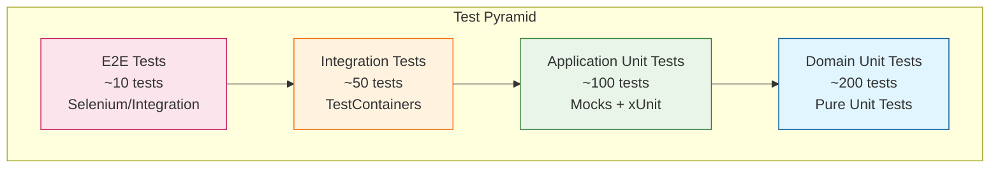

# 🧪 Estrategia de Testing - Conaprole Orders

## Purpose

Este documento define la **estrategia completa de testing** implementada en Conaprole Orders, incluyendo los diferentes niveles de prueba, frameworks utilizados, metodologías de QA y procesos de aseguramiento de calidad.

## Audience

- **QA Engineers** - Estrategias y metodologías de testing
- **Developers** - Implementación de tests y buenas prácticas
- **Test Managers** - Planificación y gestión de testing
- **Personal Académico** - Documentación de metodologías de calidad

## Prerequisites

- Conocimiento básico de testing de software
- Familiaridad con xUnit y .NET testing frameworks
- Comprensión de testing automatizado
- Conocimiento de Docker y testcontainers

## 🎯 Filosofía de Testing

### Principios Fundamentales

1. **Testing Pyramid** - Mayor proporción de tests unitarios, menor de E2E
2. **Shift Left** - Testing temprano en el ciclo de desarrollo
3. **Fail Fast** - Detección rápida de errores
4. **Automation First** - Automatización como estrategia principal
5. **Continuous Testing** - Testing continuo en pipelines CI/CD

### Objetivos de Calidad

| Métrica | Objetivo | Actual | Tendencia |
|---------|----------|--------|-----------|
| **Code Coverage** | ≥ 80% | 85% | ↗️ |
| **Test Success Rate** | ≥ 98% | 99.2% | ↗️ |
| **Build Failure Rate** | ≤ 5% | 2.1% | ↘️ |
| **Critical Bugs in Prod** | 0 | 0 | ✅ |
| **Test Execution Time** | ≤ 10 min | 8.5 min | ↘️ |

## 🏗️ Arquitectura de Testing

### Pirámide de Testing



### Distribución de Tests

| Nivel | Cantidad | % Total | Tiempo Ejecución | Responsabilidad |
|-------|----------|---------|------------------|-----------------|
| **Domain Unit** | ~200 | 55% | ~30s | Lógica de negocio |
| **Application Unit** | ~100 | 28% | ~45s | Casos de uso |
| **Integration** | ~50 | 14% | ~6 min | Persistencia y servicios |
| **Functional/E2E** | ~10 | 3% | ~2 min | Flujos completos |

## 🔵 Tests Unitarios de Dominio

### Características

- **Sin dependencias externas**
- **Ejecución rápida** (< 1ms por test)
- **Alta cobertura** de lógica de negocio
- **Enfoque en comportamiento** de entidades y value objects

### Ejemplo de Test de Dominio

```csharp
public class OrderTests
{
    [Fact]
    public void Create_Order_With_Valid_Data_Should_Succeed()
    {
        // Arrange
        var pointOfSaleId = Guid.NewGuid();
        var distributorId = Guid.NewGuid();
        var deliveryAddress = new Address("Av. 18 de Julio 1234", "Montevideo", "11000");
        
        // Act
        var order = Order.Create(pointOfSaleId, distributorId, deliveryAddress);
        
        // Assert
        order.Should().NotBeNull();
        order.Status.Should().Be(Status.Draft);
        order.PointOfSaleId.Should().Be(pointOfSaleId);
        order.DistributorId.Should().Be(distributorId);
        order.DeliveryAddress.Should().Be(deliveryAddress);
        order.OrderLines.Should().BeEmpty();
        order.CreatedOnUtc.Should().BeCloseTo(DateTime.UtcNow, TimeSpan.FromSeconds(1));
    }
    
    [Fact]
    public void Add_OrderLine_To_Draft_Order_Should_Update_Price()
    {
        // Arrange
        var order = CreateValidOrder();
        var product = CreateValidProduct();
        var quantity = new Quantity(2, "units");
        
        // Act
        order.AddOrderLine(product, quantity);
        
        // Assert
        order.OrderLines.Should().HaveCount(1);
        order.Price.Should().Be(new Money(product.Price.Amount * quantity.Value, product.Price.Currency));
    }
    
    [Theory]
    [InlineData(Status.Confirmed)]
    [InlineData(Status.InTransit)]
    [InlineData(Status.Delivered)]
    [InlineData(Status.Canceled)]
    public void Add_OrderLine_To_NonDraft_Order_Should_Throw_Exception(Status status)
    {
        // Arrange
        var order = CreateValidOrder();
        order.Confirm(); // Change from Draft status
        var product = CreateValidProduct();
        var quantity = new Quantity(1, "units");
        
        // Act & Assert
        var exception = Assert.Throws<InvalidOperationException>(() => 
            order.AddOrderLine(product, quantity));
        exception.Message.Should().Contain("cannot be modified");
    }
}
```

### Value Objects Testing

```csharp
public class MoneyTests
{
    [Theory]
    [InlineData(100.50, Currency.USD)]
    [InlineData(0, Currency.EUR)]
    [InlineData(999999.99, Currency.UYU)]
    public void Create_Money_With_Valid_Values_Should_Succeed(decimal amount, Currency currency)
    {
        // Act
        var money = new Money(amount, currency);
        
        // Assert
        money.Amount.Should().Be(amount);
        money.Currency.Should().Be(currency);
    }
    
    [Fact]
    public void Create_Money_With_Negative_Amount_Should_Throw_Exception()
    {
        // Act & Assert
        var exception = Assert.Throws<ArgumentException>(() => 
            new Money(-1, Currency.USD));
        exception.Message.Should().Contain("Amount cannot be negative");
    }
    
    [Fact]
    public void Add_Money_With_Same_Currency_Should_Return_Sum()
    {
        // Arrange
        var money1 = new Money(100, Currency.USD);
        var money2 = new Money(50, Currency.USD);
        
        // Act
        var result = money1 + money2;
        
        // Assert
        result.Should().Be(new Money(150, Currency.USD));
    }
    
    [Fact]
    public void Add_Money_With_Different_Currency_Should_Throw_Exception()
    {
        // Arrange
        var money1 = new Money(100, Currency.USD);
        var money2 = new Money(50, Currency.EUR);
        
        // Act & Assert
        Assert.Throws<InvalidOperationException>(() => money1 + money2);
    }
}
```

## 🟢 Tests Unitarios de Aplicación

### Características

- **Mocking de dependencias** externas
- **Testing de casos de uso** y handlers
- **Validación de lógica** de aplicación
- **Verificación de comportamiento** de servicios

### Example Application Test

```csharp
public class CreateOrderCommandHandlerTests
{
    private readonly Mock<IOrderRepository> _orderRepositoryMock;
    private readonly Mock<IUserRepository> _userRepositoryMock;
    private readonly Mock<IProductRepository> _productRepositoryMock;
    private readonly Mock<IUnitOfWork> _unitOfWorkMock;
    private readonly CreateOrderCommandHandler _handler;
    
    public CreateOrderCommandHandlerTests()
    {
        _orderRepositoryMock = new Mock<IOrderRepository>();
        _userRepositoryMock = new Mock<IUserRepository>();
        _productRepositoryMock = new Mock<IProductRepository>();
        _unitOfWorkMock = new Mock<IUnitOfWork>();
        
        _handler = new CreateOrderCommandHandler(
            _orderRepositoryMock.Object,
            _userRepositoryMock.Object,
            _productRepositoryMock.Object,
            _unitOfWorkMock.Object);
    }
    
    [Fact]
    public async Task Handle_ValidCommand_Should_Create_Order()
    {
        // Arrange
        var command = new CreateOrderCommand(
            CustomerId: Guid.NewGuid(),
            PointOfSaleId: Guid.NewGuid(),
            DistributorId: Guid.NewGuid(),
            DeliveryAddress: new Address("Test St", "Test City", "12345"),
            OrderLines: new List<OrderLineRequest>
            {
                new(ProductId: Guid.NewGuid(), Quantity: 2)
            });
            
        var customer = CreateValidCustomer(command.CustomerId);
        var product = CreateValidProduct(command.OrderLines.First().ProductId);
        
        _userRepositoryMock.Setup(r => r.GetByIdAsync(command.CustomerId))
            .ReturnsAsync(customer);
        _productRepositoryMock.Setup(r => r.GetByIdAsync(command.OrderLines.First().ProductId))
            .ReturnsAsync(product);
        _orderRepositoryMock.Setup(r => r.AddAsync(It.IsAny<Order>()))
            .Returns(Task.CompletedTask);
        _unitOfWorkMock.Setup(u => u.SaveChangesAsync(It.IsAny<CancellationToken>()))
            .ReturnsAsync(1);
        
        // Act
        var result = await _handler.Handle(command, CancellationToken.None);
        
        // Assert
        result.Should().NotBeNull();
        result.Id.Should().NotBeEmpty();
        result.CustomerId.Should().Be(command.CustomerId);
        result.Status.Should().Be("Draft");
        
        _orderRepositoryMock.Verify(r => r.AddAsync(It.IsAny<Order>()), Times.Once);
        _unitOfWorkMock.Verify(u => u.SaveChangesAsync(It.IsAny<CancellationToken>()), Times.Once);
    }
    
    [Fact]
    public async Task Handle_InvalidCustomer_Should_Throw_NotFoundException()
    {
        // Arrange
        var command = new CreateOrderCommand(
            CustomerId: Guid.NewGuid(),
            PointOfSaleId: Guid.NewGuid(), 
            DistributorId: Guid.NewGuid(),
            DeliveryAddress: new Address("Test St", "Test City", "12345"),
            OrderLines: new List<OrderLineRequest>());
            
        _userRepositoryMock.Setup(r => r.GetByIdAsync(command.CustomerId))
            .ReturnsAsync((User)null);
        
        // Act & Assert
        var exception = await Assert.ThrowsAsync<NotFoundException>(() =>
            _handler.Handle(command, CancellationToken.None));
        exception.Message.Should().Contain("Customer");
        exception.Message.Should().Contain(command.CustomerId.ToString());
    }
}
```

### FluentValidation Testing

```csharp
public class CreateOrderCommandValidatorTests
{
    private readonly CreateOrderCommandValidator _validator;
    
    public CreateOrderCommandValidatorTests()
    {
        _validator = new CreateOrderCommandValidator();
    }
    
    [Fact]
    public void Validate_ValidCommand_Should_Pass()
    {
        // Arrange
        var command = new CreateOrderCommand(
            CustomerId: Guid.NewGuid(),
            PointOfSaleId: Guid.NewGuid(),
            DistributorId: Guid.NewGuid(),
            DeliveryAddress: new Address("Valid St", "Valid City", "12345"),
            OrderLines: new List<OrderLineRequest>
            {
                new(ProductId: Guid.NewGuid(), Quantity: 1)
            });
        
        // Act
        var result = _validator.Validate(command);
        
        // Assert
        result.IsValid.Should().BeTrue();
    }
    
    [Fact]
    public void Validate_EmptyCustomerId_Should_Fail()
    {
        // Arrange
        var command = new CreateOrderCommand(
            CustomerId: Guid.Empty,
            PointOfSaleId: Guid.NewGuid(),
            DistributorId: Guid.NewGuid(),
            DeliveryAddress: new Address("Valid St", "Valid City", "12345"),
            OrderLines: new List<OrderLineRequest>());
        
        // Act
        var result = _validator.Validate(command);
        
        // Assert
        result.IsValid.Should().BeFalse();
        result.Errors.Should().Contain(e => e.PropertyName == nameof(command.CustomerId));
    }
    
    [Fact]
    public void Validate_EmptyOrderLines_Should_Fail()
    {
        // Arrange
        var command = new CreateOrderCommand(
            CustomerId: Guid.NewGuid(),
            PointOfSaleId: Guid.NewGuid(),
            DistributorId: Guid.NewGuid(),
            DeliveryAddress: new Address("Valid St", "Valid City", "12345"),
            OrderLines: new List<OrderLineRequest>());
        
        // Act
        var result = _validator.Validate(command);
        
        // Assert
        result.IsValid.Should().BeFalse();
        result.Errors.Should().Contain(e => e.PropertyName == nameof(command.OrderLines));
    }
}
```

## 🟡 Tests de Integración

### Características

- **TestContainers** para infraestructura real
- **Base de datos real** PostgreSQL
- **Testing de repositorios** y servicios
- **Verificación de persistencia** y queries

### Base Integration Test

```csharp
public abstract class BaseIntegrationTest : IClassFixture<IntegrationTestWebApplicationFactory>
{
    protected readonly IntegrationTestWebApplicationFactory Factory;
    protected readonly HttpClient HttpClient;
    protected readonly ApplicationDbContext DbContext;
    
    protected BaseIntegrationTest(IntegrationTestWebApplicationFactory factory)
    {
        Factory = factory;
        HttpClient = factory.CreateClient();
        DbContext = factory.Services.CreateScope().ServiceProvider
            .GetRequiredService<ApplicationDbContext>();
    }
    
    protected async Task<User> CreateTestUserAsync()
    {
        var user = User.Create(
            new FirstName("Test"),
            new LastName("User"),
            new Email("test@conaprole.com"));
            
        DbContext.Users.Add(user);
        await DbContext.SaveChangesAsync();
        return user;
    }
    
    protected async Task<Product> CreateTestProductAsync()
    {
        var product = Product.Create(
            new Name("Test Product"),
            new Description("Test Description"),
            new Money(10.00m, Currency.USD),
            Category.LACTEOS);
            
        DbContext.Products.Add(product);
        await DbContext.SaveChangesAsync();
        return product;
    }
    
    protected async Task<HttpResponseMessage> AuthenticatedRequest(
        HttpMethod method,
        string endpoint,
        object? body = null,
        params string[] permissions)
    {
        var request = new HttpRequestMessage(method, endpoint);
        
        if (body != null)
        {
            request.Content = JsonContent.Create(body);
        }
        
        // Add test JWT token with permissions
        var token = GenerateTestJwtToken(permissions);
        request.Headers.Authorization = new AuthenticationHeaderValue("Bearer", token);
        
        return await HttpClient.SendAsync(request);
    }
}
```

### Repository Integration Tests

```csharp
public class OrderRepositoryTests : BaseIntegrationTest
{
    public OrderRepositoryTests(IntegrationTestWebApplicationFactory factory) : base(factory) { }
    
    [Fact]
    public async Task AddAsync_ValidOrder_Should_Persist_To_Database()
    {
        // Arrange
        var repository = new OrderRepository(DbContext);
        var pointOfSale = await CreateTestPointOfSaleAsync();
        var distributor = await CreateTestDistributorAsync();
        var address = new Address("Test St", "Test City", "12345");
        
        var order = Order.Create(pointOfSale.Id, distributor.Id, address);
        
        // Act
        await repository.AddAsync(order);
        await DbContext.SaveChangesAsync();
        
        // Assert
        var savedOrder = await DbContext.Orders.FindAsync(order.Id);
        savedOrder.Should().NotBeNull();
        savedOrder.Id.Should().Be(order.Id);
        savedOrder.Status.Should().Be(Status.Draft);
    }
    
    [Fact]
    public async Task GetByIdWithOrderLinesAsync_ExistingOrder_Should_Return_With_OrderLines()
    {
        // Arrange
        var repository = new OrderRepository(DbContext);
        var order = await CreateTestOrderWithOrderLinesAsync();
        
        // Act
        var result = await repository.GetByIdWithOrderLinesAsync(order.Id);
        
        // Assert
        result.Should().NotBeNull();
        result.Id.Should().Be(order.Id);
        result.OrderLines.Should().HaveCount(2);
    }
    
    [Fact]
    public async Task GetByCustomerIdAsync_ExistingOrders_Should_Return_Customer_Orders()
    {
        // Arrange
        var repository = new OrderRepository(DbContext);
        var customer1 = await CreateTestUserAsync();
        var customer2 = await CreateTestUserAsync();
        var order1 = await CreateTestOrderAsync(customer1.Id);
        var order2 = await CreateTestOrderAsync(customer1.Id);
        var order3 = await CreateTestOrderAsync(customer2.Id);
        
        // Act
        var result = await repository.GetByCustomerIdAsync(customer1.Id);
        
        // Assert
        result.Should().HaveCount(2);
        result.Should().Contain(o => o.Id == order1.Id);
        result.Should().Contain(o => o.Id == order2.Id);
        result.Should().NotContain(o => o.Id == order3.Id);
    }
}
```

## 🔴 Tests Funcionales/E2E

### Características

- **Testing de APIs completas**
- **Autenticación y autorización** real
- **Flujos de negocio completos**
- **TestContainers** para infraestructura

### API Controller Tests

```csharp
public class OrdersControllerTests : BaseIntegrationTest
{
    public OrdersControllerTests(IntegrationTestWebApplicationFactory factory) : base(factory) { }
    
    [Fact]
    public async Task CreateOrder_WithValidData_Should_Return_Created()
    {
        // Arrange
        var customer = await CreateTestUserAsync();
        var product = await CreateTestProductAsync();
        var pointOfSale = await CreateTestPointOfSaleAsync();
        var distributor = await CreateTestDistributorAsync();
        
        var request = new CreateOrderRequest
        {
            CustomerId = customer.Id,
            PointOfSaleId = pointOfSale.Id,
            DistributorId = distributor.Id,
            DeliveryAddress = new AddressDto
            {
                Street = "Test Street 123",
                City = "Test City",
                PostalCode = "12345"
            },
            OrderLines = new[]
            {
                new OrderLineRequest
                {
                    ProductId = product.Id,
                    Quantity = 2
                }
            }
        };
        
        // Act
        var response = await AuthenticatedRequest(
            HttpMethod.Post,
            "/api/orders",
            request,
            "orders:write");
        
        // Assert
        response.StatusCode.Should().Be(HttpStatusCode.Created);
        
        var createdOrder = await response.Content.ReadFromJsonAsync<OrderResponse>();
        createdOrder.Should().NotBeNull();
        createdOrder.Id.Should().NotBeEmpty();
        createdOrder.CustomerId.Should().Be(customer.Id);
        createdOrder.Status.Should().Be("Draft");
        createdOrder.OrderLines.Should().HaveCount(1);
        
        // Verify in database
        var orderInDb = await DbContext.Orders
            .Include(o => o.OrderLines)
            .FirstOrDefaultAsync(o => o.Id == createdOrder.Id);
        orderInDb.Should().NotBeNull();
        orderInDb.OrderLines.Should().HaveCount(1);
    }
    
    [Fact]
    public async Task GetOrder_WithoutPermission_Should_Return_Forbidden()
    {
        // Arrange
        var order = await CreateTestOrderAsync();
        
        // Act
        var response = await AuthenticatedRequest(
            HttpMethod.Get,
            $"/api/orders/{order.Id}");
        
        // Assert
        response.StatusCode.Should().Be(HttpStatusCode.Forbidden);
    }
    
    [Fact]
    public async Task GetOrders_WithValidPermission_Should_Return_Orders()
    {
        // Arrange
        var customer = await CreateTestUserAsync();
        var order1 = await CreateTestOrderAsync(customer.Id);
        var order2 = await CreateTestOrderAsync(customer.Id);
        
        // Act
        var response = await AuthenticatedRequest(
            HttpMethod.Get,
            $"/api/orders?customerId={customer.Id}",
            permissions: new[] { "orders:read" });
        
        // Assert
        response.StatusCode.Should().Be(HttpStatusCode.OK);
        
        var orders = await response.Content.ReadFromJsonAsync<OrderResponse[]>();
        orders.Should().HaveCount(2);
        orders.Should().Contain(o => o.Id == order1.Id);
        orders.Should().Contain(o => o.Id == order2.Id);
    }
}
```

### Authorization Tests

```csharp
public class OrdersControllerAuthorizationTests : BaseIntegrationTest
{
    public OrdersControllerAuthorizationTests(IntegrationTestWebApplicationFactory factory) : base(factory) { }
    
    [Theory]
    [InlineData("GET", "/api/orders", "orders:read")]
    [InlineData("POST", "/api/orders", "orders:write")]
    [InlineData("PUT", "/api/orders/123", "orders:write")]
    [InlineData("DELETE", "/api/orders/123", "orders:delete")]
    public async Task Endpoint_WithoutRequiredPermission_Should_Return_Forbidden(
        string method, string endpoint, string requiredPermission)
    {
        // Act
        var response = await AuthenticatedRequest(
            new HttpMethod(method),
            endpoint);
        
        // Assert
        response.StatusCode.Should().Be(HttpStatusCode.Forbidden);
    }
    
    [Fact]
    public async Task CreateOrder_WithValidPermission_Should_Succeed()
    {
        // Arrange
        var request = CreateValidOrderRequest();
        
        // Act
        var response = await AuthenticatedRequest(
            HttpMethod.Post,
            "/api/orders",
            request,
            "orders:write");
        
        // Assert
        response.StatusCode.Should().Be(HttpStatusCode.Created);
    }
}
```

## 🛠️ Testing Infrastructure

### Test Containers Configuration

```csharp
public class IntegrationTestWebApplicationFactory : WebApplicationFactory<Program>
{
    private readonly PostgreSqlContainer _postgresContainer;
    
    public IntegrationTestWebApplicationFactory()
    {
        _postgresContainer = new PostgreSqlBuilder()
            .WithImage("postgres:15-alpine")
            .WithDatabase("conaprole_test")
            .WithUsername("test_user")
            .WithPassword("test_password")
            .WithCleanUp(true)
            .Build();
    }
    
    protected override void ConfigureWebHost(IWebHostBuilder builder)
    {
        builder.ConfigureTestServices(services =>
        {
            // Replace real database with test container
            services.RemoveAll<DbContextOptions<ApplicationDbContext>>();
            services.AddDbContext<ApplicationDbContext>(options =>
            {
                options.UseNpgsql(_postgresContainer.GetConnectionString());
            });
            
            // Replace external services with mocks
            services.RemoveAll<IKeycloakService>();
            services.AddScoped<IKeycloakService, MockKeycloakService>();
            
            services.RemoveAll<IEmailService>();
            services.AddScoped<IEmailService, MockEmailService>();
        });
    }
    
    public override async Task InitializeAsync()
    {
        await _postgresContainer.StartAsync();
        
        // Run migrations
        using var scope = Services.CreateScope();
        var context = scope.ServiceProvider.GetRequiredService<ApplicationDbContext>();
        await context.Database.MigrateAsync();
        
        await base.InitializeAsync();
    }
    
    public override async Task DisposeAsync()
    {
        await _postgresContainer.StopAsync();
        await base.DisposeAsync();
    }
}
```

## 📊 Métricas de Testing

### Coverage Report

```bash
# Comando para generar reporte de cobertura
dotnet test --collect:"XPlat Code Coverage" --logger "trx"
reportgenerator -reports:"**/coverage.cobertura.xml" -targetdir:"coverage-report" -reporttypes:Html
```

### Test Execution Pipeline

```yaml
- name: Run Unit Tests
  run: |
    dotnet test test/Conaprole.Orders.Domain.UnitTests/
    dotnet test test/Conaprole.Orders.Application.UnitTests/

- name: Run Integration Tests
  run: |
    dotnet test test/Conaprole.Orders.Application.IntegrationTests/

- name: Run Functional Tests
  run: |
    dotnet test test/Conaprole.Orders.Api.FunctionalTests/

- name: Generate Coverage Report
  run: |
    reportgenerator -reports:"**/coverage.cobertura.xml" -targetdir:"coverage-report" -reporttypes:Html
    
- name: Upload Coverage to Codecov
  uses: codecov/codecov-action@v3
  with:
    files: ./coverage-report/coverage.xml
```

## 🎯 Testing Best Practices

### Naming Conventions

```csharp
// Pattern: MethodName_StateUnderTest_ExpectedBehavior
[Fact]
public void Create_Order_With_Valid_Data_Should_Succeed()

[Fact] 
public void Add_OrderLine_To_Confirmed_Order_Should_Throw_Exception()

[Theory]
[InlineData(Status.Confirmed)]
[InlineData(Status.Delivered)]
public void Modify_Order_In_NonDraft_Status_Should_Throw_Exception(Status status)
```

### Test Data Builders

```csharp
public class OrderBuilder
{
    private Guid _pointOfSaleId = Guid.NewGuid();
    private Guid _distributorId = Guid.NewGuid();
    private Address _deliveryAddress = new("Default St", "Default City", "00000");
    private List<OrderLine> _orderLines = new();
    
    public OrderBuilder WithPointOfSale(Guid pointOfSaleId)
    {
        _pointOfSaleId = pointOfSaleId;
        return this;
    }
    
    public OrderBuilder WithDistributor(Guid distributorId)
    {
        _distributorId = distributorId;
        return this;
    }
    
    public OrderBuilder WithDeliveryAddress(Address address)
    {
        _deliveryAddress = address;
        return this;
    }
    
    public OrderBuilder WithOrderLine(Product product, Quantity quantity)
    {
        _orderLines.Add(OrderLine.Create(product.Id, quantity, product.Price));
        return this;
    }
    
    public Order Build()
    {
        var order = Order.Create(_pointOfSaleId, _distributorId, _deliveryAddress);
        foreach (var line in _orderLines)
        {
            order.AddOrderLine(line.Product, line.Quantity);
        }
        return order;
    }
}

// Usage
var order = new OrderBuilder()
    .WithPointOfSale(pointOfSaleId)
    .WithDistributor(distributorId)
    .WithOrderLine(product1, new Quantity(2, "units"))
    .WithOrderLine(product2, new Quantity(1, "units"))
    .Build();
```

## Mapping to Thesis

Este documento contribuye directamente a las siguientes secciones de la tesis:

- **5.1 Estrategia de testing** - Metodología completa de testing y QA
- **5.2 Niveles de prueba** - Descripción detallada de cada nivel de testing
- **8.0 Automatización de pruebas** - Framework de automatización y CI/CD
- **6.0 Plan de pruebas** - Estructura y organización de testing

## Referencias

- [xUnit Documentation](https://xunit.net/)
- [FluentAssertions](https://fluentassertions.com/)
- [Testcontainers for .NET](https://dotnet.testcontainers.org/)
- [Moq Framework](https://github.com/moq/moq4)
- [Test Pyramid - Martin Fowler](https://martinfowler.com/articles/practical-test-pyramid.html)

---

*Last verified: 2025-01-02 - Commit: bbed9c1ad056ddda4c3b5f646638bc9f77b4c31d*