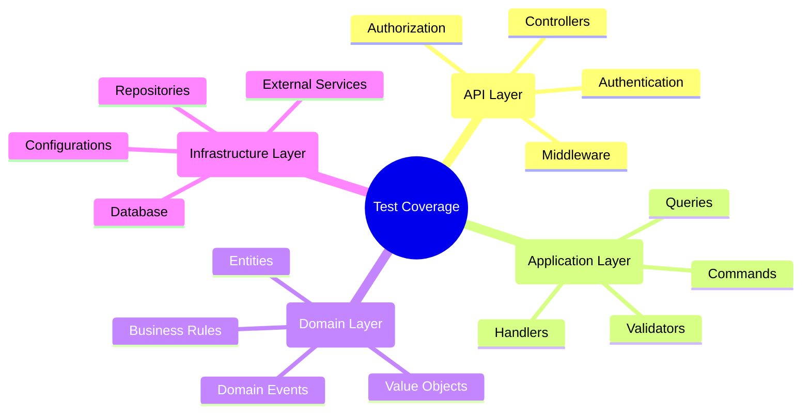

# 📋 Plan de Pruebas Integral - Conaprole Orders

## Purpose

Este documento define el **plan integral de pruebas** para el sistema Conaprole Orders, incluyendo casos de prueba detallados, criterios de aceptación, cobertura de testing y metodología de ejecución de pruebas.

## Audience

- **QA Engineers** - Ejecución de casos de prueba y validación
- **Test Managers** - Planificación y gestión de testing
- **Developers** - Comprensión de criterios de aceptación
- **Personal Académico** - Documentación de metodología de testing

## Prerequisites

- Conocimiento del sistema Conaprole Orders
- Familiaridad con casos de uso y flujos de negocio
- Comprensión de metodologías de testing
- Acceso a entornos de testing

## 🎯 Objetivos del Plan de Pruebas

### Objetivos Principales

1. **Validar funcionalidad** de todos los módulos del sistema
2. **Garantizar calidad** en producción
3. **Verificar integración** entre componentes
4. **Asegurar rendimiento** bajo carga esperada
5. **Confirmar seguridad** y autorización

### Criterios de Éxito

| Criterio | Objetivo | Métrica |
|----------|----------|---------|
| **Cobertura de Código** | ≥ 80% | Líneas cubiertas/Total líneas |
| **Casos de Prueba Pasados** | ≥ 95% | Tests exitosos/Total tests |
| **Defectos Críticos** | 0 | Bugs bloqueantes |
| **Rendimiento** | Response time < 2s | P95 de respuesta |
| **Disponibilidad** | ≥ 99.5% | Uptime en producción |

## 📊 Scope y Cobertura

### Módulos en Scope



### Features Incluidas

| Módulo | Features | Prioridad | Cobertura Objetivo |
|--------|----------|-----------|-------------------|
| **Gestión de Usuarios** | CRUD, Roles, Permisos | Alta | 90% |
| **Gestión de Pedidos** | Crear, Modificar, Consultar | Crítica | 95% |
| **Catálogo de Productos** | CRUD, Categorías | Alta | 85% |
| **Distribuidores** | CRUD, Asignaciones | Media | 80% |
| **Puntos de Venta** | CRUD, Relacionar | Media | 80% |
| **Autenticación** | Login, JWT, Permisos | Crítica | 95% |
| **API Externa** | Endpoints REST | Alta | 90% |

### Features Excluidas

- Migración de datos legacy
- Interfaces de usuario (fuera de scope de API)
- Integración con sistemas externos no críticos
- Performance testing extremo (>1000 usuarios concurrentes)

## 🧪 Tipos de Pruebas

### 1. Pruebas Unitarias

**Objetivo**: Validar lógica de negocio y componentes individuales

**Scope**: 
- Entidades de dominio
- Value objects
- Servicios de aplicación
- Repositorios (lógica)

**Criterios de Aceptación**:
- ✅ Todas las reglas de negocio validadas
- ✅ Casos edge cubiertos
- ✅ Excepciones manejadas correctamente
- ✅ Cobertura ≥ 85%

**Casos de Prueba Ejemplo**:

```gherkin
Feature: Creación de Pedidos
  
  Scenario: Crear pedido válido
    Given un distribuidor autorizado
    And un punto de venta válido
    And productos disponibles
    When se crea un pedido con datos válidos
    Then el pedido se crea en estado "Draft"
    And se calculan los totales correctamente
    
  Scenario: Crear pedido sin líneas
    Given un distribuidor autorizado
    When se intenta crear un pedido sin líneas
    Then se debe lanzar una excepción
    And el mensaje debe indicar "líneas requeridas"
```

### 2. Pruebas de Integración

**Objetivo**: Validar interacción entre componentes y persistencia

**Scope**:
- Repositorios con base de datos
- Servicios con APIs externas
- Handlers con dependencias
- Configuraciones de Entity Framework

**Criterios de Aceptación**:
- ✅ Persistencia correcta de datos
- ✅ Queries optimizadas funcionan
- ✅ Transacciones manejan errores
- ✅ Migraciones aplicadas correctamente

**Casos de Prueba Ejemplo**:

```gherkin
Feature: Persistencia de Pedidos

  Scenario: Guardar pedido con líneas
    Given una base de datos limpia
    When se guarda un pedido con 3 líneas
    Then el pedido se persiste correctamente
    And las 3 líneas se guardan relacionadas
    And los totales se calculan en BD
    
  Scenario: Query de pedidos por distribuidor
    Given 5 pedidos en la base de datos
    And 3 pertenecen al distribuidor A
    When se consultan pedidos del distribuidor A
    Then se retornan exactamente 3 pedidos
    And no se incluyen pedidos de otros distribuidores
```

### 3. Pruebas de API (E2E)

**Objetivo**: Validar endpoints y flujos completos

**Scope**:
- Todos los endpoints REST
- Autenticación y autorización
- Validación de entrada
- Formato de respuestas

**Criterios de Aceptación**:
- ✅ Todos los endpoints responden correctamente
- ✅ Códigos de estado HTTP apropiados
- ✅ Autenticación funciona
- ✅ Autorización bloquea accesos no permitidos

**Casos de Prueba Ejemplo**:

```gherkin
Feature: API de Pedidos

  Scenario: Crear pedido via API
    Given un usuario autenticado con permiso "orders:write"
    When se envía POST /api/orders con datos válidos
    Then la respuesta es 201 Created
    And el body contiene el ID del pedido creado
    And el header Location apunta al nuevo recurso
    
  Scenario: Acceso sin autorización
    Given un usuario sin permisos
    When se envía GET /api/orders
    Then la respuesta es 403 Forbidden
    And el body contiene mensaje de error
```

### 4. Pruebas de Seguridad

**Objetivo**: Validar controles de seguridad y autorización

**Scope**:
- Autenticación JWT
- Autorización basada en permisos
- Validación de entrada
- Protección contra ataques comunes

**Criterios de Aceptación**:
- ✅ JWT tokens validados correctamente
- ✅ Permisos verificados en cada endpoint
- ✅ Entrada sanitizada contra injection
- ✅ Rate limiting funcional

### 5. Pruebas de Rendimiento

**Objetivo**: Validar rendimiento bajo carga esperada

**Scope**:
- Response times de endpoints
- Throughput de API
- Uso de memoria y CPU
- Conexiones concurrentes

**Criterios de Aceptación**:
- ✅ P95 response time < 2 segundos
- ✅ Throughput ≥ 100 RPS
- ✅ Memoria estable bajo carga
- ✅ Sin memory leaks

## 📝 Casos de Prueba Detallados

### TC-001: Gestión de Usuarios

| **Test Case ID** | TC-001-01 |
|------------------|-----------|
| **Título** | Registrar usuario válido |
| **Prioridad** | Alta |
| **Prerequisitos** | Sistema disponible, datos de prueba |
| **Pasos** | 1. Enviar POST /api/users con datos válidos<br/>2. Verificar respuesta 201<br/>3. Confirmar usuario en BD |
| **Resultado Esperado** | Usuario creado exitosamente |
| **Criterios de Aceptación** | ✅ ID generado<br/>✅ Email único<br/>✅ Password hasheado |

| **Test Case ID** | TC-001-02 |
|------------------|-----------|
| **Título** | Registrar usuario con email duplicado |
| **Prioridad** | Alta |
| **Prerequisitos** | Usuario existente con email test@example.com |
| **Pasos** | 1. Enviar POST /api/users con email duplicado<br/>2. Verificar respuesta 400<br/>3. Confirmar mensaje de error |
| **Resultado Esperado** | Error de validación |
| **Criterios de Aceptación** | ✅ Status 400<br/>✅ Mensaje claro<br/>✅ No se crea usuario |

### TC-002: Gestión de Pedidos

| **Test Case ID** | TC-002-01 |
|------------------|-----------|
| **Título** | Crear pedido completo |
| **Prioridad** | Crítica |
| **Prerequisitos** | Usuario autenticado, productos disponibles |
| **Pasos** | 1. Autenticar usuario<br/>2. POST /api/orders con datos completos<br/>3. Verificar respuesta<br/>4. Confirmar en BD |
| **Resultado Esperado** | Pedido creado con estado Draft |
| **Criterios de Aceptación** | ✅ ID generado<br/>✅ Totales calculados<br/>✅ Estado = Draft<br/>✅ Líneas relacionadas |

| **Test Case ID** | TC-002-02 |
|------------------|-----------|
| **Título** | Confirmar pedido en estado Draft |
| **Prioridad** | Alta |
| **Prerequisitos** | Pedido existente en estado Draft |
| **Pasos** | 1. Autenticar usuario<br/>2. PUT /api/orders/{id}/confirm<br/>3. Verificar estado cambia<br/>4. Confirmar timestamp |
| **Resultado Esperado** | Pedido confirmado exitosamente |
| **Criterios de Aceptación** | ✅ Estado = Confirmed<br/>✅ ConfirmedOnUtc poblado<br/>✅ No se puede modificar |

### TC-003: Autenticación y Autorización

| **Test Case ID** | TC-003-01 |
|------------------|-----------|
| **Título** | Login con credenciales válidas |
| **Prioridad** | Crítica |
| **Prerequisitos** | Usuario registrado en Keycloak |
| **Pasos** | 1. POST /auth/login con credenciales<br/>2. Verificar JWT token<br/>3. Validar claims |
| **Resultado Esperado** | Token JWT válido retornado |
| **Criterios de Aceptación** | ✅ Token válido<br/>✅ Expires_in correcto<br/>✅ Claims poblados |

| **Test Case ID** | TC-003-02 |
|------------------|-----------|
| **Título** | Acceso con token expirado |
| **Prioridad** | Alta |
| **Prerequisitos** | Token JWT expirado |
| **Pasos** | 1. Usar token expirado<br/>2. GET /api/orders<br/>3. Verificar rechazo |
| **Resultado Esperado** | Acceso denegado |
| **Criterios de Aceptación** | ✅ Status 401<br/>✅ Mensaje de token expirado |

## 🗂️ Test Cases por Feature

### Feature: Gestión de Productos

| ID | Caso de Prueba | Prioridad | Estado |
|----|----------------|-----------|--------|
| TC-004-01 | Crear producto válido | Alta | ✅ Passed |
| TC-004-02 | Actualizar precio producto | Alta | ✅ Passed |
| TC-004-03 | Desactivar producto | Media | ✅ Passed |
| TC-004-04 | Buscar productos por categoría | Alta | ✅ Passed |
| TC-004-05 | Validar producto duplicado | Media | ⏳ Pending |

### Feature: Gestión de Distribuidores

| ID | Caso de Prueba | Prioridad | Estado |
|----|----------------|-----------|--------|
| TC-005-01 | Registrar distribuidor | Alta | ✅ Passed |
| TC-005-02 | Asignar puntos de venta | Alta | ✅ Passed |
| TC-005-03 | Consultar distribuidores activos | Media | ✅ Passed |
| TC-005-04 | Validar datos requeridos | Alta | ❌ Failed |
| TC-005-05 | Eliminar distribuidor con pedidos | Baja | ⏳ Pending |

### Feature: Integración con Keycloak

| ID | Caso de Prueba | Prioridad | Estado |
|----|----------------|-----------|--------|
| TC-006-01 | Sincronizar usuarios | Alta | ✅ Passed |
| TC-006-02 | Validar permisos dinámicos | Crítica | ✅ Passed |
| TC-006-03 | Manejar usuario inexistente | Media | ⏳ Pending |
| TC-006-04 | Timeout de conexión | Baja | ⏳ Pending |

## 📊 Matriz de Trazabilidad

### Requerimientos → Test Cases

| Requerimiento | Descripción | Test Cases | Cobertura |
|---------------|-------------|------------|-----------|
| **REQ-001** | Usuario debe poder crear pedidos | TC-002-01, TC-002-02, TC-002-03 | 100% |
| **REQ-002** | Sistema debe validar permisos | TC-003-01, TC-003-02, TC-003-03 | 100% |
| **REQ-003** | Productos deben tener categorías | TC-004-01, TC-004-04 | 100% |
| **REQ-004** | Distribuidores asignan POS | TC-005-02, TC-005-03 | 90% |
| **REQ-005** | API debe ser RESTful | TC-007-01, TC-007-02 | 85% |

### Business Rules → Test Cases

| Regla de Negocio | Test Cases | Validación |
|------------------|------------|------------|
| Solo pedidos Draft pueden modificarse | TC-002-02, TC-002-05 | ✅ |
| Usuarios necesitan permisos específicos | TC-003-02, TC-003-04 | ✅ |
| Productos inactivos no se venden | TC-004-03, TC-002-06 | ⏳ |
| Distribuidores pueden tener múltiples POS | TC-005-02 | ✅ |

## 🚀 Estrategia de Ejecución


### Criterios de Entry/Exit

#### Entry Criteria
- ✅ Código compilando sin errores
- ✅ Casos de prueba revisados y aprobados
- ✅ Entorno de testing configurado
- ✅ Datos de prueba preparados
- ✅ Dependencias externas disponibles

#### Exit Criteria
- ✅ 95% de casos de prueba exitosos
- ✅ 0 defectos críticos
- ✅ Cobertura de código ≥ 80%
- ✅ Performance dentro de parámetros
- ✅ Security tests aprobados

### Entornos de Testing

| Entorno | Propósito | Configuración | Responsable |
|---------|-----------|---------------|-------------|
| **DEV** | Desarrollo y unit tests | Local + Docker | Developers |
| **TEST** | Integration y E2E tests | Azure + TestContainers | QA Team |
| **STAGING** | Pre-production testing | Azure Mirror Prod | DevOps |
| **PROD** | Smoke tests post-deploy | Production Environment | SRE |

## 🔍 Test Data Management

### Estrategia de Datos

1. **Test Data Builder Pattern** para objetos complejos
2. **Factories** para escenarios comunes
3. **Database seeding** para datos base
4. **Cleanup automático** después de tests

### Datos de Prueba

```csharp
public class TestDataFactory
{
    public static User CreateValidUser(string email = "test@conaprole.com")
    {
        return User.Create(
            new FirstName("Test"),
            new LastName("User"),
            new Email(email));
    }
    
    public static Product CreateValidProduct(string name = "Test Product")
    {
        return Product.Create(
            new Name(name),
            new Description("Test Description"),
            new Money(10.00m, Currency.USD),
            Category.LACTEOS);
    }
    
    public static Order CreateValidOrder()
    {
        return new OrderBuilder()
            .WithValidCustomer()
            .WithValidDistributor()
            .WithValidPointOfSale()
            .WithOrderLine(CreateValidProduct(), new Quantity(1, "units"))
            .Build();
    }
}
```

### Database Cleanup

```csharp
[Collection("Database")]
public class DatabaseTestBase : IDisposable
{
    protected readonly ApplicationDbContext Context;
    
    public DatabaseTestBase()
    {
        Context = TestDatabaseFactory.CreateContext();
        SeedTestData();
    }
    
    public void Dispose()
    {
        CleanupTestData();
        Context.Dispose();
    }
    
    private void CleanupTestData()
    {
        Context.Orders.RemoveRange(Context.Orders.Where(o => o.CreatedOnUtc > TestStartTime));
        Context.Users.RemoveRange(Context.Users.Where(u => u.Email.Value.Contains("test")));
        Context.SaveChanges();
    }
}
```

## 📈 Reporting y Métricas

### Test Execution Report

```json
{
  "testSummary": {
    "totalTests": 365,
    "passed": 350,
    "failed": 12,
    "skipped": 3,
    "successRate": "95.9%",
    "executionTime": "8m 45s"
  },
  "coverage": {
    "linesCovered": 1847,
    "totalLines": 2156,
    "percentage": "85.7%"
  },
  "failedTests": [
    {
      "testId": "TC-005-04",
      "name": "Validar datos requeridos distribuidor",
      "error": "Validation message not matching expected",
      "priority": "High"
    }
  ]
}
```

### Coverage by Module

| Módulo | Lines | Covered | Percentage | Branches | Covered | Percentage |
|--------|-------|---------|------------|----------|---------|------------|
| Domain | 856 | 798 | 93.2% | 234 | 210 | 89.7% |
| Application | 674 | 589 | 87.4% | 189 | 156 | 82.5% |
| Infrastructure | 445 | 334 | 75.1% | 98 | 71 | 72.4% |
| API | 181 | 126 | 69.6% | 45 | 29 | 64.4% |
| **Total** | **2156** | **1847** | **85.7%** | **566** | **466** | **82.3%** |

## 🐛 Defect Management

### Bug Classification

| Severidad | Criterio | SLA Resolución | Asignación |
|-----------|----------|----------------|------------|
| **Critical** | Sistema no funcional | 4 horas | Lead Developer |
| **High** | Feature principal afectada | 1 día | Senior Developer |
| **Medium** | Feature secundaria afectada | 3 días | Developer |
| **Low** | Mejora o issue menor | 1 semana | Junior Developer |

### Defect Template

```yaml
BUG-ID: BUG-2025-001
Title: "Order total calculation incorrect with multiple currencies"
Severity: High
Priority: High
Environment: TEST
Steps to Reproduce:
  1. Create order with USD product
  2. Add EUR product to same order
  3. Observe total calculation
Expected: Exception or conversion
Actual: Incorrect sum without conversion
Reporter: QA Engineer
Assignee: Backend Developer
Status: Open
```

## 🔄 Continuous Testing

### CI/CD Integration

```yaml
# Testing pipeline
name: Continuous Testing
on: [push, pull_request]

jobs:
  unit-tests:
    runs-on: ubuntu-latest
    steps:
      - name: Run Unit Tests
        run: dotnet test --filter Category=Unit
        
  integration-tests:
    runs-on: ubuntu-latest
    needs: unit-tests
    steps:
      - name: Start Test Containers
        run: docker-compose -f docker-compose.test.yml up -d
      - name: Run Integration Tests
        run: dotnet test --filter Category=Integration
        
  e2e-tests:
    runs-on: ubuntu-latest
    needs: integration-tests
    steps:
      - name: Run E2E Tests
        run: dotnet test --filter Category=E2E
        
  quality-gate:
    runs-on: ubuntu-latest
    needs: [unit-tests, integration-tests, e2e-tests]
    steps:
      - name: Quality Gate
        run: |
          if [ "${{ env.COVERAGE }}" -lt "80" ]; then
            echo "Coverage below 80%"
            exit 1
          fi
```

### Automated Test Selection

- **On PR**: Unit + Critical integration tests
- **On Merge**: Full test suite
- **Nightly**: Full suite + Performance tests
- **Weekly**: Full suite + Security scan


## Referencias

- [IEEE 829 Test Plan Standard](https://standards.ieee.org/standard/829-2008.html)
- [ISTQB Testing Glossary](https://glossary.istqb.org/)
- [xUnit Best Practices](https://xunit.net/docs/comparisons)
- [Test Pyramid - Martin Fowler](https://martinfowler.com/articles/practical-test-pyramid.html)

---

*Last verified: 2025-01-02 - Commit: 4ef981b*
